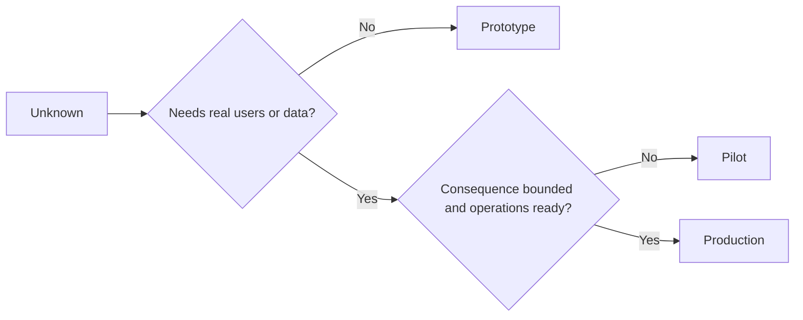

# Elige el prototipo, el piloto o la producción deliberadamente

> Esos son diferentes entornos de aprendizaje, no niveles de pulido. Elige la etapa que responda a la corriente desconocida con la menor consecuencia innecesaria.

**Type:** Learn + Build
**Languages:** Python (stdlib)
**Prerequisites:** Phase 14 lessons 50 to 52
**Time:** ~70 minutes

## Objetivos de aprendizaje

- Elige una etapa de construcción de lo desconocido, audiencia, datos, consecuencia y preparación.
- Definir los controles específicos de cada etapa y los criterios de salida.
- Prevenir que los prototipos se conviertan en sistemas de producción.
- Retrasar la autoridad real hasta que la evidencia y las operaciones la justifiquen.

## Tres preguntas diferentes

| Stage | Primary question |
|---|---|
| Prototype | Can this mechanism produce the evidence at all? |
| Pilot | Does it work safely with a bounded real audience and real conditions? |
| Production | Can we own it continuously at the promised reliability and risk level? |

Un prototipo puede ser técnicamente completo y aún desechable. Un piloto puede utilizar los datos de producción sin dejar de tener una audiencia y autoridad limitadas.

## Prototipo

Utilice un prototipo cuando lo desconocido no requiera usuarios reales o datos reales.

- Discardable;
- aislados;
- comportamiento limitado;
- explícito sobre la cuestión de aprendizaje;
- libre de falsas garantías operativas.

No optimice la arquitectura antes de que el mecanismo gane otro paso.

## El piloto

Utilice un piloto cuando lo desconocido requiere un comportamiento real, datos realistas o un flujo de trabajo real, pero la consecuencia o la preparación aún no es compatible con la liberación general.

Un piloto necesita:

- un público designado;
- un propietario humano;
- duración y autoridad limitadas;
- auditoría y retroceso;
- los umbrales de salida y de barandillas de protección;
- criterios de salida para expandir, revisar o detener.

## Producción

La producción necesita más que el despliegue:

- objetivo de nivel de servicio;
- la propiedad en caso de llamada e incidencia;
- la revisión de la seguridad y la privacidad;
- controles de costes y capacidad;
- el retroceso y la recuperación;
- vigilancia continua;
- un camino de retiro.



## Drift de etapa

El código prototipo se vuelve peligroso cuando adquiere usuarios, datos o autoridad sin adquirir propiedad. Marque los límites del prototipo y del piloto en la configuración, control de acceso, telemetría y documentación.

La etapa debe ser observable desde el propio sistema.

## Construye el mismo

El laboratorio elige una etapa del contexto de la decisión, devuelve los controles requeridos y escribe `outputs/stage-decisions.json`¿ Qué ?

```bash
python3 code/main.py
python3 -m unittest discover code/tests -v
```

Cambiar el ejemplo piloto a una consecuencia baja con preparación para la operación.

## Los ejercicios

1. Clasificar tres proyectos actuales por etapa de aprendizaje, no por estado de despliegue.
2. Escriba criterios de salida del piloto que incluyan una decisión de parada.
3. Añadir un control técnico que impida que un prototipo llegue a los datos de producción.
4. Identificar la primera responsabilidad operativa que hace que la producción de construcción.
5. Diseñe un recibo de regreso para el piloto de bordo.

## Leer más

- [Barry Boehm, A Spiral Model of Software Development and Enhancement](https://dl.acm.org/doi/10.1145/12944.12948), para la combinación de cada iteración con el compromiso de resolver el riesgo.
- [Fagerholm et al., Building Blocks for Continuous Experimentation](https://doi.org/10.1145/2601248.2601276), para las condiciones organizativas y técnicas necesarias para la realización continua de los experimentos.

## Lo que guardas

Mantenga .`outputs/stage-decisions.json`En él se registra por qué cada etapa es justificada y qué controles deben existir antes de la siguiente.
