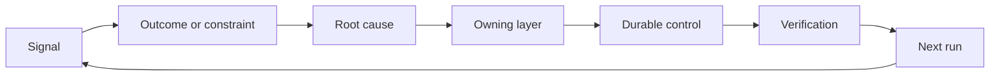

# Construye un ratchet de retroalimentación con propiedad y jubilación

> La navegación cierra un bucle de construcción y abre el bucle de aprendizaje.

**Type:** Learn + Build
**Languages:** Python (stdlib)
**Prerequisites:** Phase 14 lessons 46 and 53
**Time:** ~75 minutes

## Objetivos de aprendizaje

- Convierta incidentes, evaluaciones, comportamiento de los usuarios y correcciones en acciones propias.
- Enrutar cada señal al contexto, evaluación, política, tiempo de ejecución o atrasos.
- Priorizar la recurrencia por gravedad y frecuencia.
- Dar a todos los controles una condición de jubilación.

## La retroalimentación es infraestructura

Un equipo puede recopilar rastros, evaluaciones, boletos de apoyo y registros de incidentes sin aprender de ninguno de ellos.

El bucle es:

1. observar una señal concreta;
2. conectarlo a un resultado, una restricción o una suposición;
3. identificar la capa de sistema más temprana que posee la causa;
4. crear un cambio limitado;
5. verificar que la recurrencia es menos probable;
6. evaluar si el control debe permanecer.

## El camino hacia la capa de posesión

| Signal | Destination |
|---|---|
| False positive, regression, wrong result | Evaluation or test |
| Missing context, duplicate work, stale fact | Context source or retrieval route |
| Unsafe action or authority gap | Policy or permission boundary |
| Timeout, retry storm, unavailable dependency | Runtime control |
| New product need or unresolved tradeoff | Shaped backlog item |

No agregue otro párrafo inmediato cuando una prueba o permiso pueda hacer imposible el fallo.



## La propiedad es parte del control

Cada acción de ratchet necesita:

- un propietario;
- una prioridad basada en la consecuencia y la recurrencia;
- el artefacto a cambiar;
- la verificación que compruebe el cambio;
- una ventana de revisión o de vencimiento;
- una condición de jubilación.

Una mejora no adquirida es una observación con mejor formato.

## Retirar los controles estales

Los sistemas de retroalimentación acumulan políticas. Esa política puede volverse contradictoria y costosa.

- cambios en la arquitectura o en el flujo de trabajo;
- una invariante de nivel inferior sustituye una instrucción de nivel superior;
- la falla protegida no se ha mostrado en la ventana elegida;
- El control bloquea más a menudo el trabajo legítimo que evita el daño.

La jubilación también necesita pruebas.

## Conectar la creación y la codificación de los agentes de retroalimentación

El mismo ratchet sirve a ambas pistas:

- La evidencia del producto cambia el marco de resultados, las suposiciones, la rebanada o el plan de medición.
- Las correcciones de agentes de codificación cambian las pruebas, el contexto, el alcance, la automatización o la entrega.
- Los incidentes pueden cambiar tanto el límite del producto como el banco de trabajo del agente.

Por eso la configuración de la construcción no es una fase que termina antes de codificar.

## Construye el mismo

El laboratorio clasifica las señales, crea acciones de ratchet propias, las prioriza y escribe.`outputs/feedback-backlog.json`¿ Qué ?

```bash
python3 code/main.py
python3 -m unittest discover code/tests -v
```

Añadir una señal de tiempo de espera de tiempo de ejecución y confirmar que se dirige a la hora de ejecución en lugar de la cartera general.

## Los ejercicios

1. Convierta un incidente y una queja de usuario en acciones de ratchet.
2. Nombre la capa más temprana que puede evitar cada repetición.
3. Añadir comandos de verificación o observaciones a la salida del laboratorio.
4. Definir una condición de jubilación para una regla de póliza.
5. Trace uno aceptó la corrección de vuelta en el siguiente marco de tarea.

## Leer más

- [Basili, Caldiera, and Rombach, The Goal Question Metric Approach](https://www.cs.toronto.edu/~sme/CSC444F/handouts/GQM-paper.pdf), para el aprendizaje organizacional a través de la medición orientada a objetivos.
- [Fagerholm et al., Building Blocks for Continuous Experimentation](https://doi.org/10.1145/2601248.2601276), para el ciclo técnico y organizativo que conecta la evidencia con el desarrollo continuo del producto.
- [Nuseibeh and Easterbrook, Requirements Engineering: A Roadmap](https://www.cs.toronto.edu/~sme/papers/2000/ICSE2000.pdf), para tratar los requisitos como evolucionando a través del ciclo de vida del sistema.

## Lo que guardas

Mantenga .`outputs/feedback-backlog.json`. Es el artefacto final del camino de evaluación y entrega del producto y la entrada al siguiente marco de resultados.
