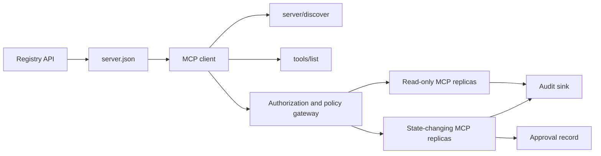

# Capstone 13: servidor de MCP sin estatus con registro y gobernanza

> Producción MCP no es un solo proceso de servidor. Es una cadena de contratos: metadatos publicables, descubrimiento en vivo, un envase de solicitud sin estado, autorización, política, auditoría y pruebas de implementación.

**Type:** Capstone
**Languages:** Python and TypeScript reference models; any production language
**Prerequisites:** Phase 11, Phase 13, Phase 14, Phase 17, and Phase 18
**Required MCP deep dives:** [Lesson 28: Tool Contracts](../../../13-tools-and-protocols/28-mcp-tool-contracts-and-content/docs/en.md)¿ Qué ?[Lesson 29: Reliability](../../../13-tools-and-protocols/29-mcp-reliability-cancellation-and-flow-control/docs/en.md)¿ Qué ?[Lesson 30: Registry Supply Chain](../../../13-tools-and-protocols/30-mcp-registry-supply-chain-and-drift/docs/en.md), y [Lesson 31: Conformance Operations](../../../13-tools-and-protocols/31-mcp-conformance-versioning-and-operations/docs/en.md)
**Protocol target:**MCP `2026-07-28`
**Time:** ~25 hours

## Objetivos de aprendizaje

- Implementar el envase de MCP sin estatus y el resultado.
- Mantenga los metadatos del Registro separados del protocolo de descubrimiento en vivo.
- Construir determinista, conocimiento de la caché de la herramienta de descubrimiento.
- Aplicar la política de emisor, audiencia, alcance y aprobación para cada llamada de herramienta.
- Implemente HTTP en transmisión sin afinidad de sesión.
- Prueba el comportamiento en el cable, autorización, política, registro y límites de auditoría.

## Caminos requeridos de MCP

Completa las cuatro lecciones de la Fase 13 en orden antes de tratar esta piedra angular como lista para la producción:

1. [Lesson 28](../../../13-tools-and-protocols/28-mcp-tool-contracts-and-content/docs/en.md)define la herramienta, esquema, contenido, paginado, completado, enrutamiento y contratos de error que este servidor debe exponer.
2. [Lesson 29](../../../13-tools-and-protocols/29-mcp-reliability-cancellation-and-flow-control/docs/en.md)define carreras de cancelación, plazos, impotencia, retropresión, retrocesión y comportamiento de reconexión.
3. [Lesson 30](../../../13-tools-and-protocols/30-mcp-registry-supply-chain-and-drift/docs/en.md)define el espacio de nombres, la procedencia, el pin de admisión, el estado del Registro, la derivación, el libro mayor y la evidencia de retroceso.
4. [Lesson 31](../../../13-tools-and-protocols/31-mcp-conformance-versioning-and-operations/docs/en.md)define transcripciones doradas y negativas, épocas de versiones estrictas, controles de diferenciales SDK, prueba de proxy, redacción, salud y puertas de liberación.

La piedra angular integra esos artefactos. No los reemplaza con una prueba de SDK de camino feliz.

## El problema

Una plataforma interna necesita herramientas de datos de lectura y un pequeño conjunto de herramientas de cambio de estado. Los desarrolladores deben ser capaces de descubrir el servidor, entender cómo conectarse, inspeccionar sus capacidades en vivo y llamar solo a las operaciones que están autorizados a usar.

La parte difícil es no registrar una función, la parte difícil es mantener seis verdades diferentes alineadas:

1. `server.json`dice dónde se puede instalar o llegar al servidor.
2. `server/discover`dice lo que el proceso en vivo apoya ahora.
3. Cada solicitud dice qué revisión de protocolo y capacidades del cliente utiliza.
4. La autorización vincula a un llamador al emisor correcto, el recurso y los ámbitos.
5. La política decide si esta acción específica puede ejecutarse.
6. Las pruebas de auditoría registran lo que cruzó la frontera sin filtración de secretos o cargas útiles sensibles.

Si alguna de estas derivaciones, la plataforma puede enumerar un servidor que no se puede acceder, enrutar un cliente incompatible, aceptar un token acuñado para otro recurso o exponer una acción destructiva sin la revisión esperada.

## Las dos capas de descubrimiento

El Registro y el servidor MCP en vivo responden a preguntas diferentes.

| Layer | Contract | Question it answers |
|---|---|---|
| Publication | `server.json` and Registry API | What is this server, where is its package or remote endpoint, and how is it configured? |
| Runtime | `server/discover` | Which protocol versions, capabilities, extensions, and server identity does this process support? |

El Registro oficial utiliza una versión `server.json`Una entrada remota puede nombrar una URL HTTP Streamable:

```json
{
  "$schema": "https://static.modelcontextprotocol.io/schemas/2025-12-11/server.schema.json",
  "name": "com.example/internal-readonly",
  "title": "Internal Read-Only Tools",
  "description": "Read-only incident and data lookup tools.",
  "version": "1.0.0",
  "remotes": [
    {
      "type": "streamable-http",
      "url": "https://mcp.internal.example.com/readonly"
    }
  ]
}
```

La versión del esquema de Registro y la revisión del protocolo MCP son independientes. No reescriba una fecha para coincidir con la otra. Valida cada documento en función de su propio contrato.

La validez del esquema no prueba la propiedad del espacio de nombres.`example.com`utiliza el espacio de nombres de DNS inverso `com.example/*`El flujo de autenticación del Registro prueba esa propiedad.

El modelo de la STDlib `validate_registry_document`La función es intencionalmente un validador de perfil remoto parcial.`name`¿ Qué ?`description`, y `version`campos; opcionales `title`; el nombre y la longitud publicados; la forma de la versión de concreto; y cada `streamable-http`o `sse`forma de URL HTTP(S) de la remota. Además requiere una no vacía `remotes`lista porque esta piedra angular siempre pone a prueba un control remoto.`validate_publisher_namespace`Se verifica por separado el nombre con el dominio de la editorial verificado, mientras que `validate_runtime_alignment`compara el nombre y la versión de la publicación con el en vivo `serverInfo`. El esquema oficial también admite registros de paquetes y campos más remotos. Antes de la publicación, valida todo el documento con el esquema oficial JSON fijado o `mcp-publisher`; no presentar este subconjunto libre de dependencias como validación completa del esquema.

El servidor debe implementar `server/discover`Este cliente de capstone lo hace después de resolver el punto final, y recibe la revisión del protocolo actual y las capacidades en vivo:

```json
{
  "resultType": "complete",
  "supportedVersions": ["2026-07-28"],
  "capabilities": {
    "tools": {
      "listChanged": false
    }
  },
  "_meta": {
    "io.modelcontextprotocol/serverInfo": {
      "name": "com.example/internal-readonly",
      "version": "1.0.0"
    }
  },
  "ttlMs": 3600000,
  "cacheScope": "public"
}
```

Un catálogo privado puede indexar datos adicionales de propiedad, revisión o ciclo de vida, pero no debe inventar esos datos como campos de cable de MCP o raíz `server.json`Los campos de datos de la organización se almacenan junto al registro publicado.`_meta.io.modelcontextprotocol.registry/publisher-provided`extensión y permanecer dentro de su límite de 4 KB.

## Núcleo de MCP sin estatus

Revisión del MCP `2026-07-28`elimina las sesiones de protocolo y el `initialize`- ¿ Qué ?`notifications/initialized`Apetece la mano.`Mcp-Session-Id`¿ Qué ?

Cada solicitud contiene el contexto del protocolo en `params._meta`¿Qué es esto ?

```json
{
  "io.modelcontextprotocol/protocolVersion": "2026-07-28",
  "io.modelcontextprotocol/clientCapabilities": {},
  "io.modelcontextprotocol/clientInfo": {
    "name": "internal-platform-client",
    "version": "1.0.0"
  }
}
```

La versión y las capacidades son hechos de solicitud, no hechos de conexión. Un balanceador de carga puede enviar solicitudes consecutivas a diferentes réplicas saludables porque cualquiera de las réplicas puede validar la solicitud del mensaje en sí.

Los resultados ordinarios incluyen:`resultType: "complete"`Los servidores deben poner su identidad en `_meta.io.modelcontextprotocol/serverInfo`Una versión de protocolo que no esté disponible o que no esté en cadena es un parámetro inválido.`-32602`. Erro `-32022`es sólo para una cadena suministrada que no es compatible, con exactamente `{"supported": ["2026-07-28"], "requested": "..."}`como sus datos.

### Descubrimiento oculto

`tools/list`El resultado debe ser determinista para el mismo conjunto de herramientas efectivas.

- `ttlMs`, una pista de frescura para el cliente;
- `cacheScope`, o bien`public`o `private`El artículo 1
- un orden de herramientas estable para que las listas idénticas puedan reutilizar las cachées rápidas;
- `resultType: "complete"`y metadatos de identidad del servidor.

La autorización por usuario debe generalmente producir `cacheScope: "private"`No coloque la visibilidad de las herramientas específicas del usuario detrás de una caché pública compartida.

## HTTP en transmisión

Un servidor de red expone un punto final de MCP que acepta POST. Cada solicitud o notificación de JSON-RPC recibe su propio POST.

Para una solicitud, el servidor devuelve un objeto JSON o un flujo SSE con el alcance de esa solicitud.`subscriptions/listen`La solicitud contiene notificaciones de cambio optadas. No hay flujo de GET independiente, DELETE de sesión, encabezado de sesión o `Last-Event-ID`reproducir en el transporte actual.

Cada solicitud incluye:

- `MCP-Protocol-Version`, coincidiendo con los metadatos del cuerpo;
- `Mcp-Method`, que coincida con el método JSON-RPC;
- `Mcp-Name`por`tools/call`¿ Qué ?`resources/read`, y `prompts/get`El artículo 1
- `Accept: application/json, text/event-stream`¿ Qué ?

Rechazar cabeceras espejo incoplicadas con los especificados `-32020`error. Valida`Origin`, vincular los servidores de desarrollo locales a la copia de seguridad, autenticar clientes remotos y tratar una respuesta de SSE cerrada a escala de solicitud como cancelación.



```figure
cf-mcp-gate
```

## Autorizamiento y política

Los metadatos de transporte no son una autorización.

Para servidores remotos:

1. Descubra metadatos de recursos protegidos.
2. Seleccione el servidor de autorización para ese recurso.
3. Prefiere Documento de Metadatos de ID de cliente para el registro de cliente.
4. Envía el indicador de recursos durante la autorización.
5. Valida una vuelta `iss`el valor en relación con el servidor de autorización registrado para el flujo.
6. Identificación de cliente clave por emisor. Nunca vuelva a utilizar los datos de registro entre emisores.
7. Valida el emisor de tokens, el público o el recurso, la expiración y los ámbitos en el servidor MCP.
8. Aplicar una segunda decisión de política a la herramienta y argumentos concretos.

Anotadas de herramientas como `readOnlyHint`y `destructiveHint`No son controles de autorización de confianza.

### La aprobación es un registro, no un alcance mágico

Una llamada de cambio de estado necesita un registro de aprobación vinculado al actor, herramienta, argumentos normalizados o digestión, entorno objetivo, vencimiento y política de uso único o repetido.

El modelo Python hashes JSON canónico con claves ordenadas, luego une ese digesto con el objeto del token, el nombre de la herramienta, la URL del servidor y la expiración.

Mantener las herramientas de alto riesgo en una superficie que pueda ser revisada por separado cuando esto reduzca significativamente el radio de explosión.

## Construye el mismo

### 1. Modelo de metadatos de publicación

Crear y validar esquemas `server.json`. Incluir un nombre estable dentro del espacio de nombres autenticado para el editor, más versión, descripción, oficial `repository`o `packages`Los datos de la información de la información de la información de la información de la información de la información de la información de la información de la información de la información de la información de la información de la información de la información de la información de la información de la información de la información de la información de la información de la información de la información de la información de la información de la información de la información de la información de la información de la información de la información de la información de la información de la información de la información de la información de la información de la información de la información de la información de la información de la información de la información de la información de la información de la información de la información de la información de la información de la información de la información de la información de la información de la información de la información de la información de la información de la información de la información de la información de la información de la información de la información de la información de la información de la información de la información de la información de la información de la información de la información de la información de la información de la información de la información de la información de la información de la información de la información de la información de la información de la información de la información de la información de la información de la información de la información de la información de la información de la información de la información de la información de la información de la información de la información de la información de la información de la información de la información de la información de la información de la información de la información de la información de la información de la información de la información de la información de la información de la información de la información de la información de la información de la información de la información de la información de la información de la información de la información de la información de la información de la información de la información de la información de la información de la información de la información de la información de la información de la información de la información de la información de la información de la información de la información de la información de la información de cuyo.

### 2. Implementar el descubrimiento en vivo

Implementación `server/discover`Antes de cualquier función RPC. Publicitar las versiones de protocolo, capacidades, extensiones y identidad del servidor compatibles. Agregar un caso de rechazo de versión usando `-32022`¿ Qué ?

### 3. Implementar el envase sin estatus

Requiere la versión del protocolo y las capacidades del cliente en cada solicitud.`resultType`Eliminar el estado de inicialización, caches de capacidad de conexión y identificadores de sesión.

### 4. Construir la superficie de la herramienta

Comience con dos herramientas de lectura y una herramienta de cambio de estado. Preste a cada una un esquema JSON limitado, una descripción precisa, una forma determinista de resultado y anotaciones honestas. Agregue esquemas de salida cuando los clientes confían en resultados estructurados.

### 5. Añadir la lista de caché

Retorno de herramientas en orden estable con `ttlMs`y `cacheScope`. Ejerce el comportamiento de notificación de caducidad de caché y cambio de lista por separado.

### 6. Añadir autorización y política

Valida el emisor, la audiencia, la expiración y el alcance. ejecuta una decisión de política para cada llamada de herramienta. Atinge las aprobaciones a acciones exatas de alto riesgo. Niega las aprobaciones faltantes o obsoletas antes de ejecutar un manipulador.

### 7. Registro separado y validación de tiempo de ejecución

Valida la estática `server.json`grabar, luego sondear el punto final remoto con `server/discover`.Drift de informes cuando el control remoto, la identidad, la versión o las capacidades requeridas publicadas no están de acuerdo con el proceso en vivo.

### 8. Añadir pruebas de auditoría

Registrar actor, emisor, recurso, herramienta, decisión de política, identificador de solicitud, contexto de rastreo, latencia y resultado. Redigir o digerir argumentos y resultados sensibles antes de la persistencia. Mantener el fundido de auditoría fuera del contexto visible del modelo.

### 9. Ejercicio de escala horizontal

Coloque dos réplicas sin estado detrás de un balanceador de carga. Envíe al menos 100 solicitudes simultáneas. Demostrar que la corrección no depende de la afinidad. Si una herramienta necesita estado de llamada cruzada, acuña un mango opaco explícito y almacenalo en un sistema duradero compartido.

### 10. Cruza el cable real

Realice comprobaciones de conformidad con el binario del servidor real. Captura los encabezados de las solicitudes y los cuerpos JSON, no solo los objetos SDK. Ejerce una versión incorrecta, una incompatibilidad de encabezados, un alcance perdido, un público incorrecto, argumentos malformados, falla del procesador, cancelación y caducidad de caché.

## El paquete de pruebas requerido

Una presentación es incompleta hasta que contiene las cinco clases de pruebas:

| Evidence | Minimum proof | Source lesson |
|---|---|---|
| Wire | Redacted raw headers and JSON-RPC bodies for golden and negative cases, including metadata type failure, header mismatch, unsupported version, missing or unknown `resultType`, notification no-response, and response ID matching | [Lesson 31](../../../13-tools-and-protocols/31-mcp-conformance-versioning-and-operations/docs/en.md) |
| Proxy | The same stable case run directly and through the deployed intermediary, with ingress, origin, and egress status and body digests; prove protocol errors are not collapsed into generic 500 responses and streaming is not buffered | [Lessons 29](../../../13-tools-and-protocols/29-mcp-reliability-cancellation-and-flow-control/docs/en.md) and [31](../../../13-tools-and-protocols/31-mcp-conformance-versioning-and-operations/docs/en.md) |
| Admission | Verified publisher namespace, immutable Registry record digest, artifact or remote provenance, live `server/discover` identity and capability observation, descriptor pin, current Registry status, and admission-ledger event | [Lesson 30](../../../13-tools-and-protocols/30-mcp-registry-supply-chain-and-drift/docs/en.md) |
| Retry | A cancellation-versus-completion race, explicit timeout, safe read retry, mutation idempotency key, reconnect refetch, and proof that request cancellation cannot silently become durable task cancellation | [Lesson 29](../../../13-tools-and-protocols/29-mcp-reliability-cancellation-and-flow-control/docs/en.md) |
| Rollback | Exact previous version, admission and artifact digests, descriptor pin, active Registry status, current health window, route restoration result, and redacted decision evidence | [Lessons 30](../../../13-tools-and-protocols/30-mcp-registry-supply-chain-and-drift/docs/en.md) and [31](../../../13-tools-and-protocols/31-mcp-conformance-versioning-and-operations/docs/en.md) |

Guarde un resumen del paquete editado con la publicación. Si falta alguna clase, mantenga la publicación. No deduzca el comportamiento de proxy de un despachador en proceso, la admisión de presencia del Registro, retoma la seguridad de un nuevo ID JSON-RPC o la preparación de retroceso de la implementación anterior.

## Modelos de referencia locales

El modelo Python demuestra metadatos de registro, validación del espacio de nombres de los editores de DNS inverso, verificaciones de identidad de publicación a tiempo de ejecución, descubrimiento en vivo, lista de herramientas deterministas, metadatos por solicitud, emisor de confianza, audiencia, verificación de vencimiento y alcance, aprobaciones vinculadas a la acción, un validador de registro parcial documentado, política y auditoría sin abrir un socket de red:

```bash
cd phases/19-capstone-projects/13-mcp-server-with-registry
python3 code/main.py
python3 -m unittest discover -s code/tests -v
```

El proyecto TypeScript expone la forma sin estado de JSON-RPC en el estudio sin un SDK MCP.`tools/call`el camino hace cumplir los mismos esquemas de entrada de límites anunciados por `tools/list`; argumentos inválidos para una herramienta conocida devuelven un resultado completo con `isError: true`sin invocar al ejecutor:

```bash
cd phases/19-capstone-projects/13-mcp-server-with-registry/code/ts
npm install
npm run typecheck
npm test
npm run demo
```

Estos modelos prueban la lógica de los contratos locales. No prueban encabezados HTTP, intercambio de OAuth, publicación del Registro, integración de OPA, balance de carga o recibo de colector.

## Ejemplo de cable

```http
POST /mcp HTTP/1.1
Host: mcp.internal.example.com
Content-Type: application/json
Accept: application/json, text/event-stream
MCP-Protocol-Version: 2026-07-28
Mcp-Method: tools/call
Mcp-Name: postgres.readonly
Authorization: Bearer REDACTED

{
  "jsonrpc": "2.0",
  "id": 42,
  "method": "tools/call",
  "params": {
    "name": "postgres.readonly",
    "arguments": {"sql": "SELECT 1"},
    "_meta": {
      "io.modelcontextprotocol/protocolVersion": "2026-07-28",
      "io.modelcontextprotocol/clientCapabilities": {},
      "io.modelcontextprotocol/clientInfo": {
        "name": "internal-platform-client",
        "version": "1.0.0"
      }
    }
  }
}
```

## Envío

Enviar un depósito que contenga:

- un esquema-valid `server.json`El artículo 1
- superficies de servidor de lectura única y de cambio de estado;
- `server/discover`, determinista `tools/list`, y de política de puertas`tools/call`El artículo 1
- una implementación HTTP en streaming con dos réplicas intercambiables;
- la integración de la autorización y la homologación;
- un editor de Registro o un adaptador privado de API de Registro;
- las definiciones de políticas y los registros de aprobación vinculados a la acción;
- la producción de auditoría redactada y la propagación de los rastros;
- pruebas de fallas por cable y por medio de un agente;
- admisión, retraso, salud y pruebas de retroceso con un resumen del paquete redactado.

| Weight | Criterion | Evidence |
|---:|---|---|
| 25 | Protocol correctness | Stateless request metadata, discovery, results, headers, and negative cases |
| 20 | Authorization | Issuer, audience, expiry, scope, and action-bound approval cases |
| 15 | Registry integrity | Valid `server.json`, publication record, live discovery probe, and drift report |
| 15 | Policy and safety | Allow, deny, malformed, stale approval, and sensitive-data cases |
| 15 | Scale and reliability | Two replicas, no affinity dependency, cancellation, timeout, and recovery |
| 10 | Auditability | Redacted receiver-side audit and trace evidence |

## Los ejercicios

1. Cambiar la URL remota publicada mientras que el servidor en vivo no cambia. Hacer que el registro de validación informe la deriva exacta.
2. Envía`tools/list`dos veces con entradas idénticas y probar orden de herramientas estable en byte.`ttlMs`y refrescarse.
3. Envía un cuerpo válido con otro.`MCP-Protocol-Version`Encapsulado.`-32020`y no invocan la política o la herramienta.
4. La prueba de validación de audiencia falla antes de que el procesador se ejecute.
5. Enlace una aprobación a un digesto de argumento normalizado. Cambia un campo y demuestra que la aprobación no puede ser reproducida.
6. Enrutar llamadas consecutivas a replicas alternadas. reemplazar la memoria oculta de proceso con un manejo compartido explícito donde el flujo de trabajo necesita persistencia.
7. Rompe una conexión SSE escaneada por solicitud y vuelva a intentar con un nuevo ID de solicitud JSON-RPC.`Last-Event-ID`se utilizará el camino de recuperación.

## Términos clave

| Term | What people say | What it actually means |
|---|---|---|
| Stateless MCP | "No state anywhere" | No protocol session; cross-call state is explicit and server-managed |
| `server.json` | "The tool manifest" | Registry metadata for naming, packaging, configuration, and transports |
| `server/discover` | "The handshake" | A normal mandatory RPC for live versions and capabilities, not a session initializer |
| Cache scope | "Can I cache it?" | Whether a cacheable result is safe for shared or private reuse |
| Policy decision | "The token allows it" | A separate decision over actor, tool, target, arguments, and context |
| Approval record | "A human clicked yes" | Evidence bound to one actor and consequential action under an expiry policy |
| Explicit handle | "A session ID" | Ordinary application data for named server-managed state, not protocol connection state |

## Leer más

- [MCP 2026-07-28 key changes](https://modelcontextprotocol.io/specification/2026-07-28/changelog)
- [Streamable HTTP](https://modelcontextprotocol.io/specification/2026-07-28/basic/transports/streamable-http)
- [Server discovery](https://modelcontextprotocol.io/specification/2026-07-28/server/discover)
- [MCP authorization](https://modelcontextprotocol.io/specification/2026-07-28/basic/authorization)
- [Official Registry server.json requirements](https://github.com/modelcontextprotocol/registry/blob/main/docs/reference/server-json/official-registry-requirements.md)
- [Official Registry OpenAPI contract](https://registry.modelcontextprotocol.io/openapi.yaml)
