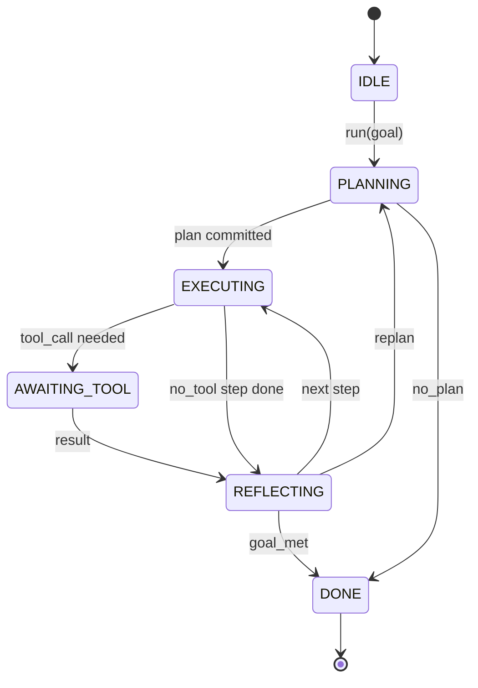

# Contratación de la cadena de agente Harness

> El arnés es el agente, el modelo es un coprocesador, esta lección congela el contrato de bucle en el que puedes conectar cualquier modelo.

**Type:** Build
**Languages:** Python
**Prerequisites:** Phase 13 lessons 01-07, Phase 14 lesson 01
**Time:** ~90 minutes

## Objetivos de aprendizaje
- Especifique un bucle de aprovechamiento de agentes como una máquina de estado determinista con transiciones explícitas.
- Implemente diez temas de gancho del ciclo de vida en los que los operadores incorporan políticas, telemetría y barandillas.
- Definir dos puntos de atracción donde el bucle devuelve el control al receptor y se reanuda en una entrada nueva.
- Aplicar los presupuestos por sesión (tornadas, llamadas a herramientas, reloj de pared) sin que se produzca pérdida de estado parcial en el exceso.
- Emite un flujo tipado de once tipos de eventos para que las UI y los rastreadores de abajo puedan suscribirse sin inspeccionar el bucle directamente.

```figure
cf-loop-contract
```

## El marco

Un agente de codificación que se ejecuta sin vigilancia durante cuarenta vueltas no es un bucle de chat. Es una máquina de estado cuyos nodos el operador puede interceptar y cuyos bordes el operador puede auditar. Una vez que escribe el contrato, el intercambio de modelos, herramientas o políticas deja de ser un refactor. Se convierte en una llamada de registro.

Esta lección construye ese contrato. Nombramos seis estados, diez temas de gancho, dos puntos de atracción, once tipos de eventos y un sobre de presupuesto. Todo lo demás en el arnés (registro de herramientas, transporte JSON-RPC, despachador, planificador) se conecta a esta forma.

## Los Estados

El bucle tiene seis estados, cinco están activos, uno es terminal.



`IDLE`Es el único punto de entrada legal. `DONE`Es la única salida legal.`AWAITING_TOOL`Es el único estado que produce un punto de atracción.

La máquina de estado es determinista. Dado el mismo registro de eventos, el arnés vuelve a entrar en el mismo estado. Esa propiedad es lo que le permite reproducir sesiones para el descomposición sin volver a llamar al modelo.

## Los temas del gancho

Los ganchos son la costura del operador en el bucle. El arnés dispara diez temas. Cada tema acepta cualquier número de suscriptores. Los suscriptores disparan en orden de registro. Un suscriptor puede mutar la carga útil, aumentar para abortar el turno o devolver un sentinela para saltar el siguiente paso.

```text
before_plan         after_plan
before_tool_call    after_tool_call
before_step         after_step
on_error
on_pause
on_budget_exceeded
on_complete
```

La forma refleja lo que Claude Code, Cursor y OpenCode convergieron a mediados de 2025. Los nombres son funcionales, no marcados.`rm -rf`Vive en la ciudad de`before_tool_call`Un gancho que envía un espacio de OpenTelemetry vive en`after_step`Un gancho que reanuda una sesión pausa vive en`on_pause`¿ Qué ?

## Los puntos de atracción

El bucle da control dos veces.`AWAITING_TOOL`Cuando no puede progresar sin un resultado de herramienta.`on_pause`cuando el presupuesto se agota o un gancho solicita explícitamente una revisión humana.

Un punto de atracción no es una excepción, es un retorno. El que llama inspecciona el estado del arnés, trae lo que el arnés pidió y llama.`resume(payload)`El arnés se recupera donde se detuvo. Esta es la misma forma que un generador Python. El transporte sobre el punto de atracción es su elección. En un TUI es de teclado. sobre MCP es`tools/call`En una cola es una encuesta de trabajo.

## El flujo de eventos

El bucle añade eventos a un flujo tipado en puntos específicos del contrato. El flujo es solo añade y los suscriptores pueden reproducir desde cualquier despacho. Los once tipos de eventos implementados son:

- `session.start` emitido una vez cuando `run(goal)`se llama
- `plan.draft` emitido cuando el planificador devuelve un proyecto de plan
- `plan.commit` emitido después de que el proyecto se comprometa como plan activo
- `step.start` emitido al comienzo de cada paso de ejecución
- `step.end` emitido al final de cada paso de ejecución
- `tool.call` emitido cuando un paso que requiere una herramienta le da el control al que llama
- `tool.result` emitido en el currículum con un resultado de la herramienta
- `tool.error` emitido en el currículum con un error o cuando un gancho abortar la llamada
- `budget.warn` emitidos cuando se alcanza un límite presupuestario
- `session.pause` emitido cuando el bucle cede en una pausa (orden de presupuesto o gancho)
- `session.complete` emitido una vez cuando el bucle alcanza `DONE`

Los eventos no duplican cargas útiles de ganchos. Los ganchos son imperativos (mutación, abortar).

## El presupuesto

Una sesión tiene tres límites: cuenta de giras, número de llamadas de herramientas, segundos de reloj de pared. Cada turno incrementa un. Cada herramienta llama incrementa llamadas de herramienta por uno. El reloj de pared se verifica en cada transición de estado. Cuando se alcanza cualquier límite, el bucle se dispara.`on_budget_exceeded`, emite`budget.warn`, luego las transiciones a `IDLE`con una razón que exceda el presupuesto en el siguiente punto de atracción.

El presupuesto no es un interruptor de ejecución, es un rendimiento, el que llama decide si se prolonga el presupuesto y se reanuda o si se cierra la sesión.

## Lo que esta lección no hace

No llama a un modelo, no registra herramientas reales, no implementa un transporte, son las siguientes cuatro lecciones, esta lección clava el contrato para que las siguientes cuatro puedan conectarse a él sin volver a escribir.

El planificador determinista en `main.py`Es un reemplazo. devuelve un plan codificado en tres pasos, dos de los cuales requieren un resultado de herramienta. El punto es el bucle, no el plan.

## Cómo leer el código

`HarnessLoop`Es la clase principal, tiene el estado, dispara ganchos, emite eventos.`Budget`- ¿Qué es eso?`Event`es el sobre escrito en la corriente. `HookRegistry`Es la mesa de envío.`_transition`es la única función que cambia el estado, por lo que las invariantes de la máquina del estado viven en un solo lugar.

Leer .`main.py`De arriba a abajo.`code/tests/test_loop.py`Las pruebas fijan cada transición y cada orden de disparo.

## Ir más allá

La parte más difícil de construir un arnés en la producción no es la máquina del estado. Está haciendo que el contrato sea ejecutable. El contrato tiene que sobrevivir a una recarga caliente del planificador. Tiene que sobrevivir a una herramienta que devuelve JSON malformado. Tiene que sobrevivir a un gancho que se eleva en`before_tool_call`Las pruebas de esta clase ejercen esos modos de falla, ejecutarlos, romperlos, añadir casos.

La siguiente lección añade el registro de herramientas. Después, el transporte JSON-RPC. Después, el despachador.
