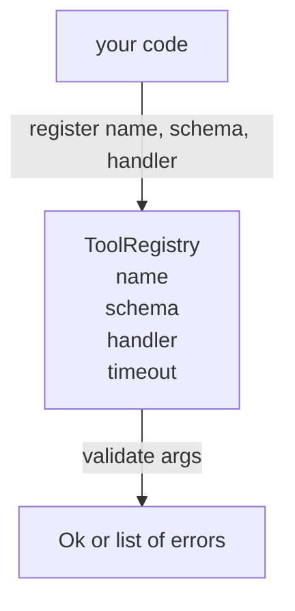

# Registro de herramientas con validación de esquema

> Una herramienta que el agente no puede validar es una herramienta que el agente no puede llamar. Construye el registro y el comprobador de esquemas antes de construir las herramientas.

**Type:** Build
**Languages:** Python
**Prerequisites:** Phase 13 lessons 01-07, Phase 14 lesson 01
**Time:** ~90 minutes

## Objetivos de aprendizaje
- Mantenga un registro de nombre de herramienta → schema → manipulador que el despachador puede pedir una vez y confiar después.
- Implemente un subconjunto de JSON Schema 2020-12 que cubre las palabras clave que el noventa por ciento de las llamadas de herramientas realmente usan.
- Regresa pistas de error precisas en forma de json-pointer para que el modelo pueda autocorregirse en un viaje de ida y vuelta.
- Rechazar la re-registro sin una anulación explícita, ya que las anulaciones silenciosas son la forma en que los catálogos de herramientas de producción se mueven.
- Mantenga el validador puro (sin entrada/entrada, sin tiempo, sin globals) para que pueda ser reiniciado en un registro de reproducción.

```figure
cf-registry-validate
```

## Por qué el registro viene antes que la herramienta

Un agente de codificación en 2026 tiene más herramientas registradas de las que el modelo puede caber en una sola ventana de contexto. Un arnés no trivial registrará doscientos herramientas y superficial de diez a cuarenta en cualquier giro dado. El registro es la fuente de verdad para "qué herramientas existen", "qué forma toman sus argumentos", y "a qué manipulador llamo". Una vez que estas tres respuestas están fijadas, el resto del arnés puede dejar de adivinar.

El error que estamos evitando es enviar a los manipuladores sin esquemas, o enviar esquemas sin validación. Ambos son comunes. Ambos convierten la siguiente capa (el despachador en la lección veintitrés) en un juego de adivinanzas donde el único modo de fracaso es una pista de pila del manipulador.

## ¿Qué aspecto tiene un registro de herramientas?

```text
ToolRecord
  name        : str          (unique, lowercase alphanumeric and underscore segments separated by dots, e.g., snake_case.segment.case)
  description : str          (one line, shown to the model)
  schema      : dict         (JSON Schema 2020-12 subset)
  handler     : Callable     (async or sync, returns Any)
  idempotent  : bool         (dispatcher uses this for retry decisions)
  timeout_ms  : int          (override per-tool dispatcher default)
```

El esquema es el único campo que el validador toca. El manipulador es opaco para él. Los separamos a propósito. El esquema son datos. El manipulador es código. Mezclarlos te tenta a poner la lógica de validación dentro del manipulador, que es el error que estamos deteniendo.

## El subconjunto JSON Schema 2020-12

La especificación completa del 2020-12 es un documento. Necesitamos ocho palabras clave.

```text
type           string / number / integer / boolean / object / array / null
properties     map of property name -> schema
required       list of property names
enum           list of allowed primitive values
minLength      integer, applies to strings
maxLength      integer, applies to strings
pattern        ECMA-262-compatible regex, applies to strings
items          schema applied to every array element
```

Las palabras clave que no estamos agregando (oneOf, anyOf, allOf, $ref, condicionales) son válidas en esquemas de producción pero convertir el validador en un caminador de árbol con ciclos. Estamos construyendo un registro, no un motor de esquema JSON.

## Rutas de error de Json

Cuando la validación falla, el validador devuelve una lista de errores. Cada error lleva un sendero json-pointer a la entrada. Un puntero es una secuencia prefijada en slash de nombres de propiedades e índices de matriz.

```text
{"a": {"b": [1, 2, "x"]}}
                    ^
                    /a/b/2
```

El modelo lee los caminos de error mejor que las oraciones. Si un esquema requiere `args.user.email`y el modelo pasó un número entero, el error debe ser `/user/email`con`expected_type: string`El modelo lo arregla en la próxima llamada sin una ronda de lenguaje natural.

## Registro y anulación

`register(name, schema, handler, **opts)`Rechaza el reinscripción por defecto.`override=True`Dos partes de la base de código que registran silenciosamente el mismo nombre de la herramienta es el tipo de error que toma una semana encontrar en la producción.

El registro expone tres métodos de lectura. `get(name)`devuelve el registro o aumenta. `validate(name, args)`devuelve un `Ok`o una lista de errores. `names()`devuelve los nombres de las herramientas en orden de registro.

## Lo que es y lo que no es el validador

Es un solo paso sobre el árbol de esquema, recursivo. Es puro. No llama a los manipuladores. No obliga a tipos (una cadena)`"42"`No se truncará silenciosamente.

El despachador en la lección veintitrés agrega capas de tiempo y sandbox. El registro agrega forma.

## Forma



## Cómo leer el código

`code/main.py`define `ToolRegistry`¿ Qué ?`ToolRecord`¿ Qué ?`ValidationError`, y las ocho funciones de validador.`schema["type"]`(o trata un esquema con `enum`Cada validador de tipo devuelve una lista vacía o una lista de `ValidationError`El caminante de nivel superior concatenará errores y preponderá segmentos de ruta a medida que desciende.

`code/tests/test_registry.py`cubre el registro, la anulación, el éxito de la validación, el fracaso de la validación con los caminos y cada palabra clave del subconjunto.

## Ir más allá

Las dos extensiones que querrás una vez que esta lección aterrice son`$ref`Resolución contra un bloque de definiciones locales, y `additionalProperties: false`Los dos son pequeños. ambos son comunes para agregar a medida que el catálogo de herramientas crece más de cincuenta herramientas. Los dejamos fuera de la lección para mantener el archivo bajo una lectura.

La siguiente lección (veinticuatro) construye el transporte de estudio JSON-RPC que presenta este registro a un cliente modelo.
