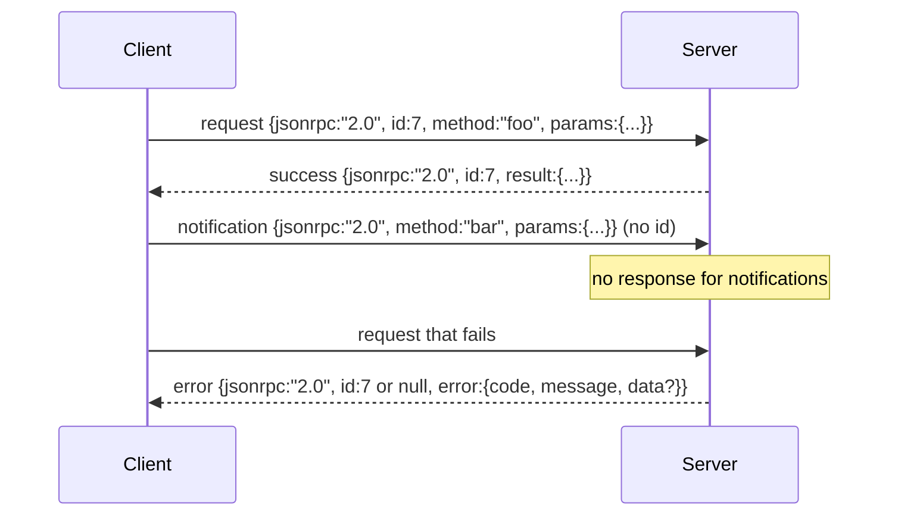

# JSON-RPC 2.0 sobre el nuevo línea-delimitado de estudio

> El transporte entre un cliente modelo y un servidor de herramientas es JSON-RPC a través de un estudio.

**Type:** Build
**Languages:** Python
**Prerequisites:** Phase 13 lessons 01-07, Phase 14 lesson 01
**Time:** ~90 minutes

## Objetivos de aprendizaje
- Habla JSON-RPC 2.0 enmarcado como JSON de línea nueva-delimitada sobre stdin y stdout.
- Mapa de los cinco códigos de error estándar (-32700, -32600, -32601, -32602, -32603) y superfírese con la semántica correcta.
- Distinguir entre solicitudes, respuestas, notificaciones y lotes sin inventar nuevas claves de sobre.
- Maneja un error de análisis por línea sin envenenar el resto de la corriente.
- Construir una demostración automática usando io.BytesIO para que la lección se ejecute sin desatar un proceso infantil.

```figure
cf-jsonrpc-frames
```

## Por qué JSON-RPC sigue siendo la lengua franca

Un agente de codificación en 2026 habla con tal vez doce servidores de herramientas en una sola sesión. Cada servidor es un proceso separado o un punto final remoto. El formato de cable ha sido el mismo desde 2013. JSON-RPC 2.0 es una especificación de dos páginas. Sobrevive porque las alternativas (gRPC, HTTP por llamada, binario personalizado) imponen una compensación JSON-RPC no: eligen el streaming o el batch o el transporte-acoplamiento. JSON-RPC es simétrico en todo el estudio, sockets, websockets y HTTP, y un cliente puede ejecutar un servidor que nunca ha visto si ambos honran la especificación.

Esta lección construye la variante de estudio. Newline-delimited JSON. Cada solicitud es una línea. Cada respuesta es una línea. El límite de transporte es `\n`¿ Qué ?

## La forma del cable

Existen cuatro formas de sobre, dos hablan el cliente, dos hablan el servidor.



Una notificación no tiene `id`El servidor no debe responder a ella. Si un servidor devuelve una respuesta a una notificación, el cliente no tiene manera de adjuntarla a un sitio de llamada. Esa regla única mantiene la matemática de enmarcado simple.

Un lote es una matriz JSON de solicitudes o notificaciones. El servidor responde con una matriz de respuestas, en cualquier orden, una por entrada sin notificación. Si cada entrada en el lote es una notificación, el servidor no envía nada de vuelta.

## Los cinco códigos de error

```text
-32700  Parse error      JSON could not be parsed
-32600  Invalid Request  Envelope shape is wrong
-32601  Method not found
-32602  Invalid params
-32603  Internal error
```

Los códigos entre -32000 y -32099 están reservados para errores definidos por el servidor. Todo lo demás está definido por la aplicación. La lección se adhiere a los cinco. Si su manipulador levanta, el transporte lo envuelve como -32603 con el nombre de clase excepcional en `data.exception`¿ Qué ?

Un error de análisis tiene una regla especial.`id`en la respuesta es `null`, porque la solicitud nunca analizó lo suficiente para extraer una identificación.

## Enmarcado de línea nueva y la demostración de BytesIO

El transporte lee una línea a la vez.`\n`Si una línea no puede ser analizada, el transporte escribe una respuesta -32700 con `id: null`La corriente no está envenenada, la siguiente línea se analiza fresca.

Para la lección terminamos con un`io.BytesIO`El servidor lee las solicitudes hasta EOF, escribe respuestas para cada uno y devuelve. El cliente lee las respuestas de nuevo. No hay desove de proceso. No hay tiempos. El comportamiento de transporte es idéntico a un tubo de subproceso real porque Python `io`La interfaz presenta lo mismo `.readline()`y `.write()`contrato.

## Disposición del método

El transporte no sabe qué métodos existen.`handler(method, params)`El manipulador devuelve un resultado o aumenta. tres clases de excepción superficia códigos específicos.

```text
MethodNotFound -> -32601
InvalidParams  -> -32602
Anything else  -> -32603 with exception name in data
```

El transporte nunca ve un registro de herramientas. El registro se encuentra detrás del manipulador. Esta es la capas que queremos. El transporte habla JSON-RPC. El registro habla formas de herramientas. El despachador (lección veintitrés) las cose juntas.

## El comportamiento de transmisión en errores

```text
client writes              server reads             server writes
---------------            -----------              -------------
{...valid request...}      parses ok                {...response, id matches...}
{...broken json...         parse fails              {id:null, error: -32700}
{...valid request...}      parses ok                {...response, id matches...}
{...missing method...}     invalid envelope         {id:X, error: -32600}
```

Una línea JSON rota no detiene el bucle.`method`El campo no detiene el bucle. Una excepción de manipulador no detiene el bucle. El transporte sigue leyendo hasta EOF.

## Notificaciones y flujos asimétricos

Una notificación es de fuego y olvido. El arnés utiliza notificaciones para eventos de progreso, señales de cancelación y líneas de registro. Las notificaciones son cómo una herramienta de larga duración puede transmitir actualizaciones de estado sin dar vueltas y vuelta para cada una.

La lección implementa un asistente de notificación de salida, `write_notification`El servidor lo utiliza para emitir el progreso mientras una solicitud está en vuelo. La demostración muestra el patrón: una solicitud entra, el procesador emite dos notificaciones de progreso, y luego escribe la respuesta final.

## Cómo leer el código

`code/main.py`define `StdioTransport`, el ayudante de análisis (`parse_request`), los tres ayudantes de escritura (`write_response`¿ Qué ?`write_error`¿ Qué ?`write_notification`), y el bucle de envío `serve`Las constantes del código de error están en el alcance del módulo.

`code/tests/test_transport.py`cubre los cinco códigos de error, las notificaciones (sin respuesta escrita), los lotes (arreglo, arrastre, notificaciones saltadas), el JSON roto (error de análisis luego continúa) y el flujo asimétrico en el que un procesador escribe una notificación en medio de la llamada.

## Ir más allá

El transporte de producción añade tres cosas.`id`Es una red de datos que se puede utilizar para realizar una operación de registro de datos.`$/cancelRequest`Y un tipo de contenido de negociación apretón de manos para que el mismo enchufe puede hablar JSON-RPC y HTTP en directo. ninguno de ellos cambia el cable. Añaden metadatos.
