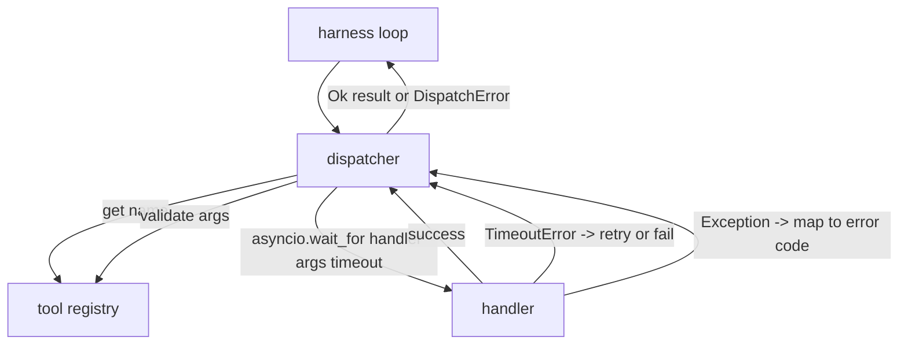
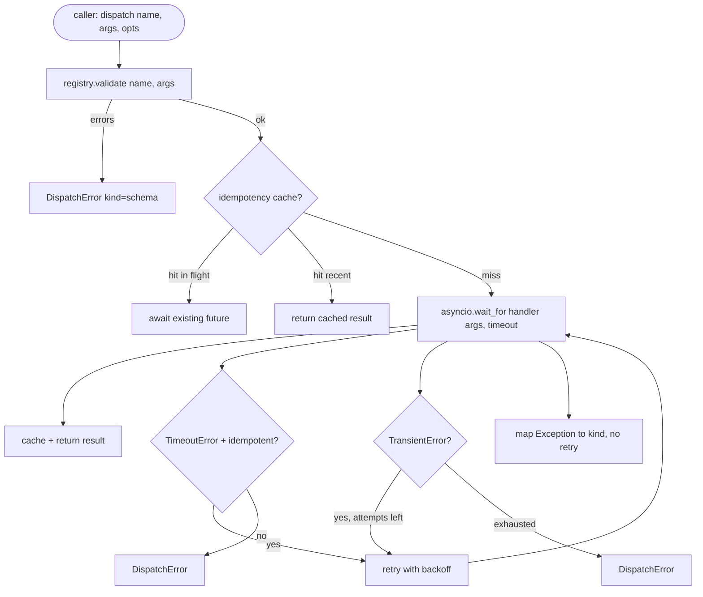

# Dispensador de llamadas de función

> El dispecer es donde el arnés paga por cada promesa que el esquema hizo, tiempo de espera, retemplajes, deducción, mapeo de errores, todo en una sola costura.

**Type:** Build
**Languages:** Python
**Prerequisites:** Phase 13 lessons 01-07, Phase 14 lesson 01
**Time:** ~90 minutes

## Objetivos de aprendizaje
- Envuelve un manipulador de herramientas en un tiempo de espera por llamada que devuelve un error de tipografía en lugar de colgar el bucle.
- Aplique retraso de retroceso exponencial con nerviosismo y un máximo de intentos.
- Deduplicar retemplajes en una tecla de idempotencia para que un retemplaje que corre con un original lento no corra dos veces.
- Las excepciones del manipulador de mapas y las fallas de transporte en un solo envoltorio de error que el bucle de arnés ya entiende.
- Enlace paralelo con un límite de concurrencia para que una ventilación de cuarenta llamadas de herramientas no agote el bucle de eventos.

```figure
cf-dispatch-retry
```

## Donde se sienta el despachador

Entre el bucle de arnés (lección veinte) y el registro de herramientas (lección veintiún). El transporte (lección veintidós) alimenta el bucle. El bucle entrega una llamada de herramienta al despachador. El despachador llama al registro, ejecuta el procesador y devuelve un resultado o un sobre de error en forma de JSON-RPC.



El dispecer es la única capa que sabe sobre los tiempos, retries e idempotencia.

## Tiempos de tiempo

Cada herramienta tiene un tiempo de espera predeterminado.`timeout_ms`El despachador lo anula desde una anulación de llamada cuando el arnés pasa uno.`asyncio.wait_for`En el tiempo de espera, la tarea de manipulación se cancela y el despachador regresa.`DispatchError(kind="timeout")`¿ Qué ?

Un tiempo de espera no es un error retryable por defecto para las herramientas no idempotentes.`db.write`El despachador honra a la persona que ha enviado la carta.`idempotent`las herramientas idempotentes vuelven a intentar. las herramientas no idempotentes no lo hacen.

## Retempos con retroceso exponencial

La política de retraso es de tres intentos, el retroceso es exponencial con nerviosismo.

```text
attempt 1  -> delay 0
attempt 2  -> delay 0.1s * (1 + random[0..0.5])
attempt 3  -> delay 0.4s * (1 + random[0..0.5])
```

Sólo .`timeout`y `transient`Error de prueba de nuevo.`schema`error, una `not_found`, o un `internal`El error no se retoma. Los errores de esquema son deterministas.

El bucle de retraso respeta el presupuesto del arnés. si el presupuesto del llamador tiene cero llamadas restantes a las herramientas, el despachador falla rápidamente en el primer intento y regresa `kind="budget_exceeded"`¿ Qué ?

## Dedución de la clave de impotencia

Una nueva prueba que dispara mientras el original todavía está en vuelo es un error de producción real. La primera llamada se hace en cuatro puntos nueve segundos (poco más allá del tiempo límite). La nueva prueba dispara en cinco segundos. Ahora dos solicitudes se enfrentan contra el mismo backend.`payments.charge`, has cargado dos veces.

El despachador acepta una opción.`idempotency_key`Si la misma llave está en vuelo cuando llega una llamada, el despachador espera el futuro en vuelo y devuelve su resultado.

La clave es la responsabilidad del llamador.`f"{step_id}:{tool_name}:{hash(args)}"`El despachador no inventa las claves, porque derivar una clave de los argumentos por sí solo hace que dos llamadas semánticamente diferentes parezcan iguales.

## Envase de error

Un envío fallido devuelve una sola forma.

```text
DispatchError
  kind        : "timeout" | "transient" | "schema" | "not_found" | "internal" | "budget_exceeded"
  message     : str
  attempts    : int
  jsonrpc_code: int   (one of -32601, -32602, -32603)
```

Los mapas de los circuitos de arnés `kind`al siguiente estado.`schema`y `not_found`¿ Qué pasa ?`on_error`y desencadenar un replan.`timeout`y `transient`¿ Qué pasa ?`on_error`y puede o no replantearse dependiendo de los intentos. `budget_exceeded`los desencadenantes `on_budget_exceeded`¿ Qué ?

## Límites de competencia para el ventilador

`gather(*calls)`La mayoría de los backends no quieren conexiones paralelas de un cliente.

El despachador se envuelve .`gather`En un semáforo. El límite de concurrencia predeterminado es ocho. Cada llamada adquiere el semáforo antes de enviar y se libera al finalizar.`gather`- la salida de forma pero la programación real está limitada.

## Flujo para una llamada



## Cómo leer el código

`code/main.py`define `Dispatcher`¿ Qué ?`DispatchError`, y `TransientError`El despachador lleva un registro de la construcción.`dispatch(name, args, ...)`El tiempo de entrada es el único punto de entrada.`_run_with_retries`el uso de`asyncio.wait_for`- ¿ Qué ?`gather_bounded(calls)`ejecuta muchos envíos con el límite de concurrencia.

`code/tests/test_dispatcher.py`cubre el disparo de tiempo de espera, el retiro en transiente, el no retiro en el error de esquema, la deducción de idempotencia (dos llamadas simultáneas con el mismo colapso de llave a una invocación de manipulador) y la limitación de concurrencia (el semáforo en acción).

Los ensayos utilizan`asyncio.sleep(0)`y determinista `Counter`- manipuladores basados, por lo que terminan en milisegundos y no dependen del tiempo del reloj de pared.

## Ir más allá

Dos extensiones de producción de los despachadores añaden. primero, registro estructurado en cada transición (que el flujo de eventos del bucle ya le da, pero el despachador también debe emitir `dispatch.attempt`y `dispatch.retry`En segundo lugar, los interruptores de circuito: después de que N fallos en una ventana, una herramienta recibe un período de enfriamiento en el que los envíos regresan inmediatamente con `kind="circuit_open"`Ambos encajan en la parte superior de este despachador sin cambiar el contrato.

Lección 24 pega el dispector a un agente de planificación y ejecución para que veas las cuatro piezas en movimiento.
