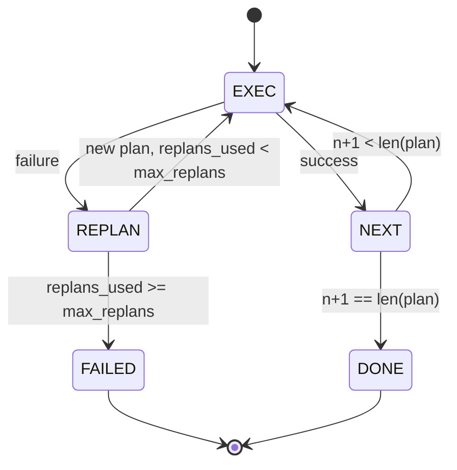

# Planar y ejecutar el flujo de control

> Un plan que no puede sobrevivir a un fracaso es un guión. Un guión que puede replanar es un agente.

**Type:** Build
**Languages:** Python
**Prerequisites:** Phase 13 lessons 01-07, Phase 14 lesson 01
**Time:** ~90 minutes

## Objetivos de aprendizaje
- Representa un plan como una lista ordenada de pasos tipados para que el ejecutor pueda razonar sobre el progreso y el resultado.
- Ejecutar los pasos secuencialmente con una entrega controlada de fallas de vuelta al planificador.
- Replan de la cursora actual con el error anterior en el contexto para que el siguiente plan se informe.
- Emite un plan diferente en cada revisión para que un rastreador o UI en aguas posteriores pueda mostrar por qué el plan cambió.
- Se aplican dos presupuestos: un techo de escalera duro y un techo de replante duro.

```figure
cg-plan-replan
```

## Planificar y ejecutar, no en cadena de pensamiento

Un agente de cadena de pensamiento emite tokens y deja que el bucle adivine dónde termina la llamada de herramienta. Un agente de plan y ejecución emite primero un plan estructurado, luego ejecuta cada paso deterministicamente. El plan es los datos que el arnés puede introspectar.

Un planificador que produce un plan, un ejecutor que ejecuta el plan, el trabajo interesante es lo que sucede cuando el ejecutor golpea un fracaso.

```text
1. Abort         (return failed, surface the error)
2. Skip          (mark step failed, continue with the rest)
3. Replan        (hand the error to the planner, get a new plan from the cursor)
```

Replan es el que convierte un guión en un agente.

## La forma del paso

```text
Step
  id              : int           (monotonic within a plan revision)
  tool_name       : str
  args            : dict
  expected_outcome: str           (planner's stated success condition)
  result          : Any | None
  error           : str | None
```

`expected_outcome`Es una frase corta que el planificador emite junto al paso. No es aplicada por el ejecutor. Es para dos cosas: el replanificador la lee al revisar el plan; el flujo de eventos la emite para que un rastreador pueda mostrar "este paso se suponía que haría X".

## La forma del planificador

```python
def planner(goal: str, history: list[Step], last_error: str | None) -> list[Step]:
    ...
```

Una función pura.`goal`es el objetivo del usuario. `history`es los pasos ya ejecutados (con resultados y errores completados). `last_error`No es ninguna en la primera llamada y el mensaje de falla más reciente en cada llamada posterior. El planificador devuelve el siguiente plan a partir del cursor.

El planificador no sabe del ejecutor, no sabe de retempos, no sabe de tiempos de espera, produce un plan, eso es todo.

## El ejecutor

El ejecutor es una pequeña máquina de estado. Cada paso pasa por el despachador. El resultado es una de tres cosas: éxito, fracaso-replantable, fracaso-fatal. fallos replantables devuelve al planificador. fallos fatales (orden el presupuesto, replan techo golpeado) devuelven un `FAILED`Resultado de la sesión.



## Diferencias en el plan de revisión

Cuando el planificador devuelve un nuevo plan después de un fracaso, el ejecutor emite una`plan.diff`evento con tres campos.

```text
removed: list of step ids that were in the old plan and are not in the new
added  : list of step ids in the new plan that were not in the old
revised: list of step ids whose tool_name or args changed
```

Un tracer o UI puede hacer esto como un golpe en los pasos eliminados y un resaltado en los añadidos. El punto no es el formato diferente. El punto es que la revisión es un evento visible, no una reescritura silenciosa.

## Dos presupuestos, ambos difíciles

`max_steps`El plan de cinco pasos lineal que se replantea dos veces y añade tres pasos cada vez que se ejecuta dieciséis ejecuciones y excedería el presupuesto. El ejecutor rechazará el replan y devolverá FAILED.

`max_replans`El plan de planificación de la primera etapa de la planificación de la planificación de la planificación de la planificación de la planificación de la planificación de la planificación de la planificación de la planificación de la planificación de la planificación de la planificación de la planificación de la planificación de la planificación de la planificación de la planificación de la planificación de la planificación de la planificación de la planificación de la planificación de la planificación de la planificación de la planificación de la planificación de la planificación de la planificación de la planificación de la planificación de la planificación de la planificación de la planificación de la planificación de la planificación de la planificación de la planificación de la planificación de la planificación de la planificación de la planificación de la planificación de la planificación de la planificación de la planificación de la planificación de la planificación de la planificación de la planificación de la planificación de la planificación de la planificación de la planificación de la planificación de la planificación de la planificación de la planificación de la planificación de la planificación de la planificación de la planificación de la planificación de la planificación de la planificación de la planificación de la planificación de la planificación de la planificación de la planificación de la planificación de la planificación de la planificación de la planificación de la planificación de la planificación de la planificación de la planificación de la planificación de la planificación de la planificación de la planificación de la planificación de la planificación de la planificación de la planificación de la planificación de la planificación de la planificación de la planificación de la planificación de la planificación de la planificación de la planificación de la planificación de la planificación de la planificación de la planificación de la planificación de la planificación de la planificación de la planificación de la planificación de la planificación de la planificación de la planificación de la planificación de la planificación de la planificación de la planificación de la planificación de la planificación de la planificación de la planificación de la planificación de la planificación de la planificación de la planificación de la planificación de la planificación de la planificación de la planificación de la planificación de la planificación de la planificación de la planificación de

## El planificador determinista en esta lección

En esta lección no llamamos a un modelo, sino a un planificador determinista que elige un plan basado en`last_error`¿ Qué ?

```text
last_error is None    -> emit a four-step plan
last_error matches X  -> emit a three-step plan that routes around X
last_error matches Y  -> emit a two-step plan that gives up gracefully
otherwise             -> return [] (signals nothing to replan)
```

Esto es suficiente para probar el comportamiento del ejecutor en cada camino de transición: éxito, replan-once, replan-twice, replan-exhaustion, y el gasto de paso.

## Forma del resultado

```text
SessionResult
  status      : "completed" | "failed"
  reason      : str     ("goal_met" | "step_budget" | "replan_budget" | "no_plan")
  history     : list[Step]
  revisions   : list[PlanDiff]
  events      : list[Event]
```

El bucle de arnés de la lección veinte puede leer esto directamente. El despachador de la lección veintitrés es lo que ejecuta cada paso. El registro de la lección veintiún valida los args de cada paso. El transporte de la lección veintitrés superficia todo este flujo a través de JSON-RPC a un cliente modelo.

## Cómo leer el código

`code/main.py`define `PlanExecuteAgent`¿ Qué ?`Step`¿ Qué ?`PlanDiff`¿ Qué ?`SessionResult`El ejecutor es un solo.`run(goal)`método que devuelve un `SessionResult`. La diferencia del plan se calcula comparando las identidades de los pasos y `(tool_name, args)`- ¿Qué?

`code/tests/test_agent.py`cubre un éxito lineal, un fracaso de medio plan que se replantea una vez, replantación de agotamiento que regresa `failed:replan_budget`, el agotamiento de los presupuestos a pasos y el formato de los eventos de diferencia de planes.

## Ir más allá

Dos extensiones que querrá una vez que se cableó esto a un modelo real. Primero, el plan de caché parcial: cuando un plan tiene éxito para los tres primeros pasos de seis y luego falla, no quiere volver a ejecutar los tres primeros. El ejecutor ya guarda el historial; el planificador solo necesita leerlo. Segundo, ramas paralelas: el ejecutor actual es estrictamente secuencial. Un planificador que emite una rama independiente (`gather_step`en lugar de`next_step`) puede realizar dos llamadas simultáneas a través del despachador.

Ambos agregan complejidad real. Ambos son más fáciles de agregar una vez que el ejecutor lineal está fijado. Eso es lo que esta lección hace.
