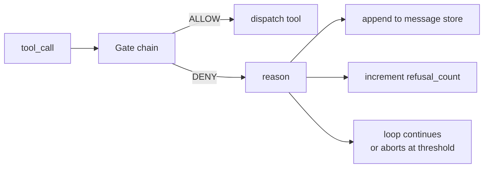
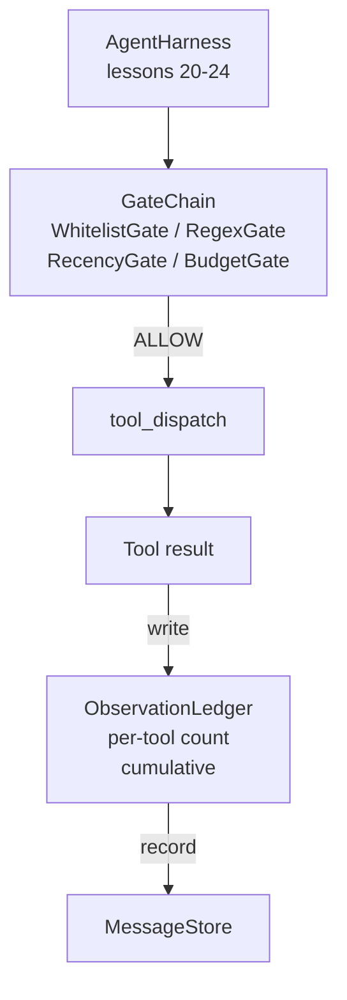

# Lección de Capstone 25: Puertas de Verificación y el presupuesto de observación

> Un arnés de agente sin una capa de verificación es un deseo en un abrigo. Esta lección construye la cadena de puertas determinista que decide si se permite disparar una llamada de herramienta, cuánto de su salida se permite a la agencia ver, y cuando el bucle tiene que parar porque la agencia ha leído demasiado. La cadena es una función de puertas pequeñas y nombradas más un libro mayor de observaciones que rastrea cada token que se ha mostrado el modelo.

**Type:** Build
**Languages:** Python (stdlib)
**Prerequisites:** Phase 19 · 20-24 (Track A1: agent loop, tool registry, message store, prompt builder, model router), Phase 14 · 33 (instructions as constraints), Phase 14 · 36 (scope contracts), Phase 14 · 38 (verification gates)
**Time:** ~90 minutes

## Objetivos de aprendizaje

- Construir un `VerificationGate`protocolo con un determinista `evaluate(call)`El método.
- Componer el presupuesto, la actualidad, la lista blanca y las puertas de regex en una cadena con semántica de cortocircuito.
- Seguir cada observación a través de un `ObservationLedger`teclado por herramienta y girar.
- Rechazar una convocatoria de instrumentos cuando se exceda el presupuesto de observación acumulado.
- Superficie de una estructura`GateDecision`registrar que la observabilidad aguas abajo puede ingerir.

## El problema

Cuando un arnés de agente permite que el modelo llame libremente a las herramientas, aparecen tres clases de errores dentro de la primera hora de uso real.

El primer es la observación ilimitada. Un grab en un repo de 200K líneas descarga medio millón de tokens de salida en el siguiente giro. El modelo ve una coincidencia por kilobita y el resto del contexto se desperdicia. La factura de tokens es grande y el agente ahora es peor, no mejor, en la tarea.

La segunda es la actualidad obsoleta. Una tarea de larga duración acumula cincuenta llamadas de herramientas. El modelo vuelve a leer el primer read_file desde la tercera curva como si fuera en estado real. Las modificaciones realizadas en la curva cuarenta y siete nunca aparecen porque el constructor de solicitudes serializó las primeras observaciones primero.

La tercera es el "Creeper de Privilegio".`web_search`, y de alguna manera termina corriendo .`shell`porque el modelo inventó un nombre de herramienta y el arnés se convirtió en permisible por defecto.

Una puerta de verificación es el componente del arnés que dice no. No es un modelo. No es un juez. Es una función determinista de `(call, history, ledger)`El modelo se cuenta, el bucle continúa o se aborta.

## El concepto



Una puerta es cualquier cosa con una`evaluate(call, ctx) -> GateDecision`La cadena es una lista ordenada. Los cortocircuitos de evaluación en la primera negación.

Esta lección tiene cuatro puertas:

- `WhitelistGate`Los nombres de herramientas permitidos son un conjunto explícito. Todo lo que está fuera es negado. Esta es la puerta más barata y se ejecuta primero.
- `RegexGate`. Los argumentos de herramienta se combinan con un regex. Útil para rechazar llamadas con shell`rm -rf`En ellos, o llamadas HTTP a IPs internas.
- `RecencyGate`El modelo sólo ve observaciones de las últimas curvas N. Las observaciones más antiguas se enmasculan. La puerta rechaza una llamada de herramienta cuyo resultado extendería una ventana de observación que ya ha envejecido.
- `BudgetGate`Cuando el libro mayor dice que se alcanza el límite, se niega cada llamada adicional a las herramientas.

El libro mayor de observaciones es la contabilidad. Cada llamada de herramienta exitosa escribe una fila: nombre de herramienta, turno, tokens emitidos, acumulativo. El libro mayor responde a dos preguntas: cuánto ha visto el modelo total, y cuánto ha visto de la herramienta X. La puerta de presupuesto lee la primera. Una puerta de presupuesto por herramienta, que escribirás como ejercicio, lee la segunda.

```figure
cg-gate-chain
```

## Arquitectura



El arnés pide a la cadena. La cadena o hace un guiño o se niega. Si hace un guiño, la herramienta se ejecuta, el libro mayor marca, y el resultado se adjunta a la tienda de mensajes. Si se niega, se le entrega al modelo el rechazo como un mensaje del sistema y el bucle decide si se intenta o abortar de nuevo.

## Lo que construirás

La aplicación es única `main.py`Además de pruebas.

1. `Observation`y `ToolCall`las clases de datos definen las formas de alambre.
2. `ObservationLedger`registros `(turn, tool, tokens)`líneas y respuestas `cumulative()`y `per_tool(name)`¿ Qué ?
3. `GateDecision`que lleva`(allow, reason, gate_name)`¿ Qué ?
4. `VerificationGate`Cada puerta se ejecuta.`evaluate(call, ctx)`¿ Qué ?
5. `GateChain`Llama a cada puerta, devuelve la primera negación o devuelve permiten si cada puerta pasa.
6. La demostración ejecuta un pequeño ciclo de agentes sintéticos. Tres giros. La tercera vuelta desvía la puerta de presupuesto y el ciclo informa un rechazo limpio con un recuento de rechazo no cero.

El contador de tokens es intencionalmente un estúpido .`len(text) // 4`El punto de esta lección es la tubería de puertas, no el tokenizer.

## Por qué importa el orden de la cadena

Una negación es más barata que una autorización.`WhitelistGate`se ejecuta en O(1) búsqueda de hash. `RegexGate`se ejecuta en O(patrón * argv). `RecencyGate`lee una pequeña rebanada de la tienda de mensajes. `BudgetGate`Los pedimos al subir el costo, así que una llamada rechazada corta el circuito antes de hacer el trabajo caro.

El proyecto de ley de la Unión Europea, que se aplica a las empresas de la industria de la construcción, se ha convertido en un proyecto de ley de la Unión Europea, que se ha desarrollado en el ámbito de la industria de la construcción, y que se ha desarrollado en el ámbito de la industria de la construcción.

## Cómo se compone esto con el resto de la pista A

Las lecciones anteriores te dieron el bucle, el registro de herramientas, el almacén de mensajes, el constructor de instrucciones y el router modelo. Esta lección añade la capa entre el modelo y las herramientas. Lección 26 envía la caja de arena a la que el despachador entrega la llamada de herramienta una vez que la cadena de puertas dice ALLOW. La lección 27 envía el arnés de evaluación que registra la negativa cuenta como una señal de calidad. La lección 28 conecta las decisiones de la puerta a los espacios de OpenTelemetry. La lección 29 teña el lote en un agente de codificación que trabaja.

## Lo estoy ejecutando.

```bash
cd phases/19-capstone-projects/25-verification-gates-observation-budget
python3 code/main.py
python3 -m pytest code/tests/ -v
```

La demostración imprime un rastro de turno a turno incluyendo cada decisión de la puerta y sale de cero. Las pruebas cubren el libro mayor, cada puerta en aislamiento, el cortocircuito de cadena y el bucle sintético de extremo a extremo.
