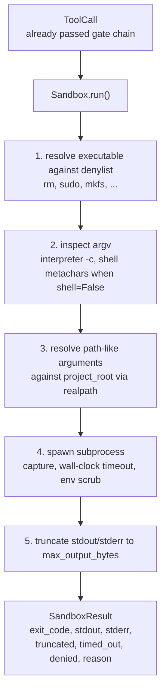
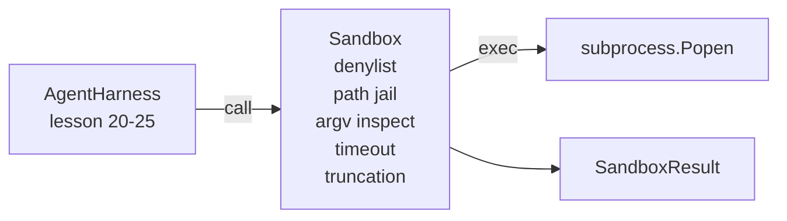

# Lección 26: Corredor de Sandbox con Denylist y Path Prison

> La puerta de verificación decide si se debe ejecutar una llamada de herramienta. La caja de arena decide lo que sucede cuando lo hace. Esta lección envía un subprocesador que rechaza ejecutables peligrosos, rechaza formas peligrosas de argv, encierra todos los caminos de archivos a una raíz del proyecto, truncando la salida de tamaño excesivo y matando procesos fugitivos en un tiempo límite de tiempo. Es la segunda de las dos capas que se sitúan entre el modelo y el sistema operativo.

**Type:** Build
**Languages:** Python (stdlib)
**Prerequisites:** Phase 19 · 25 (verification gates and observation budget), Phase 14 · 33 (instructions as constraints), Phase 14 · 38 (verification gates)
**Time:** ~90 minutes

## Objetivos de aprendizaje

- Construir un `Sandbox`envase de clase `subprocess.run`con tiempo de espera, captura y truncado.
- Rechazar un comando por nombre contra un denilista y por estructura contra un inspector de argv.
- Rechazar cualquier argumento de ruta que se resuelva fuera de una raíz del proyecto declarada.
- Rechazar metacaracteres de la cáscara cuando el modo de la cáscara está apagado.
- Regresa una estructura`SandboxResult`que la observabilidad aguas abajo y el arnés de evaluación pueden ingerir.

## El problema

Un agente de codificación que puede descargar puede instalar puertas traseras, exfiltrar llaves, construir una computadora portátil para desarrolladores y acumular una factura en la nube en un solo giro. La defensa menos costosa es no darle carcasa. La segunda más costosa es una caja de arena que dice no a una lista precisa de patrones.

Tres clases de fallas se repiten en las huellas de los agentes.

El primero es ejecutables peligrosos. Un modelo bajo presión para arreglar un problema de ruta intentará`sudo`¿ Qué ?`chmod -R 777`¿ Qué ?`rm -rf`¿ Qué ?`mkfs`¿ Qué ?`dd`Ninguno de estos pertenece a una carrera de agentes.

El segundo es el truco de argv. Un modelo que no se le ha dicho que no tiene proyectiles conducirá un ataque a través de un intérprete:`python3 -c "import os; os.system('rm -rf /')"`¿ Qué ?`bash -c '...'`¿ Qué ?`node -e '...'`¿ Qué ?`perl -e '...'`La caja de arena necesita saber que cualquier intérprete corre con un`-c`- como la bandera es sólo una llamada con pasos adicionales.

El tercer es el escape de camino.`./src/main.py`y en su lugar lee`../../etc/passwd`La caja de arena encarcela cada argumento de camino resolviéndolo a través de`os.path.realpath`y afirmar el prefijo.

La caja de arena no es un límite de seguridad en el sentido del sistema operativo. Un atacante determinado con ejecución de código aún puede salir. La caja de arena es un barranco de seguridad en el tiempo de desarrollo: hace que los modos de falla comunes sean fuertes y impide que el agente haga daño por pura ineptitud.

## El concepto



El sandbox tiene cuatro ejes de rechazo: nombre, argv, camino, estructura. Cada eje es una función pura de la llamada, no hay subproceso todavía. El subproceso solo se desata después de que cada eje ha pasado.

El `SandboxResult`Los códigos de salida son los convencionales: 0 éxito, fallo no cero, más tres códigos sentinel para rechazado (-100), timed_out (-101), y truncado (el código de salida es el real, con un conjunto de banderas).

```figure
cg-path-jail
```

## Arquitectura



El nombre denilista es un conjunto de nombres básicos ejecutables.`/bin/rm`¿ Qué ?`/usr/bin/rm`El inspector argv conoce la forma del intérprete: cualquier argv donde argv[0] es un intérprete y cualquier arg posterior comienza con `-c`o `-e`Se niega la información.`;`¿ Qué ?`|`¿ Qué ?`&`¿ Qué ?`>`¿ Qué ?`<`, las bolsas de atrás,`$()`) causa la negativa cuando la convocatoria no solicita explícitamente una concha.

La cárcel de la ruta es la pieza más sutil.`project_root`En la construcción. cualquier argumento que parezca un camino (contiene`/`o corresponde a un archivo existente) se normaliza a través de `os.path.realpath`, luego se comprueba contra el camino real de la raíz del proyecto. Si el objetivo resuelto no está debajo de la raíz, rechazo. Los intentos de escape de Symlink (un vínculo simétrico en la raíz del proyecto que apunta hacia afuera) se bloquean comprobando el camino real, no el camino literal.

## Lo que construirás

La aplicación es `main.py`Además de un examen de la droga.

1. `SandboxResult`Dataclass: exit_code, stdout, stderr, truncado, timed_out, denegado, razón, duración_ms.
2. `SandboxConfig`clase de datos: proyecto_root, max_output_bytes, tiempoout_seconds, denylist, interpret_block.
3. `Sandbox`clase: `run(argv, *, shell=False, cwd=None)`devuelve un `SandboxResult`¿ Qué ?
4. Ajudantes internos de rechazo: `_check_executable_denylist`¿ Qué ?`_check_argv_interpreter`¿ Qué ?`_check_shell_metachars`¿ Qué ?`_check_path_jail`¿ Qué ?
5. Truncado de salida con un claro`truncated`bandera y una línea de marcado en el arroyo capturado.
6. Demo en la parte inferior: una secuencia de llamadas legítimas y adversarias.

La caja de arena utiliza `subprocess.run`con`shell=False`por defecto y `capture_output=True`El tiempo de tiempo del reloj de la pared utiliza el `timeout`argumentos; en `TimeoutExpired`, la caja de arena mata el grupo de procesos y sintetiza un Result de la caja de arena.

## ¿Por qué no es una verdadera caja de arena?

La caja de arena de la lección no utiliza espacios de nombres, grupos, seccomp, gVisor, Firecracker o cualquier aislamiento a nivel de núcleo. Cualquier cosa que el subproceso pueda hacer, la caja de arena puede hacer. La protección es estructural: al agente se le niegan las invocaciones peligrosas más comunes, y la negativa fuerte se vuelve observable en lugar de correr silenciosamente.

Para los agentes de producción, coloca la capa superior: ejecuta dentro de un contenedor de Docker no privilegiado, ejecuta dentro de una microVM, deja de lado las capacidades, monta el proyecto de raíz de lectura-solo y un rascador de lectura-escritura, establece un límite en la memoria y la CPU, despeja el entorno a una lista blanca segura conocida.

## Lo estoy ejecutando.

```bash
cd phases/19-capstone-projects/26-sandbox-runner-denylist
python3 code/main.py
python3 -m pytest code/tests/ -v
```

La demostración crea un directorio temporal, deja un archivo limpio en él, luego ejecuta una batería de llamadas. Las llamadas legales tienen éxito. Las llamadas rechazadas devuelven SandboxResult con `denied=True`Y una razón.`timed_out=True`. Setios de truncado `truncated=True`La demostración imprime una tabla JSON de resultados y sale de cero.

## Cómo se compone esto con el resto de la pista A

La lección 25 produjo la cadena de puertas. La lección 26 es el ejecutor que se ejecuta después de una puerta ALLOW. El valor de evaluación de la lección 27 compara los resultados de la caja de arena con el código de salida esperado por tarea. La lección 28 emite un `gen_ai.tool.execution`Esparcimiento alrededor de cada uno `Sandbox.run`La demostración de extremo a extremo de la lección 29 transmite un agente de codificación real a través de ambas capas.
