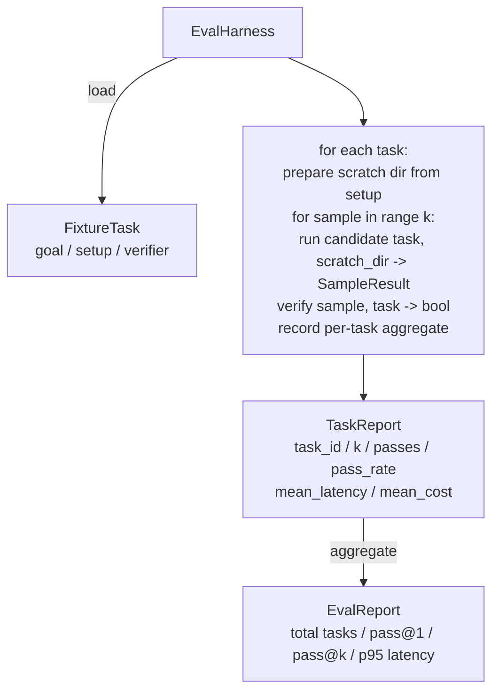

# Lección 27: Arnés igual con tareas fijas

> Un agente de codificación es tan bueno como el conjunto de tareas con las que lo mide. Esta lección construye un arnés de evaluación que toma una carpeta de tareas fijas, ejecuta cada una a través de un agente candidato, las puntuaciones pasan o fallan a través de un verificador determinístico, y agrega los resultados en pass@1, pass@k, latencia media y costo medio. El arnés es la fuente de la verdad que permite saber una regresión de un refactor.

**Type:** Build
**Languages:** Python (stdlib)
**Prerequisites:** Phase 19 · 25 (verification gates), Phase 19 · 26 (sandbox runner), Phase 14 · 30 (eval-driven agent development), Phase 14 · 19 (SWE-bench and GAIA benchmarks)
**Time:** ~90 minutes

## Objetivos de aprendizaje

- Definir una tarea fija como un triple de meta, configuración y verificador.
- Pon en varias muestras de ejecuciones por tarea y computa pas@1 y pass@k.
- La latencia y el costo agregados en medias y 95o percentil métricas.
- Verificadores determinísticos de cable (diferencia de archivo, código de salida, regex match) en funciones reutilizables.
- Emite un informe JSON estructurado que un script de seguimiento de regresión pueda ingerir.

## El problema

Tres modos de falla de los agentes de plaga de referencia construidos sin un arnés de evaluación.

El agente dice que arregló el error, las miradas humanas al dif, la suite está marcada de verde, y tres semanas después la prueba de regresión aparece el mismo error.

El segundo es la regresión no detectada. Un cambio en la plantilla de solicitud hace que el agente sea 4% mejor en la tarea alta y 14% peor en la silenciosa. Sin un conjunto de oro y una puntuación por tarea, la regresión se dirige al principal y aparece solo cuando un cliente se queja.

La tercera es la deriva por tarea. La evaluación se realizó el lunes con 100 tareas y el viernes con 95 de ellas, porque alguien cambió el nombre de cinco fichas. La tasa de aprobación parece una mejora del 5%.

El arnés es el programa que convierte estos fallos en hechos. ejecuta cada fijación, cada vez, en un orden reproducible, contra un verificador que devuelve verdad o falsedad en una verificación determinista.

## El concepto

```mermaid
flowchart LR
  F1[fixtures/task_001/<br/>task.json + expected/] --> Harness
  F2[fixtures/task_002/<br/>...] --> Harness
  Harness[Harness<br/>for each task:<br/>setup / run agent k samples /<br/>verify each sample /<br/>record latency, cost]
  Harness --> Report[EvalReport<br/>pass@1 / pass@k<br/>mean ms / p95 ms<br/>mean cost]
```

¿ Qué es esto ?`FixtureTask`es un pequeño archivo JSON más una opción `expected/`El JSON declara un `id`, una `goal`(la solicitud enviada al agente), un `setup`bloque (files para caer en el rasguño dir), y un `verifier`El bloque de verificación nombra una función en el registro de verificación del arnés y suministra sus argumentos.

Tres formas de verificación cubren la mayoría de las tareas útiles.

El primero es:`file_equals`Después de que el agente se ejecute, comparar un archivo con el contenido esperado. Esto capta "corregar este error de esta manera exacta" tareas.

El segundo es`regex_match`. El contenido del archivo nombrado se combina con un regex. Esto capta "la función debe existir y devolver X" tareas donde hay muchas soluciones aceptables.

El tercero es`shell_exit_zero`El arnés ejecuta un comando de captura (a través de la caja de arena de la lección 26) y pasa la tarea solo si el comando sale de cero.

El arnés hace cada tarea .`k`veces. Pass@k es `1 - (1 - p)^k`donde p es la tasa de paso empírica; el arnés también informa los recuentos en bruto para que pueda detectar la variación. La latencia es el reloj de pared por muestra. El costo es lo que sea que el agente auto-reporte (conto de tokens, USD o ambos); el arnés lo suma a través de las muestras y presenta los números por tarea y agregados.

```figure
pass-at-k
```

## Arquitectura



El candidato es un llamativo:`Callable[[FixtureTask, str], SampleResult]`El arnés crea el directorio de rasguños a través de`tempfile.mkdtemp()`El arnés no se preocupa de cómo funciona el candidato. El candidato podría ser un aplicador de parches deterministas (utiles para las autoprobas de arnés), un agente de LLM real, un fuzzer.

## Lo que construirás

`main.py`Naves:

1. `FixtureTask`clase de datos.
2. `SampleResult`clase de datos: éxito_auto-reportado, latencia_ms, cost_unities, modificaciones.
3. `TaskReport`¿ Qué ?`EvalReport`las clases de datos con `to_dict()`¿ Qué ?
4. `VerifierRegistry`el nombre del verificador de mapas para funcionar. verificadores incorporados: file_equals, regex_match, shell_exit_zero.
5. `EvalHarness`Se ejecuta un directorio de tareas contra un candidato.
6. Cinco tareas fijas en conjunto `tasks/`¿Qué es esto ?
   - de un a otro en `fizzbuzz`
   - falta de retorno en `factorial`
   - error de escritura en el mensaje de error
   - cuerpo de función vacía
   - de un lado a otro en el recorrido de la lista vinculada
7. Un candidato de referencia determinista (`apply_known_fixes`) el arnés utiliza para demostrar un paso limpio@1 de 1.0.
8. Demo imprime el JSON de EvalReport y sale de cero.

Las tareas de fixture se agrupan como archivos JSON en `tasks/`más archivos de origen emparejados en `tasks/<id>/buggy/`y `tasks/<id>/expected/`El arnés copia el buggy en un rasguño, lo entrega al candidato, y verifica contra lo esperado.

## ¿Por qué pasar@k y no sólo pasar@1

Los agentes de LLM reales son estocásticos. Un pass@1 de 0.6 parece un fracaso. Un pass@5 de 0.95 dice que el agente obtiene la respuesta correcta la mayoría de las veces, pero está eligiendo mal en las primeras muestras. La solución es la muestreo y clasificación, no siempre más entrenamiento.

Pass@k se informa junto con pass@1 porque pass@k presenta un fallo real: si el modelo obtiene la respuesta correcta una vez en veinte intentos no tienes un agente útil.

## Cómo se compone esto con el resto de la pista A

La lección 25 produjo la cadena de la puerta. La lección 26 produjo la caja de arena.`shell_exit_zero`La lección 28 incluye cada arnés en un rastro OTel. La lección 29 muestra la demostración de extremo a extremo contra uno de los accesorios en paquete y afirma que pass@1 = 1.0 para el candidato de referencia.

## Lo estoy ejecutando.

```bash
cd phases/19-capstone-projects/27-eval-harness-fixture-tasks
python3 code/main.py
python3 -m pytest code/tests/ -v
```

La demostración imprime el EvalReport en JSON, incluyendo pass@1, pass@5, latencia media y desglose por tarea. El código de salida es cero. Las pruebas cubren las funciones de verificación, la matemática de pass@k, la carga de fijos y el arnés de extremo a extremo contra el candidato de referencia en paquete.
