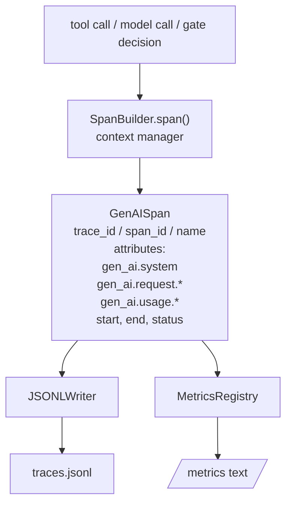
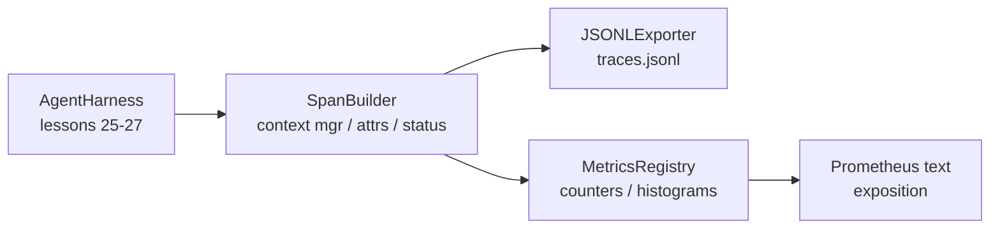

# Lección 28 de Capstone: Observabilidad con OTel GenAI Spans y Metricas Prometheus

> Un arnés de agente sin observabilidad es una caja negra que cuesta dinero. Esta lección rodea manualmente un constructor de espacio que emite registros que cumplen con las convenciones semánticas OpenTelemetry GenAI, los escribe en un archivo JSON-Lines un espacio por línea y expone contadores e histogramas en formato de texto Prometheus.

**Type:** Build
**Languages:** Python (stdlib)
**Prerequisites:** Phase 19 · 25 (verification gates), Phase 19 · 26 (sandbox), Phase 19 · 27 (eval harness), Phase 13 · 20 (OpenTelemetry GenAI), Phase 14 · 23 (OTel GenAI conventions)
**Time:** ~90 minutes

## Objetivos de aprendizaje

- Construir una clase de datos de extensión conformada a las convenciones semánticas de OpenTelemetry GenAI.
- Implementar un exportador JSONL que escribe un espacio autónomo por línea.
- Construir contadores e histogramas con etiquetas y exposición en formato de texto Prometheus.
- Envuelve cualquier llamada en un gestor de contexto de período que registre la duración, el estado y las excepciones.
- Verifique si el espacio emitido viaja de ida y vuelta a través de `json.loads`y coincide con la forma de la especificación.

## El problema

Un agente de codificación en producción produce tres clases de artefactos a cada turno: una llamada de modelo, una ejecución de herramienta y una decisión de puerta de verificación. Ninguno de estos es útil sin telemetría estructurada.

El primer modo de falla es el rastro perdido. Algo salió mal el martes pero el único registro es un registro de chat de 500 líneas. No hay registro de qué herramienta se ejecutó, cuánto tiempo tomó, cuántos tokens entraron en el aviso, o si la puerta rechazó algo. El agente autor tiene que adivinar.

El segundo modo de falla es el rastro imperceptible. El arnés escribió extensiones pero usó sus propios nombres de campo ad hoc. Nada en Grafana, Honeycomb, Jaeger o el CLI local puede leerlos. Cualquier herramienta que exista en la pila del equipo se desperdicia porque las extensiones no son estándar.

El tercer modo de falla es la métrica no agregada. Puedes ver una llamada lenta de herramienta en el rastro, pero no puedes responder "¿cuál es la latencia p95 de las llamadas de read_file durante la última hora?" porque no hay métricas, solo rastros.

Los conceptos semánticos de OpenTelemetry GenAI existen exactamente para esto. Definen un pequeño conjunto de atributos estándar que los emisores de todos los frameworks LLM comparten.

## El concepto



Cada operación en el arnés produce un span. Un span tiene un trace id (la invocación de todo el agente), un span id (esta operación), un nombre (por ejemplo `gen_ai.chat`¿ Qué ?`gen_ai.tool.execution`), los atributos que siguen a las convenciones de GenAI, un tiempo de inicio y de fin y un estado.

Las convenciones de GenAI estandarizan estas claves de atributos: `gen_ai.system`(cuál proveedor, por ejemplo `anthropic`¿ Qué ?`openai`), `gen_ai.request.model`(identificación del modelo), `gen_ai.request.max_tokens`¿ Qué ?`gen_ai.usage.input_tokens`¿ Qué ?`gen_ai.usage.output_tokens`¿ Qué ?`gen_ai.response.model`¿ Qué ?`gen_ai.response.id`¿ Qué ?`gen_ai.operation.name`, más claves específicas de las herramientas `gen_ai.tool.name`y `gen_ai.tool.call.id`¿ Qué ?

El exportador escribe JSONL. Un objeto JSON por línea. Este es el formato más simple posible que las herramientas en aguas subyacentes pueden transmitir, grabar e importar. Un exportador OTel real hablaría OTLP gRPC; el exportador JSONL de la lección es el equivalente fuera de línea y sale de cero en cada estación de trabajo.

Las métricas viven junto a las huellas. Un incremento de contra en cada llamada de herramienta: `tools_called_total{tool="read_file"}`Un histograma registra la latencia observada: `tool_latency_ms{tool="read_file"}`Ambos se enserrizan en formato de exposición de texto Prometheus, que es el estándar de facto para métricas basadas en la atracción.

```figure
trace-spans
```

## Arquitectura



El constructor de espacios es una clase pequeña con un `span(name, attrs)`El gestor de contexto registra el tiempo de inicio en la entrada, el tiempo de finalización en la salida, adjunta una excepción si se levantó una y empuja el período final al exportador.

El registro de métricas es de dos dicts.`{(name, frozen_labels): int}`Los histogramas conservan muestras crudas en una lista y se enserizan en cubos de histograma de Prometheus en el momento de la exposición.

## Lo que construirás

`main.py`Naves:

1. `GenAISpan`Dataclass: trace_id, span_id, parent_span_id, nombre, atributos, start_unix_nano, end_unix_nano, estado, estado_mensaje, eventos.
2. `SpanBuilder`clase con `span(name, attrs, parent=None)`el gestor de contexto.
3. `JSONLExporter`clase con `export(span)`que añade una línea.
4. `Counter`y `Histogram`clases más `MetricsRegistry`¿ Qué ?
5. `prometheus_exposition(registry)`que produce una salida de formato de texto.
6. `wrap_tool_call(name)`decoratora que emite un espacio y actualiza las métricas.
7. Demo: sintetiza una invocación completa de agente (gen_ai.chat span alrededor de las extensiones de herramientas), escribe traces.jsonl, imprime la exposición de Prometheus, sale de cero.

El ID de la franja y el ID de la pista son cadenas hexáticas de 16 bytes, generadas a partir de `os.urandom`El exportador nunca lanza, los errores de IO aparecen pero el arnés sigue funcionando.

El histograma tiene un conjunto de cubo fijo (el OTel predeterminado para la latencia en milisegundos: 5, 10, 25, 50, 100, 250, 500, 1000, 2500, 5000, 10000, +Inf).

## ¿Por qué rodado a mano en lugar de opentelemetría-sdk

El OTel Python SDK es una dependencia real. También es varios miles de líneas de código, múltiples procesos para el exportador de OTLP, y un costo de tiempo de ejecución que inunda un presupuesto de lección. La versión rodada a mano enseña el formato de cable. En producción se filtran los mismos atributos en el SDK real y se obtiene el exportador de OTLP, lotes y detección de recursos de forma gratuita.

Los convenciones son estables. El formato de cable que emite la lección seguirá analizando en 2030 porque OTel nunca rompe los nombres de atributos de GenAI; sólo añaden nuevos.

## Cómo se compone esto con el resto de la pista A

La lección 25 produjo la cadena de puertas. La lección 26 produjo la caja de arena. La lección 27 produjo el arnés de evaluación. La lección 28 hace que los tres sean observables. La lección 29 envuelve cada paso de la demostración de extremo a extremo en espacios y impresa el texto de Prometeo al final.

## Lo estoy ejecutando.

```bash
cd phases/19-capstone-projects/28-observability-otel-traces
python3 code/main.py
python3 -m pytest code/tests/ -v
```

La demostración emite una`traces.jsonl`En el trabajo dir de la lección (limpiado al final), luego imprime una muestra de tres intervalos, luego imprime la exposición Prometheus para los contadores e histogramas. Las pruebas verifican que los intervalos se enseran en serie, que los atributos canónicos GenAI están presentes, que cuenta el incremento correctamente y que la exposición del histograma contiene los recuentos esperados.
