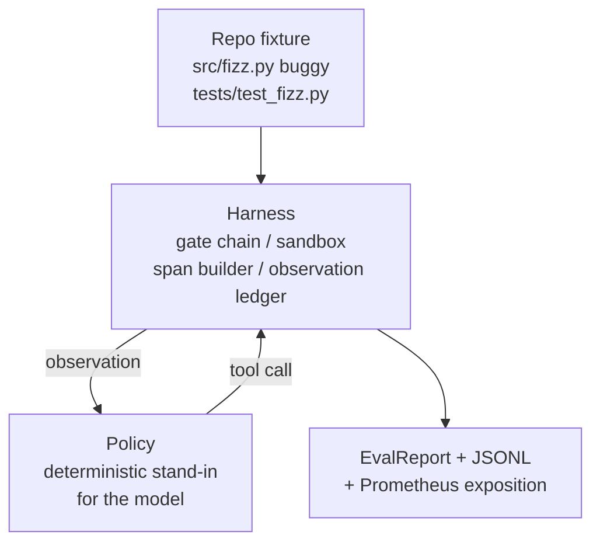
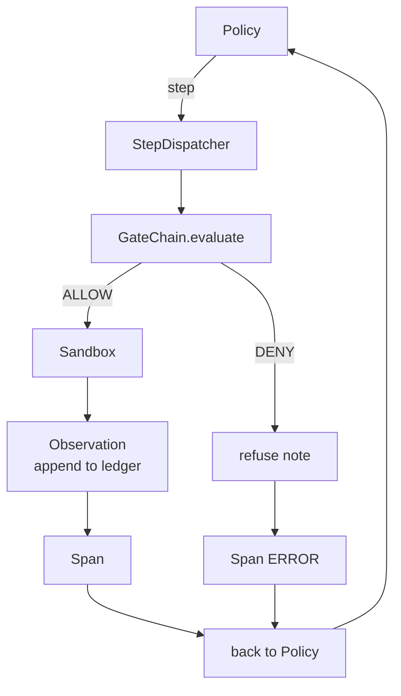

# Capstone Lección 29: Agente de codificación de extremo a extremo en el arnés

> La recompensa de la pista A. Esta lección cose la cadena de puertas, la caja de arena, el arnés de eval y el OTel se extiende en un agente de codificación que arregla un error real (pequeño, a escala fija) en un proyecto de Python multi-archivo. El agente es una política determinista, no un LLM; la sustitución hace que la lección sea reproducible y muestra que el arnés fue la parte interesante todo el tiempo. El contrato es idéntico: un modelo real se conecta a la costura de la política.

**Type:** Build
**Languages:** Python (stdlib)
**Prerequisites:** Phase 19 · 25 (verification gates), Phase 19 · 26 (sandbox), Phase 19 · 27 (eval harness), Phase 19 · 28 (observability), Phase 14 · 38 (verification gates), Phase 14 · 41 (workbench for real repos), Phase 14 · 42 (agent workbench capstone)
**Time:** ~90 minutes

## Objetivos de aprendizaje

- Compone la cadena de la puerta, la caja de arena, el arnés de evaluación y el constructor de extensión en un solo bucle de agentes.
- Implemente una política determinista que utiliza read_file, run_tests y write_file para arreglar un error de fijación.
- Implementar un presupuesto global de pasos más un presupuesto de tokens de observación en una carrera de extremo a extremo.
- Emite las huellas completas de OTel GenAI y las métricas de Prometheus para el funcionamiento completo.
- Verifique si el agente resuelve la fijación en menos de 12 pasos con cero viajes a la puerta en herramientas legales.

## El problema

La mayoría de las demostraciones de agentes funcionan aisladas: una caja de arena por sí misma, un arnés de evaluación por sí mismo, un emisor de espacio por sí mismo. Se ven bien.

La cadena de puertas dice ALLOVE pero la caja de arena se niega por una razón que la cadena no anticipó. El arnés de evaluación registra un pase pero los espacios de OTel dicen que la puerta rechazó una herramienta que el agente afirma que usó. El contador Prometheus se incrementa dos veces cuando debe incrementarse una vez. El presupuesto de observación se ha superado pero el agente siguió adelante porque el presupuesto estaba rastreado en la cadena y la caja de arena no lo sabía.

Esta lección es la prueba de integración para toda la pista. El agente tiene que hacer cuatro cosas para orden: leer el proyecto, ejecutar las pruebas, identificar el error del fallo de la prueba, escribir la corrección, volver a ejecutar las pruebas y detener. Cada operación pasa a través de la cadena de puertas. Cada ejecución de herramientas pasa a través de la caja de arena. Cada paso se envuelve en un lapso. El arnés de evaluación marca todo al final.

## El concepto



La política del agente es una máquina estatal.

`SURVEY`El siguiente estado es RUN_TESTS.

`RUN_TESTS`Si las pruebas pasan, la máquina de estado se detiene con éxito.

`INSPECT`El agente lee el archivo fuente fallido.

`FIX`El agente escribe el archivo corregido.

`VERIFY`Si las pruebas pasan, detenga el éxito.

Cada estado corresponde a una llamada de herramienta. Cada llamada de herramienta pasa a través de la cadena de puertas. Si una llamada de herramienta es denegada, el agente informa el rechazo en el rastreo y se detiene.

El error de fijación es un off-by-one en `fizz.py`La política determinista detecta el error del mensaje de falla de prueba a través de un regex y emite el archivo corregido.

```figure
cg-harness-weave
```

## Arquitectura



La lección es autónoma. Cada primitiva pre-lección se reimplementa a escala mínima en`main.py`Los nombres coinciden exactamente con las lecciones 25-28 así que el mapeo conceptual es inequívoco.

## Lo que construirás

`main.py`Naves:

1. Las primitivas de arnés mínimo, copiadas con los mismos nombres que las lecciones 25-28:`GateChain`¿ Qué ?`Sandbox`¿ Qué ?`ObservationLedger`¿ Qué ?`SpanBuilder`¿ Qué ?`MetricsRegistry`¿ Qué ?
2. `CodingAgentPolicy`clase: máquina de estado con cinco estados.
3. `Repo`auxiliar: prepara un rasguño con el accesorio de la camioneta envuelto.
4. `AgentRun`clase: maneja la póliza, despachas a través del arnés, devuelve un `AgentRunReport`¿ Qué ?
5. Un dispositivo en conjunto (`fixture_repo/`) con src/fizz.py, tests/test_fizz.py y un árbol/previsión para el arnés de evaluación.
6. Demo: ejecuta la política de extremo a extremo, imprime el rastro paso a paso, afirma el paso, imprime métricas.

El paquete de fijación tiene la misma forma que la estructura de tareas de la lección 27: un archivo de errores y un archivo de pruebas. El mensaje de falla de prueba contiene suficiente información para que la política determinista identifique la solución. Un LLM real haría el mismo trabajo, más lento y con un recuerdo más amplio, pero no cambiaría las expectativas del arnés.

## Por qué la política no es un LLM

Un LLM real requiere una clave API, una llamada de red y una estocástica no verificable. El arnés es la parte que le importa a la lección. Subbing en una política determinista permite que la lección se ejecute en cualquier ordenador portátil de desarrollador con cero dependencias externas y permite que la suite de pruebas afirme el recuento exacto de pasos.

La política de la lección es un subconjunto estricto de lo que hace un agente de LLM. La política lee el repo, ve la prueba fallida, identifica la línea y emite una corrección.

## Lo que dice la demostración

La demostración de extremo a extremo afirma cinco cosas en el momento de la salida, y la suite de pruebas las reafirma programáticamente.

La política resolvió el problema en menos de 12 pasos.

El presupuesto de observación nunca se excedió.

Las negaciones de la puerta cero dispararon contra herramientas legales.

Cada paso tiene un lapso correspondiente en los rastros. jsonl.

La exposición de Prometheus contiene un `tools_called_total{tool="read_file"}`entrada y una `tool_latency_ms`histograma.

## Cómo se compone esto con el resto de la pista A

Esta lección es la integración. La lección 25 escribió la cadena de puertas. La lección 26 escribió la caja de arena. La lección 27 escribió el arnés de evaluación. La lección 28 escribió la observabilidad. La lección 29 prueba que funcionan como un sistema. Un arnés de agente real se extiende desde aquí: intercambiar la política determinista por un modelo, intercambiar el fijo en paquete por una tarea de reposición real, intercambiar el exportador JSONL por OTLP.

## Lo estoy ejecutando.

```bash
cd phases/19-capstone-projects/29-end-to-end-coding-task-demo
python3 code/main.py
python3 -m pytest code/tests/ -v
```

La demostración imprime un rastro por paso, el informe de evaluación final y la exposición de Prometheus. El código de salida es cero. Las pruebas cubren las transiciones del estado de la política, los rechazos de puertas en llamadas de herramientas sintéticas, la ejecución de extremo a extremo en el dispositivo en paquete e invariantes de presupuesto a paso.
