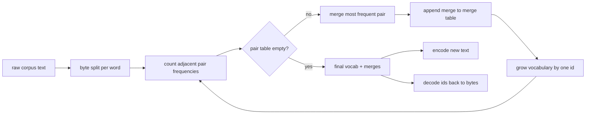
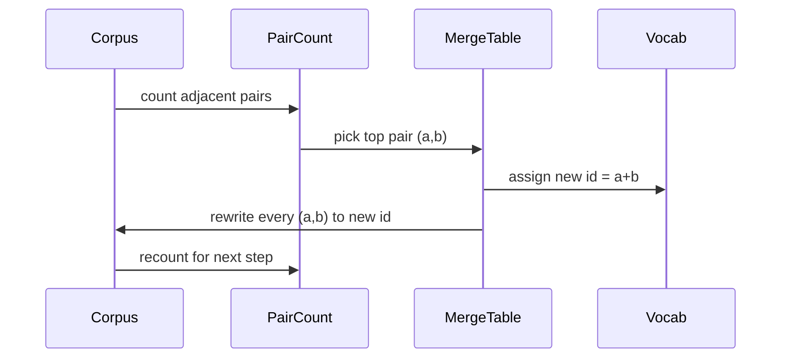

# Tokenizaje BPE desde cero

> Los bytes entran, los IDs salen, los IDs vuelven a los mismos bytes. Construye el tokenizer de que todos los modelos de texto modernos todavía comienzan.

**Type:** Build
**Languages:** Python
**Prerequisites:** Phase 04 lessons, Phase 07 transformer lessons
**Time:** ~90 minutes

## Objetivos de aprendizaje
- Entrenar un par de byte codificando el vocabulario de un corpus de texto crudo mediante la fusión repetida del par de símbolos adyacentes más frecuentes.
- Implemente una tabla de combinación determinista y apliquela a texto fresco para producir un flujo de id de subpalabra.
- Entrada de UTF-8 de ida y vuelta a las identidades y de vuelta sin pérdida de información.
- Reserva y proteja tokens especiales (`<|endoftext|>`¿ Qué ?`<|pad|>`) para que sobrevivan a la formación y a la descifrada.
- Razón por la que un alfabeto de nivel de byte es el piso adecuado para un tokenizer de propósito general.

```figure
cap-bpe-merge
```

## El marco

Un modelo de lenguaje nunca ve texto. Ve números enteros. El mapa de una cadena a una lista de números enteros y atrás es el tokenizer.

La familia dominante de tokenizers de subpalabra para modelos de texto generales es Byte-Pair Encoding. La idea es pequeña. Comience con un alfabeto conocido. Encuentra el par de símbolos adyacentes que aparece con mayor frecuencia en el corpus de entrenamiento. Fúgale en un nuevo símbolo. Repita hasta que el vocabulario alcance el tamaño objetivo.

Construiremos la variante de nivel de byte. El alfabeto es los 256 bytes crudos, no los puntos de código Unicode. Esa opción es lo que permite al tokenizer manejar cualquier entrada UTF-8 sin volver a caer a un token desconocido.

## El oleoducto



El lado de entrenamiento y el lado de inferencia comparten la tabla de fusión. ese compartimento es el contrato. si cambia el orden de fusión en inferencia, descifras un flujo diferente de id.

## El alfabeto byte

Los primeros 256 ids se reservan para los bytes en bruto 0x00 a 0xFF. Esto garantiza que cada cadena de entrada puede expresarse en el vocabulario antes de que ocurra cualquier fusión. Después del bloque de byte reservamos un pequeño rango para tokens especiales. El bucle de entrenamiento nunca propone esos ids como objetivos de fusión porque los mantenemos fuera del flujo pre-tokenizado por completo.

El pretokenizer divide el corpus en espacios blancos y límites de puntuación antes de que la formación lo vea. Sin esa división el paso de fusión BPE aprendería felizmente fusiones que cruzan los límites de palabras y el vocabulario se llena de frases comunes enteras.

## El ciclo de entrenamiento

Para cada paso de entrenamiento el bucle hace tres cosas. Caminará cada palabra en el corpus y contará la frecuencia con que aparece cada par de símbolos corrientes adyacentes, ponderado por la frecuencia con que aparece la palabra misma. Elige el par con el mayor número. Reescribirá cada ocurrencia de ese par en un solo nuevo símbolo cuya id es la siguiente ranura libre en el vocabulario. Luego grabará la fusión.



El costo de cada paso es lineal en el tamaño del corpus expresado como una lista de secuencias de símbolos. Para un millón de palabras y un vocabulario objetivo de diez mil ids el bucle se completa en segundos porque las secuencias de símbolos se contraen a medida que se fusionan.

## Encriptando texto nuevo

La inferencia no llama al contador de fusiones. Aplica la tabla de fusiones en el mismo orden que se aprendió. Para una palabra nueva el codificador comienza desde la división de byte. Escanea la secuencia actual para la combinación de menor rango (la primera que se aplica). Realiza esa combinación. Escanea de nuevo. El bucle termina cuando ninguna combinación en la tabla se aplica a la secuencia actual.

El orden por rango es la propiedad que hace que la codificación sea determinista y coincida con el comportamiento de entrenamiento en la misma entrada. Una fusión que se aprendió primero se sienta en la parte superior de la tabla y se aplica primero. Si dos fusiones podrían aplicarse en la misma posición, la de rango inferior gana.

## Tokens especiales

Los tokens especiales son ID que el flujo de byte nunca puede producir. Los reservamos a mano. Dos son suficientes para esta lección.

- `<|endoftext|>`Separar documentos durante el entrenamiento. Se dice al modelo "un nuevo documento comienza aquí, no dejes que el contexto del anterior se filtra".
- `<|pad|>`El equipo de entrenamiento de la máquina de la máquina de la máquina de la máquina de la máquina de la máquina de la máquina de la máquina de la máquina de la máquina de la máquina de la máquina de la máquina de la máquina de la máquina de la máquina de la máquina de la máquina de la máquina de la máquina de la máquina de la máquina de la máquina de la máquina de la máquina de la máquina de la máquina de la máquina de la máquina de la máquina de la máquina de la máquina de la máquina de la máquina de la máquina de la máquina de la máquina de la máquina de la máquina de la máquina de la máquina de la máquina de la máquina de la máquina de la máquina de la máquina de la máquina de la máquina de la máquina de la máquina de la máquina de la máquina de la máquina de la máquina de la máquina de la máquina de la máquina de la máquina de la máquina de la máquina de la máquina de la máquina de la máquina de la máquina de la máquina de la máquina de la máquina de la máquina de la máquina de la máquina de la máquina de la máquina de la máquina de la máquina de la máquina de la máquina de la máquina de la máquina de la máquina de la máquina de la máquina de la máquina de la máquina de la máquina de la máquina de la máquina de la máquina de la máquina de la máquina de la máquina de la máquina de la máquina de la máquina de la máquina de la máquina de la máquina de la máquina de la máquina de la máquina de la máquina de la máquina de la máquina de la máquina de la máquina de la máquina de la máquina de la máquina de la máquina de la máquina de la máquina de la máquina de la máquina de la máquina de la máquina de la máquina de la máquina de la máquina de la máquina de la máquina de la máquina de la máquina de la máquina de la máquina de la máquina de la máquina de la máquina de la máquina de cubra de cubra de cubra de cubra de cubra de cubra de cubra de cubra de cubra de cubra de cubra de cubra de cubra de cubra de cubra de cubra de cubra de cubra de cubra de cubra de cubra de cubra de cubra de cubra de cubra de cubra de cubra de cubra de cubra de cubra de cubra de cubra de cubra de cubra de cubra de cubra de cubra de cubra de cubra de cubra de cubra de

El codificador acepta una bandera para permitir tokens especiales en la entrada.`<|endoftext|>`y `<|pad|>`con la bandera encendida, las cadenas literales se mapean a sus id reservados y no están sujetas a ninguna fusión.

## Garantia de ida y vuelta

El decodificador concatenará la expansión de byte de cada id en orden. Como cada id es una byte cruda o la concatenamiento de dos ids conocidos previamente, la expansión recursiva siempre termina en bytes crudos.

La suite de pruebas de esta lección comprueba esa propiedad en una oración invisible, en una oración con un emoji de Unicode y en una oración que contiene un literal `<|endoftext|>`- Sí, es un símbolo.

## Lo que esta lección no hace

No construye un pretokenizer impulsado por regex al estilo de los tokenizadores de producción más grandes. El pretokenizer aquí es un pequeño espacio blanco y puntuación dividido. Es suficiente producir fusiones sensatas en un pequeño corpus de formación y el contrato con el resto de la cadena de clases permanece igual. La siguiente lección trata al tokenizer como una caja negra y construye el conjunto de datos de ventana deslizante encima de él.

El número de pares de números en Python se reduce a un par de palabras en un corpus de unos pocos miles de palabras.

## Cómo leer el código

`main.py`define cuatro objetos.`BPETokenizer`contiene el vocabulario, la tabla de fusión y la tabla de tokens especiales. `train`es el ciclo de entrenamiento. `encode`es el camino de inferencia.`decode`La demostración en la parte inferior entraña un pequeño tokenizer en un corpus incorporado, codifica una oración prolongada, descifre las identidades y imprime ambas.`code/tests/test_bpe.py`pin la propiedad de ida y vuelta, la reserva de tokens especiales y el orden de fusiones.

ejecuta la demostración. Luego cambia el tamaño del vocabulario objetivo en la demostración de 300 a 600 y observa cómo la longitud codificada de la oración retenida cae. Esa curva es la curva de compresión BPE.
