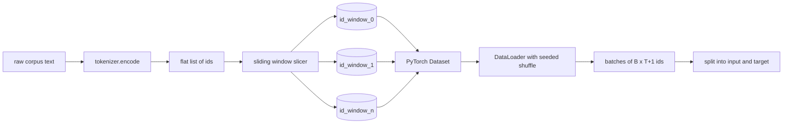
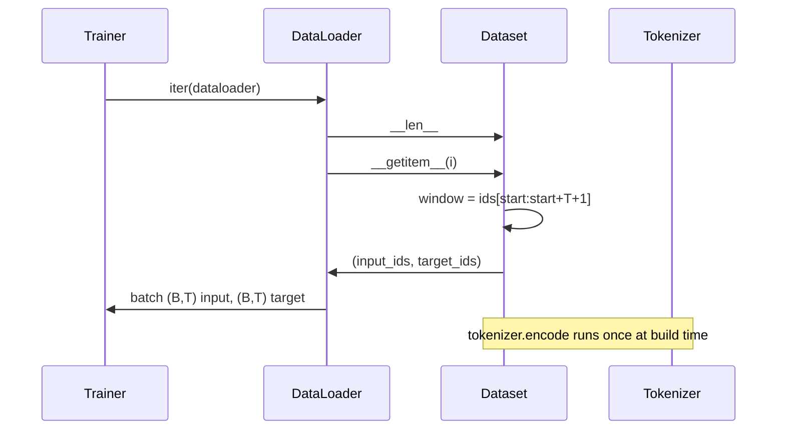

# Dataset Tokenized con ventana deslizante

> Una carrera de preentrenamiento es una función de las identidades de token a los gradientes.

**Type:** Build
**Languages:** Python
**Prerequisites:** Phase 04 lessons, Phase 07 transformer lessons, Lesson 30 of this phase
**Time:** ~90 minutes

## Objetivos de aprendizaje
- Convierta un corpus crudo en un flujo de identidades simbólicas llamando al tokenizer una vez.
- Cortar la corriente de identificación en ventanas de longitud fija con un paso de superposición configurable.
- Construir un conjunto de datos PyTorch que devuelve entradas y tensores de destino para la predicción de la próxima señal.
- Envuelva el conjunto de datos en un DataLoader con un deslizamiento determinista sembrado por época.
- Razón sobre el compromiso entre el paso, la redundancia y el tamaño efectivo del conjunto de datos.

```figure
cap-sliding-window
```

## El marco

Una carrera de preentrenamiento lee un lote de identidades de token a la vez y actualiza el modelo. La forma de cada lote está fijada por el contrato de entrenamiento.`(B, T)`Identificación de entrada y `(B, T)`El objetivo de la tubería de datos es producir ese contrato a pedido, de una manera determinista y reproducible, a partir de un corpus que puede ser varios gigabytes de texto bruto.

Esta lección construye la tubería. El tokenizer de la lección anterior convierte el texto en una larga lista plana de ids. Una ventana deslizante corta la lista en ejemplos de entrenamiento. Un conjunto de datos personalizado expone los ejemplos como tensores. Un DataLoader los acumula y los mezcla con una semilla conocida.

## El contrato de forma

Una LM causal consume IDs de forma `(B, T)`donde`B`es el tamaño del lote y `T`Es la longitud del contexto.`t`es la entrada en posición `t+1`Eso significa que cada ejemplo de entrenamiento cubre`T+1`El paso de la ventana controla la cantidad de superposición existente entre ejemplos consecutivos.



El cortador nunca se superpone con el límite del corpus. si la última ventana no tiene suficientes IDs para llenar`T+1`Posiciones, el cortador deja caer.`<|pad|>`Es una opción válida, pero complica la máscara de pérdida.

## ¿Por qué una ventana deslizante?

Un corpus de preparación es un largo flujo de identidades. Si el modelo sólo veía ventanas no superpuestas, cada ejemplo de entrenamiento le enseñaría lo mismo.`T`ajustar el paso mueve esos límites alrededor de modo que el modelo ve más diversas predicción-siguiente-token tareas.

Un paso de `T`La producción de ventanas no superpuestas.`T // 2`El resultado es un aumento de la capacidad de la información y de la información.`1`produce una superposición máxima y aumenta el conjunto de datos en un factor de `T`El costo es más calculado por época. El beneficio es más diversidad de límites. La mayoría de las carreras de preentrenamiento utilizan un paso igual a la longitud del contexto porque el corpus es ya mucho más grande de lo que el modelo puede terminar en una época, por lo que el argumento de diversidad de límites es más débil.

## La clase de conjunto de datos

Un conjunto de datos PyTorch tiene dos métodos requeridos. `__len__`devuelve el número de ejemplos. `__getitem__`El conjunto de datos almacena el flujo de identificación codificado y el paso. Indicándolo en él calcula el inicio de la ventana en marcha por lo que el costo de memoria es una copia del flujo de identificación independientemente de cuántos ejemplos produzca el paso.



El cambio por uno ocurre dentro .`__getitem__`El conjunto de datos devuelve`(input, target)`donde`input = window[:-1]`y `target = window[1:]`Ambos son tensores PyTorch largos.

## El deslizamiento determinista

Un DataLoader con `shuffle=True`Se lee desde un generador aleatorio PyTorch.`torch.Generator`Si se comparan dos carreras que difieren sólo en un único hiperparámetro, sin una semilla, dos carreras ven los datos en diferentes órdenes y las curvas de pérdida divergen por razones no relacionadas con el cambio.

El contrato de semillas en esta lección es simple.`epoch_seed = base_seed + epoch_index`La semilla base se pasa en la construcción. El índice de época se incrementa por el entrenador en la parte superior de cada época. Una re-corrida con la misma semilla base siempre ve el mismo orden en cada época.

## Muestradora de lotes

El muestreo predeterminado en PyTorch selecciona los índices uniformemente al azar con la sustitución desactivada. Eso es lo que queremos para la preparación. Para la regulación de datos en un conjunto pequeño el contrato es el mismo.`__getitem__` `B`Porque cada ejemplo es de la misma longitud por construcción, no se necesita lógica de relleno.

La lección sigue .`num_workers=0`En una producción, los trabajadores paralelalizan el trabajo.`__getitem__`Con nuestra tubería que es en su mayoría un no-op porque el trabajo es sólo una rebanada de un tensor en la memoria, pero la misma API Dataset soporta a los trabajadores limpio.

## Ejemplos de conteo

Para un flujo de ID de longitud `N`, una longitud del contexto `T`, y un paso adelante .`S`, el número de ejemplos es `max(0, 1 + (N - (T + 1)) // S)`. La lección expone ese cálculo como un método estático en el conjunto de datos para que el entrenador pueda calcular los pasos totales por época sin repetir.

## Lo que esta lección no hace

El corpus está codificado en memoria y se mantiene como un solo tensor. Para un corpus de unos pocos millones de ids que es bien por debajo de cien megabytes y es la forma correcta para la lección.

No maneja múltiples documentos. El corpus se trata como una corriente de identificación continua. El límite del siguiente documento se codifica insertando `<|endoftext|>`El modelo aprende a predecir alrededor de la frontera.

## Cómo leer el código

`main.py`define dos clases y un ayudante. `SlidingWindowDataset`es el Dataset PyTorch. `make_dataloader`devuelve un DataLoader configurado con un generador semillado. `_encode_corpus_to_ids`La demostración en la parte inferior construye un pequeño tokenizer en proceso, codifica un corpus incorporado, construye el conjunto de datos y el cargador de datos, imprime un lote y afirma el contrato de forma.`code/tests/test_dataset.py`pin la fórmula del recuento de ventanas, la propiedad de cambio por uno, el deslizamiento determinista y el cambio de pasos.

ejecuta la demostración. Luego cambia la longitud del contexto de 16 a 32 y observa cómo cae el número de ejemplos por época. Ese número es tu presupuesto paso por época.
