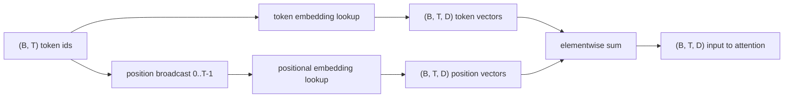
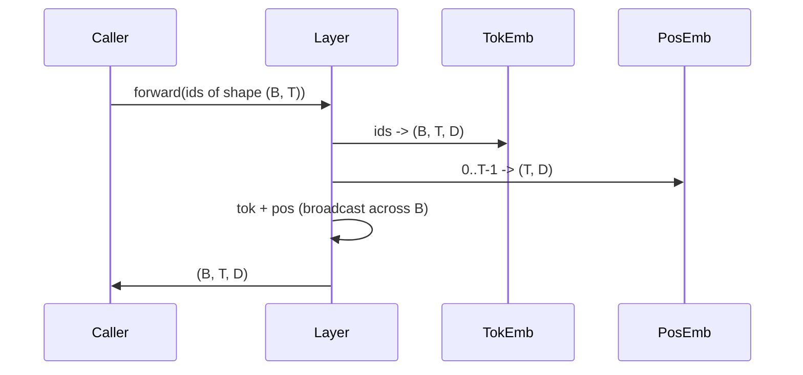

# Embedados de signos y posiciones

> Los números de identidad son enteros. El modelo quiere vectores. Dos tablas de búsqueda se sientan entre ellos, y la elección de la posicional moldea lo que el modelo puede aprender.

**Type:** Build
**Languages:** Python
**Prerequisites:** Phase 04 lessons, Phase 07 transformer lessons, Lessons 30 and 31 of this phase
**Time:** ~90 minutes

## Objetivos de aprendizaje
- Construye una tabla de búsqueda de embedding de tokens que mapea las identidades del vocabulario a vectores densos.
- Construye una tabla de búsqueda de inserción posicional aprendida indexada por posición.
- Construir una incrustación sinusoidal fija por posición indexada por posición sin parámetros.
- Compone los embeddings de tokens y posiciones en una sola entrada para un bloque de transformador.
- Contraste aprendido y sinusoidal incrustaciones en generalización de longitud y parámetro de conteo.

```figure
cc-embedding-lookup
```

## El marco

El primer contacto del modelo con un token id es una búsqueda de filas en la matriz de embedding de token. La matriz tiene una fila por id de vocabulario y una columna por dimensión del modelo. La búsqueda devuelve un vector que el resto del modelo trata como el significado del id. Backprop actualiza las filas que se utilizaron en el pase hacia adelante. Durante el entrenamiento la geometría de esas filas aprende a codificar similitud en direcciones.

Los tokens no tienen orden. El modelo necesita una segunda señal que le diga que la posición uno es diferente de la posición diecisiete. Las dos opciones dominantes para esa señal son una incorporación posicional aprendida (una segunda tabla de búsqueda, una fila por posición) y una incorporación posicional sinusoidal fija (una fórmula matemática sin parámetros). La elección tiene consecuencias. Una tabla aprendida es un parámetro y está limitada por la longitud máxima del contexto en el que se entrenó el modelo. Una tabla sinusoidal es libre de parámetros en teoría y la fórmula se extiende a cualquier posición, pero esta lección es `SinusoidalPositionalEmbedding`Precomputa una tabla fija en `max_context_length`y su `forward`El modelo puede todavía luchar por superar su longitud de entrenamiento incluso cuando la tabla es lo suficientemente grande como para indexar.

Esta lección construye ambos y los compone con el token incorporado en una sola entrada para el bloque de atención de la siguiente lección.

## El contrato de forma

La entrada a la etapa de incorporación es un lote de identidades simbólicas de forma `(B, T)`La salida es un tensor de forma.`(B, T, D)`donde`D`Cada elemento de lote tiene la misma longitud de contexto `T`Cada posición tiene la misma dimensión vectorial .`D`¿ Qué ?



La composición es una suma, no una concatenation.`D`constantes a través de la red y permite al modelo decidir en base a cada característica si el significado simbólico o la posición dominan en cada capa.

## La matriz de incorporación de tokens

La incorporación de los tokens es un tensor de parámetro de forma `(V, D)`donde`V`PyTorch lo expone como`nn.Embedding(V, D)`. En init las entradas se extraen de un pequeño gaussiano, tradicionalmente con el cero medio y la desviación estándar alrededor `0.02`La iniciación exacta es menos importante que que se mantenga consistente en todas las ejecuciones.

El pase hacia adelante es una sola operación de indexación.`(B, T)`int64 de las identidades de `(B, T, D)`El paso hacia atrás acumula gradientes sólo en las filas que se tocaron en el paso hacia adelante. Dos filas que nunca aparecieron en el lote reciben gradiente cero en ese paso.

El símbolo de inserción y la proyección de salida al final del modelo a menudo comparten pesos (peso de unión). Cuando eso sucede, cada paso hacia atrás toca cada fila de la inserción a través del lado de salida. La lección aquí expone ambos como módulos separados, pero la misma matriz podría desempeñar ambos roles en un modelo completo.

## La incorporación posicional aprendida

La incorporación posicional aprendida es una segunda.`nn.Embedding`de forma`(max_context_length, D)`La búsqueda está seleccionada por la identificación de posición.`0, 1, 2, ..., T-1`El pase hacia adelante transmite el vector de posición a través de la dimensión del lote.

La desventaja de la mesa aprendida es que no se puede consultar en posición.`T`si el modelo sólo fue entrenado para la posición `T-1`Los modelos de producción con decodificador que utilizan este esquema se incorporan a la arquitectura con la longitud máxima del contexto y se niegan a procesar entradas más largas.

## El inserto posicional sinusoidal

La inserción posicional sinusoidal es una función de posición a vector.`p`y característica `i`Productos

```python
angle = p / (10000 ** (2 * (i // 2) / D))
emb[p, 2k]     = sin(angle)
emb[p, 2k + 1] = cos(angle)
```

La función no tiene parámetros. Cada posición tiene un vector único. La longitud de onda varía geométricamente entre las dimensiones de las características, por lo que las dimensiones inferiores codifican la posición gruesa y las dimensiones superiores codifican la posición fina.

La propiedad que se deriva de la elección de `sin`y `cos`juntos es que el vector en posición `p + k`es una función lineal del vector en posición `p`El modelo no necesita un parámetro separado para expresar "mirar cinco tokens atrás".

La lección calcula la tabla sinusoidal completa una vez en construcción e indica en ella en el tiempo delantero.

## La composición

La línea de entrada hace tres cosas en orden. Lea las identidades de los tokens. Busque los vectores de los tokens. Agregue los vectores de posición. devuelva la suma.



La radiodifusión en la etapa sumaria replica la `(T, D)`PyTorch maneja automáticamente porque el tensor posicional tiene forma`(1, T, D)`después de desprimir.

## Análisis de contraste

La lección ejecuta ambas variantes en las mismas entradas e imprime dos diagnósticos.

La primera es el conteo de parámetros.`max_context_length * D`La variante sinusoidal añade cero.

El segundo es la similitud cosina entre los embebidos en posiciones vecinas. La variante sinusoidal tiene una descomposición suave y predecible porque la función es continua. La variante aprendida en la inicialización tiene similitud casi aleatoria porque las filas se dibujan de forma independiente. Después de la formación, la variante aprendida generalmente desarrolla una estructura suave similar, pero tiene que descubrir esa estructura a partir de datos.

## Lo que esta lección no hace

No construye codificación posicional rotativa (RoPE) o AliBi. Estas son las opciones modernas en transformadores de producción. Ambos siguen el mismo contrato de forma que los embebidos aquí (aplicar una transformación dependiente de la posición a los vectores de forma `(B, T, D)`La siguiente lección construye el bloque de atención, y una de las extensiones opcionales es doblar rotativamente en las proyecciones de la clave de consulta allí.

No entrenan a la incorporación.El entrenamiento requiere una pérdida, que requiere una salida de modelo, que requiere atención y una cabeza de LM. Esa es la siguiente lección y la siguiente.

## Cómo leer el código

`main.py`La Comisión ha adoptado una decisión sobre el procedimiento de evaluación.`TokenEmbedding`Envueltos`nn.Embedding(V, D)`- ¿ Qué ?`LearnedPositionalEmbedding`Envueltos`nn.Embedding(L, D)`- ¿ Qué ?`SinusoidalPositionalEmbedding`Precomputa la tabla y la expone como un amortiguador. `EmbeddingComposer`La demostración en la parte inferior imprime las formas, el parámetro cuenta y el diagnóstico de similitud de posición vecina.`code/tests/test_embeddings.py`forma del pin, comportamiento de transmisión, número de parámetros y fórmula sinusoidal.

Ejecutar la demostración. Luego cambiar la dimensión del modelo.`D`de 64 a 32 y observar cómo cambian las bandas de longitud de onda sinusoidales.
