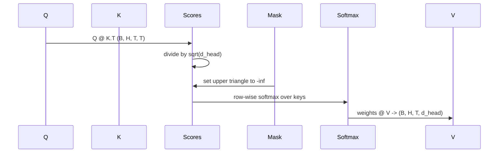

# Atención personal de varias cabezas

> Una proyección lineal, tres vistas, cabezas paralelas H, una máscara.

**Type:** Build
**Languages:** Python
**Prerequisites:** Phase 04 lessons, Phase 07 transformer lessons, Lessons 30 through 32 of this phase
**Time:** ~90 minutes

## Objetivos de aprendizaje
- Implemente una proyección de la pregunta/clave/valor en lote como una sola capa lineal dividida en cabezas H.
- Computa la atención de producto a escala de puntos con la normalización correcta y el manejo de dtype.
- Aplicar una máscara causal que impida que una posición se atenga a posiciones futuras.
- Inspeccione los pesos de atención por cabeza para obtener una entrada fija y razonar sobre lo que cada cabeza mira.
- Entrenar un pequeño bloque de atención en una tarea de juguete y ver la pérdida caer a medida que las cabezas se especializan.

```figure
cap-multihead-attention
```

## El marco

La atención es la función que permite que la representación de un token extraiga información de otros tokens en la misma secuencia. La autoatención significa que las consultas, claves y valores se derivan todos de la misma entrada.

El patrón de implementación eficiente es una capa lineal que proyecta desde `D`¿ Qué ?`3 * D`y se corta en tres vistas, luego se remodela en cabezas de tamaño H.`D // H`La suma matmul, softmax y ponderada ocurren como operaciones tensoriales en lote para que las cabezas corran en paralelo en el acelerador.

Esta lección construye ese bloque. También añade la máscara causal para que el mismo código funcione como la capa de atención en un modelo de lenguaje solo para decodificadores. La siguiente lección apila el bloque en un transformador completo y la lección después lo entrena.

## El contrato de forma

La entrada es `(B, T, D)`La salida es`(B, T, D)`La máscara es`(T, T)`En el interior del bloque los tensores intermedios tienen forma`(B, H, T, d_head)`donde`d_head = D // H`La restricción es`D % H == 0`¿ Qué ?

```mermaid
flowchart LR
    A["(B, T, D) input"] --> B[Linear D -> 3D]
    B --> C["split into Q, K, V"]
    C --> D["reshape to (B, H, T, d_head)"]
    D --> E["scores = Q @ K.T / sqrt(d_head)"]
    E --> F[apply causal mask]
    F --> G[softmax over keys]
    G --> H["context = weights @ V"]
    H --> I["reshape to (B, T, D)"]
    I --> J[output Linear D -> D]
    J --> K["(B, T, D) output"]
```



Las dos capas lineales (la proyección QKV y la proyección de salida) son los únicos parámetros en el bloque.

## La división de QKV

La implementación ingenua tiene tres capas lineales separadas, una cada una para Q, K y V. La eficiente tiene una sola capa que produce.`3 * D`Las dos son matemáticamente equivalentes porque tres multiplicidades de matriz separadas por`(D, D)`Los pesos son exactamente una matriz multiplicación por un `(3D, D)`peso apilado de ellos.

La versión eficiente es más rápida porque el acelerador lanza un matmul en lugar de tres. También es más fácil de inicializar porque las tres submatrices viven en el mismo tensor de parámetros y se pueden inicializar juntas.

## La cabeza se remodela

Después de la división, cada uno de Q, K, V es `(B, T, D)`Para convertir eso en problemas de atención paralelas, remodelamos a`(B, T, H, d_head)`y se transponen en`(B, H, T, d_head)`La dimensión de la cabeza ahora se encuentra junto a la dimensión del lote por lo que PyTorch trata la atención por cabeza como una operación en lote a través de`B * H`las instancias independientes.

La dimensión de la cabeza se mantiene en el último así que la puntuación matmul`Q @ K.transpose(-2, -1)`El resultado es que la gente no tiene derecho a pagar.`(B, H, T, T)`puntajes de atención por cabeza.

## Escalado

Las puntuaciones se dividen por`sqrt(d_head)`Sin esa escala, los productos de puntos crecen como`d_head`El sistema de la velocidad de la entrada de un motor de carga de carga de carga de carga de carga de carga de carga de carga de carga de carga de carga de carga de carga de carga de carga de carga de carga de carga de carga de carga de carga de carga de carga de carga de carga de carga de carga de carga de carga de carga de carga de carga de carga de carga de carga de carga de carga de carga de carga de carga de carga de carga de carga de carga de carga de carga de carga de carga de carga de carga de carga de carga de carga de carga de carga de carga de carga de carga de carga de carga de carga de carga de carga de carga de carga de carga de carga de carga de carga de carga de carga de carga de carga de carga de carga de carga de carga de carga de carga de carga de carga de carga de carga de carga de carga de carga de carga de carga de carga de carga de carga de carga de carga de carga de carga de carga de carga de carga de carga de carga de carga de carga de carga de carga de carga de carga de carga de carga de carga de carga de carga de carga de carga de carga de carga de carga de carga de carga de carga de carga de carga de carga de carga de carga de carga de carga de carga de carga de carga de carga de carga de carga de carga de carga de carga de carga de carga de carga de carga de carga de carga de carga de carga de carga de carga de carga de carga de carga de carga de carga de carga de carga de carga de carga de carga de carga de carga de carga de carga de carga de carga de carga de carga de carga de carga de carga de carga de carga de carga de carga de carga de carga de carga de carga de carga de carga de carga de carga de carga de carga de carga de carga de carga de carga de carga de carga de carga de carga de carga de carga de carga de carga de carga de carga de carga de carga de carga de carga de carga de carga de carga de carga de carga de carga de carga de carga de carga de carga de carga de carga de carga de carga de carga de carga de carga de carga de carga de carga de carga de carga de carga de carga de carga de carga de carga de carga de carga de carga de carga de carga de carga de carga de carga de carga de carga de carga de carga de carga de carga de carga de carga de carga de carga de carga de carga de carga de carga de carga de carga`sqrt(d_head)`mantiene la variación de las puntuaciones aproximadamente constante en los tamaños de las cabezas.

## La máscara causal

Un modelo de lenguaje solo para decodificadores sólo puede condicionar el pasado cuando predice el siguiente token. La máscara lo impone.`(T, T)`La matriz de puntaje se sustituye por el infinito negativo.



La máscara se registra como un amortiguador en la construcción para que viva en el mismo dispositivo que el modelo y no forma parte del gráfico de gradientes. La máscara cubre la longitud máxima de contexto que el bloque podrá ver. En el tiempo de avanzada cortamos la parte superior izquierda`(T, T)`En la esquina.

## La proyección de salida

Después de vectores de contexto por cabeza `(B, H, T, d_head)`, se transponen de nuevo a`(B, T, H, d_head)`, se remodelará en `(B, T, D)`, y aplicar una final `(D, D)`La proyección de salida permite que el modelo mezcle las cabezas. sin ella, las cabezas H sólo se recombinarían a través de capas posteriores y el bloque sería artificialmente restringido.

## Inspección de peso de atención

La lección expone una `return_weights=True`la bandera en el pase hacia adelante. Cuando se establece, el bloque devuelve los pesos de atención por cabeza de forma `(B, H, T, T)`La demostración imprime un mapa de calor de los pesos de una cabeza en una entrada corta para que pueda ver la estructura del triángulo causal y el enfoque por posición.

En un modelo entrenado, diferentes cabezas aprenden diferentes patrones. Algunas cabezas atenden al token inmediatamente anterior. Algunas cabezas atenden al comienzo de la secuencia. Algunas cabezas distribuyen la atención casi uniformemente. El gancho de inspección es el punto de entrada para ese trabajo de interpretabilidad.

## La demostración de entrenamiento

La demostración en la parte inferior de `main.py`El modelo de entrada de la entrada de entrada es el que se desplaza por una sola vez, por lo que el modelo debe aprender que el siguiente token es el mismo que el token anterior. La pérdida es entropía cruzada. con H=4, D=32, T=12, y un vocabulario de 64, la pérdida cae de la aleatoria (alrededor de`log(64) ~ 4.16`) hasta muy abajo `1.0`más de tres épocas en la CPU.

El objetivo de la demostración no es entrenar un modelo útil, sino confirmar el flujo de los gradientes a través de cada pieza del bloque y los jefes aprenden algo sobre un problema donde la respuesta es obvia.

## Lo que esta lección no hace

No añade un bloque de alimentación. La capa transformadora en un modelo real es la atención seguida de una MLP de dos capas con una conexión residual y una norma de capas alrededor de cada una.

No implementa codificación posicional rotativa o AliBi. Ambos se aplican en el paso de proyección QKV en el mismo bloque, pero son una unidad de enseñanza separada. El bloque como se construye aquí es compatible con cualquiera transformando Q y K antes del matmul.

No implementa la caché KV para la inferencia. La caché de claves y valores a través de pases avanzados es la optimización que hace que la decodificación autorregressiva sea rápida. Cambia el contrato de forma en los tensores K y V pero no en Q. Pertenece a la lección de inferencia.

## Cómo leer el código

`main.py`define `MultiHeadSelfAttention`¿ Qué ? La clase tiene dos capas lineales y un buffer de máscara registrado. Los proyectos de pase hacia adelante, remodelaciones, puntuaciones, máscaras, softmaxes, pesas, remodelaciones y proyectos de nuevo. La demostración en la parte inferior construye un pequeño modelo que envolve la atención con embeddings simbólicos y posicionales y una cabeza LM, la entrena en una tarea de copia durante tres épocas, y imprime la curva de pérdida y una mapa de calor de atención por cabeza. Las pruebas en `code/tests/test_attention.py`Pinar el contrato de forma, la propiedad de causalidad, la propiedad de softmax, la propiedad de cabeza-dividida y el flujo de gradiente.

Ejecutar la demostración. Luego aumentar.`n_heads`de 4 a 8 (manteniendo `d_model=32`, así que`d_head=4`) y ver el cambio de la mapa de calor.
