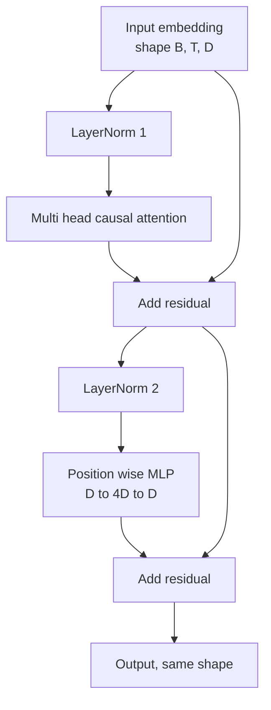
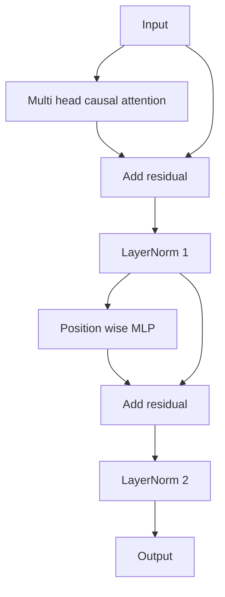

# Bloqueo de transformador desde cero

> Un bloque es la unidad de cada decodificador moderno LLM. Norma de capas, atención de múltiples cabezas, residual, MLP, residual. La variante pre-LN se extiende de forma estable sin calentamiento. La variante post-LN es lo que el papel original envió. Esta lección construye ambos, uno al lado del otro, y muestra cuál sobrevive a una pila de 12 capas a tasas de aprendizaje comunes.

**Type:** Build
**Languages:** Python
**Prerequisites:** Phase 19 lessons 30 to 33 (tokenizer, embeddings, attention math, batched data loader)
**Time:** ~90 minutes

## Objetivos de aprendizaje

- Construye un bloque de transformador en PyTorch a partir de las cuatro piezas en movimiento: LayerNorm, atención causal multi cabeza, conexiones residuales, MLP posicionado.
- Coloque las normas de capa en dos configuraciones (pre-LN y post-LN) y explique por qué uno se pone en trenes estables sin calentamiento.
- Implemente el enmascaramiento causal dentro de la atención de múltiples cabezas para que sea simbólico`i`No puedo ver los tokens .`j > i`¿ Qué ?
- Rastrear el flujo de gradiente a través de ambas variantes en una pila de 12 capas y leer el resultado sin agitar la mano.
- Reutilice el bloque como unidad de entrada cuando la siguiente lección ensamble un parámetro GPT de 124 millones.

## El problema

Un transformador es un bloque repetido. Si se equivoca el bloque una vez, repite 12 veces, y envías un modelo que diverge en la primera época o que necesita calentamiento hackeando el resto del camino. Los dos modos de fracaso que verás en esta lección no son exóticos. Aparecen la primera vez que un aprendiz apila bloques ingenuamente. Uno es la capa de atención que atende al futuro. El otro es el LayerNorm colocado donde no puede domar la señal residual en profundidad.

La fijación es mecánica una vez que la ves. El bloque tiene exactamente dos caminos residuales y exactamente dos posiciones de normalización. Elige las posiciones correctamente y el resto de la pila es sólo contabilidad.

## El concepto

Cada bloque de decodificador solo transformador es una función que toma un tensor de forma `(batch, sequence, embedding)`En el interior, dos subcapas hacen el trabajo.



Esta es la variante pre-LN. La LayerNorm se encuentra dentro de la rama residual, antes de la subcapa. La conexión residual lleva la señal no normalizada hacia adelante.

La variante post-LN se mueve a la LayerNorm después de la adición residual.



La forma es idéntica. El comportamiento de entrenamiento no es. Con post-LN, el gradiente que fluye hacia atrás a través de la ruta residual debe pasar a través de la LayerNorm.`3e-4`El pre-LN deja la trayectoria residual no normalizada, por lo que los gradientes se propagan limpiamente a la capa de incrustación.

### Atención de la cabeza múltiple causal

La subcapa de atención proyecta la entrada de tres maneras en query, key, tensor de valor.`(B, T, D)`¿ Qué ?`(B, H, T, D/H)`donde`H`Es el conteo de cabezas.`softmax(Q K^T / sqrt(d_k))`por cabeza, enmascara el triángulo superior a infinito negativo, aplica la máscara a través de softmax, luego se multiplica por `V`Las cabezas están encadenadas de nuevo en una sola .`(B, T, D)`La máscara es la única pieza que hace que el modelo sea causal. Olvídate de la máscara y entrenas a un modelo que engaña.

### El MLP

El MLP de posición inteligente aplica la misma red de dos capas a cada token de forma independiente. El ancho oculto es cuatro veces el ancho de embebido, la activación es GELU, y un abandono sigue el segundo lineal. Ningún token habla entre sí dentro del MLP. Toda mezcla de tokens ocurre en atención.

### Las conexiones residuales hacen dos cosas.

Los bloques de gradiente de la imagen de la imagen de la imagen de la imagen de la imagen de la imagen de la imagen de la imagen de la imagen de la imagen de la imagen de la imagen de la imagen de la imagen de la imagen de la imagen de la imagen de la imagen de la imagen de la imagen de la imagen de la imagen de la imagen de la imagen de la imagen de la imagen de la imagen de la imagen de la imagen de la imagen de la imagen de la imagen de la imagen de la imagen de la imagen de la imagen de la imagen de la imagen de la imagen de la imagen de la imagen de la imagen de la imagen de la imagen de la imagen de la imagen de la imagen de la imagen de la imagen de la imagen de la imagen de la imagen de la imagen de la imagen de la imagen de la imagen de la imagen de la imagen de la imagen de la imagen de la imagen de la imagen de la imagen de la imagen de la imagen de la imagen de la imagen de la imagen de la imagen de la imagen de la imagen de la imagen de la imagen de la imagen de la imagen de la imagen de la imagen de la imagen de la imagen de la imagen de la imagen de la imagen de la imagen de la imagen de la imagen de la imagen de la imagen de la imagen de la imagen de la imagen de la imagen de la imagen de la imagen de la imagen de la imagen de la imagen de la imagen de la imagen de la imagen de la imagen de la imagen de la imagen de la imagen de la imagen de la imagen de la imagen de la imagen de la imagen de la imagen de la imagen de la imagen de la imagen de la imagen de la imagen de la imagen de la imagen de la imagen de la imagen de la imagen de la imagen de la imagen de la imagen de la imagen de la imagen de la imagen de la imagen

```figure
cc-transformer-block
```

## Construye el mismo

`code/main.py`los instrumentos:

- `class LayerNorm`con escala y cambio de aprendizaje, eps sesgados, aplicados por vector de token.
- `class MultiHeadAttention`con`num_heads`¿ Qué ?`head_dim = d_model // num_heads`, proyección de QKV fusionada, máscara causal registrada, atención y abandono residual.
- `class FeedForward`con dos capas lineales, activación GELU, abandono.
- `class TransformerBlock`con un `pre_ln`bandera que cambia entre las dos variantes.
- Una demostración que construye una pila de pre-LN de 6 capas y una pila de post-LN de 6 capas con entradas e impresiones idénticas (a) forma de salida, (b) norma de gradiente en la incorporación después de un pase hacia atrás.

- ¿Qué quieres decir ?

```bash
python3 code/main.py
```

Resultado: control de forma en ambas pilas, normas de gradiente lado a lado. El gradiente de incorporación de la pila pre-LN es un orden de magnitud mayor que la pila post-LN a la misma velocidad de aprendizaje, que es la señal empírica de los trenes pre-LN sin calentamiento.

## El establo

- `torch`para la matemática del tensor, autogrado, y `nn.Module`- ¿Qué?
- No , no .`transformers`El bloque se ha implementado desde primitivos.

## Modelos de producción en la naturaleza

Tres patrones convierten el bloque de libros de texto en algo que se puede enviar.

**Fused QKV projection.**Tres capas lineales separadas cuestan tres lanzamientos del núcleo y tres matmuls.`3 * d_model`El camino fusionado es más rápido en cada acelerador y coincide con las implementaciones de referencia de GPT-2, LLaMA y Mistral.

**Registered causal mask buffer.**La máscara depende únicamente de la longitud máxima del contexto.`register_buffer`, cortar la ventana activa por paso hacia adelante, y saltar la asignación por llamada. Olvidando esto convierte la máscara en un punto caliente de asignación en contexto largo.

**Dropout in two places, not three.**El abandono pertenece después de la atención softmax (abandon de atención) y después del segundo lineal de la MLP (abandon de residuos).

## Usalo

- El bloque de esta lección se conecta directamente al conjunto de GPT en la lección 35 sin modificaciones.
- La variante pre-LN es lo que utiliza cada LLM moderno de pesos abiertos. La variante post-LN es lo que utilizó el papel de atención original de 2017.
- Cambiar el GELU por SiLU y tienes la activación de la familia LLaMA, cambiar la norma de capa por RMSNorm y tienes la normalización de la familia LLaMA, el mismo esqueleto.

## Los ejercicios

1. Añadir un`bias=False`Los LLM modernos de peso abierto envían sin sesgos en las capas lineales. Medir cuántos parámetros se guardan en un modelo de 12 capas 768 oscuro.
2. Reemplazar`nn.LayerNorm`con una RMSNorm rodada a mano y verificar que la forma de salida no haya cambiado.
3. Añadir una bandera que devuelve los pesos de atención para la primera cabeza como un `(B, T, T)`Describa el triángulo superior para confirmar que es cero después de softmax.
4. Construir un control de salud mental que alimente a un`(2, 16, 384)`tensor con `H=6`Las variaciones y las afirmaciones de las salidas de futuro son diferentes (por ejemplo, `not torch.allclose`) cuando los pesos se inicializan de manera idéntica y el punto de abandono se establece en cero.

## Términos clave

| Term | What people say | What it actually means |
|------|-----------------|------------------------|
| Pre-LN | "Pre norm" | LayerNorm inside the residual branch, before each sublayer; the residual carries the unnormalized signal |
| Post-LN | "Post norm" | LayerNorm after the residual add; what the 2017 paper shipped and what needs warmup |
| Causal mask | "Triangle mask" | The upper triangle of the attention logits set to negative infinity so token i cannot read token j when j is greater than i |
| Fused QKV | "Combined projection" | One linear of width 3D instead of three linears of width D; one kernel, one matmul |
| Residual stream | "Skip connection" | The unnormalized tensor that flows top to bottom through every block; what each block adds to |

## Leer más

- Fase 7 lección 02 (auto-atención desde cero) para la matemática de la atención debajo de este bloque.
- Fase 7 lección 05 (transformador completo) para la versión de decodificación del mismo esqueleto.
- Fase 10 lección 04 (mini GPT pre-entrenamiento) para el procedimiento de formación al que se conecta este bloque.
- Fase 19 lección 35 (esta pista) que apila doce de estos bloques en un modelo GPT.
