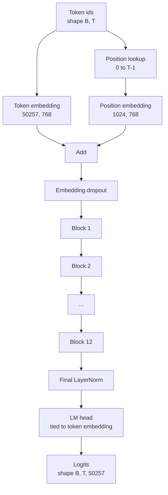
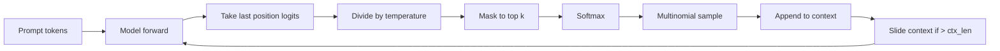

# Asamblea de modelo de GPT

> Dos bloques apilados, una ficha de embedding, una posición aprendida embedding, una última LayerNorm, y un modelo de lenguaje atado. Eso es todo el modelo de 124 millones de parámetros GPT. Esta lección reúne esas piezas en una clase trabajadora, cuenta los parámetros para confirmar que el modelo coincide con la forma de referencia 124M, y genera texto con muestreo multinomial, temperatura y top-k.

**Type:** Build
**Languages:** Python
**Prerequisites:** Phase 19 lessons 30 to 34
**Time:** ~90 minutes

## Objetivos de aprendizaje

- Ensamble el bloque de transformador de la lección 34 en un modelo GPT completo: embedding token, embedding position, N blocks, final LayerNorm, lenguaje modelo cabeza.
- Reproduce la configuración de parámetros de 124 millones: vocabulario 50257, contexto 1024, incrustando 768, doce cabezas, doce capas.
- Atájate los pesos de cabeza del modelo de lenguaje a la incorporación de tokens y explica por qué eso ahorra ~ 38 millones de parámetros en esta escala.
- Generar texto desde un prompt con muestreo multinomial, escala de temperatura y truncado de arriba, manteniendo la longitud del contexto con una ventana deslizante.
- Medir el número de parámetros y el costo de paso hacia adelante en relación con el objetivo de 124M.

## El problema

Un bloque transformador no hace nada por sí mismo. Necesitas convertir las identidades de token en vectores, mezclar información de posición, ejecutarlas a través de la pila y proyectar de nuevo a logits de vocabulario. Olvídate de cualquiera de esos cuatro pasos y el modelo o no se reenvía, deriva en la información de posición, o no puede hablar.

La forma del modelo también importa. La pequeña GPT-2 de referencia es de 124 millones de parámetros en exactamente la configuración anterior. Los números no son magia. Vocab 50257 veces el 768 es la tabla simbólica. La posición 1024 por 768 es la tabla de posiciones. Doce bloques con aproximadamente 7 millones de parámetros cada uno es 84 millones. La cabeza final reutiliza la tabla simbólica por gravedad. Sumar las piezas y llegarás a 124 millones. Construir un modelo cuyo número de parámetros no coincide con la referencia es una señal de que has cableado algo mal.

## El concepto



Los tokens se convierten en vectores de tokens. los tokens de posición se convierten en vectores de posición. Los dos se agregan y envían a través de la pila. La LayerNorm final es la pieza fuera de los bloques que sobrevive a cada variante moderna. La cabeza LM reutiliza la matriz de incorporación de tokens, que es lo que significa atarse el peso.

### Enlace de peso

La embedación del símbolo tiene forma .`(vocab, d_model)`. El modelo de lenguaje debe proyectar desde `d_model`De vuelta a`vocab`. Esos son transposos de uno al otro. Atando a los dos significa literalmente el mismo tensor de parámetros, usado dos veces. en la vocab 50257 y d_modelo 768, la matriz es de 38 millones de parámetros. Desatado, usted paga por él dos veces. Atado, usted paga por él una vez y también obtiene una señal de gradiente ligeramente más limpio porque la incorporación y la actualización de cabeza juntos.

### La inserción de posición se aprende, no sinusoidal

GPT-2 envía una posición aprendida de incorporación.`(1024, 768)`El modelo busca la posición 0 a T-1 en cada avance y añade la búsqueda a la incorporación de los tokens. Este es el más simple de los esquemas de posición (RoPE, ALiBi, T5 sesgo relativo son las alternativas) y es lo que utiliza la referencia 124M.

### Generación: temperatura, top-k, multinomal

La generación es autorregresista. En cada paso, el modelo devuelve logits sobre el vocabulario completo en cada posición. Toma la última posición sólo, divida por temperatura, opcionalmente enmascara todos los logits más altos a infinito negativo, softmax para obtener probabilidades, y muestra un token de la distribución resultante.



Tres botones, tres comportamientos diferentes. La temperatura cerca de cero se desploma a codicia. La temperatura uno coincide con la distribución natural del modelo.

```figure
cc-gpt-assembly
```

## Construye el mismo

`code/main.py`los instrumentos:

- `class GPTConfig`clase de datos con las anomalías 124M: `vocab_size=50257`¿ Qué ?`context_length=1024`¿ Qué ?`d_model=768`¿ Qué ?`num_heads=12`¿ Qué ?`num_layers=12`¿ Qué ?`mlp_expansion=4`¿ Qué ?`dropout=0.1`¿ Qué ?`use_bias=True`¿ Qué ?`weight_tying=True`¿ Qué ?
- `class GPTModel`con embedding simbólico, posicionamiento embedding, embedding drop-out, doce `TransformerBlock`S, final LayerNorm, y un `lm_head`que se une a la incorporación del símbolo cuando se establece la bandera.
- ¿ Qué es esto ?`count_parameters`auxiliar que devuelve el conteo de parámetros único (por lo que se honra la unión de peso en el conteo).
- ¿ Qué es esto ?`generate`función que hace la temperatura, top-k, multinomal, y el contexto de la ventana corredera.
- Una demostración que construye el modelo, imprime el conteo de parámetros junto al 124M de referencia, y genera una secuencia corta desde un prompt fijo para mostrar los extremos de la tubería hasta el final.

- ¿Qué quieres decir ?

```bash
python3 code/main.py
```

Resultado: cuenta de parámetros junto a la referencia 124M, generado IDs de tokens de un pedido aleatorio, y una confirmación de que la cabeza LM y token de incorporación comparten almacenamiento cuando se enlaza.

Para mantener la demostración rápida, el guión también ejecuta una pequeña configuración (`d_model=64`¿ Qué ?`num_layers=2`La configuración 124M se construye pero sólo se ejercen el conteo de parámetros y un pase hacia adelante.

## El establo

- `torch`para la matemática tensorial, autogrado y plomería de módulos.
- `code/main.py`reimplementa el mismo patrón de bloque de la lección 34 localmente.

## Modelos de producción en la naturaleza

Tres patrones hacen la diferencia entre un modelo que corre y un modelo que navega.

**Initialize the residual projections small.**La proyección de salida de la atención y el segundo lineal del MLP se alimentan directamente en una adición residual. Iniciar aquellos con la misma desviación estándar que cada otro lineal da un flujo residual que crece con profundidad y empuja la LayerNorm final en un régimen caliente.`1 / sqrt(2 * num_layers)`para esas dos proyecciones; la corriente residual se mantiene en un rango razonable a través de doce capas.

**Cache the position id tensor, do not recompute.** `torch.arange(T)`asigna memoria nueva en cada paso adelante.`__init__`para el contexto máximo, cortar las primeras entradas T por llamada y omitir el viaje de ida y vuelta del asignador.

**Tie weights at parameter level, not just by copying.**Configuración`lm_head.weight = token_embedding.weight`El optimizador necesita actualizar un parámetro y el gráfico de autogrado necesita una acumulación. Si copias, la cabeza se aleja de la incorporación y la unión de peso no te compra nada.

## Usalo

- La clase modelo en esta lección tiene la misma forma que la que se enseña en la siguiente lección.
- Al reemplazar la posición aprendida incorporada con RoPE obtienes la familia LLaMA sin tocar el bloque o la cabeza.
- Al reemplazar el GELU con SiLU y el LayerNorm con RMSNorm obtienes el resto de los cambios de la familia LLaMA.
- La función de generación funciona con cualquier fuente de logits, no sólo este modelo. Puedes extraer logits de un archivo GPT-2 preentrenado en la lección 37 y reutilizar el mismo bucle de generación.

## Los ejercicios

1. Desligue la cabeza de LM de la ficha de embedding y recuente los parámetros. Verifique el delta es 50257 veces 768 = 38 millones.
2. Reemplazar la posición aprendida con una tabla sinusoidal calculada en el momento de la construcción.
3. Añadir un`greedy=True`la señal a la generación que omite la muestreo y elige argmax.
4. Añadir un`repetition_penalty`botón que divide la logit de cualquier token en el prompt o el historial generado por una constante antes de softmax. Muestre en un prompt fijo que los valores superiores a uno reducen el recuento de repeticiones en la salida.
5. Añadir`top_p`(núcleo) muestreo junto a `top_k`. Verificación de dos líneas de que la suma de probabilidades de los tokens retenidos exceda `top_p`¿ Qué ?

## Términos clave

| Term | What people say | What it actually means |
|------|-----------------|------------------------|
| Weight tying | "Tied embeddings" | The LM head and the token embedding share the same parameter tensor; saves vocab times d_model parameters and matches the GPT-2 reference |
| Position embedding | "Learned positions" | A separate table of shape (context length, d_model) added to token vectors; learned end to end |
| Sliding window context | "Context cap" | When the prompt plus generated tokens exceed the context length, drop the oldest tokens so the active window fits |
| Top-k sampling | "K truncation" | Keep the K logits with the highest values, mask the rest to negative infinity, softmax over the remainder |
| Temperature | "Sampling temperature" | Divide logits by T before softmax; T less than 1 sharpens, T equal to 1 keeps the natural distribution, T greater than 1 flattens |

## Leer más

- Fase 19 lección 34 para el bloque que este modelo apila.
- Fase 19 lección 36 para el ciclo de entrenamiento que conduce este modelo con pérdida de entropía cruzada.
- Fase 19 lección 37 para cargar pesos preentrenados GPT-2 en esta arquitectura exacta.
- Fase 7 lección 07 (modelado de lenguaje causal GPT) para la matemática de la próxima predicción de tokens.
- Fase 10 lección 04 (mini GPT pre-entrenamiento) para el procedimiento de formación original sobre la misma arquitectura.
