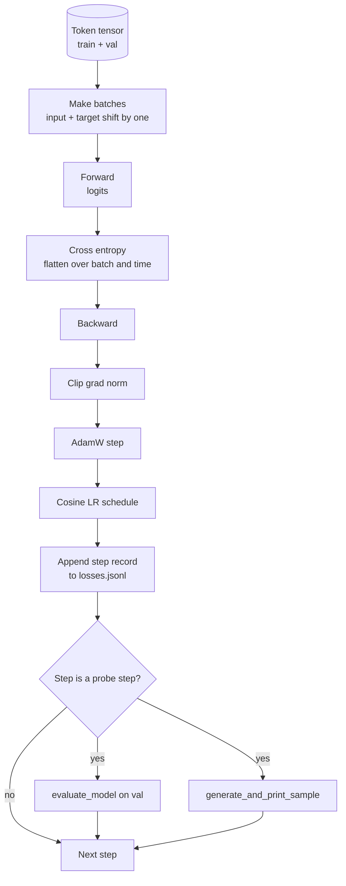

# El ciclo de formación y la evaluación

> Una bucle que no mide es una bucle que se encuentra. Esta lección construye el bucle de entrenamiento que impulsa el modelo GPT: AdamW con división de desintegración de peso, un calentamiento más un horario de tasa de aprendizaje cosínico, un `calc_loss_batch`ayudante, un `evaluate_model`transmisión de datos retenidos, a`generate_and_print_sample`Una sonda cualitativa cada paso de K, y un registro JSONL de pérdidas que puedes trazar después.

**Type:** Build
**Languages:** Python
**Prerequisites:** Phase 19 lessons 30 to 35
**Time:** ~90 minutes

## Objetivos de aprendizaje

- Construye un bucle de entrenamiento que compute la pérdida de entropía cruzada con la entrada correcta y la alineación de objetivos para la próxima predicción de tokens.
- Configurar AdamW con desintegración de peso aplicada a los tensores de peso y no a los tensores de LayerNorm o de sesgo.
- Implementar un calendario de la tasa de aprendizaje con calentamiento lineal y desintegración cosina, y leer el LR resultante con el tiempo.
- Evaluar en una división prolongada con `evaluate_model`Así que la pérdida de evaluación es comparable en todas las carreras.
- Generar una muestra cualitativa cada K pasos con `generate_and_print_sample`para detectar la divergencia antes de que la curva de pérdidas lo haga.
- Persiste por pérdida de paso a JSONL para que pueda recargar, trazar y enviar el registro de entrenamiento como un entregable.

## El problema

Un guión de entrenamiento que imprime la pérdida pero no hace nada más falla de tres maneras. No puede decir si la pérdida está disminuyendo por la razón correcta (el modelo podría sobrecapacitar el conjunto de entrenamiento y nunca aprender). No puede indicar si se está iniciando una divergencia (la pérdida puede aumentar por un paso y recuperarse, o un paso y chocar). No puede decir lo que ha aprendido el modelo (la pérdida es una escala; una muestra generada es un párrafo). Los tres fallos se ocultan a menos que el bucle se mide.

El bucle en esta lección mide de tres maneras: pérdida del lote de entrenamiento en cada paso. pérdida de un lote prolongado en cada paso K. Una continuación generada de un prompt fijo en cada paso K. El registro de entrenamiento aterriza en JSONL por lo que el artefacto es el testimonio del bucle.

## El concepto



Las dos piezas no obvias son la alineación de pérdida y la división de descomposición de AdamW.

### Alineación de pérdidas

El modelo predice el siguiente token en cada posición.`[t0, t1, t2, t3]`, el lote objetivo debe ser`[t1, t2, t3, t4]`La entropía cruzada se calcula en la forma plana .`(batch * seq, vocab)`contra el objetivo plano `(batch * seq,)`Olvídate del cambio y entrenas al modelo para predecirse, que converge a cero pérdida sin aprender nada útil.

### AdamW decadencia dividido

La desintegración del peso regulariza los tensores de peso pero no las escalas o sesgos de normalización. Colocar la desintegración en la escala LayerNorm conduce lentamente la escala a cero y rompe la normalización. Colocar la desintegración en un sesgo es matemáticamente inofensivo pero un desperdicio de ciclos. La división estándar es: los tensores en forma de matriz (pesos lineales, tablas de incorporación) se descompone, cualquier cosa que se vea como una escala o cambio no lo hace.

### Calentamiento más horario cosino

El calentamiento aumenta la tasa de aprendizaje de cero a la meta en unos cientos de pasos para que el estado de optimización tenga tiempo para poblarse. La desintegración del cosino reduce la tasa de aprendizaje hacia cero en los pasos restantes para que la fase final ajuste los pesos a un pequeño tamaño de paso. La combinación es el horario más común en el entrenamiento LLM de pesos abiertos porque elimina la mayoría de los momentos frágiles en los primeros mil pasos y los últimos mil pasos.

### Evaluación realizada

`evaluate_model`El número de partidas es reproducible a través de las carreras dado la misma semilla y la misma partida. Informar la pérdida sostenida junto a la pérdida de entrenamiento es cómo se detecta el sobreajuste.

### Muestreo cualitativo como señal temprana

Un modelo cuya pérdida de entrenamiento cae bien pero cuyas muestras generadas son todas las mismas se rompe. Un modelo cuya curva de pérdida parece plana pero cuyas muestras generadas se afian en palabras coherentes es el aprendizaje. La sonda cualitativa corre más rápido que leer la curva completa y capta los modos que el escalar pierde.

```figure
cap-training-loop
```

## Construye el mismo

`code/main.py`los instrumentos:

- `make_batches(token_ids, batch_size, context_length)`que corta un tensor de token largo en pares de entrada y objetivo.
- `calc_loss_batch(model, inputs, targets)`que avanza, aplanada y devuelve la entropía de la cruz escalar.
- `evaluate_model(model, val_loader, max_batches)`que repite un número fijo de lotes de validación sin grado y devuelve la pérdida media.
- `generate_and_print_sample(model, prompt, max_new_tokens)`que ejecuta la función de generación de lección 35 en un prompt fijo y imprime el resultado.
- `build_param_groups(model, weight_decay)`que produce la lista de parámetros AdamW de dos grupos.
- `cosine_with_warmup(step, warmup_steps, total_steps, max_lr, min_lr)`que devuelve el LR en un paso dado.
- `train(...)`que sigue el ciclo, persiste.`outputs/losses.jsonl`, y imprime la pérdida de evaluación y una muestra cada `eval_every`Es un paso.
- Una demostración que entrena un pequeño modelo en datos sintéticos para un pequeño número de pasos, escribe un registro JSONL, e imprime la pérdida de evaluación y una muestra en los puntos de la sonda.

- ¿Qué quieres decir ?

```bash
python3 code/main.py
```

Resultado: por línea de pérdida de paso, pérdida de evaluación cada paso de la sonda, una muestra generada cada paso de la sonda, y una final `outputs/losses.jsonl`¿ Qué es eso ?`json.loads`por línea.

## El establo

- `torch`para autograd, optimizador y módulos.
- `main.py`reaplica la lección 35 `GPTModel`y los módulos de apoyo localmente.

## Modelos de producción en la naturaleza

Tres patrones convierten el ciclo de los libros de texto en algo que se puede dejar corriendo durante la noche.

**Gradient norm clipping is non negotiable.**Un lote malo (datos anómalicos, un picado LR, un caso de borde numérico) produce un gran gradiente que elimina horas de entrenamiento. `torch.nn.utils.clip_grad_norm_(params, max_norm=1.0)`después de`backward`y antes `step`El valor de recorte es un parámetro libre; uno es el parámetro predeterminado que sobrevive a la mayoría de las configuraciones.

**Resumable JSONL logging, not pickled state.**Por los registros de pérdida de paso como `{"step": int, "train_loss": float, "lr": float}`Las líneas en JSONL son duraderas: cualquier accidente deja un artefacto legible, puedes grapar, puedes trazar con treinta líneas de Python, y puedes reanudar el entrenamiento leyendo el último paso.

**Eval batches drawn from a fixed slice.**Los tokens de validación se cortan en lotes al inicio del guión, no a la vuela. La reproductibilidad depende de que los lotes de eval sean idénticos de ejecución a ejecución; de lo contrario, comparar la pérdida de eval entre dos ejecuciones mide el batch shuffle tanto como el modelo.

## Usalo

- El bucle en esta lección es el mismo esqueleto que entrenan un modelo 124M en datos reales.`datasets`- estilo de carga y el bucle se ejecuta sin cambios.
- El registro JSONL es el resultado que convierte una carrera de entrenamiento en evidencia.
- La sonda de muestra cualitativa es la captura total que la pérdida escalar no puede reemplazar.

## Los ejercicios

1. Añadir`weight_decay_groups()`pruebas unitarias que confirmen que los parámetros de escala y sesgo se encuentran en el grupo sin desintegración y que los pesos lineales e incrustados se encuentran en el grupo de desintegración.
2. Reemplazar los tokens aleatorios sintéticos con bytes de un pequeño archivo de texto para que la demostración se ejecute en algo legible.
3. Añadir un`min_lr`el piso del 10 por ciento de `max_lr`al horario cosino y a la nueva trama.
4. Salva un puesto de control cada vez`eval_every`pasos adicionales al registro JSONL. Agregue un `resume_from`bandera que recarga el estado del modelo y el estado del optimizador.
5. Registre el rendimiento por paso (tokens por segundo) junto a la pérdida y confirme que permanece en una banda constante.

## Términos clave

| Term | What people say | What it actually means |
|------|-----------------|------------------------|
| Loss alignment | "Shift by one" | Input tokens at positions 0..T-1, target tokens at positions 1..T; cross entropy is computed on flattened shapes |
| Decay split | "Two groups" | AdamW receives matrix shaped tensors with weight decay and scale or bias tensors with none |
| Warmup | "Ramp" | The learning rate climbs from zero to its target over a fixed number of steps so the optimizer state can populate |
| Eval batches | "Held out batches" | A fixed slice of the validation token tensor, sliced once at script start, used identically every probe |
| Qualitative probe | "Sample print" | A short generation from a fixed prompt printed every K steps to catch failure modes loss alone hides |

## Leer más

- Fase 19 lección 35 para el modelo que el bucle conduce.
- Fase 19 lección 37 para la carga de pesas preentrenadas en el mismo modelo.
- Fase 10 lección 04 (mini GPT pre-entrenamiento) para el procedimiento de datos reales.
- Fase 10 lección 10 (evaluación) para la superficie de evaluación más amplia más allá de la pérdida de entropía cruzada.
