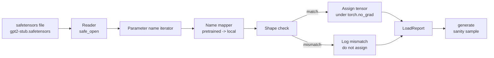

# Cargar pesas entrenadas

> El entrenamiento de un modelo de parámetros de 124 millones desde cero es una decisión presupuestaria; cargar un punto de control publicado es un martes. Esta lección carga pesos de estilo GPT-2 preentrenados de un archivo de safetensores en la arquitectura exacta de la lección 35, camina la cartografía del nombre de parámetros pieza por pieza, y la cordura genera una continuación para probar que la carga funcionó.

**Type:** Build
**Languages:** Python
**Prerequisites:** Phase 19 lessons 30 to 36
**Time:** ~90 minutes

## Objetivos de aprendizaje

- Lea un archivo de los safetensores con el `safetensors`Biblioteca Python e inspeccionar los nombres y formas del tensor.
- Mapa de cada nombre de parámetro pre-entrenado en un parámetro dentro del modelo de la lección 35 GPT.
- Manejar las dos convenciones de nombres que difieren entre los pesos publicados GPT-2 y el modelo en esta pista: `wte/wpe/h.N.attn.c_attn/c_proj`y `mlp.c_fc/c_proj`en comparación con el local denominado `tok_embed/pos_embed/blocks.N.attn.qkv/out_proj`y `mlp.fc1/fc2`¿ Qué ?
- Detectar y rechazar una desajuste de forma con un error claro antes de que ocurra cualquier asignación de peso.
- Generar una breve continuación con los pesos cargados y confirmar los tokens vienen de la distribución cargada, no el al azar iniciado.

## El problema

Los pesos publicados no están empaquetados para su arquitectura. Llevan los nombres de la implementación original utilizada.`transformer.h.0.attn.c_attn.weight`de forma`(2304, 768)`Su modelo espera`blocks.0.attn.qkv.weight`de forma`(2304, 768)`(que es la misma matriz en una convención de diseño diferente) o su modelo utiliza `nn.Linear`El mismo parámetro aparece con tres identidades sutilmente diferentes (nombre, forma, diseño de byte) y el cargador tiene que reconciliar las tres.

Un cargador que copia ciegamente pone el tensor correcto en el lugar equivocado y obtienes un modelo que genera tonterías. Un cargador que se niega a copiar cuando la forma difiere pero no registra nada te deja adivinando qué tensor no aterrizó. El cargador en esta lección es explícito: cada asignación se registra, cada forma se verifica y un`LoadReport`resume los hits, las faltas y las desajustes de forma para que puedas leer lo que sucedió.

## El concepto



El mapa de nombre es sólo una función de cadena a cadena. La comprobación de forma es un si. La asignación se realiza dentro `torch.no_grad()`Autograd no rastrea la carga. El informe contiene el resultado de cada nombre.

### La convención de nombramiento de GPT-2

Los pesos publicados de GPT-2 viven bajo nombres como:

| Pretrained name | Shape | Meaning |
|-----------------|-------|---------|
| `wte.weight` | (50257, 768) | Token embedding |
| `wpe.weight` | (1024, 768) | Position embedding |
| `h.N.ln_1.weight` | (768,) | LayerNorm 1 scale at block N |
| `h.N.ln_1.bias` | (768,) | LayerNorm 1 shift at block N |
| `h.N.attn.c_attn.weight` | (768, 2304) | Fused QKV linear weight |
| `h.N.attn.c_attn.bias` | (2304,) | Fused QKV linear bias |
| `h.N.attn.c_proj.weight` | (768, 768) | Attention output projection |
| `h.N.attn.c_proj.bias` | (768,) | Attention output projection bias |
| `h.N.ln_2.weight` | (768,) | LayerNorm 2 scale |
| `h.N.ln_2.bias` | (768,) | LayerNorm 2 shift |
| `h.N.mlp.c_fc.weight` | (768, 3072) | MLP fc1 weight |
| `h.N.mlp.c_fc.bias` | (3072,) | MLP fc1 bias |
| `h.N.mlp.c_proj.weight` | (3072, 768) | MLP fc2 weight |
| `h.N.mlp.c_proj.bias` | (768,) | MLP fc2 bias |
| `ln_f.weight` | (768,) | Final LayerNorm scale |
| `ln_f.bias` | (768,) | Final LayerNorm shift |

Dos sorpresas para planear.`c_attn`¿ Qué ?`c_proj`¿ Qué ?`c_fc`Los lineares se almacenan con la matriz transpuesta en relación con lo que `nn.Linear.weight`El cargador se transponga durante la asignación. La cabeza de LM no está en el archivo en absoluto; el modelo se basa en la unión de peso con `wte`, así que la cabeza se establece por alias una vez `wte`Las tierras.

### La convención local de nombres

El modelo de esta pista utiliza nombres descriptivos:

| Local name | Meaning |
|------------|---------|
| `tok_embed.weight` | Token embedding |
| `pos_embed.weight` | Position embedding |
| `blocks.N.ln1.scale` | LayerNorm 1 scale at block N |
| `blocks.N.ln1.shift` | LayerNorm 1 shift |
| `blocks.N.attn.qkv.weight` | Fused QKV |
| `blocks.N.attn.qkv.bias` | Fused QKV bias |
| `blocks.N.attn.out_proj.weight` | Attention output projection |
| `blocks.N.attn.out_proj.bias` | Output projection bias |
| `blocks.N.ln2.scale` | LayerNorm 2 scale |
| `blocks.N.ln2.shift` | LayerNorm 2 shift |
| `blocks.N.mlp.fc1.weight` | MLP fc1 |
| `blocks.N.mlp.fc1.bias` | MLP fc1 bias |
| `blocks.N.mlp.fc2.weight` | MLP fc2 |
| `blocks.N.mlp.fc2.bias` | MLP fc2 bias |
| `final_ln.scale` | Final LayerNorm scale |
| `final_ln.shift` | Final LayerNorm shift |

La cartografía es una función fija. La lección lo envía como un dictado que el cargador retrata.

### El accesorio de la planta

Los pesos reales de GPT-2 son de 0.5 GB. La demostración no los descarga; genera un pequeño dispositivo de seguridad en la primera ejecución, con la convención exacta de nombramiento de GPT-2 y formas apropiadas para un modelo de 12 bloques en d_model 192 en lugar de 768.

```figure
cc-weight-remap
```

## Construye el mismo

`code/main.py`los instrumentos:

- Una pequeña réplica de la lección 35 `GPTModel`Así que esta lección está contenida.
- `make_pretrained_to_local(num_layers)`que expande las entradas por capa.
- `load_safetensors(model, path)`que itera nombres, los mapea, verifica la forma, transpone los pesos de estilo conv1d y asigna bajo `torch.no_grad()`. devuelve un `LoadReport`¿ Qué ?
- `make_stub_safetensors(path, cfg)`que genera un archivo fijo con la convención de nombres pre-entrenado exacto.
- Una demostración que crea`outputs/gpt2-stub.safetensors`en la primera ejecución, construye un modelo nuevo, captura una continuación generada de la iniciación aleatoria, carga el estub, captura otra continuación, imprime ambas, y verifica que las dos son diferentes (la carga realmente cambió el modelo).

- ¿Qué quieres decir ?

```bash
python3 code/main.py
```

Producción: el camino de fijación, un registro de carga por nombre, un `LoadReport`resumen, una continuación antes de la carga, una continuación después de la carga y una desajuste de forma en un solo tensor intencionalmente malo inyectado en el dispositivo para que se ejerza la ruta de falla.

## El establo

- `safetensors`para el formato en disco y un lector de transmisión.
- `torch`para el modelo y las matemáticas de la tarea.
- No , no .`transformers`No , no .`huggingface_hub`, sin llamadas de red.

## Modelos de producción en la naturaleza

Tres patrones hacen que el cargador sobreviva al contacto con pesos que no creaste.

**Always validate the file before any assignment.**Abre el archivo, enumere cada nombre de tensor con su dtype y forma, ejecute el mapeo completo con controles de forma, y solo después del éxito comienza a asignar.

**Log every assignment with the source name and the destination name.**Cuando algo parece mal, el registro le dice qué tensor aterrizó donde; la alternativa es leer hexdumps.`LoadReport`la clase de datos en esta lección sigue `loaded`¿ Qué ?`missing`¿ Qué ?`unexpected`, y `shape_mismatch`en el final se publicará una lista y un resumen.

**The LM head is a weight tying alias, not a separate copy.**Configuración`model.lm_head.weight = model.tok_embed.weight`después de la carga `tok_embed`Es el patrón canónico.`lm_head.weight`el parámetro rompe el vínculo y silenciosamente duplica el número de parámetros.

## Usalo

- El cargador funciona para cualquier archivo de seguridad que utilice la convención de nombres pre-entrenado. Los archivos GPT-2 reales (pequeños / medianos / grandes / xl) funcionan sin cambios de código; solo la configuración del modelo difiere.
- El mismo patrón se extiende a los pesos LLaMA, Mistral, Qwen una vez que actualice el mapa de nombres.
- La generación de sentido común después de una carga es una puerta rápida: si las muestras de post-carga se parecen a las muestras de pre-carga, la carga no cambió el modelo, lo que significa que el mapeo silenciosamente se perdió cada tensor.

## Los ejercicios

1. Añadir un`dtype`El argumento para el cargador que arroja cada tensor a un tipo d objetivo (`bfloat16`¿ Qué ?`float16`¿ Qué ?`float32`En el caso de los trabajadores, el número de trabajadores en el puesto de trabajo es de un`float32`el modelo puede ser bajado a `bfloat16`y aún generan.
2. Añadir un`expected_layers`argumento que se niega a cargar un puesto de control cuyo `h.N`Los índices no coinciden con los del modelo `num_layers`¿ Qué ?
3. Enchufe el cargador en la función de generación de la lección 35 y produzca dos muestras lado a lado: una de la iniciación aleatoria, otra de la fijación cargada.
4. Añadir una ruta de exportación: escribir el estado actual del modelo en un archivo de cajas de seguridad nuevo utilizando la convención de nombramiento pre-entrenado.
5. Extenderse`NAME_MAP`para manejar la convención de nombramiento LLaMA (sin sesgos, RMSNorm, diseño qkv fusionado) y volver a ejecutar el cargador en un tablero LLaMA fijo que genere.

## Términos clave

| Term | What people say | What it actually means |
|------|-----------------|------------------------|
| Name map | "Key remapping" | The function from pretrained tensor names to local parameter names; usually a literal dict with one entry per layer index expanded over a loop |
| Shape mismatch | "Bad shape" | The pretrained tensor exists under the mapped name but its dimensions disagree with the local parameter; the loader refuses to assign and logs the pair |
| Transpose-on-load | "Conv1d layout" | Published GPT-2 stores attention and MLP projections in the transpose of what nn.Linear expects; the loader transposes during assignment |
| Weight tying alias | "Shared LM head" | Setting model.lm_head.weight = model.tok_embed.weight so the head and embedding share storage; the head is not in the file because of this |
| Load report | "Coverage summary" | A small dataclass that tracks loaded, missing, unexpected, and shape_mismatch lists; printing it is how you tell whether the load succeeded |

## Leer más

- Fase 19 lección 35 para la arquitectura que recibe los pesos.
- Fase 19 lección 36 para el ciclo de entrenamiento que produce un punto de control de la misma forma.
- Fase 10 lección 11 (cuantización) para saber qué hacer con los pesos cargados cuando la memoria es limitada.
- Fase 10 lección 13 (construcción de una línea de LLM completa) para todo el ciclo de vida alrededor de la carga y la inferencia.
