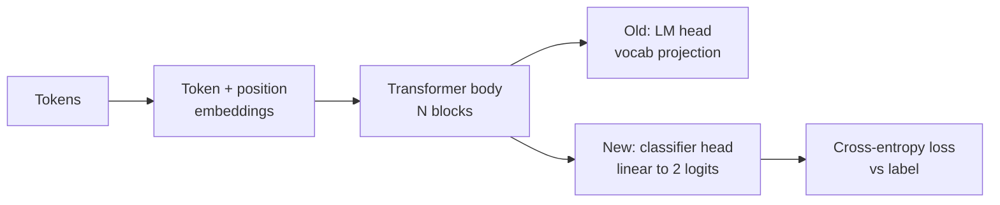
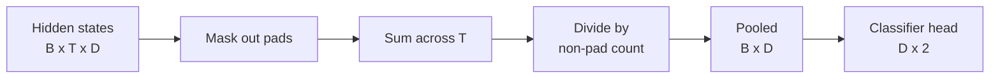
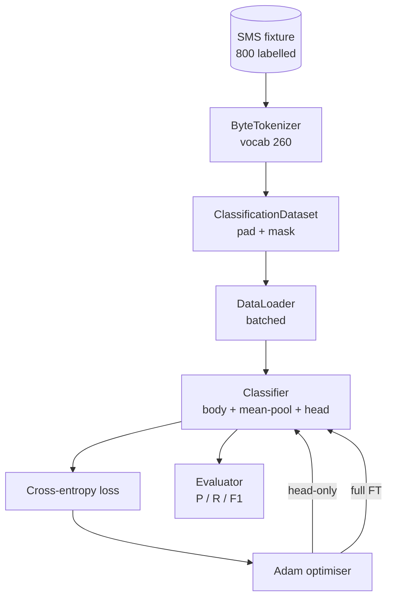

# Lección 38: Clasificador - Ajuste fino por cambio de cabeza

> La primera piedra de la pista B. Un modelo de lenguaje preentrenado es una pila de bloques de autoatención que terminan en una cabeza de predicción de token. Cuando quieres spam vs jamón, la cabeza está equivocada pero el cuerpo está en su mayoría en lo correcto. Esta lección arranca la cabeza, pega una capa lineal de dos clases en la representación conjunta, y entrena al clasificador de dos maneras diferentes: solo la capa final, y el ajuste fino completo. La evaluación es precisión, recuerdo y F1 en una división prolongada. Aprendes lo que cada estrategia te compra y cuánto te cuesta.

**Type:** Build
**Languages:** Python (torch, numpy)
**Prerequisites:** Phase 19 lessons 30-37 (NLP LLM track: tokenizer, embedding table, attention block, transformer body, pre-training loop, checkpointing, generation, perplexity)
**Time:** ~90 minutes

## Objetivos de aprendizaje

- Reemplazar una cabeza de modelo de lenguaje por una cabeza de clasificación sin reiniciar el cuerpo.
- Implementar dos regímenes de entrenamiento: cuerpo congelado (sólo para la cabeza) y ajuste fino completo, compartiendo un ciclo de entrenamiento.
- Construye una tubería de datos consciente de los tokenizadores que empadeja, enmasquea el relleno y agota la producción de atención.
- Computa precisión, recuerdo, F1, y una matriz de confusión de logits crudos.
- Razón sobre el compromiso entre el número de parámetros, el tiempo de entrenamiento y el espacio de cabeza.

## El problema

Usted ha entrenado previamente un pequeño transformador en un corpus genérico. La cabeza de salida proyecta el último estado oculto a un vocabulario de 1000 tokens. Ahora tiene 800 mensajes SMS etiquetados spam o jamón y desea un clasificador binario. Existen tres opciones.

La opción equivocada es entrenar un clasificador nuevo desde cero en 800 ejemplos. El cuerpo del modelo preentrenado ya codifica una estructura útil: identidad de la palabra, posición, coocurrencia simple.

Las dos opciones correctas son el intercambio de cabeza con el cuerpo congelado y el intercambio de cabeza con el cuerpo entrenable. El entrenamiento solo con la cabeza es rápido, casi libre en la memoria y rara vez supera con estos pequeños datos.

Esta lección construye ambos, así que puedes compararlos en el mismo dispositivo.

## El concepto



El modelo es una función.`f_theta(tokens) -> hidden_states`La cabeza es una función .`g_phi(hidden) -> logits`Cambiar la cabeza significa mantener .`theta`y sustituir`g_phi`Los parámetros del cuerpo son la parte más cara.

Dos conjuntos de parámetros entrenables son importantes:

- `theta`(el cuerpo): decenas de miles de pesas por bloque de atención.
- `phi`(la cabeza): `hidden_dim * num_classes`pesos más un sesgo.

En el entrenamiento solo para la cabeza se calculan los gradientes en contra de`phi`y los cero contra .`theta`PyTorch te permite hacer esto configurando`requires_grad=False`El optimista sólo ve la cabeza y el cuerpo se queda congelado.

En el ajuste fino completo se deja fluir los gradientes de nuevo a través de toda la pila. los pesos del cuerpo se desplazan para ajustarse al objetivo de clasificación. El riesgo es catastrófico olvidarse de pequeños datos: el preentrenamiento del cuerpo se elimina por el ruido sobreajustado.

## La cuestión de la unión

Un clasificador necesita un vector por secuencia, no un vector por token.

- **Mean pool**: promedio de los estados ocultos en toda la secuencia, ponderado por la máscara de atención.
- **CLS pool**El método de cálculo de la cantidad de datos que se pueden utilizar para el cálculo de los valores de la moneda de mercado es el método de cálculo de la moneda de mercado.
- **Last-token pool**Esto es lo que hacen los clasificadores de la clase GPT.

Esta lección utiliza el pooling de medios con una ponderación explícita de la máscara de atención. Es el más simple, da una señal estable a través de las longitudes de la secuencia y no requiere de un token CLS.



## Los datos

800 mensajes SMS, balanceados 400 spam y 400 jamón, se generan deterministicamente en `code/main.py`. El generador utiliza una semilla fija, selecciona plantillas y sustituye rellenos de ranuras, y emite mensajes de entre 5 y 25 tokens de largo.

Los datos se dividen 80/20: 640 tren, 160 prueba. Las divisiones se estratifican para que el conjunto de prueba mantenga el equilibrio 50/50.

## Las métricas

Clasificación binaria con clase 1 como clase positiva (spam).

- `TP`: el spam previsto, fue spam.
- `FP`: el spam previsto, fue jamón.
- `FN`: predicido jamón, fue spam.
- `TN`: predicido jamón, era jamón.

Las tres métricas principales:

- `precision = TP / (TP + FP)`De los mensajes marcados como spam, ¿cuál es la fracción?
- `recall = TP / (TP + FN)`De los spam reales, ¿qué fracción hizo la bandera modelo?
- `F1 = 2 * P * R / (P + R)`La media armónica de los dos.

Una matriz de confusión imprime los cuatro números como una cuadrícula 2x2.

```figure
cap-classifier-head-swap
```

## Arquitectura



El cuerpo es un transformador deliberadamente pequeño: vocabulario 260, oculto 64, 4 cabezas, 2 bloques, secuencia máxima 32. Es lo suficientemente pequeño como para entrenar a ambos regímenes a la convergencia dentro de noventa segundos en la CPU.`pretrain_quick`El ayudante hace cinco épocas de entrenamiento de LM en el mismo texto de la fijación para dar al cuerpo un punto de partida no trivial.

## Lo que construirás

La aplicación es una `main.py`más un módulo de ensayo (`code/tests/test_main.py`¿Qué es lo que se hace?

1. `ByteTokenizer`: mapas bytes a IDs, reserva un ID de la placa.
2. `Block`: un bloque de transformador con atención multi-cabeza y una capa de alimentación hacia adelante.
3. `LMBody`: embeddings de token + posición más una pila de bloques. devuelve estados ocultos.
4. `MeanPool`: media ponderada por máscara sobre el eje de secuencia.
5. `Classifier`El cuerpo es el mismo ejemplo en todos los regímenes.
6. `freeze_body`y `unfreeze_body`: conmutador `requires_grad`en los parámetros del cuerpo.
7. `train_classifier`El modelo y el optimizador configurados para el grupo de parámetros que sea entrenable.
8. `evaluate`: ejecuta el conjunto de ensayos y devuelve `Metrics(precision, recall, f1, confusion)`¿ Qué ?
9. `run_demo`: preentrenando el cuerpo brevemente, luego entrenando y evaluando sólo la cabeza, luego lleno, imprime ambos informes, y sale cero.

## Por qué es importante la comparación

El régimen de solo cabeza por lo general se entrena más rápido y se adapta más graciosamente. En este dispositivo se ve típicamente una precisión cercana a 0,9 y se recuerda cerca de 0,85 después de veinte épocas de entrenamiento solo cabeza.

La lección no escoge a un ganador. Te enseña a leer los números y el costo. En 800 ejemplos y un cuerpo pequeño, solo la cabeza es la llamada correcta. En 80.000 ejemplos y un cuerpo más grande, el ajuste fino completo comienza a dar sus frutos. El contrato que tomas de esta lección es la API: el mismo `train_classifier`La función maneja ambos, y el cambio es una llamada.

## Se extienden los objetivos

- Añadir un tercer régimen que descongelar sólo el último bloque. Esto a veces se llama ajuste fino parcial. Cuesta menos que FT completo y aprende más que sólo cabeza.
- Añadir un cronograma de tasa de aprendizaje. Un cronograma cosino en la cabeza más una tasa constante más pequeña en el cuerpo es una configuración de producción común.
- Reemplazar la combinación media con un grupo de atención aprendida: una pequeña capa de atención con una consulta aprendida.

La implementación te da los ganchos, las pruebas se fijan en el contrato, los números son tus para empujar.
