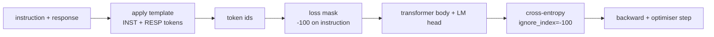
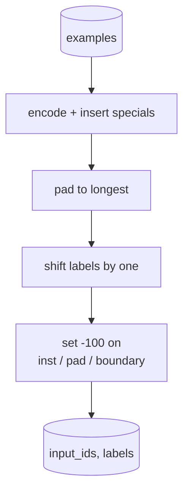
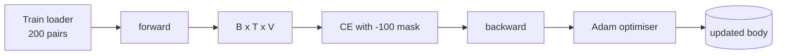

# Lección 39: Arreglo de instrucciones mediante el ajuste fino supervisado

> Un modelo base preentrenado puede extender una secuencia pero no puede seguir una instrucción. El ajuste fino supervisado es el cambio más pequeño que corrige esto: alimenta al modelo ejemplos emparejados de una instrucción y una respuesta deseada, y entrena al cuerpo para predecir los tokens de respuesta. El truco es que sólo quieres que la pérdida cuente la respuesta, no la instrucción. Esta lección construye un bucle SFT al estilo Alpaca con una función de collage personalizada que enmascara los tokens de instrucción con `ignore_index=-100`, se realiza en 200 pares de instrucciones y respuestas, y se evalúa en una división prolongada utilizando la coincidencia exacta.

**Type:** Build
**Languages:** Python (torch, numpy)
**Prerequisites:** Phase 19 lessons 30-37 (NLP LLM track: tokenizer, embedding table, attention block, transformer body, pre-training loop, checkpointing, generation, perplexity)
**Time:** ~90 minutes

## Objetivos de aprendizaje

- Formate los datos de instrucción-respuesta emparejados en una sola secuencia causal con tokens de límite explícitos.
- Construye una función de collate que enmasque las fichas de instrucción para que la entropía cruzada solo cuente las fichas de respuesta.
- Entrenar un pequeño cuerpo transformador bajo el objetivo de la FSA y ver el movimiento de la métrica de evaluación.
- Implementar generación codiciosa y de muestras de temperatura que respete el límite de inicio de respuesta.
- Computación de la coincidencia exacta de los acabados generados.

## El problema

Un modelo base entrenado en predicción de tokens siguientes no tiene idea de lo que es una instrucción. Muéstrelo la cadena `"What is the capital of France?"`El modelo tiene el lenguaje pero no el contrato de formato.

El contrato de SFT es una plantilla de cadena. Cada ejemplo de formación se convierte en una sola secuencia con tres regiones:

```text
<INST> What is the capital of France? <RESP> The capital of France is Paris.
```

Los tokens de límite son tokens especiales reservados en el momento del entrenamiento.`<RESP>`El objetivo de la base sigue siendo aplicable; sólo se entrena en un corpus donde cada ejemplo tiene esta forma.

Pero hay una trampa. Si alimentas toda la secuencia a una pérdida de entropía cruzada de vainilla, estás entrenando al modelo para predecir también los tokens de instrucción.

## El concepto



`ignore_index`es una característica de `torch.nn.functional.cross_entropy`Cualquier posición objetivo igual a `ignore_index`La convención en PyTorch es que el valor de la energía de la energía de la Tierra es igual a la de la energía de la Tierra.`-100`. La función de collate construye dos tensores por ejemplo: `input_ids`(la secuencia completa) y `labels`(una copia de `input_ids`con las posiciones de instrucción supercritas por `-100`¿Qué es lo que se hace?

El modelo ve toda la secuencia durante el pase hacia adelante; la atención puede atender a la instrucción. La pérdida sólo cuenta los tokens de respuesta. Esto es exactamente lo que quieres: condición en la instrucción, predecir la respuesta.

## Los datos

Se generan 200 pares de instrucciones y respuestas deterministicamente en `main.py`cubren seis tipos de tareas:

- En el caso de los productos de la industria de la Unión, el valor de la producción de los productos de la Unión debe ser el valor de la producción de los productos de la Unión.
- la aritmética
- extracción de la lista
- resumen de una frase
- código (impresión, clasificación)
- definición

Cada tarea tiene una instrucción templada y una respuesta determinista. Esto es intencionalmente simple. La coincidencia exacta es frágil, y la lección utiliza un fijo donde la respuesta correcta es una cadena específica.

Las divisiones son 160 tren, 40 pruebas. El conjunto de pruebas cubre los seis tipos de tareas para que se pueda informar la coincidencia exacta por categoría.

## Tokenización y empate

El tokeniser es de nivel byte con tres especiales reservados:

- `INST_ID = 256`El programa de instrucciones de la región de instrucción de la región de instrucción de la región de instrucción de la región de instrucción de la región de instrucción de instrucción de la región de instrucción de instrucción de la región de instrucción de instrucción de la región de instrucción de instrucción de instrucción de la región de instrucción de instrucción de instrucción de instrucción de instrucción de instrucción de instrucción de instrucción de instrucción de instrucción de instrucción de instrucción de instrucción de instrucción de instrucción de instrucción de instrucción de instrucción de instrucción de instrucción de instrucción de instrucción de instrucción de instrucción de instrucción de instrucción de instrucción de instrucción de instrucción de instrucción de instrucción de instrucción de instrucción de instrucción de instrucción de instrucción de instrucción de instrucción de instrucción de instrucción de instrucción de instrucción de instrucción de instrucción de instrucción de instrucción de instrucción de instrucción de instrucción de instrucción de instrucción de instrucción de instrucción de instrucción de instrucción de instrucción de instrucción de instrucción de instrucción de instrucción de instrucción de instrucción de instrucción de instrucción de instrucción de instrucción de instrucción de instrucción de instrucción de instrucción de instrucción de instrucción de instrucción de instrucción de instrucción de instrucción de instrucción de instrucción de instrucción de instrucción de instrucción de instrucción de instrucción de instrucción de instrucción de instrucción de instrucción de instrucción de instrucción de instrucción de instrucción de instrucción de instrucción de instrucción de instrucción de instrucción de instrucción de instrucción de instrucción de instrucción de instrucción de instrucción de instrucción de instrucción de instrucción de instrucción de instrucción de instrucción de instrucción de instrucción de
- `RESP_ID = 257`: marca el límite entre instrucción y respuesta.
- `PAD_ID = 258`: relleno para lotes de longitud variable.

La secuencia es `[INST] inst_bytes [RESP] resp_bytes [PAD]*`La función de collado:

1. Se simboliza cada ejemplo.
2. Enlaza cada ejemplo en el lote a la secuencia más larga del lote.
3. Construcciones `labels`¿ Qué es esto ?`input_ids`desplazado por uno (objetivo de LM causal), con:
   - La región de instrucción se sustituye por `-100`¿ Qué ?
   - La región de relleno fue sustituida por `-100`¿ Qué ?
   - El `RESP_ID`La posición límite misma sustituida por `-100`(no entrenas al modelo para predecir el signo de límite; predice lo que sigue).



El cambio es el truco causal estándar: posición `i`de `input_ids`predice la posición `i+1`, así que`labels[i] = input_ids[i+1]`La máscara se aplica después del cambio para aterrizar en las posiciones correctas.

## Formación



El bucle es el bucle estándar PyTorch SFT. Adam, tasa de aprendizaje alrededor de 3e-4 a 1e-3, diez a veinte épocas en este dispositivo, sin cronómetro. El modelo es lo suficientemente pequeño (oculto 96, 2 bloques, longitud máxima 64) para entrenar a la convergencia en la CPU dentro de dos minutos.

Cada quinta época el bucle ejecuta un pequeño pase de evaluación en el conjunto prolongado e imprime coincidencia exacta. Ver coincidencia exacta pasar de 0.0 en la época uno a algo como 0.85 en la época quince es la recompensa de la lección: se puede ver el modelo aprendiendo el formato y las respuestas al mismo tiempo.

## Generación

En el momento de la evaluación el modelo recibe el prefijo de instrucción `[INST] inst_bytes [RESP]`y genera tokens hasta que:

- la secuencia llega a`max_len`, o
- El modelo emite una heurística especial de parada: dos bytes consecutivos que terminan en oraciones (`.`¿ Qué ?`!`¿ Qué ?`?`¿Qué es lo que se hace?

La lección envía codificación codificada y un muestreo de temperatura opcional. La combinación exacta utiliza codicia porque la temperatura haría que la métrica estucastica.

## Evaluación exacta

La línea de respuesta prevista se normaliza (marcas mínimas, espacios blancos en tiras, espacios dobles de colapso) y en comparación con la respuesta de referencia, se normaliza de la misma manera. La métrica es 1 o 0, por ejemplo.

Las tuberías reales de SFT complementan la coincidencia exacta con el nivel de token F1 (lección 41) y un modelo de juez. La coincidencia exacta sigue siendo útil porque es inequívoca; si dice 0,7, exactamente el 70 por ciento de las instrucciones de prueba produjo el carácter de respuesta dorado para el carácter.

```figure
cc-sft-loss-mask
```

## Lo que construirás

La aplicación es una `main.py`Además de pruebas.

1. `InstructionTokenizer`: codificador de nivel byte con especiales reservados.
2. `make_dataset`: genera 200 pares en seis tipos de tareas con una semilla fija.
3. `SFTDataset`: retorno `(input_ids, labels)`por ejemplo, ya preparada con máscara.
4. `sft_collate`: relleno dinámico, construye el tensor de lote, conjuntos `-100`en las posiciones de instrucción y de almohadilla.
5. `TinyGPT`: cuerpo del transformador más cabeza de LM atada o desatada.
6. `train_sft`: el bucle SFT, con ganchos de evaluación por época.
7. `generate`: decodificación causal de un prefijo, codicioso o muestrado, con la heurística de parada.
8. `exact_match`: comparación de cuerdas normalizada, los resultados flotan en `[0, 1]`¿ Qué ?
9. `run_demo`: construye los datos, trenes por veinte épocas, evalúa, imprime una clasificación por categoría, sale de cero en el éxito.

## Por qué la máscara importa

Sin la máscara, la pérdida trata a los tokens de instrucción como objetivos. El modelo aprende a predecir la instrucción. Este es un objetivo diferente y produce un modelo peor de dos maneras. En primer lugar, la capacidad del modelo se desperdicia reconstruyendo los insumos que siempre proporciona el usuario. En segundo lugar, la pérdida de respuesta es menor en la suma de los gradientes porque los tokens de instrucción superan en número a los tokens de respuesta en la mayoría de los lotes; la tasa de aprendizaje efectiva del optimizador en la parte que le importa es menor de lo que pretendía. La máscara no es un pollo; es el objetivo.

## Se extienden los objetivos

- Añadir un calentamiento de la tasa de aprendizaje seguido de la desintegración cosina.
- Añadir registro de pérdidas por token y trazar la curva de pérdidas durante el entrenamiento.`<RESP>`Las primeras y posteriores épocas están dominadas por los tokens de respuesta reales.
- Extenda la evaluación a BLEU-1 o chrF. La coincidencia exacta subestima los modelos que producen una paráfrase con la misma respuesta.
- Agregue una plantilla de chat con formato multi-turn y entrenar en un dispositivo que incluya seguimientos.

La implementación le da el contrato de formato, la máscara y el bucle. El cambio objetivo del modelo base al seguidor de instrucciones es una función de collage.
