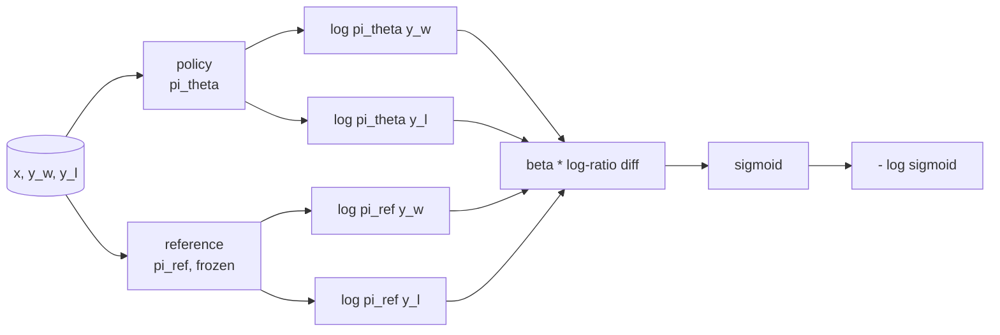
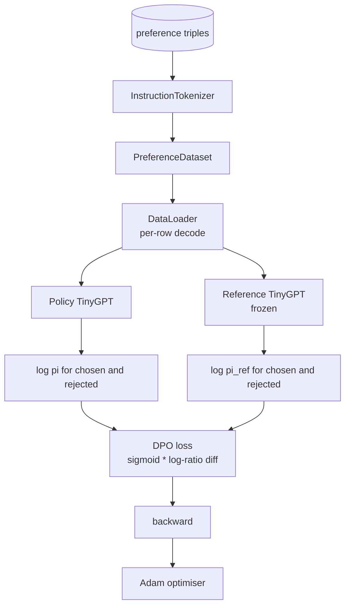

# Capstone Lección 40: Optimización directa de preferencias desde cero

> Los modelos de recompensas y PPO son la pila clásica de RLHF. DPO se desploma en una sola pérdida supervisada que se ajusta directamente a una póliza contra pares de preferencias. Esta lección deriva la pérdida de DPO de la identidad de diferencia de recompensa, envía un modelo de referencia de trabajo más un modelo de política, calcula las probabilidades de registro por token y entrena a un pequeño transformador en una fijación de preferencias de complejos elegidos y rechazados. Las pruebas pin la matemática de pérdida y la dirección del gradiente para que se sepa que la implementación coincide con el papel.

**Type:** Build
**Languages:** Python (torch, numpy)
**Prerequisites:** Phase 19 lessons 30-37 (NLP LLM track: tokenizer, embedding table, attention block, transformer body, pre-training loop, checkpointing, generation, perplexity)
**Time:** ~90 minutes

## Objetivos de aprendizaje

- Derivar la pérdida de DPO como sigmoide sobre una diferencia de log-ratio escalado y conectarlo a la recompensa implícita.
- Construir un modelo de referencia + pareja de modelos de política con una referencia congelada y una política entrenable.
- Computa probabilidades de registro a nivel de secuencia en ambos modelos, ocultando tokens de respuesta.
- Entrenamiento de la política en `(prompt, chosen, rejected)`triplicando y ver el log-prob elegido subir en relación con rechazado.
- El comportamiento de pin con pruebas sobre las matemáticas de pérdidas, el signo de gradiente y la invarianza de referencia.

## El problema

Tiene un modelo SFT. Sigue instrucciones, pero sus resultados son desiguales; algunas terminaciones son claras, algunas son verbales o incorrectas. También tiene un pequeño conjunto de datos de pares de preferencias: para el mismo prompt, un humano marcó una terminación como elegida y la otra como rechazada.

La respuesta clásica de RLHF es una línea de conducto de dos etapas. Entrenar un modelo de recompensa en las preferencias. Optimiza la política contra la recompensa con PPO. Esto funciona pero es caro: dos modelos en la memoria durante PPO, control KL para mantener la política cerca de la referencia, hacking de recompensa cuando el modelo de recompensa es frágil.

La política de compensación se forma directamente en los pares de preferencias, con una penalización KL explícita hacia la referencia SFT. La misma solución óptima bajo el modelo de preferencias Bradley-Terry, mucho menos código.

## El concepto

Comienza con el modelo Bradley-Terry.`x`y dos completos `y_w`(elegido) y `y_l`(rechazado), la probabilidad que el humano prefiere `y_w`es

```text
P(y_w > y_l | x) = sigmoid( r(x, y_w) - r(x, y_l) )
```

donde`r`Es una función de recompensa latente.`r`de las preferencias, luego forma una política `pi`para maximizar `r`con anclaje KL:

```text
max_pi   E_{x, y~pi} [ r(x, y) ] - beta * KL(pi || pi_ref)
```

La derivación del DPO observa que la política óptima `pi*`En el marco de este objetivo, tiene una forma cerrada en términos de `r`¿Qué es esto ?

```text
pi*(y | x) = (1/Z(x)) * pi_ref(y | x) * exp( r(x, y) / beta )
```

Reorganizar para `r`¿Qué es esto ?

```text
r(x, y) = beta * ( log pi*(y | x) - log pi_ref(y | x) ) + beta * log Z(x)
```

El `log Z(x)`El término es el mismo para ambos `y_w`y `y_l`(depende de lo que sea)`x`No , no .`y`), por lo que se anula cuando se calcula la diferencia de preferencias:

```text
r(x, y_w) - r(x, y_l) = beta * ( log pi_theta(y_w|x) - log pi_ref(y_w|x)
                                - log pi_theta(y_l|x) + log pi_ref(y_l|x) )
```

Substituir en la sigmoide Bradley-Terry y tomar probabilidad de registro negativo sobre los pares de preferencias:

```text
L_DPO(theta) = - E_{(x, y_w, y_l)} [
  log sigmoid( beta * ( log pi_theta(y_w|x) - log pi_ref(y_w|x)
                       - log pi_theta(y_l|x) + log pi_ref(y_l|x) ) )
]
```

Esta es la pérdida. Es un sigmoide sobre un solo escalar por ejemplo, calculado a partir de cuatro probabilidades de registro. No hay modelo de recompensa separado. No hay PPO. No hay término KL en la pérdida; la restricción KL se elabora en la derivación de forma cerrada.



## El signo del gradiente

Una buena prueba de cordura antes de cualquier entrenamiento.`log pi_theta(y_w | x)`¿Qué es esto ?

```text
d L_DPO / d log pi_theta(y_w | x) = - beta * (1 - sigmoid(z))
```

donde`z`Esto es negativo para todos.`z`, lo que significa: aumentar la probabilidad de registro de la política de finalización elegida disminuye la pérdida.`log pi_theta(y_l | x)`El proceso de formación de los trabajadores de la empresa de formación de los trabajadores de la empresa de formación de la empresa de formación de la empresa de formación de la empresa de formación de la empresa de formación de la empresa de formación de la empresa de formación de la empresa de formación de la empresa de formación de la empresa de formación de la empresa de formación de la empresa de la empresa de formación de la empresa de la empresa de formación de la empresa de la empresa de formación de la empresa de la empresa de la empresa de formación de la empresa de la empresa de la empresa de la empresa de la empresa de la empresa de la empresa de la empresa de la empresa de la empresa de la empresa de la empresa de la empresa de la empresa de la empresa de la empresa de la empresa de la empresa de la empresa de la empresa de la empresa de la empresa de la empresa de la empresa de la empresa de la empresa de la empresa de la empresa de la empresa de la empresa de la empresa de la empresa de la empresa de la empresa de la empresa de la empresa de la empresa de la empresa de la empresa de la empresa de la empresa de la empresa de la empresa de la empresa de la empresa de la empresa de la empresa de la empresa de la empresa de la empresa de la empresa de la empresa de la empresa de la empresa de la empresa de la empresa de la empresa de la empresa de la empresa de la empresa de la empresa de la empresa de la empresa de la empresa de la empresa de la empresa de la empresa de la empresa de la empresa de la empresa de la empresa de la empresa de la empresa de la empresa de la empresa de la empresa de la empresa de la empresa de la empresa de la empresa de la empresa de la empresa de la empresa de la empresa de la empresa de la empresa de la empresa de la empresa de la empresa de la empresa de la empresa de la empresa de la empresa de la empresa de la empresa de la empresa de la empresa de la empresa de la empresa de la empresa de la empresa de la empresa de la empresa de la empresa de la empresa de la empresa de la empresa de la empresa de la empresa de la empresa de la empresa de la empresa de la empresa de la empresa de la empresa de la empresa de la empresa de la empresa de la empresa de la empresa de la empresa de la empresa de la empresa de la empresa de la empresa de la empresa de la empresa de la empresa de la empresa de la empresa de la empresa de la empresa de la empresa de la empresa de la empresa

## Los datos

Doce preferencias triplican el barco con la lección.`(prompt, chosen, rejected)`. La finalización elegida es corta y precisa. La rechazada es verbal, fuera de tema o incorrecta. Los pares cubren las mismas familias de tareas que la lección 39 (capital, aritmética, lista) por lo que una política que comenzó desde una base de SFT tiene un punto de partida razonable.

El dispositivo es intencionalmente pequeño. DPO trabaja en decenas de miles de pares en producción; aquí, el punto es que la matemática de pérdida y el bucle se ejecutan de extremo a extremo en un conjunto de datos diminuto y la brecha de registro-prob de elección-versus-rechazado crece visiblemente.

## Invariante de referencia

Una implementación de DPO debe manejar el modelo de referencia con cuidado. El modelo de referencia es el modelo SFT congelado en su lugar.

- Los parámetros de referencia nunca reciben gradientes.
- Las probabilidades de registro de referencia nunca cambian entre épocas.
- La política comienza con los mismos pesos que la referencia.`theta`es la referencia más una actualización aprendida; iniciar la política como copia de la referencia es el comienzo bien definido.)

La aplicación de las disposiciones de la presente Directiva se aplicará mediante:

- Envuelve la referencia en `torch.no_grad()`durante las pasadas delanteras.
- Configuración`requires_grad=False`en cada parámetro de referencia.
- La construcción de la política mediante `policy.load_state_dict(reference.state_dict())`después de que se haya elaborado la referencia.

```figure
cap-dpo-preference
```

## Arquitectura



El modelo es el mismo TinyGPT utilizado en la lección 39 (solo para decodificar, causal, tokenizador de byte).

## Lo que construirás

La aplicación es una `main.py`Además de pruebas.

1. `InstructionTokenizer`: tokenizador de byte con `INST`y `RESP`La misma forma que la lección 39.
2. `TinyGPT`La misma forma que la lección 39, así que la lección es autónoma incluso si saltaste 39.
3. `make_preferences`: devuelve doce `(prompt, chosen, rejected)`¿Qué es eso?
4. `sequence_log_prob`: dado el modelo, un prefijo de la señal de inmediato y una terminación, devuelve la suma de las probabilidades de registro de la señal siguiente sobre la terminación (sin contribución de la posición de la señal de inmediato).
5. `dpo_loss`: toma las cuatro probabilidades log- y `beta`, devuelve el tensor de pérdida por ejemplo y el delta de recompensa implícita para el registro.
6. `train_dpo`: ciclo per-epoca que calcula los registros seleccionados y rechazados bajo política y referencia, aplica la pérdida y se ejecuta Adam.
7. `evaluate_margins`: devuelve el margen medio de probabilidad de registro rechazado en cualquier momento de la póliza.
8. `run_demo`: construye referencia y política a partir de un pequeño pre-treino de calentamiento, copia pesas, trenes por treinta pasos, imprime la pérdida y el margen por paso, y sale de cero en el éxito.

## Por qué funciona la DPO

DPO es matemáticamente equivalente a RLHF bajo el modelo de preferencia Bradley-Terry, hasta la parámetriz de la recompensa.`r(x, y) = beta * (log pi(y|x) - log pi_ref(y|x))`es identificable desde las preferencias hasta una función de `x`La política de forma cerrada permite saltar el modelo de recompensa explícita.`pi`de la`pi_ref`El índice de seguridad de la empresa es el índice de seguridad de la empresa.

## Se extienden los objetivos

- Añadir una normalización de longitud a la suma de probabilidades de registro: dividir por longitud de finalización. El sesgo de longitud es un modo conocido de falla DPO en el que el modelo prefiere completar corto porque sus probabilidades de registro son mayores en términos absolutos.
- Añadir la variante de la pérdida en la OPI: sustituir el sigmoide + log por `(z - 1)^2`Comparar la convergencia en el dispositivo.
- Añadir un parámetro de suavizamiento de la etiqueta que interpola entre la etiqueta rechazada con dificultad y una etiqueta uniforme de 0,5.
- Reemplazar la referencia por un modelo más pequeño y más barato (sabor de destilación de conocimiento).

La implementación te da la pérdida, la invarianza de referencia y el ciclo de entrenamiento.
