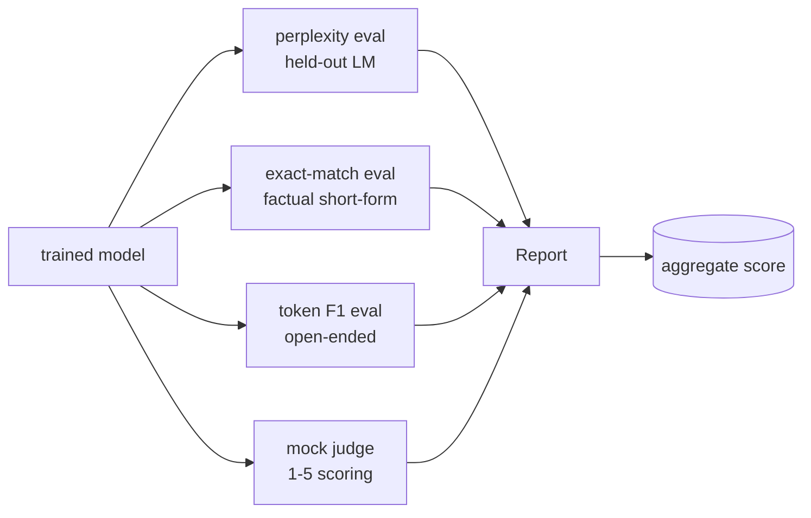
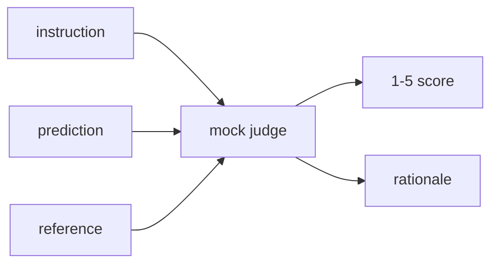
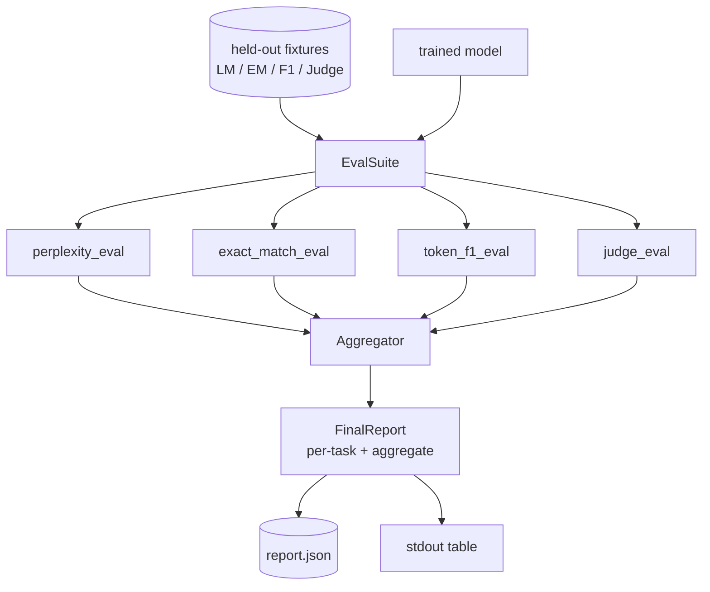

# Lección 41 de Capstone: Pipeline de evaluación completa

> El entrenamiento es la parte que se puede controlar con curvas de pérdida. La evaluación es la parte que tienes que diseñar. Esta lección construye una pipeline de evaluaciones unificadas que toma cualquier modelo de lenguaje entrenado, ejecuta cuatro evaluaciones heterogéneas en ella, agrega los resultados en un informe por tarea y envía un simulacro local LLM-as-judge para que el bucle funcione sin una red. Las cuatro evaluaciones cubren las dimensiones que cada modelo de transporte necesita: modelado de lenguaje (perplejidad), correcimiento de forma corta (cumplimiento exacto), similitud de forma abierta (token F1) y puntuación cualitativa (juzgador).

**Type:** Build
**Languages:** Python (torch, numpy)
**Prerequisites:** Phase 19 lessons 30-37 (NLP LLM track: tokenizer, embedding table, attention block, transformer body, pre-training loop, checkpointing, generation, perplexity)
**Time:** ~90 minutes

## Objetivos de aprendizaje

- Computa la perplejidad prolongada con la contabilidad de tokens enmascarados en un pequeño transformador.
- Ejecutar una evaluación exacta de coincidencia en las instrucciones de forma corta.
- Computa la cadena de referencia de nivel de token F1 entre las cadenas de referencia y las predecibles con normalización.
- Construye una simulación local de LLM como juez que califique los resultados de los modelos en una escala de 1-5.
- Agrega las cuatro evaluaciones en un solo informe ponderado con desglose por tarea.

## El problema

Una única métrica nunca describe un modelo de lenguaje. La perplejidad dice qué tan bien encaja el modelo en la distribución del idioma, pero no dice nada sobre si responde preguntas. La coincidencia exacta dice si el modelo produce la cuerda de oro pero castiga las paráfrases correctas. El token F1 perdona la paráfrase pero se engaña por la superposición léxica con contenido incorrecto. El LLM como juez capta dimensiones cualitativas pero es caro y estocástico.

El pipeline que realmente quieres tiene los cuatro. Cada eval cubre una dimensión que los otros no tienen. Cada uno se ejecuta en un subconjunto diferente de datos mantenidos en forma para esa métrica. El informe final muestra los números por tarea uno al lado del otro y un agregado, para que un revisor pueda ver a un vistazo qué compensaciones el modelo está haciendo.

Esta lección construye ese oleoducto, de extremo a extremo, en un archivo.

## El concepto



Cada eval es una función de `(model, dataset) -> EvalResult`El resultado contiene el valor métrico, los detalles por ejemplo para la inspección y un nombre para el agregado.

## Perplejidad, debidamente contada

La perplejidad es `exp(mean negative log-likelihood per token)`La aplicación tiene dos trampas:

- La media debe estar sobre las posiciones reales de los tokens, no sobre la secuencia de lote.
- El modelo predice el siguiente token, así que logits en posición `i`predecir el token en posición `i+1`Los errores de una vez a otra aquí son silenciosos: la pérdida sigue en marcha, pero la métrica se vuelve sin sentido.

La evaluación calcula las sumas por lote de `-log p(token)`En el caso de las posiciones que no son de pad y un recuento de tokens por lote, se divide al final. Esto es numéricamente más seguro que la media de perplejidades por lote (que subposa secuencias cortas) y coincide con la definición del libro de texto.

## Compatibilidad exacta con la normalización

El arnés normaliza tanto la predicción como la referencia antes de comparar:

- - En letras pequeñas.
- La banda que rodea el espacio blanco.
- El espacio interno en blanco colapsa se dirige a un solo espacio.
- Puntuación de la terminal de retraso (`.`¿ Qué ?`!`¿ Qué ?`?`) si ambas partes difieren sólo por punto.

La normalización hace que la coincidencia exacta sea útil en la práctica.`"Paris"`Es cierto; uno que dice `"Paris."`También tiene razón; uno que dice `"  paris  "`La métrica todavía requiere que la respuesta sea la misma cadena después de la normalización.

## Token F1, hacia el camino correcto

El token F1 es el medio armónico de precisión y recuerdo calculado sobre la bolsa de tokens.

1. Normaliza la predicción y la referencia (las mismas reglas que la coincidencia exacta).
2. Dividir cada uno en una lista de tokens (tokenización del espacio en blanco).
3. Cuenta la intersección de multisetos.
4. Precisión = `intersection_count / len(pred_tokens)`. Recuerda = `intersection_count / len(ref_tokens)`F1 = media armónica.

Si tanto la predicción como la referencia están vacías, F1 es 1 (combinación vacía). Si solo una está vacía, F1 es 0. Este patrón coincide con la referencia de evaluación SQuAD y produce números estables en todas las paráfrases.

## El Tribunal de Justicia local

Un juez real es un modelo de frontera detrás de una API. Para esta lección el juez tiene que ejecutar fuera de línea. El juez simulador es un punteador determinista que toma una instrucción, la predicción del modelo y la referencia, y devuelve una puntuación en `{1, 2, 3, 4, 5}`Las reglas de puntuación son explícitas:

- 5 si la predicción normalizada es igual a la referencia normalizada.
- 4 si el token F1 entre predicción y referencia es al menos 0,8.
- 3 si el token F1 está en `[0.5, 0.8)`¿ Qué ?
- 2 si el token F1 está en `[0.2, 0.5)`¿ Qué ?
- 1 de lo contrario.

Este no es un juez real, pero tiene la interfaz correcta. Cambiar en un modelo real más tarde cambiando una función.



## El número de empresas

El agregado es una media ponderada de las calificaciones de eval normalizadas.`[0, 1]`¿Qué es esto ?

- Perplejidad: normalización como `1 / (1 + log(perplexity))`Una perplejidad de 1 mapas a 1, mapas infinitos a 0.
- - Me parecen exactamente .`[0, 1]`¿ Qué ?
- F1: ya en `[0, 1]`¿ Qué ?
- Juez: dividir por 5.

Los pesos son configurables. La mezcla predeterminada es 0.2 perplejidad, 0.3 coincidencia exacta, 0.3 ficha F1, 0.2 juez. La elección de pesos es una decisión de producto; la lección expone el botón para que pueda experimentar.

```figure
cg-eval-quadrant
```

## Arquitectura



El `EvalSuite`Cada evaluación individual es una función libre que toma`(model, tokenizer, dataset, config)`y devuelve un `EvalResult`- El .`Aggregator`La demostración imprime la tabla y escribe una copia JSON que el CI aguas abajo puede ingerir.

## Lo que construirás

La aplicación es una `main.py`Además de pruebas.

1. `TinyGPT`: la misma arquitectura de decodificación utilizada en las lecciones 38-40, incluida, por lo que la lección se mantiene sola.
2. `InstructionTokenizer`: tokenizador de byte con especialistas INST / RESP / PAD.
3. Cuatro equipos: un corpus LM, un conjunto EM, un conjunto F1 y un conjunto de jueces.
4. `perplexity_eval`: retorno `EvalResult`con el valor de perplejidad y el histograma de pérdida por token.
5. `exact_match_eval`: retorna el promedio de EM y los registros por ejemplo.
6. `token_f1_eval`: devuelve el promedio de los registros de token F1 y por ejemplo.
7. `mock_judge`y `judge_eval`: por ejemplo, puntaje y razón, puntaje medio en todo el conjunto.
8. `Aggregator.normalise`La normalización por período.
9. `Aggregator.aggregate`: media ponderada y el informe ensamblado.
10. `run_demo`: forma brevemente un modelo pequeño, ejecuta las cuatro evaluaciones, imprime la tabla de informes y escribe el JSON, sale de cero en el éxito.

## Lectura del informe

El informe tiene tres capas. La parte superior es el puntaje agregado. Bajo están los cuatro números por eval. Bajo son las descomposiciones por ejemplo para el diagnóstico. Una ejecución de CI que falla normalmente quiere el agregado, pero un revisor que persigue una regresión quiere la descomposición por ejemplo para ver qué entradas el modelo se equivocó.

El despacho JSON utiliza claves estables para que un panel de CI pueda trazar líneas de tendencia en todas las versiones.

## Se extienden los objetivos

- Añadir una evaluación de calibración: ¿las probabilidades de softmax del modelo coinciden con su precisión? predicciones de cubo por confianza y reportar la precisión empírica por cubo.
- Añadir una evaluación de robustez: etiquetar cada ejemplo con una perturbación (tipo, parafrase, distractor) e informar caída métrica por perturbación.
- Reemplazar el juez simulado con un modelo real detrás de una llamada HTTP. La firma de la función no cambia.
- Añadir el aprendizaje de peso por tarea: en lugar de pesas fijas, ajuste los pesos a un orden de preferencias objetivo sobre los modelos.

La implementación le da las cuatro evaluaciones, el agregador y el informe. Las líneas reales de evaluación superponen muchas más dimensiones; el patrón permanece el mismo: una función por eval, un agregador, un informe.
