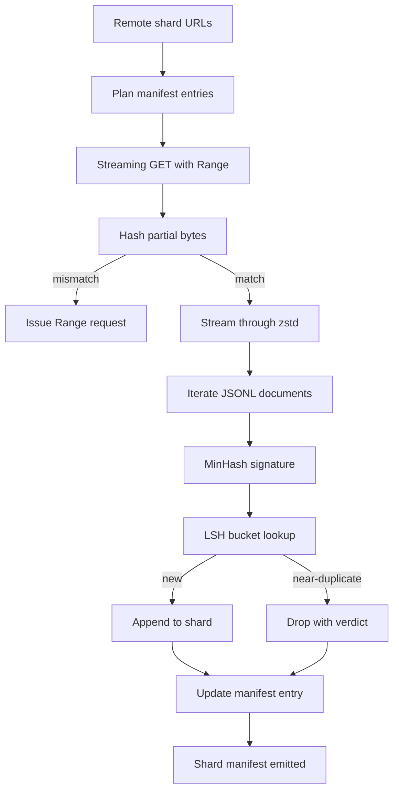

# Gran descargador de corpus

> El entrenamiento de un modelo de lenguaje comienza mucho antes del primer pase hacia adelante. El corpus tiene que aterrizar en disco, descomprimido, deduplicado y direccionable, con la historia de currículum ya elaborada antes de que la red baje al 4 por ciento. Esta lección construye un descargador de transmisión que tira de fragmentos comprimidos, descomprime a la vuela con Zstandard, las huellas dactilares casi duplicadas a través de MinHash más hashing sensible a la localidad, y escribe un fragmento manifiesto que el resto de la tubería puede confiar.

**Type:** Build
**Languages:** Python
**Prerequisites:** Phase 19 lessons 30-37
**Time:** ~90 minutes

## Objetivos de aprendizaje

- Transmite los fragmentos remotos con `urllib`y descomprimir con `zstandard`sin amortiguar el archivo entero en la memoria.
- Reanudar descargas parciales mediante la emisión de HTTP `Range`solicitudes contra una compensación de byte verificada.
- Construye una firma MinHash por documento y envuelve con LSH para que casi duplicados choquen.
- Emírese un manifiesto de fragmentos con contenido hash, tamaño de byte, número de documentos y veredicto dedup.

## El problema

La primera vez que entrenas en un corpus de 200 GB la red cae en 41 por ciento y el guión sale con un `urllib`La segunda vez que se reduce al 78 por ciento, el 99 por ciento se ha reescrito el bucle tres veces. Los dos fallos que tiene que diseñar desde el primer minuto son el currículum de descarga parcial y la eliminación de documentos duplicados. Ambos tienen soluciones bien conocidas; ambos se saltan rutinariamente porque el oleoducto comienza como una línea única.`requests.get`llamen a eso creció dientes.

El resumen es un problema HTTP. El servidor tiene que honrar`Range`Si el desplazamiento y el archivo se desvían incluso por un byte, la descarga reiniciada escribe basura y el corpus se corrompe de una manera que solo aparece durante la tokenización.

La deduplicación es un problema de firma. Exact-hash dedup pierde casi duplicados: el mismo artículo de Wikipedia aparece con tres piezas de pie de tabla de calderas diferentes, el mismo archivo de código con un encabezado de licencia diferente, la misma publicación de blog con un parámetro de seguimiento en cada enlace. MinHash más LSH los capta a un costo sublinear. El costo es una firma por documento y una búsqueda de balde por firma.

## El concepto



### En streaming con `urllib`

La biblioteca estándar `urllib.request.urlopen`devuelve un objeto parecido a un archivo. Envuélvelo en un `zstandard.ZstdDecompressor().stream_reader`y los bytes fluyen de la red a través del descompresor al iterador de documentos sin materializar nunca el fragmento comprimido o el fragmento descompreso en la memoria. El único costo de memoria es el amortiguador de líneas, la firma MinHash para el documento actual y el índice LSH.

### Resumen con `Range`

El descargador escribe dos archivos por fragmento: el fragmento mismo y un `.partial.json`Los registros de los puestos de control.`verified_bytes`¿ Qué ?`expected_size`¿ Qué ?`sha256_prefix`(computado en la primera `verified_bytes`En el inicio, el descargador lee el punto de control, recalcula `sha256_prefix`En el caso de que el hash es incorrecto, se descarta la parte parcial y se reinicia la descarga desde el byte cero. La corrupción silenciosa es imposible porque los bytes verificados se verifican, no se supone.

### MinHash más LSH

MinHash estima la similitud de Jaccard de dos conjuntos en espacio fijo.`k`valores mínimos de hash, uno por función de hash independiente. Dos documentos con similitud Jaccard `s`¿ Qué es eso ?`s`de acordar cualquier componente de la firma.

LSH luego agrupa los `k`los componentes en `b`las bandas de `r`las filas cada una, donde `k = b * r`Dos documentos chocan en al menos una banda con probabilidad .`1 - (1 - s^r)^b`, que es un umbral pronunciado alrededor del valor de `s`¿ Qué haces ?`(b, r)`El umbral para el corpus dedup típico es `s = 0.8`, que la literatura de investigación de LSH llega con `k = 128`¿ Qué ?`b = 32`¿ Qué ?`r = 4`¿ Qué ?

### Manifiesto de fragmentos como contrato

La única salida duradera del descargador es el manifiesto. El manifiesto contiene, por fragmento, la URL, el recuento de bytes descomprimidos, el recuento de documentos, el recuento de documentos únicos después de dedup, y el sha256 del archivo final de fragmento. La tokenización a continuación lee el manifiesto, no la lista de directorios. Si falta un fragmento o su sha256 está equivocado, el manifiesto indica a la siguiente etapa que se niegue a comenzar. El manifiesto es la ventaja decisiva entre "los datos se descargan" y "los datos se descargan y se pueden verificar".

```figure
cap-corpus-downloader
```

## Construye el mismo

`code/main.py`los instrumentos:

- `ShardPlanner`- lee una lista de URL de fragmentos y produce entradas de manifiesto planeadas.
- `StreamingDownloader`- abre una`urllib`flujo con opcional `Range`, escribe a un archivo temporal, actualiza el `.partial.json`punto de control en cada pieza, y verifica el prefijo Sha256 en el currículum.
- `ZstdDocIterator`- envuelve el flujo de archivo en `zstandard.ZstdDecompressor`y produce un documento por línea.
- `MinHasher`- produce una`k`- firma de componente para una cadena que utiliza una familia fija de semillas de hash.
- `LSHIndex`- cubos de firmas por banda y informes de colisiones.
- `Dedup`- combina hasher e índice para etiquetar cada documento `keep`o `near_duplicate`junto con la identificación de fragmento correspondiente.
- `ManifestWriter`- recopila estadísticas por parte y escribe `manifest.json`¿ Qué ?

Una demostración en la parte inferior del archivo construye un pequeño cuerpo sintético en el disco, comprime con `zstandard`, lo descarga a través de un `file://`URL, deduplica y imprime el manifiesto.

- ¿Qué quieres decir ?

```bash
python3 code/main.py
```

El guión sale de cero y imprime un resumen manifiesto.

## Modelos de producción

Cuatro patrones escalar esta lección a corpora reales.

**Checkpoint before write.**El `.partial.json`Debe ser .`fsync`-ed antes de que los bytes se añaden al fragmento. de lo contrario una pérdida de energía invierte el orden: bytes de fragmento en disco, punto de control sin ellos, el siguiente currículum cree que tiene menos bytes verificados que lo que hace, los bytes de sufijo duplicados corrompen el archivo.

**Sharded LSH index.**Un único índice LSH en todo el corpus no encaja en la RAM a la escala de 200 GB. Partir el índice LSH por el primer hash de banda, almacenar particiones en disco, y consultar sólo la partición que una nueva firma aterrizaría en. El costo es un disco extra leído por documento; el beneficio es que el índice LSH ya no es un límite de memoria dura.

**Tombstone, not delete.**Los duplicados abandonados se registran en el manifiesto con el veredicto .`near_duplicate`El Tombstoning conserva el rastro de auditoría y permite que un pase aguas abajo cambie su opinión sobre el umbral.

**Per-shard sha256 in the manifest, plus a manifest sha256.**El manifiesto en sí mismo obtiene un hash de contenido. Las etapas descendentes verifican el hash del manifiesto antes de confiar en las entradas por fragmento. Sin esto el manifiesto es la superficie de ataque silenciosa: un atacante que puede editar un solo archivo puede corromper toda la tubería.

## Usalo

Modelos de producción:

- **Resume on every CI run.**Los ejecutores de CI son efímeros. El descargador tiene que asumir un disco nuevo en cada ejecución y recuperar de la caché o el control remoto. `--cache-dir`es una bandera de primera clase.
- **Dedup before tokenization.**La tokenización es costosa. ejecutarla dos veces en el mismo documento es el doble del costo para la misma curva de pérdidas. Dedup es río arriba de la tokenización, no río abajo.
- **Manifest as merge gate.**La ejecución de entrenamiento lee el manifiesto sha256 de un comit fijado. Una nueva versión del conjunto de datos requiere un nuevo comitamiento manifiesto. El vínculo entre el código y los datos es git, no folclore.

## Envío

`outputs/skill-corpus-downloader.md`En un proyecto real, describiría qué URL alimenta al descargador, cómo se diseña el directorio de puntos de control, qué ancho de baranda y `(k, b, r)`El manifiesto vive en el control de versión.

## Los ejercicios

1. Añadir un`--shingle-width`señalar y medir cómo cambia el veredicto dedup en amplitudes 3, 5, 9.
2. Añadir soporte gzip junto a zstd al olfatear los bytes mágicos. El descargador no debe requerir que el llamador especifique el codec.
3. Añadir un`--resume-only`El modo que se niega a iniciar una nueva descarga si no se encuentra un punto de control.
4. Mover el índice LSH a un archivo de estante o sqlite y medir el rendimiento frente a la variante en memoria.
5. Añadir un manifiesto sha256 para comprobar la inicialización. El descargador debe no cerrarse si el manifiesto en el disco no está de acuerdo con el hash del manifiesto en `manifest.lock`¿ Qué ?

## Términos clave

| Term | What people say | What it actually means |
|------|-----------------|------------------------|
| Shard | "A file" | A self-contained slice of the corpus with its own sha256, used as the unit of resume and dedup |
| MinHash signature | "Fingerprint" | A `k`-component sketch of a set, where each component is the minimum of one independent hash over the set |
| LSH band | "Bucket" | A group of `r` signature components used as a single bucket key for collision detection |
| Verified bytes | "Resume offset" | Bytes on disk whose sha256 prefix matches the checkpoint; the only safe offset to resume from |
| Manifest | "The index" | The single durable record of what the downloader produced, including content hashes |

## Leer más

- [RFC 7233](https://datatracker.ietf.org/doc/html/rfc7233)- Las solicitudes de Rango HTTP, el protocolo de currículum
- [Zstandard format specification](https://datatracker.ietf.org/doc/html/rfc8478)- formato de marco que hace que la descompresión de transmisión sea segura
- [MinHash](https://en.wikipedia.org/wiki/MinHash)- la familia de la firma que utiliza esta lección
- [Locality-sensitive hashing](https://en.wikipedia.org/wiki/Locality-sensitive_hashing)- el régimen de bandaje detrás del umbral de deducción
- Fase 19 · 43 - el corpus tokenizado HDF5 alimenta el descargador
- Fase 19 · 44 - el calendario cosino que se ejerce en el corpus
- Fase 19 · 45 - el ciclo de AMP que consume el horario
