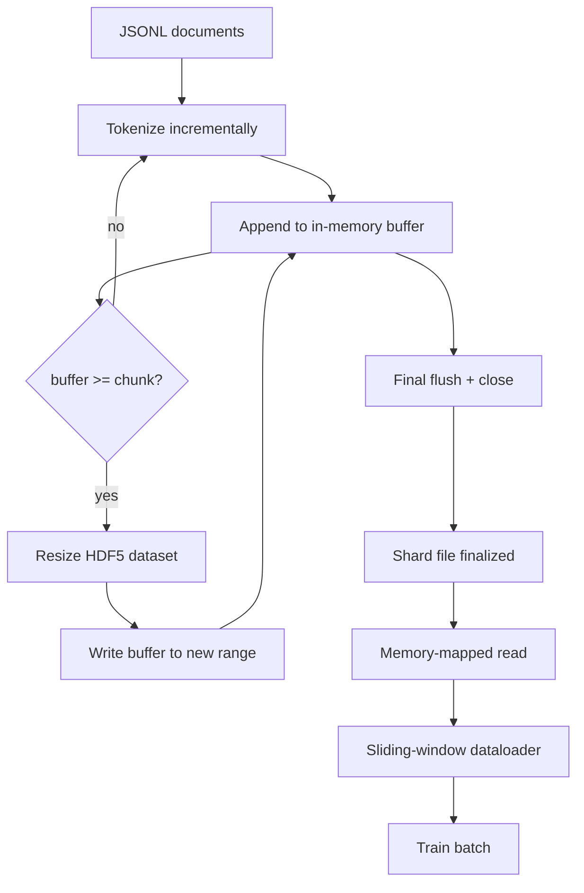

# Corpus Tokenizado HDF5

> El corpus descargado tiene que aterrizar en un diseño que el entrenador puede transmitir a velocidad de línea. JSONL en disco no sobrevive a 16 trabajadores de cargador de datos. HDF5 con un conjunto de datos de números enteros dimensionables y en pedazos lo hace. Esta lección construye la tokenización de transmisión en un conjunto de datos HDF5 dimensionable, escritura en fragmentos en múltiples archivos, lectura en memoria en el tiempo de entrenamiento y un cargador de datos de ventana deslizante que produce secuencias de longitud fija con el empaquetado correcto.

**Type:** Build
**Languages:** Python
**Prerequisites:** Phase 19 lessons 30-37
**Time:** ~90 minutes

## Objetivos de aprendizaje

- Transmite los documentos en un conjunto de datos de números enteros HDF5 dimensionables con fragmentos deterministas.
- Divide la escritura en varios archivos HDF5 para que el fallo sea limitado y sea posible el paralelismo.
- Lea los tokens a través de la disposición de HDF5 respaldada por la página de caché, para que el cargador de datos copie en los buffers de lote solo en el momento del lote.
- Implementar un cargador de datos de ventanas deslizantes que emita secuencias de entrenamiento de longitud fija con reglas explícitas de embalaje.

## El problema

Una formación moderna de lenguaje de modelo lee tokens a cientos de miles de muestras por segundo en decenas de trabajadores. JSONL en disco muere en la primera falla de página de caché frío: el parser JSON es lento, los límites del documento no son direccionables, y buscar "muestra 4,217,884" requiere escanear el archivo. Incluso Parquet, que comprime bien, es un mal ajuste porque el entrenador no quiere columnas; quiere un flujo de tokens plano con acceso aleatorio O(1).

HDF5 se adapta porque ofrece un conjunto de datos fragmentado, dimensionable, solo de números enteros cuyos fragmentos son amigables con la caché de páginas en el momento de la lectura.`tokens[3,200,000 : 3,200,8192]`HDF5 copia el hiperlab solicitado de la caché de la página en una matriz NumPy recientemente asignada. El costo es un manejo de archivo abierto y una huella de caché de página de tamaño grueso por trabajador, lo que es insignificante en comparación con el costo de decodificar JSONL.

El problema de la construcción es hacer que el lado de la escritura sea honesto. Los conjuntos de datos dimensionables son fáciles de usar mal: escribe un documento a la vez y el archivo HDF5 está fragmentado hasta el punto de no ser utilizable. Escriba todos los documentos en un tamaño y una muerte de proceso pierde todo el fragmento. La disciplina correcta es el buffer-then-extend, con un tamaño de buffer que coincide con el tamaño del pedazo, y una escritura en fragmentos que divide la carga de trabajo en archivos para que un accidente pierda al máximo un fragmento.

## El concepto



### HDF5 de tamaño recíproco hecho correctamente

El conjunto de datos de token se crea con `maxshape=(None,)`y un fijo `chunks=(chunk_size,)`. Escribir ganancias mediante el amortiguamiento de tokens en una matriz NumPy de longitud `chunk_size`Cuando el buffer se llena, el conjunto de datos se redimensionará exactamente`chunk_size`y el buffer se escribe en el nuevo rango. al final de la fragmentación el buffer residual se escribe en un rango parcial final. cada escritura es contiguo y alineado en pedazos excepto el último, que se le dice al lector para truncar en el registro`token_count`en los atributos HDF5 del fragmento.

### Escriba en fragmentos

Un solo archivo HDF5 es un solo punto de falla. La tubería escribe fragmentos en paralelo: cada fragmento de entrada de la lección 42 de la fase 19 produce un fragmento de salida HDF5.`shards.json`registros de índice, por fragmento, el camino del archivo, el recuento de tokens, el recuento de documentos, y un sha256 sobre los tokens.`shards.json`para calcular las compensaciones globales y validar el corpus.

### Lectura con mapa de memoria

En el momento de la formación, cada trabajador abre su parte de archivos HDF5 en `swmr=True`el modo y pide `tokens[start:stop]`El trabajo nunca materializa el archivo completo: la rodaje se copia en el buffer de lote del cargador de datos, que el cargador de datos luego copia en un tensor de entrenamiento de memoria fijada en el momento del lote.

### Cargador de datos de ventanas deslizantes

El cargador de datos es la única etapa que sabe sobre la longitud de la secuencia de entrenamiento.`window_size + 1`los tokens y los retornos `(input, target) = (tokens[:-1], tokens[1:])`. No se aplican los límites de los documentos: una ventana puede estar sobre dos documentos, con una`boundary_token_id`Esto es la regla estándar de empaquetado; también es la regla que un principiante olvida, terminando con un corpus que es un 8% de tokens de entrenamiento de límites y un 92% de texto natural.

```figure
cc-hdf5-corpus
```

## Construye el mismo

`code/main.py`los instrumentos:

- `Tokenizer`- un tokenizer determinista de nivel de byte lo suficientemente bueno para la demostración.`encode(text) -> list[int]`y `vocab_size`¿ Qué ?
- `HDF5ShardWriter`- abre un conjunto de datos de números enteros dimensionables, guarda fichas de tamaño de pieza, redimensionó y escribe en pasos de tamaño fijo, registra `token_count`y `sha256`como los atributos HDF5 en cercano.
- `ShardedTokenizationPipeline`- Itera documentos de entrada, los envía a un escritor y emite un `shards.json`índice.
- `MmapTokenStore`- abre archivos de fragmentos para lecturas en memoria, calcula compensaciones globales, expone un solo `get_slice(start, stop)`- ¿Qué es eso?
- `SlidingWindowDataloader`- elige ventanas aleatorias de la corriente global y da resultados `(input_ids, target_ids)`Arrays de número.

Una demostración en la parte inferior del archivo construye un pequeño corpus de memoria, se tokeniza en dos fragmentos, se abre a través del mapa de memoria, ejecuta el cargador de datos para 10 lotes, e imprime la forma por lotes y una suma de comprobación.

- ¿Qué quieres decir ?

```bash
python3 code/main.py
```

El guión sale de cero y imprime sumas de lote.

## Modelos de producción

Cuatro patrones escalar esta lección a una carrera de entrenamiento real.

**Chunk size equals the typical read.**El entrenador lee`window_size + 1`Se puede establecer el HDF5 en un múltiplo de `window_size`Los trozos no coincidentes reducen a la mitad el rendimiento porque cada muestra toca dos trozos.

**Token count in attributes, not in the dataset.**La parte posterior del conjunto de datos puede estar parcialmente llena porque el tamaño de la pieza no divide el límite del documento.`token_count`Sin esto el lector se va del extremo a tokens de cero y el modelo aprende a predecir cero.

**Sharded sha256 with parallel verification.**Cada fragmento tiene su propio sha256 sobre los bytes de token. El entrenador puede verificar todos los fragmentos en paralelo antes de comenzar el entrenamiento.

**`swmr=True` on both sides, with `libver="latest"` on the writer.**El modo de escritora única-múltiple-lector requiere que el escritor abra con `libver="latest"`, crear todos los conjuntos de datos de antemano, luego establecer `file.swmr_mode = True`Después de eso el escritor debe llamar`dataset.flush()`después de cada cambio de tamaño para que los lectores trabajan (abierto con `swmr=True`• ver datos coherentes.`libver="latest"`o la activación de SWMR después de cambios estructurales es una fuente común de fallos de "fichero bloqueado".

## Usalo

Modelos de producción:

- **One HDF5 per source shard.**El descargador (lección 42) emite un fragmento por URL; la tokenización (esta lección) emite un HDF5 por fragmento fuente.
- **Boundary token id.**El token de límite es parte del vocabulario del tokenizer y es el único token que el cargador de datos inyecta. La pérdida de entrenamiento enmascara el token de límite si se supone que el modelo lo ignora; de lo contrario aprende a usarlo como separador de secuencias.
- **`shards.json` as the source of truth.**Añadir un nuevo fragmento significa escribir el HDF5, calcular su sha256 y agregar una entrada.

## Envío

`outputs/skill-hdf5-tokenized-corpus.md`¿En un proyecto real, describiría qué tokenizer alimenta la tubería, qué tamaño de pieza coincide con la ventana del entrenador, donde `shards.json`Esta lección nos ayuda a mejorar el motor.

## Los ejercicios

1. Añadir un`--compression gzip`señalar al escritor HDF5 y medir el costo de rendimiento en el corpus de demostración.
2. Añadir una semilla determinista al cargador de datos de la ventana deslizante y verificar dos carreras con la misma semilla producen lotes idénticos.
3. Añadir un`--validate`modo que lee cada fragmento, recalcula el sha256 sobre sus tokens, y compara con`shards.json`La informática debería revisar esto antes de que comience el entrenamiento.
4. Comparar el rendimiento del cargador de datos en un tamaño de pieza igual a, la mitad y el doble del tamaño de la ventana.
5. Añadir un`--max-document-tokens`La Comisión ha adoptado una propuesta de reglamento que establece que el Consejo debe adoptar medidas para evitar que los Estados miembros se opongan a la adopción de medidas de seguridad en el ámbito de la seguridad social.

## Términos clave

| Term | What people say | What it actually means |
|------|-----------------|------------------------|
| Resizable dataset | "Append-only" | An HDF5 dataset with `maxshape=(None,)` that grows via `resize` calls in chunk-sized strides |
| Chunked layout | "How HDF5 stores it" | Fixed-size on-disk pages that the kernel can memory-map and the dataloader can read contiguously |
| `swmr` mode | "Read-while-write" | Single-Writer-Multiple-Reader mode that lets dataloader workers share the file safely |
| Shard index | "shards.json" | The durable index of all token shards with offsets and content hashes |
| Sliding window | "Training sample" | A fixed-length slice of the global token stream that the trainer pairs with its shift-by-one target |

## Leer más

- [HDF5 chunking documentation](https://support.hdfgroup.org/documentation/hdf5/latest/hdf5_chunking.html)- el diseño del conjunto de datos reducido y dimensionable que utiliza esta lección
- [h5py user guide](https://docs.h5py.org/en/stable/)- Enlaces de Python para HDF5
- [NumPy memory mapping](https://numpy.org/doc/stable/reference/generated/numpy.memmap.html)- la exposición primitiva de HDF5 a través de h5py
- Fase 19 · 42 - el descargador cuya salida esta lección se tokeniza
- Fase 19 · 44 - el calendario cosino que consume este cargador de datos
- Fase 19 · 45 - el ciclo AMP que concluye el paso de entrenamiento
