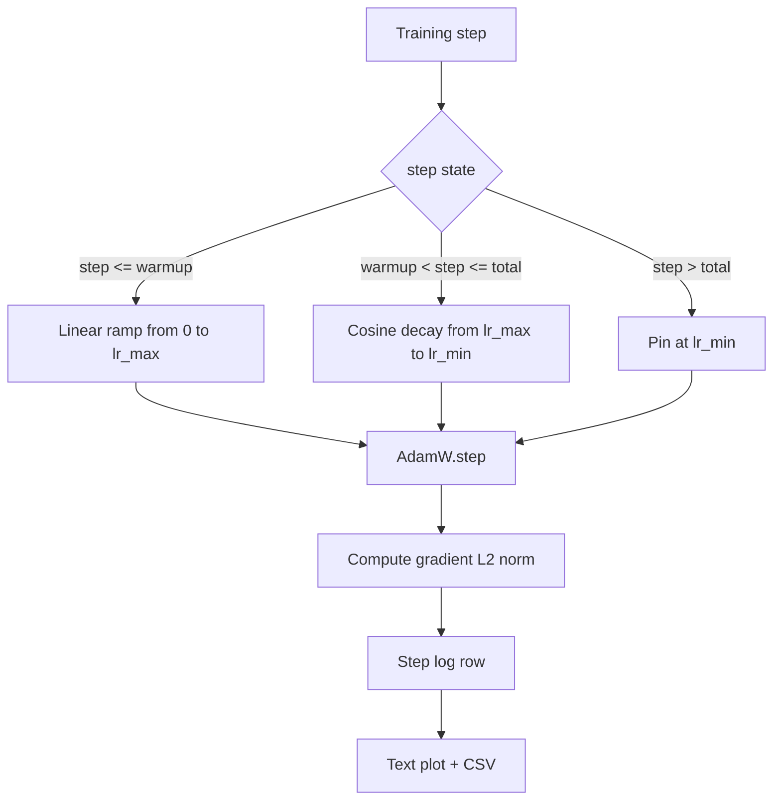

# Cósino LR con calentamiento lineal

> El calendario de la tasa de aprendizaje es la segunda decisión más importante después de la función de pérdida. AdamW con una desintegración cosínica y un calentamiento lineal es el estándar moderno para el entrenamiento de modelos de lenguaje porque permite al modelo ver un pequeño tamaño efectivo de paso durante las frágiles primeras mil actualizaciones, se eleva a un pico configurado y se descompone suavemente hacia cero. Esta lección construye ese horario, traza la curva sobre los pasos de entrenamiento, registra las normas de gradiente junto al horario, y demuestra que el horario honra los límites de calentamiento, pico y descomposición.

**Type:** Build
**Languages:** Python
**Prerequisites:** Phase 19 lessons 30-37
**Time:** ~90 minutes

## Objetivos de aprendizaje

- Implemente un optimizador AdamW cableado a un horario de tasa de aprendizaje cosino con calentamiento lineal.
- Calcule el valor exacto del horario en cualquier paso sin que el punto flotante défenda entre las carreras.
- El gradiente de registro L2 norma junto con la tasa de aprendizaje para que la salud del entrenamiento sea observable.
- Representar el horario a un gráfico de texto que el ojo puede leer y un CSV que cualquier herramienta puede consumir.

## El problema

Las primeras mil actualizaciones de entrenamiento son las más ruidosas. Los pesos del modelo están cerca de la inicialización. La estimación de segundo momento del optimizador no se ha estabilizado. La norma de gradiente es grande y ruidosa. Si la tasa de aprendizaje está en su punto máximo durante estas actualizaciones el modelo o se desvía directamente o se instala en una meseta de pérdida que nunca escapa. Las dos correcciones bien conocidas son el recorte de gradientes, que es el tema de la lección 45 de la Fase 19, y un horario de tasa de aprendizaje que comienza pequeño y aumenta.

El calendario de cosinos con calentamiento tiene tres regiones.`warmup_steps`La tasa de aprendizaje se escala linealmente desde cero hasta el pico configurado `lr_max`Desde el paso .`warmup_steps`para dar un paso`total_steps`La tasa de aprendizaje sigue la mitad superior de una curva cosínica, decayendo desde `lr_max`¿ Qué ?`lr_min`Después de`total_steps`La tasa de aprendizaje está fijada en `lr_min`Así que un entrenador mal configurado que se sobrepasa no sale silenciosamente del horario.

El problema de la construcción es que los horarios son fáciles de equivocarse por uno. El off-by-one aparece seis horas en una carrera de entrenamiento como una tasa de aprendizaje que es un 1% demasiado alta o demasiado baja en el momento en que el modelo comienza a sobreajustar, lo que es invisible a menos que el horario se prueba exhaustivamente en los límites.

## El concepto



### Formula de calentamiento

Para`step`En el`[0, warmup_steps]`con`warmup_steps > 0`, la tasa de aprendizaje es `lr_max * step / warmup_steps`Los degenerados .`warmup_steps = 0`El caso se trata como "no calentamiento": el horario comienza directamente en `lr_max`En el paso cero entra inmediatamente en descomposición cosina.`warmup_steps = 0`para comprobar el horario todavía produce una curva utilizable.

### Formula de cosino

Para`step`En el`(warmup_steps, total_steps]`La tasa de aprendizaje es `lr_min + 0.5 * (lr_max - lr_min) * (1 + cos(pi * progress))`donde`progress = (step - warmup_steps) / max(1, total_steps - warmup_steps)`- En el`step = warmup_steps`el cosino evalúa a `cos(0) = 1`, que da`lr_max`, que coincide exactamente con el punto final de calentamiento.`step = total_steps`el cosino evalúa a `cos(pi) = -1`, que da`lr_min`, coincide exactamente con el punto final de la descomposición.

La continuidad en ambos puntos finales no es un accidente, es por ello que el calendario se implementa como una sola función en más de `step`Un calendario pegado pierde un límite la primera vez`lr_max`se ha cambiado.

### piso después de los pasos totales

Para`step > total_steps`La tasa de aprendizaje se mantiene en `lr_min`. El contrato es explícito: el horario no se extrapola ni se extrapola; se fija en el suelo y permite al entrenador registrar una advertencia.`total_steps`No el bucle.

### Registro de la norma gradual junto con la tasa

La norma de gradiente es la otra mitad. La norma de gradiente es la otra mitad. La norma de gradiente es la mitad de la norma de salud. La norma de gradiente es la mitad de la norma de salud.`step, lr, grad_l2_norm, loss`El CSV es el único registro duradero.

```figure
cap-cosine-warmup
```

## Construye el mismo

`code/main.py`los instrumentos:

- `CosineWithWarmup`- una función sin estado`lr(step) -> float`sobre el horario configurado.
- `TrainState`- envuelve un modelo, un`AdamW`optimizador, y el horario en una función de un solo paso.
- `TrainState.step`- ejecuta un pase hacia adelante, un pase hacia atrás, registra la norma de gradiente L2, y se aplica `lr(step)`al optimizador.
- `plot_schedule_ascii`- hace que el horario sea un gráfico de texto que el ojo pueda leer.
- `write_schedule_csv`- emite una fila por paso con la tasa de aprendizaje.

Una demostración en la parte inferior del archivo crea un pequeño`nn.Linear`El modelo, los trenes por 20 pasos sobre un lote de entrada fija, e imprime la tasa de aprendizaje por paso, la norma de gradiente y la pérdida.

- ¿Qué quieres decir ?

```bash
python3 code/main.py
```

El guión sale de cero y imprime un registro de entrenamiento por paso más la trama del horario.

## Modelos de producción

Cuatro patrones elevan el horario a un artefacto de producción.

**Schedule lives in a config, not in code.**El entrenador lee`warmup_steps`¿ Qué ?`total_steps`¿ Qué ?`lr_max`¿ Qué ?`lr_min`El cronograma es reproducible porque el cronograma está dirigido al contenido; el cronograma es auditable porque el cronograma es parte del PR Diff.

**Step counter is monotonic and decoupled from epochs.**Algunos marcos confunden el paso y la época en que el conjunto de datos se fragmenta o se reinicia el cargador de datos.`global_step`La marcha se reanuda en la posición correcta del horario debido a que el contador de pasos es el eje duradero.

**Schedule plot in the run directory.**Cada entrenamiento escribe`outputs/lr_schedule.png`Un revisor que desciende el directorio puede comprobar el horario sin volver a ejecutar nada. Esto captura la clase de errores de horario mal configurado de bugs en el tiempo de relaciones públicas.

**Log row schema is fixed.** `step, lr, grad_l2_norm, loss`Un cuaderno o tablero de control en línea baja lee el esquema; renombrar una columna sin golpear una versión invalida todos los tableros de control existentes.

## Usalo

Modelos de producción:

- **Sweep peak before sweeping anything else.** `lr_max`Es el botón más sensible.`lr_max`Escala débil con el tamaño del modelo, por lo que el barrido del modelo pequeño es un fuerte previo.
- **Warmup is a fraction of total steps, not an absolute count.**Una carrera de 200 millones de pasos con 2.000 pasos de calentamiento comienza en su punto máximo casi inmediatamente; una carrera de 20.000 pasos con el mismo número se calienta en un 10 por ciento. Configure el calentamiento como una fracción (típico: 1-3 por ciento) para que el horario se balancea con la duración del entrenamiento.
- **`lr_min` is non-zero on purpose.**Un piso que es el 10 por ciento de`lr_max`El equipo de optimización de las actividades de la máquina de la máquina de la máquina de la máquina de la máquina de la máquina de la máquina de la máquina de la máquina de la máquina de la máquina de la máquina de la máquina de la máquina de la máquina de la máquina de la máquina de la máquina de la máquina de la máquina de la máquina de la máquina de la máquina de la máquina de la máquina de la máquina de la máquina de la máquina de la máquina de la máquina de la máquina de la máquina de la máquina de la máquina de la máquina de la máquina de la máquina de la máquina de la máquina de la máquina de la máquina de la máquina de la máquina de la máquina de la máquina de la máquina de la máquina de la máquina de la máquina de la máquina de la máquina de la máquina de la máquina de la máquina de la máquina de la máquina de la máquina de la máquina de la máquina de la máquina de la máquina de la máquina de la máquina de la máquina de la máquina de la máquina de la máquina de la máquina de la máquina de la máquina de la máquina de la máquina de la máquina de la máquina de la máquina de la máquina de la máquina de la máquina de la máquina de la máquina de la máquina de la máquina de la máquina de la máquina de la máquina de la máquina de la máquina de la máquina de la máquina de la máquina de la máquina de la máquina de la máquina de la máquina de la máquina de la máquina de la máquina de la máquina de la máquina de la máquina de la máquina de la máquina de la máquina de la máquina de la máquina de la máquina de la máquina de la máquina de la máquina de la máquina de la máquina de la máquina de la máquina de la máquina de la máquina de la máquina de la máquina de la máquina de la máquina de la máquina de la máquina de la máquina de la máquina de la máquina de la máquina de la máquina de la máquina de la máquina de la máquina de la máquina de la máquina de la máquina de la máquina de la máquina de la máquina de la máquina de la máquina de la máquina de la máquina de la máquina de la máquina de la máquina de la máquina de la máquina de la máquina de la máquina de la máquina de la máquina de la máquina de la máquina de la máquina de la máquina de la máquina de la máquina de la máquina de la máquina de la máquina de la máquina de la máquina de la máquina de la máquina de la máquina de la máquina de la máquina de la máquina de la máquina de la máquina de`lr_min = 0`el programa produce una curva de entrenamiento que se ve bien en una trama y un modelo que no ha terminado de entrenamiento.

## Envío

`outputs/skill-cosine-warmup.md`¿Cómo se puede describir el programa de formación de la cuenta global y qué es lo que se lee en el programa?`lr_max`El valor de la máquina se ha producido en el barrido.

## Los ejercicios

1. Añadir una variante inversa de la raíz cuadrada del cronograma y compararlo en una carrera de entrenamiento de juguete de 200 pasos. ¿Qué curva produce la menor pérdida final?
2. Añadir un`--restart`bandera que añade un segundo calentamiento en `total_steps / 2`- Defender si los reinicios calientes mejoran o se dañan en la carrera de juguetes.
3. Añadir un ensayo unitario que el horario es continuo: para cada paso en `[0, total_steps]`La diferencia`|lr(step+1) - lr(step)|`está limitado por `lr_max / warmup_steps`¿ Qué ?
4. Envía el horario en un `torch.optim.lr_scheduler.LambdaLR`La lección utiliza una función simple de paso; ¿qué cambia el envoltorio?
5. Añadir un`--plot-png`bandera que escribe una trama real a través de `matplotlib`. Defender si la gráfica de texto de la lección o la PNG es la mejor opción predeterminada para ejecutar CI.

## Términos clave

| Term | What people say | What it actually means |
|------|-----------------|------------------------|
| Warmup | "Slow start" | Linear ramp from zero to `lr_max` over the first `warmup_steps` updates |
| Cosine decay | "Smooth drop" | Upper-half cosine curve from `lr_max` to `lr_min` over the remaining steps |
| Floor | "After training" | The fixed `lr_min` value the schedule pins at past `total_steps` |
| Gradient norm | "L2 of grads" | The Euclidean norm of the concatenated gradient vector, logged each step |
| Global step | "Schedule axis" | A monotonic step counter that survives restarts and drives the schedule |

## Leer más

- [Loshchilov and Hutter, SGDR: Stochastic Gradient Descent with Warm Restarts (arXiv 1608.03983)](https://arxiv.org/abs/1608.03983)- el papel de referencia del calendario cosino
- [Loshchilov and Hutter, Decoupled Weight Decay Regularization (arXiv 1711.05101)](https://arxiv.org/abs/1711.05101)- El documento de referencia de AdamW
- [PyTorch torch.optim.lr_scheduler](https://docs.pytorch.org/docs/stable/optim.html#how-to-adjust-learning-rate)- cómo componen las funciones de paso con los calendarios marco
- Fase 19 · 42 - el descargador cuyo cuerpo consuma este horario
- Fase 19 · 43 - el cargador de datos con el que el calendario evoluciona
- Fase 19 · 45 - recorte de gradiente y AMP, la siguiente capa en el ciclo
