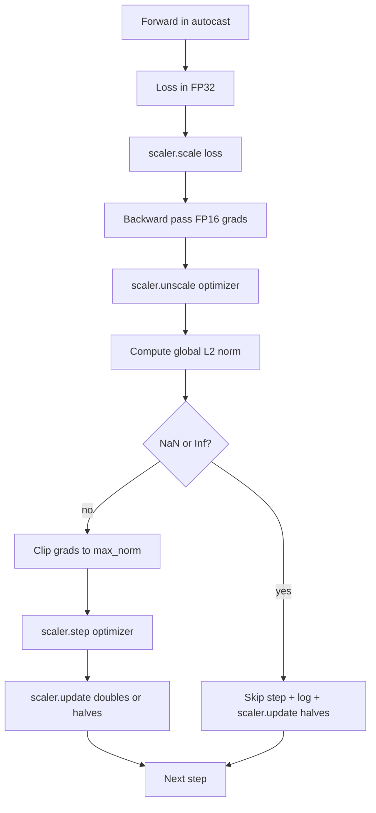

# El corte gradual y la precisión mixta

> El optimizador y el horario de la lección anterior asumen que los gradientes son sensatos. Por lo general no lo son. Un solo lote malo puede aumentar la norma de gradiente en tres órdenes de magnitud. El entrenamiento de precisión mixta amplifica esto mediante la introducción de sobrecarga de FP16 en el lado de la pérdida. Esta lección construye los dos cinturones de seguridad que la capacitación de producción no puede enviar sin: recorte de gradiente a una norma global L2 configurada, y un bucle de precisión mixta con autocast y GradScaler que detecta NaN e Inf, saltan el paso de forma limpia, y registra el factor de escala para la forense.

**Type:** Build
**Languages:** Python
**Prerequisites:** Phase 19 lessons 30-37
**Time:** ~90 minutes

## Objetivos de aprendizaje

- Calcule la norma global de L2 sobre todos los gradientes y clip de parámetros en su lugar cuando exceda un umbral configurado.
- Envuelve un paso de entrenamiento en autocast más un GradScaler para que los pasos hacia adelante y hacia atrás de FP16 sobrevivan al desbordamiento.
- Detectar NaN e Inf en la pérdida o gradiente, saltar el paso de optimización, y registrar el salto.
- Reporte el factor de escala del GradScaler cada paso para que una larga secuencia de saltos sea visible inmediatamente.

## El problema

Una carrera de entrenamiento que se llevó a cabo ayer produce una curva de pérdida que va vertical en el paso 8.217. El culpable es un solo lote cuya norma de gradiente es de 4.200, veinte veces el pico anterior. Sin cortar el optimizador aplica un paso que restablece cada aprendizaje que el modelo había hecho en la hora anterior. Con un clip global L2 a la norma 1.0, el mismo lote contribuye a una actualización de la norma unitaria; la pérdida se mantiene en su línea de tendencia; la carrera sobrevive.

El entrenamiento de precisión mixta impulsa el rendimiento en 2-3 veces mediante el cálculo del pase hacia adelante y la mayor parte del pase hacia atrás en FP16. El costo es que FP16 tiene un rango de exponentes estrecho. Un gradiente típico que se sobreflue en FP16 se evalúa a Inf, que se propaga a través de las capas posteriores como NaN, que establece cada peso a NaN en el siguiente paso de optimización. El GradScaler de PyTorch resuelve esto multiplicando la pérdida por un factor de escalación grande antes del paso hacia atrás y dividiendo los gradientes por el mismo factor antes del paso optimizador. Si algún gradiente es Inf o NaN en un tiempo no escalado, el escalador omite el paso y reduce a la mitad el factor de escalado; si los pasos N anteriores fueron limpios, el escalador duplica el factor. Durante el entrenamiento, el factor encuentra el valor más alto permitido por el rango FP16.

El problema de construcción es el cableado de los dos correctamente. Clip antes de descalificar y el umbral está en gradientes escalados; clip después de descalificar y el orden de operaciones en el GradScaler importa. El orden correcto es: `scaler.scale(loss).backward()`, entonces`scaler.unscale_(optimizer)`, entonces`clip_grad_norm_`, entonces`scaler.step(optimizer)`, entonces`scaler.update()`Cualquier otro orden produce un bucle silenciosamente roto.

## El concepto



### Norma global de L2

La norma global L2 es la norma euclidiana del vector de gradiente concatenado, no la norma por parámetro. PyTorch la implementa como `torch.nn.utils.clip_grad_norm_(parameters, max_norm)`. La función devuelve la norma pre-clip para que la lección pueda registrar tanto el valor natural como el valor recortado, lo cual es necesario para el diagnóstico de "estamos recortando en cada paso".

### autocast y GradScaler

`torch.amp.autocast(device_type)`es el gestor de contexto que ejecuta de forma selectiva las operaciones elegibles (la mayoría de las operaciones de la clase matmul) en el PQ16. `torch.amp.GradScaler(device_type)`El auxiliar es el auxiliar que escala la pérdida antes de retroceder y inverso escalas los gradientes antes del paso optimizador.

La lección utiliza CPU autocast porque es lo que se ejecuta en CI; el mismo patrón transfiere literalmente a CUDA cambiando `device_type="cpu"`¿ Qué ?`device_type="cuda"`. El GradScaler en la CPU es un estub (el autocast de la CPU ya funciona en BF16 por defecto y no necesita escala de pérdida), pero la lección incluye los sitios de llamadas por lo que el cableado es idéntico al bucle de la GPU.

### Detección de NaN e Inf

La detección se realiza en dos lugares.`torch.isfinite`La pérdida de inf o de NaN no produce gradientes útiles y se omite sin entrar en el optimizador.`scaler.unscale_(optimizer)`La lección escanea los gradientes no escalados con `has_non_finite_grad(...)`Los dos controles juntos abarcan tanto los modos de falla del pase hacia adelante como los modos de falla del pase hacia atrás.

### Diagnosticar el factor de escala

El factor de escala es el estado interno del GradScaler.`scaler.get_scale()`Una carrera saludable muestra el factor de escalación subirse en potencias de dos hasta que se satura cerca de`2^17`o `2^18`. Una carrera de mal comportamiento muestra el factor oscilante entre los valores altos y bajos, que es la señal de que los gradientes del modelo están a veces en el rango y a veces no. El diagnóstico es invisible sin registro.

```figure
grad-clip-monitor
```

## Construye el mismo

`code/main.py`los instrumentos:

- `clip_global_l2_norm`- un envase alrededor `torch.nn.utils.clip_grad_norm_`que devuelve la norma pre-clip y post-clip.
- `has_non_finite_grad`- un ayudante que escanea los gradientes para NaN e Inf.
- `AmpTrainState`- envuelve un modelo, un`AdamW`El sistema de optimización, un GradScaler y un dispositivo de autocarga.`step(inputs, targets)`que ejecuta el recorte completo, escalado y saltar en la tubería NaN.
- `StepLog`y `SkipLog`- registros estructurados por paso.
- Una demostración que entrena a un pequeño`nn.Linear`el modelo de 20 pasos, inyecta un inf en el gradiente en el paso 5 para ejercer el camino de salto, e imprime el registro resultante.

- ¿Qué quieres decir ?

```bash
python3 code/main.py
```

El guión sale de cero y imprime un registro por paso con cada fila etiquetada `STEP`o `SKIP`; al menos una fila es una `SKIP`¿ Qué ?

## Modelos de producción

Cuatro patrones elevan el bucle a un paso de entrenamiento de producción.

**Skip counter as an alert, not a log line.**Un puñado de pasos saltados por carrera de entrenamiento es saludable. Cientos de saltos por época son una alerta dura: el modelo está en un régimen FP16 no puede sostener y el bucle está fallando silenciosamente. La lección rastrea una tasa de saltos de 1000 pasos y, en producción, se vería en una tasa superior al 5 por ciento.

**Clip threshold lives in the config.** `max_norm = 1.0`Es el estándar moderno para el entrenamiento de modelos de lenguaje. Primero, limpie en un modelo pequeño; los umbrales más grandes permiten que el modelo se recupere de lotes realmente difíciles; los umbrales más pequeños limitan el peor caso a costa de una curva de pérdida más ruidosa. El umbrale pertenece a la misma configuración YAML o JSON que el calendario de la lección 44.

**Norm log goes to a CSV with the schedule.**Las columnas de CSV son `step, lr, grad_l2_pre_clip, grad_l2_post_clip, loss, skipped, skip_reason, scaler_scale`. Un revisor que abre el archivo ve el cronograma, la historia de gradientes, el factor de escala y el resultado de saltar (con su razón) en una sola fila.

**`scaler.update()` runs every step, even on skip.**En un paso limpio el escalador lee su contador sin información, lo incrementa y posiblemente duplica el factor.`update()`en el sendero de salto es el error que produce "el factor de escala nunca cambió".

## Usalo

Modelos de producción:

- **Autocast device matches optimizer device.** `torch.amp.autocast(device_type="cuda")`para la formación de GPU; `torch.amp.autocast(device_type="cpu")`Para la CPU. los dispositivos de mezcla producen un error de tipo silencioso que aparece como una curva de pérdida que se ve bien pero un modelo que no está aprendiendo.
- **Loss check before backward.** `torch.isfinite(loss).all()`El costo es insignificante y los ahorros en una pérdida de NaN son un paso de entrenamiento completo.
- **`set_to_none=True` in `zero_grad`.**Establece los gradientes a `None`En lugar de cero, que permite que el optimizador salte el cálculo para grupos de parámetros no afectados.

## Envío

`outputs/skill-clip-amp.md`En un proyecto real, describiría qué umbral de clip y dispositivo de lanzamiento automático utiliza el paso de entrenamiento, dónde vive el CSV por paso en el control de versión y cuál es el umbral de alerta de velocidad de salto de producción.

## Los ejercicios

1. Reemplazar la inyección de Inf sintética con un aumento real de la pérdida (multiplicar el objetivo de un lote por 1e8) y verificar los desencadenantes del camino de salto.
2. Añadir un`--bf16`modo que cambia el lanzamiento automático a BF16 en lugar de FP16. BF16 tiene un rango de exponentes más amplio que FP16 y rara vez necesita escala de pérdidas; verifique que la tasa de saltos cae a cero en la misma demostración.
3. Añadir una prueba de unidad que el envoltorio de la cinta de gradiente devuelva correctamente la norma previa y posterior a la cinta cuando no se produzca ningún recorte.
4. Añadir un cálculo de la velocidad de saltar de la ventana de rodamiento y una señal de CLI que no se ejecute si la velocidad excede un umbral configurado durante 100 pasos consecutivos.
5. Envía el bucle para escribir el CSV canónico (`step, lr, grad_l2_pre_clip, grad_l2_post_clip, loss, skipped, skip_reason, scaler_scale`) y confirmar que el archivo sobrevive a un Ctrl-C rociando después de cada fila.

## Términos clave

| Term | What people say | What it actually means |
|------|-----------------|------------------------|
| Global L2 norm | "Clip target" | Euclidean norm of the concatenated gradient vector across all trainable parameters |
| autocast | "Mixed precision" | Selective FP16 (or BF16) execution of eligible operations inside a `with` block |
| GradScaler | "Loss scaler" | Helper that multiplies the loss before backward and inverse-scales gradients before the optimizer step |
| Skip | "Bad step" | An optimizer step refused because the gradient or loss was non-finite; the scaler halves the factor |
| Scaling factor | "Scaler state" | The GradScaler's current multiplier; doubles after clean stretches and halves on every skip |

## Leer más

- [Micikevicius et al., Mixed Precision Training (arXiv 1710.03740)](https://arxiv.org/abs/1710.03740)- la propuesta original de escala de pérdidas
- [Pascanu, Mikolov, Bengio, On the difficulty of training recurrent neural networks (arXiv 1211.5063)](https://arxiv.org/abs/1211.5063)- el papel de referencia de recorte de gradientes
- [PyTorch torch.amp.GradScaler](https://docs.pytorch.org/docs/stable/amp.html)- la API de escaladores que esta lección incluye
- [PyTorch torch.nn.utils.clip_grad_norm_](https://docs.pytorch.org/docs/stable/generated/torch.nn.utils.clip_grad_norm_.html)- el recorte primitivo que esta lección utiliza
- Fase 19 · 42 - el descargador cuyo cuerpo alimenta el bucle
- Fase 19 · 43 - el cargador de datos que consume el bucle
- Fase 19 · 44 - el calendario que compone este ciclo
