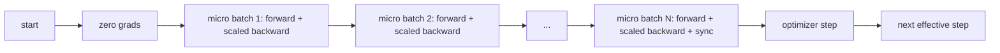
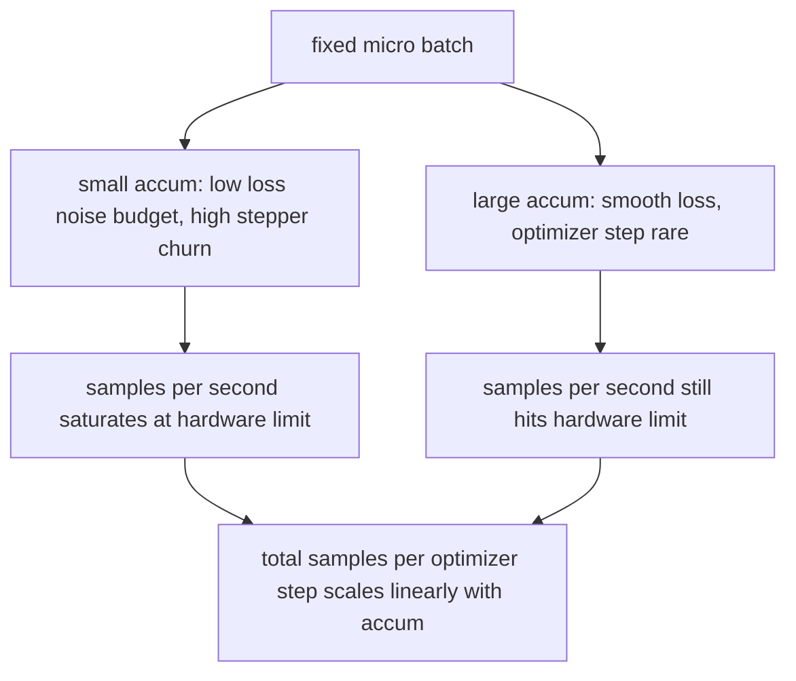

# Acumulación gradual

> Entrenad en un lote efectivo que no podéis pagar, un micro lote a la vez.

**Type:** Build
**Languages:** Python
**Prerequisites:** Phase 19 lessons 42 to 45
**Time:** ~90 minutes

## Objetivos de aprendizaje

- Derivar la identidad efectiva del lote: `effective_batch = micro_batch * accum_steps`¿ Qué ?
- Implemente una escala de pérdida por micro lote para que el gradiente acumulado coincida con un solo lote completo hacia atrás.
- Salta la sincronización de la optimizadora hasta el último micro lote (sincronización en el último paso).
- Lea un rendimiento en contra de la curva efectiva del lote y explique el rendimiento decreciente.

## El problema

Queremos entrenar en un lote efectivo de 512 porque la curva de pérdida es más suave y el paso optimizador tiene más sentido en esa escala. El acelerador en el escritorio contiene 32 ejemplos antes de que se quede sin memoria. Doblar el lote no es una opción. La reducción a la mitad del modelo no es una opción. El truco que el campo alcanzó en 2017 y nunca dejó de usar es ejecutar 16 pases hacia atrás, dejar que los gradientes se acumulen dentro de los buffers de parámetros, y solo pisar el optimizador cuando el recuento alcance el objetivo.

El riesgo es que la pérdida ya no sea el mismo número que en el lote más grande. La entropía cruzada de 16 mini-batches sumadas ingenuamente es 16 veces la pérdida de un lote completo. Sin escalar, la dirección del gradiente es correcta pero la magnitud es incorrecta, y el paso optimizador es 16 veces demasiado grande. La solución es una división. La solución también es fácil de olvidar.

## El concepto



El contrato es corto:

- La pérdida de cada micro lote se divide por `accum_steps`antes de`backward()`PyTorch suma los gradientes en`param.grad`por defecto; la división empuja la suma corriente de nuevo a la escala correcta.
- El paso de optimización dispara una vez por lote efectivo, después de que el último micro lote se retroceda.
- El estado del optimizador (momentum buffers, momentos de Adam) avanza una vez por paso efectivo, no una vez por micro-batch.
- En un grupo de varios rango el mismo patrón envuelve los micro lotes no finales en un`no_sync`El último micro-parce reduce el gradiente acumulado completo en un solo paso en lugar de pagar el costo de la red N veces.

### La prueba de equivalencia en código

```python
loss = criterion(model(x_full), y_full)
loss.backward()
opt.step()
```

es equivalente a

```python
for x, y in chunks(x_full, y_full, n):
    scaled = criterion(model(x), y) / n
    scaled.backward()
opt.step()
```

El buffer de gradiente acumulado al final del bucle es el mismo tensor que producirá un solo lote completo hacia atrás.`equivalence_check`¿ Qué ?

### ¿Dónde va el costo?

Cada micro-parcela cuesta uno hacia adelante y uno hacia atrás.`outputs/accum-curve.json`muestra lo que ocurre a medida que el lote efectivo crece en micro lote fijo:



No hay almuerzo gratis.`accum_steps`El tiempo de la pared por paso de optimización. Lo que cambia es la variación de la estimación de gradiente: en el mismo presupuesto de pared se han hecho menos pasos de optimización pero cada uno fue promedio en más muestras. La literatura trata el lote grande y el lote pequeño como diferentes problemas de optimización; la lección aquí es mecánica, no estadística.

```figure
cc-grad-accumulation
```

## Construye el mismo

`code/main.py`Es el artefacto que se puede ejecutar. Hace tres cosas.

### Paso 1: Verificación de equivalencia

`equivalence_check()`La función de la función de la función de la función de la función de la función de la función de la función de la función de la función de la función de la función de la función de la función de la función de la función de la función de la función de la función de la función de la función de la función de la función de la función de la función de la función de la función de la función de la función de la función de la función de la función de la función de la función de la función de la función de la función de la función de la función de la función de la función de la función de la función de la función de la función de la función de la función de la función de la función de la función de la función de la función de la función de la función de la función de la función de la función de la función de la función de la función de la función de la función de la función de la función de la función de la función de la función de la función de la función de la función de la función de la función de la función de la función de la función de la función de la función de la función de la función de la función de la función de la función de la función de la función de la función de la función de la función de la función de la función de la función de la función de la función de la función de la función de la función de la función de la función de la función de la función de la función de la función de la función de la función de la función de la función de la función de la función de la función de la función de la función de la función de la función de la función de la función de la función de la de la función de la de la función de la función de la de la función de la de la de la función de la de la de la de la de la de la de la de la de la de la de la de la de la de la de la de la de la de la de la de la de la de la de la de la de la de la de la de la de la de la de la de la de la de la de la de la de la de la de la de la de la de la de la de la de la de la de la de la de la de la de la de la de la de la de la de la de la de la de la de la de la de la de la de la de la de la de la de la de la de la de`max_abs_diff < 1e-4`¿ Qué ?

### Paso 2: patrón de sincronización en el último paso

`train_one_optimizer_step`Para cada micro lote excepto el último que entra`no_sync_context(model)`En un solo proceso el contexto es un no-op; en DDP es donde se saltan los gradientes de reducción total.`sync_counter`registra cuántas veces hemos dejado el alcance no_sync; para N micro-partidos el recuento es uno por paso efectivo, no N.

### Paso 3: la curva de rendimiento

`sweep_effective_batches`ejecuta el mismo modelo con un micro-parce fijo y una lista de pasos de acumulación.

- `samples_per_sec`: total de muestras vistas divididas por tiempo de pared
- `median_step_ms`: 50o percentil por paso efectivo
- `sync_calls`: puntos colectivos ejercidos
- `avg_loss`: promedio a través de los pasos de optimización del barrido

La producción se encuentra en `outputs/accum-curve.json`y es reutilizable desde un cuaderno.

- ¿Qué quieres decir ?

```bash
python3 code/main.py
```

El script imprime la diferencia de equivalencia, luego la tabla de barrido, luego el camino JSON.

## Usalo

En la formación de producción, la acumulación de gradientes vive detrás de un botón.`accumulation_steps = effective_batch // (micro_batch * world_size)`Los marcos que no se le permite utilizar aquí envuelven el mismo bucle, pero los pasos son los mismos: escalar la pérdida, omitir la sincronización en micros no finales, acumula, paso una vez.

Tres patrones en la naturaleza:

- El tamaño de micro lote se elige para saturar la memoria del dispositivo. Cualquier cosa más pequeña desperdicia ciclos de acelerador. Cualquier cosa más grande se estrella.
- El lote efectivo se elige a partir de un horario de tasa de aprendizaje. Los grandes lotes eficaces necesitan tasas de aprendizaje escaladas y calentamiento; esta es la regla de escalación lineal de la que se habla desde 2017.
- El recuento de acumulación es el puente entre los dos y el único botón que puedes sintonizar en el tiempo de ejecución sin reescribir el cargador de datos.

## Envío

`outputs/skill-gradient-accumulation.md`captura la receta para que un compañero pueda dejarla en un nuevo repo: pérdida de escala por `accum_steps`, saltar la sincronización del optimizador en micros no finales, paso el optimizador una vez por lote efectivo, registro de rendimiento contra lote efectivo como JSON para que el comercio sea visible.

## Los ejercicios

1. Repite el barrido con `--num-steps 100`¿Dónde se aplanará la curva?
2. Añadir una variante de escalación incorrecta (sin división) y mostrar el parámetro de diferencia en el paso 1 contra la referencia.
3. Cambiar SGD por AdamW y confirmar el estado de optimización avanza una vez por paso efectivo, no una vez por micro-parcela.
4. Introduzca una verdadera`DistributedDataParallel`envuelve y recorre la ruta `no_sync_context`Confirmar que las llamadas de sincronización se reducen en N-1 por lote efectivo.
5. Modifique la comprobación de equivalencia para comparar dos micro-divisiones diferentes (2 por 8 vs 4 por 4) y explique cualquier tolerancia que necesite para relajarse.

## Términos clave

| Term | What people say | What it actually means |
|------|-----------------|------------------------|
| Micro batch | The batch you forward | The slice that fits in memory in a single forward pass |
| Accum steps | Backward passes per step | Number of backwards summed before one optimizer step |
| Effective batch | The batch | Micro batch times accum steps times data parallel world size |
| Loss scaling | Divide by N | Per-micro-batch division so summed gradients match full batch |
| Sync on last | Skip the rest | Only run the gradient collective on the last backward in the window |

## Leer más

- Documents de PyTorch en `DistributedDataParallel.no_sync`para la versión de producción del truco de sincronización en el último paso.
- Goyal et al., 2017, sobre la escalación lineal para el entrenamiento de grandes lotes, la razón canónica para preocuparse por el lote efectivo.
- PyTorch es un rastreador de emisiones de interacciones de acumulación de gradientes con descalado de precisión mixta.
- Las lecciones de fase 19 de 42 a 45 cubren el modelo, el cargador de datos, el optimizador y el andamio de entrenador que supone esta lección.
- La lección 47 de la fase 19 cubre el punto de control y el reanudar para que una larga carrera de acumulación sobreviva a un límite de tiempo.
