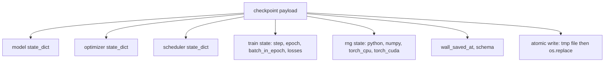
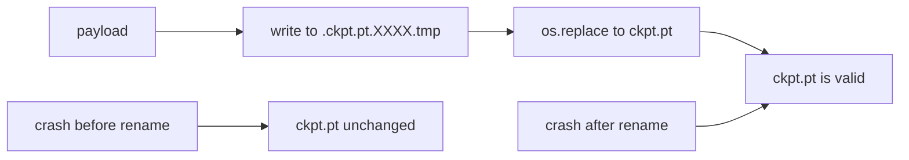
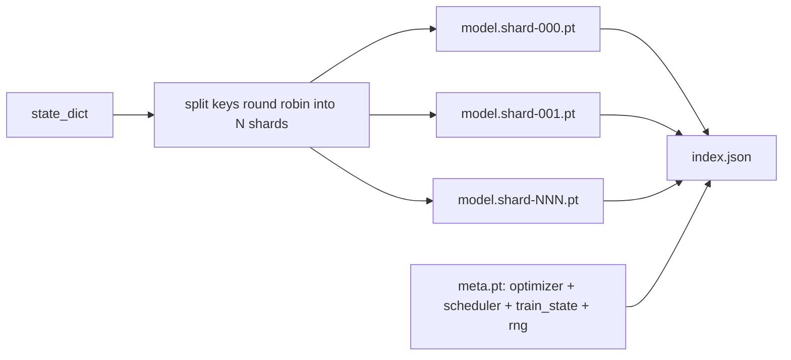

# Punto de control guardar y reanudar

> El tren interrumpe las ejecuciones de matanza; los puntos de control permiten que continúen. Guarde el modelo, el optimizador, el cronista, el historial de pérdidas, el contador de pasos y el estado RNG, de forma atómica, por lo que una matanza en cualquier momento deja un archivo válido en el disco.

**Type:** Build
**Languages:** Python
**Prerequisites:** Phase 19 lessons 42 to 45
**Time:** ~90 minutes

## Objetivos de aprendizaje

- Captura el estado completo de entrenamiento en una sola carga útil que se puede recargar en un proceso nuevo.
- Implemente el ahorro atómico con escritura a tiempo y luego renombre para que un accidente nunca deje un archivo medio escrito.
- Restaurar el estado de RNG para Python, NumPy y PyTorch para que la pérdida después de resume coincida con la línea de base ininterrumpida.
- Construir un diseño de puntos de control fragmentados para modelos que ya no encajan en un solo archivo, con fragmentos verificados por hash y un índice JSON.

## El problema

Estableces un trabajo de entrenamiento de 18 horas. El reloj de la pared tiene 4 horas. El cluster se reinicia a las 11 porque alguien por encima de su nivel de pago aprobó una actualización del kernel. Sin puestos de control empiezas de nuevo. Sin resumen también pierdes el estado de optimización que tomó las primeras 11 horas para aprender, así que incluso si los pesos del modelo sobrevivieron, los momentos de AdamW se han ido y el siguiente paso acecha en una dirección que la trayectoria de entrenamiento ya había pasado.

El artefacto correcto es un archivo único que contiene todo lo necesario para continuar: parámetros del modelo, estado de optimizador, estado de programador, el historial de pérdidas para las parámetros, el paso actual y el tiempo y los contadores de lote en época, y el estado de RNG para cada fuente de aleatoriedad. Sin el estado de RNG la curva de pérdida reanudada es otra. El mismo modelo, los mismos datos, diferentes mezclas, diferentes máscaras de abandono, diferente número en el panel.

El resumen lee basura. Escribir en un archivo temporal en el mismo directorio y luego renombrar significa que un error medio de escritura deja intacto el archivo bueno anterior. El renombre es atómico en los sistemas de archivos POSIX.

## El concepto



### Los cinco baldes del estado

| Bucket | Why it matters |
|--------|----------------|
| Model | Weights and buffers; what the model is. |
| Optimizer | Momentum and adaptive moments; without these the next step is a different optimization problem. |
| Scheduler | Where the learning rate is on its curve; cosine schedules in particular care. |
| Train counters | Step, epoch, batch-in-epoch, plus the loss history that draws the dashboard. |
| RNG state | Determinism for dropout, data shuffling, and any sampling inside the model. |

### Salvamiento atómico



Dos reglas. Primero, el archivo temporal vive en el mismo directorio que el objetivo para que el renombre permanezca dentro del mismo sistema de archivos; renombros de dispositivos no son atómicos. Segundo, el nombre temporal es único por intento para que dos escritores no pisoteen.

### Puntos de control en fragmentos

Cuando el modelo se hace grande la carga útil de un solo archivo se vuelve demasiado grande para cargarse rápidamente, demasiado grande para inspeccionar, y demasiado doloroso cuando una red comparte problemas a mitad de lectura.



El índice registra el número de fragmentos, el sha256 de cada fragmento y el sha256 del archivo meta. El cargador falla en voz alta cuando cualquier hash no coincide. Los fragmentos pueden aterrizar en diferentes discos físicos; el meta es pequeño y se lee primero.

### El currículo continúa a mediados de la época

Un currículum que se remonta al comienzo de la próxima época de residuos en cualquier lugar de minutos a un día.`(epoch, batch_in_epoch)`Después de la carga, el ciclo de entrenamiento avanza rápidamente el generador de números aleatorios más allá de los lotes ya consumidos en la época actual y continúa desde`batch_in_epoch`El código de lección hace exactamente esto; la afirmación es que la trayectoria de pérdida después de reanudar coincide con la línea de base ininterrumpida dentro de 1e-4.

```figure
cc-atomic-checkpoint
```

## Construye el mismo

`code/main.py`proporciona cuatro primitivos y un controlador demo.

### Paso 1: captura y restauración del estado de RNG

`capture_rng_state`devuelve un dictado con Python `random.getstate`, NumPy's `np.random.get_state`, y PyTorch CPU y CUDA RNG bytes. `restore_rng_state`El tensor de la CPU es un buffer de 8 bytes que el RNG de PyTorch sabe consumir.

### Paso 2: rescate atómico

`atomic_save`escribe la carga útil a un archivo temporal en el directorio objetivo, entonces `os.replace`lo cambia por el nombre final.`atomic_write_json`hace lo mismo para el índice fragmentado.

### Paso 3: viaje de ida y vuelta en el punto de control completo

`save_checkpoint`empaque el modelo, el optimizador, el programador, el estado del tren y el RNG en un solo dictado. `load_checkpoint`lo invierte y devuelve un `TrainState`. El campo de esquema es el gancho de actualización: los cambios futuros en el formato golpean la cadena de versiones y el cargador despacha.

### Paso 4: variante en fragmentos

`save_sharded_checkpoint`redondea las teclas de parámetro en N fragmentos, escribe cada fragmento con su propio salvo atómico, escribe un archivo meta con optimizador y cronista y estado de tren, y escribe el índice JSON con fragmentos sha256s. `load_sharded_checkpoint`Verifica cada fragmento antes de fusionarse.

### Paso 5: Demostración de resumen

`run_resume_demo`trenes de un modelo pequeño para `total_steps`, guarda un puesto de control en `interrupt_at`, luego continúa. Un segundo proceso restaura el punto de control y ejecuta los pasos restantes. La función devuelve la diferencia máxima absoluta entre las dos trayectorias de pérdida después del punto de interrupción.

- ¿Qué quieres decir ?

```bash
python3 code/main.py
```

Los demos de archivo único y fragmentados afirman la diferencia máxima en 1e-4.`outputs/resume-demo.json`¿ Qué ?

## Usalo

El entrenamiento de producción apila el punto de control de buques como parte del entrenador. La forma es la misma: modelo + optimizador + programador + contadores + RNG, escrito de forma atómica, nombrado por paso para que lo último sea fácil de encontrar.

Tres patrones para hacer cumplir:

- **Schema is a string in the payload.**Sin él no se puede evolucionar el formato sin romper las viejas corrientes.
- **Sha256 every shard.**Una descarga silenciosa y truncada es el peor tipo de error; el cargador falla rápido o se cae tarde.
- **Keep checkpoint cadence honest.**Salva cada N pasos y cada minuto de reloj, lo que sea más corto.

## Envío

`outputs/skill-checkpoint-save-resume.md`Es la receta para cualquier nuevo script de entrenamiento: forma de carga útil, escritura atómica, captura de RNG, índice en fragmentos.`save_checkpoint`en el sitio de almacenamiento periódico, cable `load_checkpoint`al inicio, y la carrera sobrevive a las muertes.

## Los ejercicios

1. Reemplazar el fragmento de la rotonda con fragmentos por grupo de parámetros (capas que terminan en `.weight`- ¿ Qué ?`.bias`¿Cuándo es preferible cada diseño?
2. Extenda el bucle de almacenamiento para mantener los últimos puntos de control K y poda los más antiguos. ¿Cuál es el K correcto cuando el disco es pequeño?
3. Añadir un`--ckpt-every-seconds`bandera que activa un salvo en un intervalo de reloj de pared, no sólo el recuento de pasos.
4. Añadir un camino de verificación de la suma de checks que se ejecuta en el inicio, escanea todos los puntos de control en el directorio, y informa cuáles son corruptos.
5. Implementar una `migrate_v1_to_v2`Función que añade un nuevo campo a la carga útil y golpes de la cadena de esquema. Hacer la carga tolerar ambas versiones.

## Términos clave

| Term | What people say | What it actually means |
|------|-----------------|------------------------|
| Atomic save | "Write and pray" | Write to a temp file in the same directory, then os.replace into the target name |
| State dict | "The weights" | Model parameters and buffers, keyed by parameter name |
| Sharded checkpoint | "Big model file" | Multiple files, one per shard, plus a meta file and a JSON index with sha256s |
| RNG state | "Random seed" | Captured state for python random, numpy, torch CPU, torch CUDA; not just the seed |
| Mid-epoch resume | "Restart" | Fast-forward the RNG and continue from the next batch in the same epoch |

## Leer más

- POSIX `rename`La semántica para la atomización afirma que `os.replace`se basa en.
- Documentación de PyTorch sobre `torch.save`y `torch.load`, incluyendo `map_location`para las restauraciones transversales de dispositivos.
- La lección 46 de la fase 19 cubre la acumulación de gradientes que la carga útil de este punto de control de la lección sobrevive a través.
- La fase 19 lección 48 abarca los envoltorios distribuidos cuyo formato de dictamen estatal se adapte a este régimen.
- El núcleo de Linux `fsync`documentación de la garantía de durabilidad detrás del renombre atómico.
