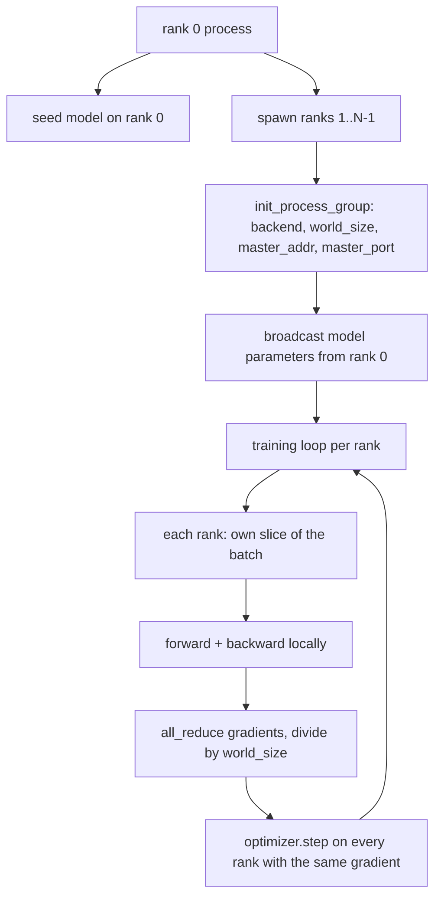
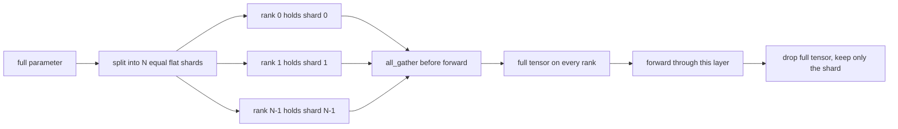

# Datos distribuidos paralelamente y FSDP desde cero

> El entrenamiento multi-ranqueado es dos colectivos y una regla.

**Type:** Build
**Languages:** Python
**Prerequisites:** Phase 19 lessons 42 to 45
**Time:** ~90 minutes

## Objetivos de aprendizaje

- Traer un grupo de procesos a través de N filas con el `gloo`- No hay hardware especial.
- Implemente un envoltorio DDP mínimo que transmita los parámetros en la construcción y reduce totalmente los gradientes después de retroceder.
- Demostrar que la reducción total de los gradientes por rango coincide con un gradiente de un solo proceso en la entrada concatena.
- Esbozo de fragmentación de parámetros FSDP: cada rango contiene una rebanada, el tensor completo se recoge para el pase hacia adelante y se deja caer después.

## El problema

El modelo encaja en un dispositivo. El conjunto de datos no lo hace. El presupuesto de optimización dice que quieres ver N veces los ejemplos por segundo. La primera palanca es paralela a los datos: cada rango ejecuta el mismo modelo en una rebanada diferente del lote, luego promedia los gradientes antes del paso optimizador. La segunda palanca es FSDP: el modelo tampoco se ajusta a un dispositivo, por lo que cada rango contiene una fracción de cada parámetro y reconstruye el tensor completo capa por capa durante el paso hacia adelante.

El dolor es la contabilidad. Si los parámetros se desplazan a través de las filas, la carrera está silenciosamente corrompida. Si promedias los gradientes pero no la pérdida, el panel de instrumentos está en falso. Si el fondo colectivo no puede acordar una topología, la carrera se cuelga para siempre. La solución es escribir los colectivos a mano una vez y nunca confiar en un envoltorio que no pueda reproducir.

Esta lección se ejecuta en CPU.`gloo`Naves de backend con cada PyTorch construido y acepta`torch.multiprocessing`trabajadores; el mismo código cambia a `nccl`en un nodo multi-GPU sin cambios de estructura.

## El concepto



### Los dos colectivos que importan

| Collective | What it does | When |
|------------|--------------|------|
| `broadcast` | Copy a tensor from one rank to all others | Parameter init, scheduler state, any one-to-all sync |
| `all_reduce` | Sum (or mean, or max) a tensor across all ranks, every rank gets the result | Gradient averaging after backward |
| `all_gather` | Each rank contributes a tensor, every rank gets the concatenation | Logits collection, FSDP parameter unshard |

El contrato de DDP es `broadcast`en la construcción y `all_reduce`El boceto del FSDP añade:`all_gather`antes de que cada capa pase hacia adelante.

### Los datos de los datos de los procesos de cálculo de los datos de los datos de los datos de los datos de los datos de los datos de los datos de los datos de los datos de los datos de los datos de los datos de los datos de los datos de los datos de los datos de los datos de los datos de los datos de los datos de los datos de los datos de los datos de los datos de los datos de los datos de los datos de los datos de los datos de los datos de los datos de los datos de los datos de los datos de los datos de los datos de los datos de los datos de los datos de los datos de los datos de los datos de los datos de los datos de los datos de los datos de los datos de los datos de los datos de los datos de los datos de los datos de los datos de los datos de los datos de los datos de los datos de los datos de los datos de los datos de los datos de los datos de los datos de los datos de los datos de los datos de los datos de los datos de los datos de los datos de los datos de los datos de los datos de los datos de los datos de los datos de los datos de los datos de los datos de los datos de los datos de los datos de los datos de los datos de los datos de los datos de los datos de los datos de los datos de los datos de los datos de los datos de los datos de la Unión.

Un modelo entrenado en un lote de ejemplos B a través de N filas debe producir el mismo gradiente que un entrenamiento de proceso único en un lote de N*B. El truco es que sumar los gradientes por rango y dividir por N da el gradiente de pérdida promedio, que es lo que la entropía cruzada con reducción media produciría en el lote completo.`max-abs-diff < 1e-3`entre el gradiente manual de reducción total y el gradiente de referencia de un solo proceso.

### Esbozo del FSDP



La memoria ganadora es exacta: la memoria por rango para parámetros cae a 1/N. El costo es el recopilado, que se paga cada paso hacia adelante. La producción FSDP superpone el recopilado con el cálculo de la capa anterior por lo que el costo del reloj de la pared es mucho menor de lo que predice la contabilidad ingenua. La lección hace el viaje de ida y vuelta en cada parámetro y afirma que la reconstrucción es bit-igual al original.

### CPU y el fondo de la pantalla

CUDA es el objetivo de producción, pero los mismos caminos de código existen en la CPU. `gloo`Es más lento que `nccl`En las GPU por ordenes de magnitud, pero la superficie de la API es idéntica.`backend="gloo"`y las filas son generadas con `torch.multiprocessing`en lugar de`torchrun`Los dos terminan en el mismo lugar .`torch.distributed`En un nodo multi-GPU, los únicos cambios son `backend="nccl"`, tensores de dispositivo, y `torchrun`para lanzar.

```figure
cg-allreduce-ring
```

## Construye el mismo

`code/main.py`es el artefacto en marcha.

### Paso 1: presentar el grupo de procesos

```python
os.environ["MASTER_ADDR"] = "127.0.0.1"
os.environ["MASTER_PORT"] = str(port)
dist.init_process_group(backend="gloo", rank=rank, world_size=world_size)
```

`MASTER_ADDR`y `MASTER_PORT`Las clases seleccionan un puerto libre a través de un truco de enlace y cierre para evitar colisiones cuando varias carreras comparten una máquina.

### Paso 2: transmisión en la construcción

`MinimalDDP.__init__`camina todos los parámetros y buffer y llamadas `dist.broadcast(tensor, src=0)`Los valores de la clasificación 0 se convierten en el init canónico. sin esto, cada clasificación inicia con su propia semilla y las filas divergen del paso uno.

### Paso 3: reducción total de los gradientes después de retroceder

```python
def all_reduce_grads_(module, world_size):
    for p in module.parameters():
        if p.grad is None:
            p.grad = torch.zeros_like(p.data)
        dist.all_reduce(p.grad.data, op=dist.ReduceOp.SUM)
        p.grad.data.div_(world_size)
```

Cada rango termina con el mismo gradiente promedio. El paso optimizador es ahora una función de la misma entrada en cada rango, por lo que los parámetros permanecen sincronizados a lo largo de la carrera.

### Paso 4: demostrar la equivalencia

`manual_all_reduce_matches_single_process`construye el mismo modelo en la posición 0 y compara el gradiente post-all-reduce con el gradiente que un solo proceso calcularía en la entrada concatena.

### Paso 5: viaje de ida y vuelta del FSDP

`fsdp_round_trip_sketch`Aplanes cada parámetro, almohadillas a un múltiplo de `world_size`El paso inverso (re-dividido después del adelante) es una rebanada del tensor reunido.

- ¿Qué quieres decir ?

```bash
python3 code/main.py
```

El tamaño de mundo predeterminado es 2. Dos procesos de CPU desembocan, hablan entre sí a través de `gloo`, y salida cero. La salida `outputs/ddp-demo.json`captura las sumas de parámetros por rango, la norma de gradiente después de todo reducido, el resultado de ida y vuelta del FSDP y la diferencia de gradiente manual frente a referencia.

## Usalo

Las pilas de entrenamiento de producción llaman a los mismos primitivos.`DistributedDataParallel`añade: ganchos de gradiente post-retracimiento que se superponen a todo-reducir con todo-reducir retracimiento, cubo que combina varios pequeños gradientes en un colectivo, y el `no_sync`contexto de la lección 46 utilizada.

El FSDP de PyTorch agrega: una vista de parámetros plana por capa para que cada rango tenga un amortiguador contiguo, superposición de la capa siguiente de la no dividida con el cálculo de la capa actual, y descarga opcional de la CPU para los fragmentos.

La forma se mantiene la misma: transmisión al inicio, reducción después de retroceder, fragmentos de parámetros cuando ya no encajan.

## Envío

`outputs/skill-distributed-fsdp-ddp.md`El programa de formación de la empresa de formación de formación de formación de formación de formación de formación de formación de formación de formación de formación de formación de formación de formación de formación de formación de formación de formación de formación de formación de formación de formación de formación de formación de formación de formación de formación de formación de formación de formación de formación de formación de formación de formación de formación de formación de formación de formación de formación de formación de formación de formación de formación de formación de formación de formación de formación de formación de formación de formación de formación de formación de formación de formación de formación de formación de formación de formación de formación de formación de formación de formación de formación de formación de formación de formación de formación de formación de formación de formación de formación de formación de formación de formación de formación de formación de formación de formación de formación de formación de formación de formación de formación de formación de formación de formación de formación de formación de formación de formación de formación de formación de formación de formación de formación de formación de formación de formación de formación de formación de formación de formación de formación de formación de formación de formación de formación de formación de formación de formación de formación de formación de formación de formación de formación de formación de formación de formación de formación de formación de formación de formación de formación de formación de formación de formación de formación de formación de formación de formación de formación de formación de formación de formación de formación de formación de formación de formación de formación de formación de formación de formación de formación de formación de formación de formación de formación de formación de formación de formación de formación de formación de formación de formación de formación de formación de formación de formación de formación de formación de formación de formación de formación de formación de formación de formación de formación de formación de formación de formación de formación de formación de formación de formación de formación de formación de formación de formación de formación de formación de formación de formación de formación de formación de formación de formación de formación de formación de formación de formación de formación de formación de formación de formación de formación de formación de formación de formación de formación de formación de formación de formación de formación de formación de formación de formación de formación de formación de formación de formación de formación de formación de formación de formación de formación de formación de formación de formación de formación de formación de formación de formación de formación de formación de formación de formación de formación de formación de formación de formación de formación de formación de formación de formación de formación de formación de formación de formación de formación de formación de formación de formación de formación de formación de formación de formación de formación de formación de formación de formación de formación de formación de`gloo`para CPU y `nccl`para GPU, envuelva el modelo en una cáscara DDP que emite en la construcción y reduce después hacia atrás, opcionalmente fragmenta los parámetros con el patrón all_gather del boceto FSDP.

## Los ejercicios

1. Corra con`--world-size 4`y confirme que el parámetro de dispersión se mantiene por debajo de 1e-3 durante la carrera.
2. Reemplazar el promedio manual con `dist.all_reduce(op=dist.ReduceOp.AVG)`y el tiempo la diferencia.
3. Añadir un gancho post-retractuales al envoltorio DDP para que el todo-reducir se superpone con el resto del retro; medir la mejora del reloj de pared.
4. Implemente el paso de re-shard FSDP: después del paso hacia adelante, reemplace el tensor completo con el shard local de nuevo.
5. Cambiar el backend a `nccl`Observe qué variables del entorno cambian y cuáles permanecen iguales.

## Términos clave

| Term | What people say | What it actually means |
|------|-----------------|------------------------|
| Backend | "gloo or nccl" | The library that implements the collective ops; gloo is CPU, nccl is GPU |
| World size | "Total ranks" | Number of processes in the group; the group is the unit collectives operate on |
| Rank | "Worker id" | Process identifier within the group, zero indexed |
| All-reduce | "Sum the grads" | Sum a tensor across all ranks, every rank ends with the same result |
| Unshard | "Gather the params" | Reconstruct the full tensor from per-rank slices via all_gather |

## Leer más

- PyTorch `torch.distributed`La documentación para la semántica colectiva en la que se basa esta lección.
- El `gloo`La lista colectiva de la biblioteca, idéntica en forma a la respaldada por la CUDA `nccl`Primitivos.
- Fase 19 lección 46 para el patrón de acumulación de gradientes que envuelve el DDP todo-reducir en `no_sync`¿ Qué ?
- Fase 19 lección 47 para el diseño del puesto de control que sobrevive a las carreras de DDP y FSDP.
- Documentación de PyTorch FSDP para la implementación de producción del fragmento de parámetros que se muestra aquí.
