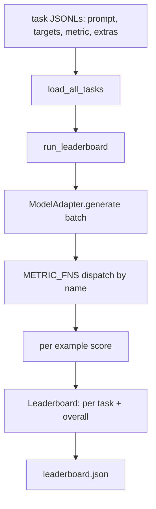
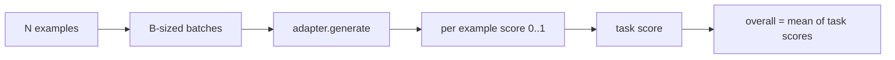

# Arnés de evaluación de modelos de idiomas

> Un modelo que funciona bien en una tarea que no se puede definir es un modelo que funciona bien por accidente. El arnés es la definición de tarea, la métrica, el corredor y el tablero de clasificación, en una forma corta, intercambiable.

**Type:** Build
**Languages:** Python
**Prerequisites:** Phase 19 lessons 42 to 45
**Time:** ~90 minutes

## Objetivos de aprendizaje

- Definir una tarea como un archivo JSONL con `prompt`¿ Qué ?`targets`¿ Qué ?`metric`, y opcionales `extras`Por ejemplo.
- Implemente cinco métricas: coincidencia exacta, rouge-l F1, verificación ejecutable, opción múltiple y contenido de substring.
- Construir un ejecutor que acumula ejemplos por tarea y envía a un adaptador de modelo intercambiable.
- Emite un JSON de la tabla de clasificación con puntuaciones por tarea, latencia y un promedio general reproducible.

## El problema

El modelo de lenguaje nuevo llega cada semana. La afirmación de marketing es que funciona bien. La pregunta honesta es: ¿en qué? La respuesta honesta es el tablero de clasificación que usted mismo escribió, porque el tablero de clasificación del vendedor es el que se sintonizó.

Sin un arnés en su repo se comparan dos modelos por vibraciones. con un arnés se comparan por puntaje en un conjunto de tareas fijas con una métrica fija, en una salida JSON se puede diferir. El arnés es el contrato entre la carrera de ayer y la carrera de hoy. sin él, las regresiones envían.

La trampa es sobreconectar el arnés a un solo modelo. La solución es la misma trampa inversa: el arnés es lo suficientemente pequeño como para leerlo en quince minutos, las tareas son lo suficientemente pequeñas como para enviarse en el repo, las métricas se escriben desde cero para que un colega pueda auditarlas, y el adaptador es el único lugar donde el código específico del modelo vive. Cambiar el adaptador, el tablero se mueve; cambiar las tareas, el tablero se mueve. Nada más debe moverse.

## El concepto



### Específico de tarea

Cada ejemplo es una línea JSONL:

```json
{"id": "arith-00", "prompt": "compute: 2 + 2", "targets": ["4"], "metric": "exact_match"}
```

Para las métricas que necesitan ayudantes de puntuación,`extras`Carga la carga útil lateral:

```json
{
  "id": "code-00",
  "prompt": "python: write a function f that doubles its input",
  "targets": ["ok"],
  "metric": "code_exec",
  "extras": {"io_pairs": [[1, 2], [3, 6]]}
}
```

Una tarea es una tarea .`.jsonl`archivo en`outputs/tasks/`El nombre del archivo es el nombre de la tarea. Todos los ejemplos en un archivo comparten una métrica.

### Las cinco tareas fijas

| Task | Metric | What it tests |
|------|--------|---------------|
| arithmetic | exact_match | Token-level correctness on a deterministic answer |
| summary | rouge_l | Longest common subsequence F1 against a one-line reference summary |
| code-exec | code_exec | Executable test: the predicted function must satisfy a list of input-output pairs |
| multiple-choice | multiple_choice | First letter of the prediction must match an allowed letter |
| generation | substring_contains | Free-form text must contain at least one target substring |

### El contrato métrico

Cada métrica es una función de `(prediction, targets, extras) -> float in [0.0, 1.0]`El arnés promedia las puntuaciones por ejemplo para obtener una puntuación de tarea, luego promedia las puntuaciones de tarea para obtener la total.

- `exact_match`: minúsculas, colapso del espacio blanco, igualdad.
- `substring_contains`: la misma normalización, prueba de substring.
- `multiple_choice`: el primer carácter en alto.
- `rouge_l`: longitud del LCS dividida por longitudes de predicción y referencia, F1 de precisión y de recuerdo.
- `code_exec`: ejecutar la predicción en un espacio de nombres restringido, llamar `f(x)`en cada par de entrada y salida, cuentan coincidencias.

La métrica code_exec ejecuta la predicción en un espacio de nombres de integrados despojados.`import os`Se estalla porque`os`no está en el espacio de nombres; no se puede llegar al sistema de archivos desde una predicción de código.

### El adaptador del modelo

```python
class ModelAdapter(Protocol):
    def generate(self, prompts: Sequence[str]) -> List[str]: ...
    @property
    def name(self) -> str: ...
```

El adaptador es la costura.`ToyAdapter`, un matador de patrones determinista que devuelve la respuesta correcta para cada instante en las cinco tareas fijas. Un adaptador real llama al modelo y devuelve su salida.

### El corredor

`run_task`lotes `batch_size`las instrucciones a la vez y las despachas a la función métrica. `run_leaderboard`Caminó todas las tareas y promedió.`write_leaderboard`emite JSON con una cadena de esquema para que los cambios futuros en formato no rompan silenciosamente los tableros de control.



```figure
eval-harness-matrix
```

## Construye el mismo

`code/main.py`es el artefacto en marcha.

### Paso 1: tareas de fijación de semillas

`seed_fixture_tasks(target_dir)`escribe los cinco `.jsonl`Los archivos.`main.py`las siembra cuando el directorio está vacío.

### Paso 2: tareas de carga

`load_all_tasks(task_dir)`Leía todo .`.jsonl`y devuelve un dictado de nombre de tarea a una lista de `Example`Registros. líneas de comentarios que comienzan con `#`y se omiten líneas en blanco para que los colaboradores puedan anotar los archivos.

### Paso 3: Implementar métricas

Cada métrica es una pequeña función con una prueba unitaria. La serie de pruebas de la lección incluye 13 casos que cubren normalización, superposición parcial, ejecución de código y rechazo de código inseguro.

### Paso 4: escribe el corredor

`run_task`Itera lotes y produce un `TaskResult`con puntaje, recuento correcto, recuento total y latencia. `run_leaderboard`Caminando todas las tareas y producen un `Leaderboard`con el promedio general.

### Paso 5: emite JSON

`write_leaderboard`La serieliza la tabla.`--include-per-example`Flag descarga los registros por ejemplo para que pueda diferenciar las predicciones con respecto a la carrera anterior cuando los puntajes se mueven.

- ¿Qué quieres decir ?

```bash
python3 code/main.py
```

El guión seembra los accesorios en la primera carrera, los califica con el adaptador de juguetes (que consigue cada accesorio correcto), y escribe `outputs/leaderboard.json`. La puntuación general es de 1,0 con el adaptador de juguete; la prueba de adaptador de estufas en `test_main.py`muestra el mismo arnés produce 0,0 cuando el adaptador no puede responder.

## Usalo

Para conectar un modelo real, escribe un adaptador.

```python
class HttpAdapter:
    name = "vendor.v1"

    def __init__(self, endpoint, api_key):
        self.endpoint = endpoint
        self.api_key = api_key

    def generate(self, prompts):
        out = []
        for prompt in prompts:
            response = http_post(self.endpoint, prompt, self.api_key)
            out.append(response["text"])
        return out
```

Cambiar`ToyAdapter`por`HttpAdapter`en la parte superior de `main()`El arnés, las tareas, las métricas y el tablero de clasificación permanecen iguales.

Tres patrones a aplicar al enviar el arnés en un proyecto real:

- **Pin the task files.**El rankboard.json lleva contenido de tarea con hash pinado o lleva los JSONL junto; de lo contrario, la puntuación se mueve cuando el archivo de tarea lo hace, y no se puede decir cuál.
- **Diff predictions, not just scores.**El `--include-per-example`Flag permite ver lo que dijo el modelo el día que la puntuación cayó.
- **Cap the batch size.**Los adaptadores reales tienen límites de velocidad. Un pequeño tamaño de lote mantiene el arnés compatible entre los proveedores.

## Envío

`outputs/skill-lm-eval-harness.md`lleva la receta: JSONL especificación de tarea, cinco métricas, adaptador intercambiable, runner lotado, tabla de clasificación JSON con cadena de esquema.`outputs/tasks/`Las instalaciones son las instalaciones; copiarlas en un proyecto real como un inicio.

## Los ejercicios

1. Añadir una sexta tarea con una métrica personalizada que escriba desde cero (sobreposición similar a BLEU, puntuación de referencia similar a BLEURT, cualquier cosa con un contrato claro).
2. Extenderse`code_exec`para capturar las dificultades y aceptar una lista de dificultades esperadas como objetivos.
3. Añadir un comando de clasificación de diferencia: dado dos `leaderboard.json`archivos, imprimir qué tareas se movieron y en cuánto.
4. Por ejemplo, la latencia de límite. Envuelve la llamada del adaptador en un tiempo de espera; superfija una superficie separada `timeouts`columna en el tablero de clasificación.
5. Pinifica el contenido de la tarea con un sha256 en la tabla de clasificación para que un futuro lector pueda verificar que obtuvieron las mismas tareas.

## Términos clave

| Term | What people say | What it actually means |
|------|-----------------|------------------------|
| Task spec | "The eval format" | JSONL file with prompt, targets, metric, optional extras per example |
| Metric | "How you score" | Function from (prediction, targets, extras) to a float in [0, 1] |
| Adapter | "The model client" | Object with a generate(prompts) -> list[str] method; the only model-specific code |
| Leaderboard | "The scoreboard" | JSON with per-task scores, total counts, latency, and an overall average |
| Code exec metric | "Run it and check" | Execute the prediction in a restricted namespace, compare against input-output pairs |

## Leer más

- El arnés original de evaluación de la producción, mucho más grande pero de la misma forma.
- La ligera de HuggingFace para una aplicación alternativa del mismo contrato.
- La lección 46 de la fase 19 cubre los patrones de acumulación de gradientes utilizados en la pila de entrenamiento y las puntuaciones del arnés.
- La lección 47 de la fase 19 cubre el formato de punto de control contra el que marcas; pin el hash de punto de control en el ranking.
- La lección 48 de la fase 19 cubre la pila de entrenamiento distribuida que produjo el modelo en prueba.
