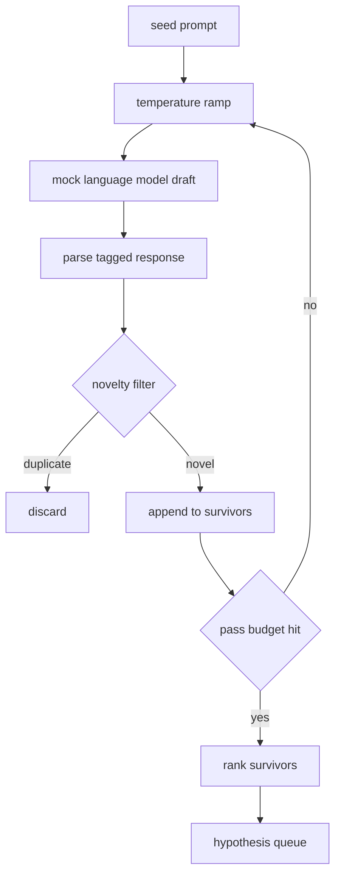

# Generador de hipótesis

> Un agente de investigación que hace la misma pregunta dos veces está desperdiciando tokens.

**Type:** Build
**Languages:** Python
**Prerequisites:** Phase 19 Track A lessons 20-29
**Time:** ~90 minutes

## Objetivos de aprendizaje
- Conducir un muestreo de una muestra de semillas y convertir sus salidas en registros de hipótesis tipografadas.
- Ramp la temperatura de la muestra en cada paso para que el siguiente borrador se aleje del último.
- Filtro cerca de duplicados con un pequeño modelo de incorporación y un umbral de distancia cosino.
- Califique a los sobrevivientes con una función de puntuación que mezcla novedad, especificidad y testabilidad.
- Mantenga cada paso determinista para que la misma semilla siempre produzca la misma cola.

## ¿Por qué generar, y luego filtrar?

Un planificador que pregunta a un modelo una vez obtiene una hipótesis. Eso está bien para un ejemplo trabajado. Para un bucle de investigación es la forma equivocada. El bucle quiere una cola clasificada con profundidad, por lo que cuando la primera hipótesis falla el corredor tiene la siguiente lista sin pagar por otro pase de muestreo completo.

La primera es el aumento de la temperatura: cada paso a través del muestreo eleva la temperatura un gracho, por lo que se alienta a los borradores posteriores a vagar. La segunda es el filtro de novedades: después de cada borrador, el generador mide la distancia de incorporación de cada sobreviviente anterior y rechaza cualquier cosa dentro del racimo.

La lección envía un modelo de lenguaje simulado que devuelve secuencias de tokens scripted para las instrucciones fijas. La simulación es suficiente para ejercer el camino completo: la instrucción de semilla, la rampa de temperatura aplicada, los candidatos analizados, el filtro de novedades ejecutado, la cola clasificada.

## La forma de la hipótesis

```text
Hypothesis
  id             : int           (monotonic within a run)
  text           : str           (the claim)
  variables      : list[str]     (what changes between conditions)
  metric         : str           (what the runner will measure)
  baseline_ref   : str | None    (which paper or run the comparison cites)
  draft_pass     : int           (which sampler pass produced this)
  temperature    : float         (the sampler setting at draft time)
  novelty_score  : float         (distance from prior survivors, 0..1)
  rank_score     : float         (weighted sum used for ordering)
```

`variables`y `metric`El cursor en la lección 52 lee estos campos directamente cuando construye la configuración del experimento.

`baseline_ref`El evaluador en la lección 53 necesita una línea de base para comparar. Si la hipótesis omite una, el evaluador vuelve a la carrera anterior en la misma métrica.

```figure
cg-novelty-ramp
```

## Arquitectura



El bucle es directo hacia adelante. La parte interesante es que cada caja tiene un contrato duro.

## Rampilla de temperatura

Comience en`t_min`, final en`t_max`, paso `(t_max - t_min) / (n_passes - 1)`. Cada paso llama a la muestra a la temperatura actual, produciendo `n_passes`valores espaciados uniformemente de `GeneratorConfig.schedule()`. El modelo simulado honra la temperatura cambiando entre un pequeño conjunto de respuestas scripted encendidas `(prompt, temp_bucket)`Los cubos son intervalos abiertos, por lo que un pequeño cambio de temperatura elige un cubo diferente y produce un borrador diferente.`temperature=t`Pasó por aquí.

El horario predeterminado es de seis pases desde `0.2`¿ Qué ?`1.2`Seis es suficiente para llenar la cola sin pagar por muestras que el filtro de novedades rechazará de todos modos.`0.2`El modelo vuelve a la semilla.`1.2`Las respuestas tienden a desviarse del tema y fallar en el parser.

## Filtro de novedades

Después de analizar cada borrador, el generador incorpora el texto y compara con cada hipótesis aceptada.`1 - dot(a, b)`Un borrador se aprueba si su distancia mínima a cualquier sobreviviente anterior es superior .`novelty_threshold`- El defecto es`0.25`¿ Qué ?

La incorporación hashed no es elegante. Es determinista, tiene cero dependencias, y es suficiente para capturar el caso obvio: dos borradores que comparten la mayoría de sus sustantivos.

## Punto de clasificación

```text
rank_score = w_novelty * novelty_score
           + w_specificity * specificity_score
           + w_testability * testability_score
```

Tres sub puntuaciones.`novelty_score`es la distancia mínima de incorporación de los sobrevivientes anteriores. `specificity_score`es el número de variables concretas en la hipótesis dividido por un número objetivo. `testability_score`es uno si la hipótesis especifica tanto una métrica como una línea de base, la mitad si sólo tiene una métrica, cero de lo contrario.

Los pesos por defecto son `0.4`¿ Qué ?`0.3`¿ Qué ?`0.3`Los pesos viven en la configuración del generador para que una lección aguas abajo pueda desplazarlos sin forjar el código.

## Modelo de lenguaje simulado

```python
class MockLLM:
    def sample(self, prompt: str, temperature: float, seed: int) -> str:
        ...
```

El muestreo es determinista dado un `(prompt, temperature, seed)`El simulacro mantiene una tabla de respuesta guionada encendida.`(prompt_signature, temperature_bucket)`Si la tabla no tiene entrada para una clave, el muestreo devuelve una caída que falla en el parser.

La semilla se mezcla en la respuesta así que lo mismo `(prompt, temperature)`En los ensayos, se pincha la semilla para mantener los resultados reproducibles. en un despliegue real la semilla vendría de un reloj del sistema o un contador.

## Cuadra de salida

La salida es una lista de `Hypothesis`registros ordenados por `rank_score`El corredor en la lección 52 se pone la cabeza, realiza el experimento y el evaluador en la lección 53 escribe un veredicto.

Cuando está vacía, el orquestrador puede ampliar la señal de semilla y volver a ejecutar el generador o detenerse y reportar el presupuesto agotado.

## Cómo leer el código

`code/main.py`define `Hypothesis`¿ Qué ?`MockLLM`¿ Qué ?`HypothesisGenerator`El generador expone un solo`run(seed_prompt)`método que devuelve una cola ordenada; el recuento de pases se lee desde `GeneratorConfig.n_passes`El filtro de novedad es una función única. El puntaje de rango es una función única. Nada depende de`numpy`La matemática de incorporación es pura, así que la lección se mantiene portátil.

`code/tests/test_generator.py`cubre la trayectoria lineal, la trayectoria de rechazo duplicado, la trayectoria de falla del parser, los límites de la rampa de temperatura y el orden de rango.

## Donde esta ranura en

La lección cincuenta produce la cola. La lección cincuenta y una toma la cabeza de la cola y realiza una búsqueda de literatura para confirmarla o refutarla. La lección cincuenta y dos toma la misma cabeza y realiza un experimento real. La lección cincuenta y tres lee ambas salidas y escribe un veredicto. Las cuatro lecciones se componen en un bucle de investigación sin humano en ella; un humano puede entrar en cualquier límite.
