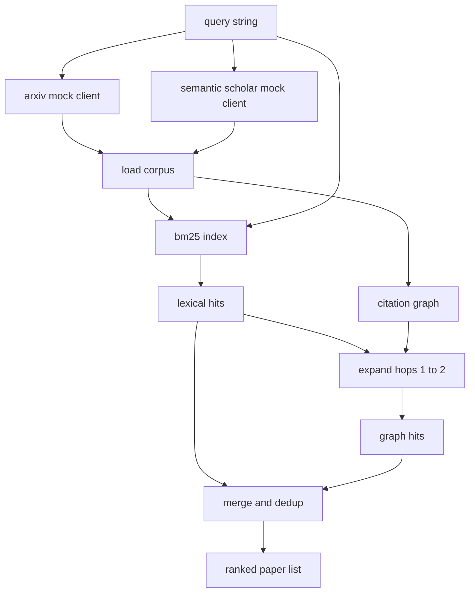

# Recuperación de la literatura

> Una hipótesis es barata, saber si alguien ya lo ha demostrado es la parte más cara, construir la capa de recuperación que responda a esa pregunta antes de que el corredor haga girar una caja de arena.

**Type:** Build
**Languages:** Python
**Prerequisites:** Phase 19 Track A lessons 20-29
**Time:** ~90 minutes

## Objetivos de aprendizaje
- Modela un pequeño registro en papel con los campos que el bucle leerá río abajo.
- Construir un índice BM25 sobre los resúmenes con estructuras de datos de stdlib solamente.
- Caminar un gráfico de citas a la superficie de los papeles de la búsqueda léxica no se hizo.
- Desdobla los puntos en el léxico y el gráfico pasa por un documento de identificación estable.
- Envuelve dos FAKE APIs externas detrás de un solo cliente para que el sitio de llamada en alta corriente permanezca igual cuando los puntos finales reales aterrizan.

## ¿Por qué dos pases de recuperación

Una búsqueda de palabras clave en los resúmenes devuelve documentos que comparten el vocabulario con la consulta. Cubre la mayor parte de la superficie. Se pierden dos casos. El primero es cuando el documento de base utiliza un vocabulario diferente; por ejemplo, una consulta para "atención escasa" pierde un documento titulado "selección de bloques en el enrutamiento de transformadores". El segundo es cuando el documento relevante es un seguimiento que cita un ancla conocido; es más eficiente encontrar el ancla y avanzar que forzar bruta la piscina abstracta.

La lección construye ambos pasos. BM25 sobre resúmenes capta los hits léxicos. Un recorrido de gráfico de citación expande una semilla puesta hacia adelante y hacia atrás por uno o dos saltos. La unión se deduplica por papel id y se clasifica por una pequeña puntuación combinada.

## La forma del papel

```text
Paper
  id          : str           (stable identifier, "p001" for the mock corpus)
  title       : str
  abstract    : str
  year        : int
  authors     : list[str]
  references  : list[str]     (paper ids this paper cites)
  citations   : list[str]     (paper ids that cite this paper)
  source      : str           (which mock api supplied it, "arxiv" or "s2")
```

Los campos de referencia y citación forman el gráfico de citación dirigida.`id`¿ Qué ?

```figure
cg-citation-hops
```

## Arquitectura



El cliente de recuperación posee los pases y la fusión. El solicitante le entrega una consulta y recibe de vuelta una lista clasificada donde cada entrada contiene campos de puntaje por papel (`bm25_score`¿ Qué ?`graph_distance`¿ Qué ?`recency_score`¿ Qué ?`final_score`) que explican el ranking.

## BM25 desde cero

La implementación es la norma Okapi BM25 con parámetros predeterminados `k1=1.5`¿ Qué ?`b=0.75`El índice es de dos diccionarios:`term -> doc_frequency`y `term -> list of (doc_id, term_count)`. La longitud del documento es el recuento de símbolos del resumen. La longitud media del documento se calcula una vez en el tiempo de construcción del índice.`idf * tf_norm`donde`tf_norm`es la frecuencia normalizada de término de longitud BM25 estándar.

El tokeniser es`lower`El sistema de producción se intercambiaría en un pequeño votador.

```text
idf(t)      = log((N - df + 0.5) / (df + 0.5) + 1.0)
tf_norm(t)  = (f * (k1 + 1)) / (f + k1 * (1 - b + b * dl / avgdl))
score(d, q) = sum over t in q of idf(t) * tf_norm(t)
```

## Transcurso de gráfico de citas

El gráfico se construye una vez desde el corpus. los bordes delantera van de un papel a sus referencias. los bordes delantera van de un papel a sus citas. El cruce es una anchura de primera búsqueda sembrada por los primeros hits BM25, cubierta con dos saltos.

Dos saltos es un techo deliberado. Un saltos es demasiado poco profundo; el agente a menudo quiere el antepasado inmediato o descendiente. Tres saltos hace volar el tamaño del resultado en un gráfico conectado y tiende a desviarse del tema. La lección expone el límite de saltos como un botón de configuración para que un bucle aguas abajo pueda apretarlo.

## Descenso y clasificación

Los dos pases devuelven conjuntos superpuestos. Las teclas de fusión en el documento de identificación. Para cada documento el puntaje final es una mezcla ponderada.

```text
final_score = w_bm25 * bm25_score_norm
            + w_graph * graph_score
            + w_recency * recency_score
```

`bm25_score_norm`es la puntuación BM25 dividida por la puntuación máxima BM25 en el conjunto fusionado (por lo que el campo vive en cero a uno). `graph_score`es uno para hits directos de léxico, entonces `0.6`por un salto, `0.3`Si no lo haces, no lo harás.`recency_score`es una rampa lineal que va de cero en el año mínimo del corpus a uno en el máximo.

Los pesos por defecto son `0.5`¿ Qué ?`0.3`¿ Qué ?`0.2`Los pesos son config; un tema obsoleto puede bajar la actualidad mientras que un tema en movimiento rápido lo eleva.

## Fomento de cuerpo

El corpus es de cien artículos, generados por`build_corpus()`. Cada documento tiene un título escrito a mano y un resumen sobre uno de los cinco temas: la escasez de atención, el aumento de la recuperación, los adaptadores de bajo rango, la destilación de conjuntos de datos y los arneses de evaluación.

Los dos clientes de API falsos (`ArxivMockClient`¿ Qué ?`SemanticScholarMockClient`Arxiv devuelve el título, resumen, año, autores. Semantic Scholar agrega referencias y citas.

## ¿Qué lecciones 52 y 53 leyeron

El corredor en la lección 52 lee`paper.id`¿ Qué ?`paper.title`, y las tres primeras frases del resumen como contexto para el experimento.`paper.year`y `paper.references`para atribuir una línea de base a un documento específico.

El cliente de recuperación devuelve un `RetrievalResult`El corredor registra estos datos para que un pase de observabilidad aguas abajo pueda trazar la calidad a lo largo del tiempo.

## Cómo leer el código

`code/main.py`define `Paper`¿ Qué ?`ArxivMockClient`¿ Qué ?`SemanticScholarMockClient`¿ Qué ?`BM25Index`¿ Qué ?`CitationGraph`¿ Qué ?`RetrievalClient`El modelo de la clase BM25 es una clase, sesenta líneas. El gráfico de cruce es un método.

`code/tests/test_retrieval.py`cubre el camino léxico, el camino gráfico, la fusión, la dedup y la consulta vacía.

## Donde esta ranura en

La lección cincuenta produce una hipótesis. La lección cincuenta y una busca en la literatura para ver si esa hipótesis ya está establecida. La lección cincuenta y dos ejecuta el experimento si no lo es. La lección cincuenta y tres lee tanto el resultado de la recuperación como las métricas del experimento para escribir el veredicto. El cliente de la recuperación es el más barato de las cuatro etapas y se ejecuta primero en el orquestrador.
