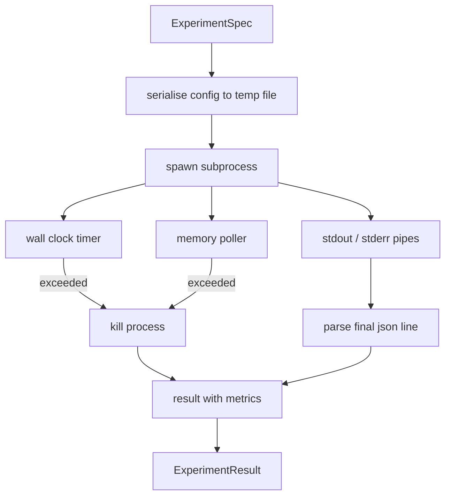

# El corredor de experimento

> El bucle es tan honesto como sus mediciones. Construye el ejecutor que toma una especificación, la ejecuta en un subproceso sandboxed, y emite una mancha de métricas json que el evaluador puede confiar.

**Type:** Build
**Languages:** Python
**Prerequisites:** Phase 19 Track A lessons 20-29
**Time:** ~90 minutes

## Objetivos de aprendizaje
- Encoderar un experimento como una especificación tipografada que el corredor puede sererizar a un subproceso.
- Lanzar un subproceso con un tiempo de tiempo duro y una tapa de memoria suave, y la superficie ambos como condiciones terminales.
- Captura stdout, stderr y las métricas estructuradas en un solo registro de resultados.
- Construir una tabla de ablación que varíe un botón de configuración a la vez sobre una especificación de base fija.
- Mantenga cada resultado determinista dado una semilla para que el evaluador vea los mismos números a través de las carreras.

## ¿Por qué un subproceso

Un bucle de investigación ejecuta código no confiable. La hipótesis vino de un muestreo, el guión del experimento vino de la misma vía; tratar cualquiera como seguro en el proceso es pedir un accidente que lleva al orquestrador hacia abajo. Los subprocesos son el aislamiento más simple que el lenguaje navega: un proceso separado, un espacio de direcciones independiente, un mango de señal en el lado maternal.

El corredor aquí no implementa el sandboxing completo. No hay cgroup, no hay filtro de secuomp, no hay remaping de espacio de nombres. Lo que sí tiene es un tiempo de tiempo de reloj de pared, un bucle de encuestas para el crecimiento de la memoria y un camino de muerte que termina el proceso en cualquiera de los límites. Ese es el contrato de tiempo de ejecución cada vez más elaborado sandbox se extiende. La lección mantiene el contrato lo suficientemente pequeño como para leer en una sola sesión.

## La forma de ExperimentSpec

```text
ExperimentSpec
  spec_id        : str            (stable id, "exp_001")
  hypothesis_id  : int            (link back to the queue from lesson 50)
  script_path    : str            (path to the python script to run)
  config         : dict           (passed to the script as one json arg)
  seed           : int            (deterministic seed for the experiment)
  wall_timeout_s : float          (hard timeout, killed on exceed)
  memory_cap_mb  : int            (soft cap, polled; killed on exceed)
  metric_keys    : list[str]      (which fields the evaluator will read)
```

El guión vive en disco; el ejecutor escribe la configuración a un camino de archivo temporal que el guión lee.`metric_keys`Cualquier otra cosa en Stdout es capturada pero ignorada por el paresador de métricas.

```figure
cg-runner-limits
```

## Arquitectura



El corredor es una clase con un método principal. El encuestador es un pequeño hilo que se despierta una vez cada intervalo de encuestas y lee el subproceso.`psutil`El sistema de archivos proc, cuando esté disponible, se reduce a la ausencia de operaciones cuando la plataforma no la expone.

## ¿Por qué una gorra de memoria suave

Necesitamos tapas de memoria dura`resource.setrlimit`La lección ofrece un enfoque portátil: sondear el tamaño del conjunto residente desde la plataforma y matar el subproceso si supera el límite. El límite es suave porque el sondeador tiene un intervalo no cero; un proceso puede subir por encima del límite entre las encuestas y luego retroceder. El corredor registra el RSS máximo observado para que el evaluador pueda ver cuán cerca llegó el límite.

En los sistemas sin soporte de inspección de procesos, el sondeador registra una advertencia única y se desactiva.

## Capturando el estudo y el estderr

El corredor lee ambas tuberías drenadas al finalizar.`metric_keys`Se toma como la mancha de métricas.`intermediate_metrics`El evaluador puede utilizarlas para curvas de aprendizaje.

El corredor nunca aumenta un código de salida no cero; en su lugar registra el código en el resultado.`"crash"`incluso cuando el script imprimió métricas, por lo que el evaluador trata las ejecuciones parciales como fallos por defecto.

## Tabla de ablación

```python
def ablate(base: ExperimentSpec, knob: str, values: list[Any]) -> list[ExperimentSpec]:
    ...
```

Dado un valor base y un nombre de botón, el ayudante devuelve un valor por valor con `config[knob]`Cada especificación obtiene un derivado.`spec_id`(El artículo`f"{base.spec_id}_{knob}_{value}"`El corredor lanza un barco .`AblationRunner`que los ejecuta en orden y devuelve un `AblationTable`se clava por valor de botón.

Por qué un botón a la vez. los barridos factoriales completos explotan exponencialmente y producen resultados que el evaluador no puede interpretar. Un botón a la vez produce un eje limpio que el evaluador puede trazar. La lección soporta barridos multibotón solo como ablaciones repetidas de un solo botón, compuestas por el llamador.

## El determinismo

Cada especificación lleva una semilla. El corredor envía la semilla al guión a través del dictado de configuración (`config["__seed"] = spec.seed`Los guiones de los simulacros de experimentación en`code/experiments/`El evaluador en la lección 53 depende de esto; sin determinismo una "regressión" podría ser una inicialización aleatoria diferente.

## El guión del simulacro de experimento

La lección nos da un guión de experimento:`code/experiments/sparsity_experiment.py`Es un script real que lee su archivo de configuración, simula una pequeña carrera de entrenamiento con un pase aleatorio numpy, e imprime una mancha de métricas json.`sleep_s`botón para el tiempo de prueba y un `allocate_mb`botón para probar el sondeador de memoria.

La simulación no es entrenar nada real. Es un cálculo numérico que imita la forma de un bucle de entrenamiento: una curva de pérdida, una perplejidad final, un tiempo de pared. El punto de la lección es el corredor, no la simulación. Un guión de experimento real importaría un modelo.

## Forma del resultado

```text
ExperimentResult
  spec_id              : str
  hypothesis_id        : int
  exit_code            : int
  terminal             : "ok" | "timeout" | "oom" | "crash"
  wall_time_s          : float
  peak_rss_mb          : float | None
  metrics              : dict
  intermediate_metrics : list[dict]
  stdout_tail          : str
  stderr_tail          : str
```

El evaluador lee `metrics`y `terminal`Primero, si el terminal es algo más que...`"ok"`El experimento cuenta como una prueba fallida y el veredicto del evaluador es automático.

## Cómo leer el código

`code/main.py`define `ExperimentSpec`¿ Qué ?`ExperimentResult`¿ Qué ?`ExperimentRunner`¿ Qué ?`AblationRunner`La gestión de subprocesos es una clase. el poller de memoria es un hilo pequeño. el ayudante de ablación es una función única.

`code/experiments/sparsity_experiment.py`Es el experimento simulado utilizado en pruebas. Leer su ruta de archivo de configuración de argv y escribir una sola línea de métricas json al finalizar.

`code/tests/test_runner.py`cubre el camino del éxito, el camino de tiempo, el camino de choque, la tabla de ablación y el control del determinismo en dos carreras.

## Donde esta ranura en

La lección cincuenta genera la hipótesis. La lección cincuenta y una filtra todo lo que la literatura ya ha resuelto. La lección cincuenta y dos realiza el experimento por lo que queda. La lección cincuenta y tres lee el resultado, realiza la prueba de significado y escribe el veredicto que el orquestrador almacena contra la identificación de la hipótesis.
