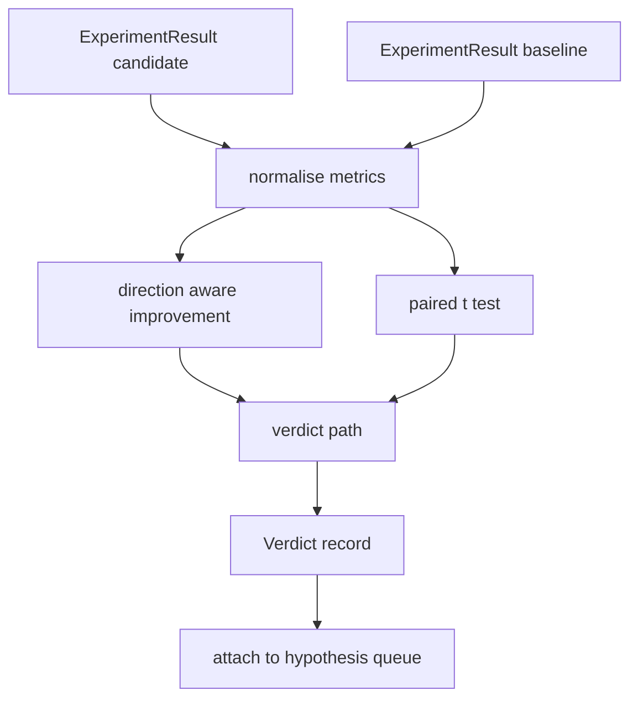

# Evaluación de resultados

> El corredor produjo números. El evaluador decide si esos números son una mejora, una regresión o ruido. Construye el camino del veredicto que convierte las métricas en una conclusión de una línea.

**Type:** Build
**Languages:** Python
**Prerequisites:** Phase 19 Track A lessons 20-29
**Time:** ~90 minutes

## Objetivos de aprendizaje
- Comparar una carrera de candidato con una línea de base utilizando una mejora consciente de la dirección y un umbral fijo.
- Realice una prueba de par t desde cero por semilla y lea el valor p resultante.
- Normalizar las métricas a escala de registro para que un informe a continuación pueda mezclarlas con métricas lineales.
- Emite un veredicto por hipótesis que el orquestrador puede adjuntar a la cola de la lección cincuenta.
- Mantenga cada paso puro para que las mismas entradas siempre produzcan el mismo veredicto.

## ¿Por qué una prueba en pareja?

Un solo número del corredor no dice si el cambio es real. La misma configuración con una semilla diferente da una complejidad diferente. El cambio podría ser ruido. La comparación correcta se combina: las mismas semillas con los mismos datos, se ejecutaron una vez con el candidato y una vez con la línea de base. Cada semilla contribuye a una diferencia. La media de esas diferencias es el efecto. El error estándar de esas diferencias es el piso de ruido.

La lección implementa la prueba desde cero.`scipy.stats`Las matemáticas son lo suficientemente pequeñas como para leer en una pantalla.

```text
diffs    = [a_i - b_i for i in seeds]
mean     = sum(diffs) / n
variance = sum((d - mean) ** 2 for d in diffs) / (n - 1)
t_stat   = mean / sqrt(variance / n)
df       = n - 1
p_value  = two_sided_p(t_stat, df)
```

El valor de p de dos lados utiliza una función beta regularizada incompleta. La lección envía una pequeña implementación que utiliza la fracción continua de Lentz.

## Mejora de la conciencia de la dirección

Algunas métricas mejoran cuando aumentan (acurateza, rendimiento), otras mejoran cuando disminuyen (pérdida, perplejidad, tiempo de pared).`direction`campo en cada métrica.

```text
if direction == "higher_is_better":
    improvement = (candidate - baseline) / abs(baseline)
elif direction == "lower_is_better":
    improvement = (baseline - candidate) / abs(baseline)
```

Una mejora negativa en una métrica superior es mejor significa que el candidato es peor.

Un umbral plano (`improvement_threshold=0.02`En el caso de los usuarios, el circuito no está interesado en cambios que el usuario no pueda medir.

```figure
cg-paired-verdict
```

## Arquitectura



El evaluador ejecuta tres cálculos independientes y los une en el camino del veredicto.

## Normalización del registro

La perplejidad es exponencial en pérdida. Una caída de 0,1 en pérdida es una caída mucho mayor en perplejidad. Comparar la perplejidad directamente entre dos configuraciones es bueno, pero mezclarla con métricas lineales en un solo informe requiere normalización.

La lección normaliza cualquier métrica cuyo`scale`campo es `"log"`El límite de comprobación de la comprobación de la comprobación de la comprobación de la comprobación de la comprobación de la comprobación de la comprobación de la comprobación de la comprobación de la comprobación de la comprobación de la comprobación de la comprobación de la comprobación de la comprobación de la comprobación de la comprobación de la comprobación de la comprobación de la comprobación de la comprobación de la comprobación de la comprobación de la comprobación de la comprobación de la comprobación de la comprobación de la comprobación de la comprobación de la comprobación de la comprobación de la comprobación de la comprobación de la comprobación de la comprobación de la comprobación de la comprobación de la comprobación de la comprobación de la comprobación de la comprobación de la comprobación de la comprobación de la comprobación de la comprobación de la comprobación de la comprobación de la comprobación de la comprobación de la comprobación de la comprobación de la comprobación de la comprobación de la comprobación de la comprobación de la comprobación de la comprobación de la comprobación de la comprobación de la comprobación de la comprobación de la comprobación de la comprobación de la comprobación de la comprobación de la comprobación de la comprobación de la comprobación de la comprobación de la comprobación de la comprobación de la comprobación de la comprobación de la comprobación de la comprobación de la comprobación de la comprobación de la comprobación de la comprobación de la comprobación de la comprobación de la comprobación de la comprobación de la comprobación de la comprobación de la comprobación de la comprobación de la comprobación de la comprobación de la comprobación de la comprobación de la comprobación de la comprobación de la comprobación de la comprobación de la comprobación de la comprobación de la comprobación de la comprobación de la comprobación de la comproba`log(28) - log(32) = -0.133`en un nivel inferior es mejor métrica, que está muy por encima del umbral del dos por ciento.

```text
if scale == "log":
    a = log(candidate)
    b = log(baseline)
else:
    a = candidate
    b = baseline
```

Metricas con `scale="linear"`El mismo camino de código maneja ambos.

## Prueba de paridad por semilla

El corredor de la lección 52 emite una mancha de métricas finales por carrera. Para la prueba emparejada el evaluador necesita una mancha por semilla para el candidato y una por semilla para la línea de base. El orquestrador ejecuta el mismo experimento bajo ambas configuraciones a través de una lista de semillas y le entrega al evaluador dos listas de semillas.`ExperimentResult`los registros.

El evaluador los empareja por semilla (la semilla vive en `result.metrics["seed"]`Si las semillas no coinciden en las dos listas, el evaluador eleva una`PairingError`El orquestrador debería volver a correr.

## La forma del veredicto

```text
Verdict
  hypothesis_id          : int
  metric                 : str
  direction              : "higher_is_better" | "lower_is_better"
  scale                  : "linear" | "log"
  candidate_mean         : float
  baseline_mean          : float
  improvement            : float       (signed, fraction; see direction rules)
  p_value                : float | None  (None if n < 2)
  significance_threshold : float
  improvement_threshold  : float
  verdict                : "improved" | "regressed" | "noise" | "failed"
  rationale              : str
```

El camino del veredicto es una pequeña tabla de decisiones:

```text
1. If any candidate result has terminal != "ok": verdict = "failed"
2. else if |improvement| < improvement_threshold:  verdict = "noise"
3. else if p_value is None or p_value > significance: verdict = "noise"
4. else if improvement > 0:                          verdict = "improved"
5. else:                                             verdict = "regressed"
```

La racionalidad es una frase legible humana de una línea que el orquestrador puede registrar contra la hipótesis id.

## Cómo leer el código

`code/main.py`define `MetricSpec`¿ Qué ?`Verdict`¿ Qué ?`Evaluator`La prueba t se implementa en matemáticas puras de stdlib; numpy se utiliza sólo para leer la lista de métricas y los medios de cálculo y las variaciones.

`code/tests/test_evaluator.py`cubre la ruta mejorada, la ruta regresada, la ruta de ruido (petua mejora), la ruta de ruido (baja n), la ruta terminal fallida, la ruta normalizada del registro, la prueba t contra un valor de referencia conocido y el error de emparejamiento.

## Donde esta ranura en

La lección cincuenta produjo la cola de hipótesis. La lección cincuenta y una filtró todo lo que la literatura resolvió. La lección cincuenta y dos realizó el experimento bajo configuraciones de candidato y línea de base a través de semillas. La lección cincuenta y tres lee esas carreras y escribe el veredicto. El orquestrador cose las cuatro juntas:

```text
for hypothesis in queue:
    literature = retrieval.search(hypothesis.text)
    if literature_settles(hypothesis, literature):
        attach(hypothesis, verdict="settled")
        continue
    candidates = runner.run_all(specs_for(hypothesis))
    baselines  = runner.run_all(baseline_specs_for(hypothesis))
    metric_spec = MetricSpec("perplexity", direction=LOWER, scale=LOG)
    verdict = evaluator.evaluate(hypothesis.id, metric_spec, candidates, baselines)
    attach(hypothesis, verdict)
```

Ese orquestrador no está en esta lección; las cuatro lecciones se componen en ella sin ningún pegamento más allá de las clases de datos definidas por cada una.
