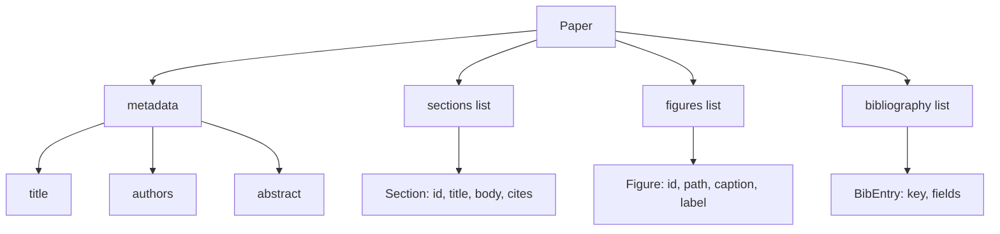
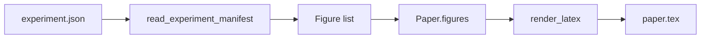
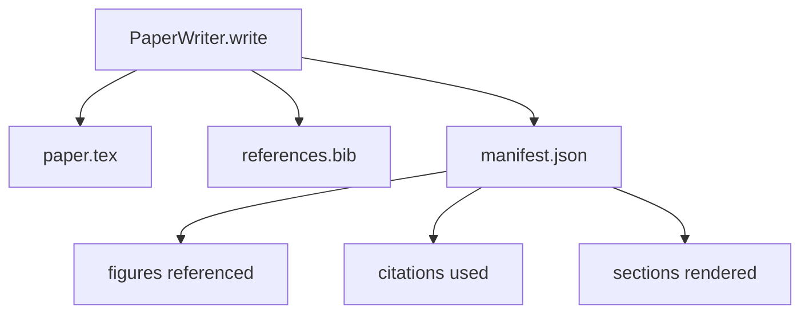

# Escritor de papel

> Un esqueleto LaTeX es un contrato entre el investigador y el mecanógrafo. Si el contrato se rompe el documento no se compila, y el fallo es ruidoso. Construye el esqueleto primero, luego llénalo.

**Type:** Build
**Languages:** Python
**Prerequisites:** Phase 19 lessons 50-53
**Time:** ~90 minutes

## Objetivos de aprendizaje

- Trate un documento de investigación como un artefacto estructurado con un gráfico de sección conocido, no un documento de forma libre.
- Generar un esqueleto de LaTeX que declara su resumen, secciones, ranuras de figuras y claves de bibliografía antes de que se escriba cualquier prosa.
- Inyectar figuras de las salidas de los experimentos (caminos y capciones) en el esqueleto a través de un mecanismo de ranura determinista.
- Enlazar un generador de prosa simulado que llena cada sección de un contorno estructurado para que el arnés sea testable sin un modelo.
- Emite un solo .`paper.tex`más un `references.bib`Además de un manifiesto que enumera cada figura a la que se hace referencia y cada cita utilizada.

```figure
ch-paper-skeleton
```

## ¿Por qué un esqueleto primero?

Un borrador que comienza como prosa acumula deuda estructural. La introducción crece tres párrafos que deben estar en el trabajo relacionado. Una figura se hace referencia antes de que se define. La bibliografía termina con tres claves para el mismo artículo. Para el momento en que el autor se da cuenta, el costo de reescribir es mayor que el costo de escribir.

Un esqueleto inverte eso. La estructura se declara como datos de antemano. Las secciones son ranuras con nombres y orden. Las cifras son ranuras con identidades y títulos. Las claves de bibliografía se declaran en la parte superior con las entradas a las que apunta. La prosa se genera en esas ranuras una a la vez. El arnés puede validar, antes de que se escriba prosa, que cada figura tiene una ranura, cada cita tiene una entrada, y cada sección aparece en la tabla de contenido.

Esta es la misma disciplina que las lecciones anteriores aplicaron a los planes, llamadas de herramientas y rastros.

## La forma del papel



Cada campo es datos de Python. El renderizado es una función pura de `Paper`El arnés puede observar el papel antes de renderizarlo: contar secciones, enumerar archivos de figuras faltantes, comprobar que cada `\cite{key}`tiene una coincidencia `BibEntry`¿ Qué ?

## El contrato de rendimiento

El renderizador garantiza tres propiedades.`\begin{figure}`bloque con una etiqueta estable del formulario `fig:<id>`En segundo lugar, cada sección emite un`\section{}`con una etiqueta estable del formulario `sec:<id>`En el caso de las bibliografías, la información sobre las referencias cruzados es una fuente de información.`\bibliography`Bloqueo cuyo `references.bib`contiene exactamente las entradas declaradas en el papel, ni más ni menos.

El esqueleto es el contrato; un renderizado que baja silenciosamente una figura es una ruptura del contrato.

## Inyección de figuras de experimentos

Las lecciones anteriores en esta pista produjeron resultados experimentales a medida que se manifiesta JSON. Cada manifiesto lleva una lista de artefactos con caminos y capciones cortas.`Figure`los registros.



La inyección es determinista. Las identidades de la figura se derivan del nombre del experimento más un contador monótono. Los títulos provienen del manifiesto. Los caminos se normalizan en relación con el directorio de salida del papel para que el LaTeX compile incluso cuando las salidas del experimento se encuentran en otro lugar del disco.

## El generador de prosa burlado

La lección no llama a un modelo.`MockProseGenerator`El generador expande esa cadena en dos párrafos cortos con el título de la sección tejido.

Esto es suficiente para probar cada comportamiento del escritor. Una implementación real cambiaría el generador por una llamada modelo. El arnés alrededor de él no cambia. Ese es el valor de declarar el generador de prosa como un llamable: el test sustituye a uno determinista, la producción sustituye a uno modelo, el resto de la tubería es idéntico.

## La salida manifiesta

El escritor emite tres archivos en el directorio de salida.



El manifiesto es lo que lee un evaluador o un bucle crítico en el flujo descendente. No analiza LaTeX; lee el manifiesto. La siguiente lección, el bucle crítico, toma este manifiesto como entrada y produce una lista de retroalimentación. Por eso el manifiesto es parte del contrato y el LaTeX no lo es.

## Puertas de validación

El escritor corre cuatro puertas antes de escribir cualquier archivo.

1. Cada identificación de figura es única dentro del papel.
2. Cada sección es.`cites`el campo hace referencia a una clave bibliográfica que se declara en el papel.
3. El abstracto no está vacío.
4. El título no está vacío.

Una puerta fallida se eleva .`PaperValidationError`El arnés aparece la razón como el modo de falla. No hay escritura parcial: o los tres archivos se emiten, o ninguno.

## Cómo leer el código

`code/main.py`define `Paper`¿ Qué ?`Section`¿ Qué ?`Figure`¿ Qué ?`BibEntry`¿ Qué ?`PaperValidationError`¿ Qué ?`MockProseGenerator`¿ Qué ?`PaperWriter`, y un `render_latex`La función de la`write`método toma un directorio de salida y emite `paper.tex`¿ Qué ?`references.bib`, y `manifest.json`- El .`read_experiment_manifest`ayudante convierte una lista de manifiestos de experimento en `Figure`los registros.

`code/tests/test_paper_writer.py`cubiertas: render esqueleto sin secciones, render completo con dos secciones y dos figuras, puerta de citación faltante, puerta de identificación de figura duplicada, contenido manifestado y el contrato de cadena LaTeX (cada sección emite un `\section{}`, cada figura emite un`\begin{figure}`¿Qué es lo que se hace?

## Ir más allá

Dos extensiones que una implementación real necesitará.`Paper`El render se convierte en una estrategia en `Paper`. Segundo, enriquecimiento de citas: el escritor obtiene entradas de BibTeX de una clave de citación, dada una caché local de DOI. Ambos pueden agregar valor, ambos pueden agregarse sin tocar el contrato esqueleto.

El esqueleto es la apuesta. Secciones, cifras y citas declaradas como datos, prosa generada en ranuras, manifiesto emitido junto con la LaTeX.
