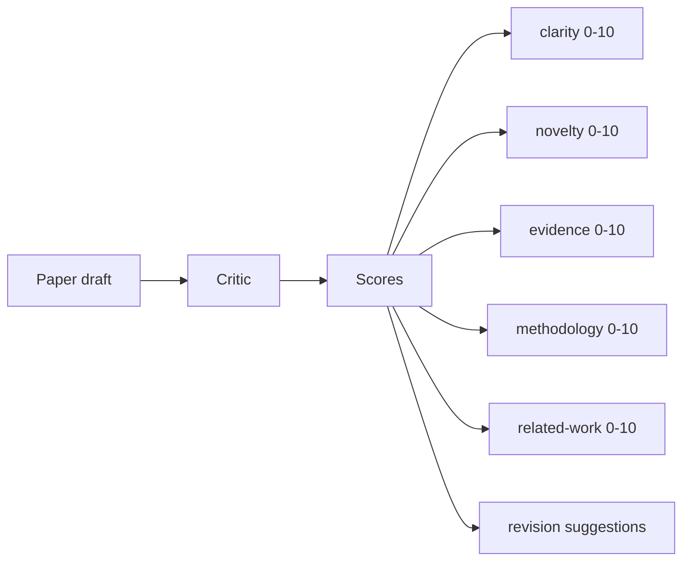
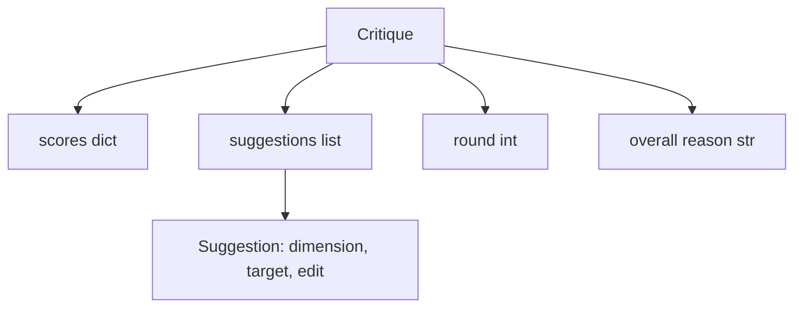
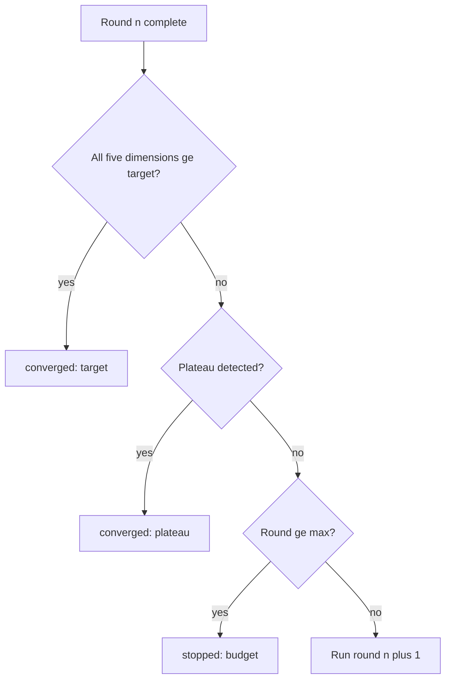
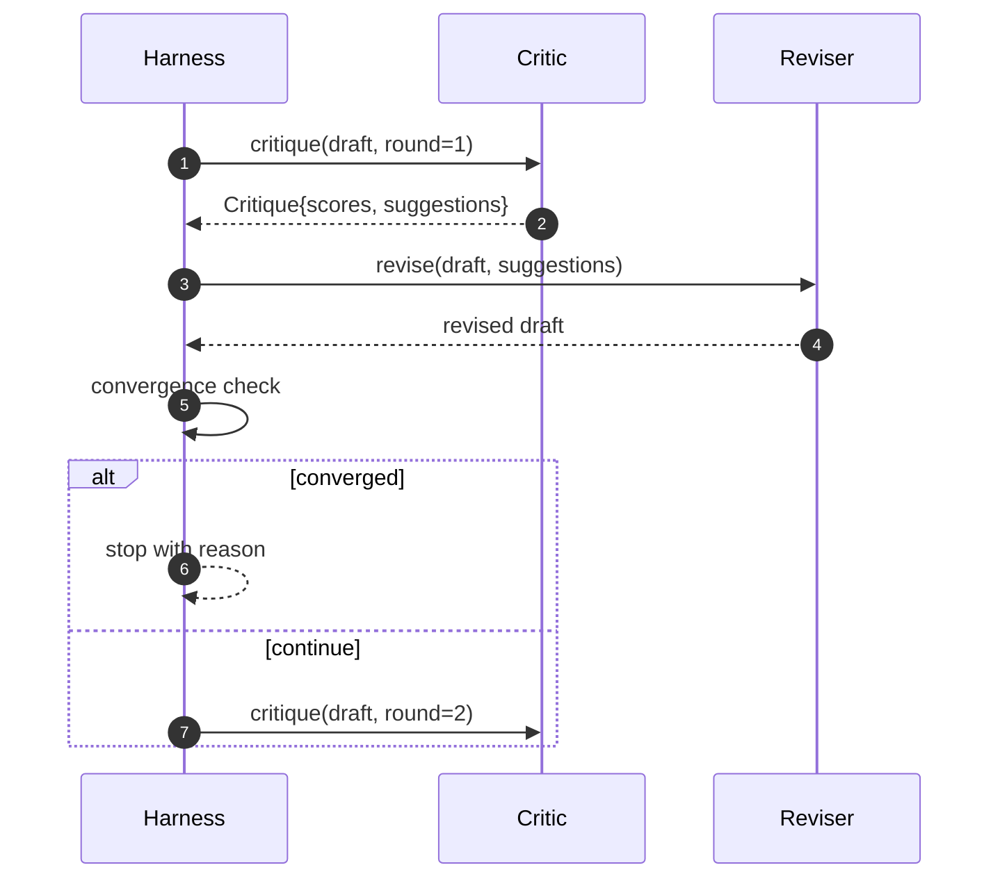

# El círculo crítico

> Un crítico que regrese "parece bien" la primera vez se rompe. Un crítico que siempre regresa "necesita trabajo" se rompe. El crítico interesante es el que converge, y tienes que diseñar la convergencia.

**Type:** Build
**Languages:** Python
**Prerequisites:** Phase 19 lessons 50-53
**Time:** ~90 minutes

## Objetivos de aprendizaje

- Obtenga un borrador de papel en cinco dimensiones fijas: claridad, novedad, evidencia, metodología y trabajo relacionado.
- Aplique la crítica de cada ronda como una revisión estructurada diferente en lugar de una reescritura de forma libre.
- Detectar la convergencia comparando las puntuaciones entre rondas; parar en la meseta, alcanzar el objetivo o agotar el presupuesto.
- El límite de tiempo se reduce con un presupuesto de máxima iteración para que un crítico no convergente no funcione para siempre.
- Emite un rastro por ronda para que el tablero o la siguiente etapa pueda representar la trayectoria de la puntuación.

```figure
ch-critic-converge
```

## ¿Por qué cinco dimensiones fijas

Un crítico de forma libre es un modelo que devuelve un párrafo de sugerencias. La revisión de la siguiente ronda trata el párrafo como contexto ambiental.

Las cinco dimensiones le dan al arnés un contrato.



El arnés observa cada dimensión a través de las rondas. Una revisión que aumenta la claridad pero tanquea la evidencia es una regresión de la evidencia, y la verificación de convergencia lo ve. Un crítico solo modelo no puede ofrecer esa garantía.

## La forma de la crítica



Cada sugerencia tiene la dimensión que mejora, la sección que se dirige y un`edit`La lección envía un revisor determinista que interpreta la instrucción de edición como una operación de apéndice a sección. Un revisor impulsado por un modelo interpretaría el mismo campo como un prompt. El contrato no cambia.

## Las normas de convergencia, en orden

El ciclo crítico termina cuando una de las tres condiciones dispara.



El objetivo es el caso más estricto: cada una de las cinco dimensiones (claridad, novedad, evidencia, metodología, trabajo relacionado) debe alcanzar `>= target_score`(por defecto `8.0`La detección de plato compara la media de la ronda actual con la media de la ronda anterior. Si la mejora es inferior `plateau_epsilon`(por defecto `0.1`) para dos rondas consecutivas, el bucle sale con `plateau`. El presupuesto es un límite de las rondas (por defecto `5`) y salidas con `budget`¿ Qué ?

El orden importa. El objetivo gana sobre la meseta gana sobre el presupuesto. Si la tercera ronda golpea el objetivo en la misma iteración que también desencadenaría una meseta, el resultado es `target`No , no .`plateau`¿ Qué ?

## ¿Por qué la detección de la meseta se extiende a través de dos rondas

Un plano de plano de plano es ruido. Un crítico real devuelve una puntuación ligeramente diferente cada iteración incluso en un borrador fijo, porque la puntuación determinista todavía depende de qué sugerencias se aplicaron y en qué orden. Requerir dos rondas consecutivas de plano de plano filtra el ruido.

## El crítico determinista en esta lección

La lección no llama a un modelo. El crítico enviado es un convocable que califica un borrador basado en tres señales: longitud media del cuerpo de la sección (claridad), número de figuras y número de citas (evidencia), y un`originality_tag`El revisor sabe cómo elevar cada puntuación.

```text
clarity      grows when the average section body length increases
novelty      grows when originality_tag is set to "high"
evidence     grows when a section's figure_refs is non-empty
methodology  grows when a section titled "Method" exists with body
related-work grows when a section titled "Related Work" exists with body
```

El revisor interpreta cada sugerencia como un apéndice dirigido. Después de la primera ronda, el arnés puede observar la puntuación subiendo.

## El contrato de ciclo completo



El arnés es dueño del contador redondo, el rastro y el control de convergencia. El crítico es dueño de la partitura. El revisor es dueño de la diferencia. Ninguno de los tres toca el estado de los demás.

## La salida de Trace

Cada ronda emite un evento de pista con el número de ronda, el vector de puntaje, el recuento de sugerencias y el veredicto de convergencia. La pista completa se devuelve junto al borrador final. Un panel de control aguas abajo puede renderizar la tabla de puntaje por ronda. La siguiente lección, el programador de iteraciones, lee la pista para decidir si vale la pena mantener la rama.

## Presupuestos que protejan contra los malos críticos

Un crítico que produce sugerencias que nunca mejoran la puntuación bloqueará el bucle en el techo de máxima iteración.`budget`El usuario lee que como un error crítico, no un error de borrador. La alternativa, que aparece sólo el borrador final, oculta el diagnóstico.

## Cómo leer el código

`code/main.py`define `Critique`¿ Qué ?`Suggestion`¿ Qué ?`Critic`Protocolo,`Reviser`Protocolo,`CriticLoop`, y un `make_deterministic_critic_pair`Fabrica que devuelve el crítico determinista y un revisor correspondiente.`Paper`forma está incluida para que la lección se mantenga sola.

`code/tests/test_critic_loop.py`Las revisiones incluyen: mejora monótona después de la primera ronda, convergencia de objetivos en un borrador ajustado, detección de plato después de dos rondas planas, agotamiento presupuestario cuando no se mejora ninguna sugerencia, aplicación de sugerencias por parte del revisor y forma de rastro.

## Ir más allá

En el caso de los estudios de la investigación, el estudio de la evolución de la evolución de la evolución de la evolución de la evolución de la evolución de la evolución de la evolución de la evolución de la evolución de la evolución de la evolución de la evolución de la evolución de la evolución de la evolución de la evolución de la evolución de la evolución de la evolución de la evolución de la evolución de la evolución de la evolución de la evolución de la evolución de la evolución de la evolución de la evolución de la evolución de la evolución de la evolución de la evolución de la evolución de la evolución de la evolución de la evolución de la evolución de la evolución de la evolución de la evolución de la evolución de la evolución de la evolución de la evolución de la evolución de la evolución de la evolución de la evolución de la evolución de la evolución de la evolución de la evolución de la evolución de la evolución de la evolución de la evolución de la evolución de la evolución de la evolución de la evolución de la evolución de la evolución de la evolución de la evolución de la evolución de la evolución de la evolución de la evolución de la evolución de la evolución de la evolución de la evolución de la evolución de la evolución de la evolución de la evolución de la evolución de la evolución de la evolución de la evolución de la evolución de la evolución de la evolución de la evolución de la evolución de la evolución de la evolución de la evolución de la evolución de la evolución de la evolución de la evolución de la evolución de la evolución de la evolución de la evolución de la evolución de la evolución de la evolución de la evolución de la evolución de la evolución de la evolución de la evolución de la evolución de la evolución de la evolución de la evolución de la evolución de la evolución de la evolución de la evolución de la evolución de la evolución de la evolución de la evolución de la evolución de la evolución de la evolución de la evolución de la evolución de la evolución de la evolución de la evolución de la evolución de la evolución de la evolución de la evolución de la evolución de la evolución de la evolución de la evolución de la evolución de la evolución de la evolución de la evolución de la evolución de la evolución de la evolución de la evolución de la evolución de la evolución de la evolución de la evolución de la evolución de la evolución de la evolución de la evolución de la evolución de la evolución de la evolución de la evolución de la evolución de la evolución de la evolución de la evolución de la evolución de la evolución de la evolución de la evolución de la evolución de la evolución de la evolución de la evolución de la evolución`Critique`¿Qué forma tiene?

La apuesta es el vector de puntaje. Una vez que la crítica está estructurada, cada otra mejora, regla de convergencia, tablero de instrumentos, crítico emparejado, cae sin cambiar el bucle.
