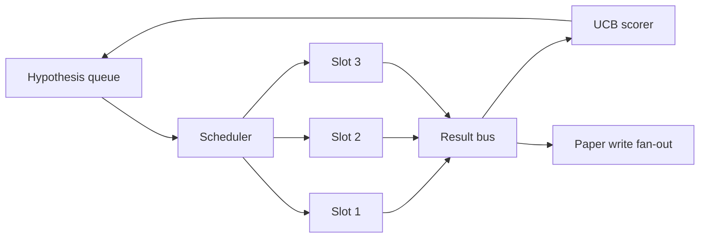
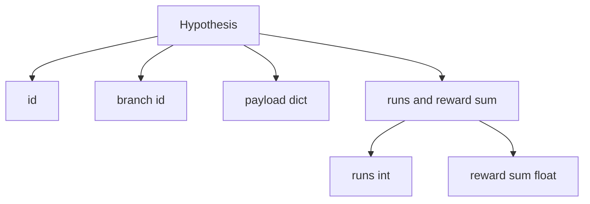
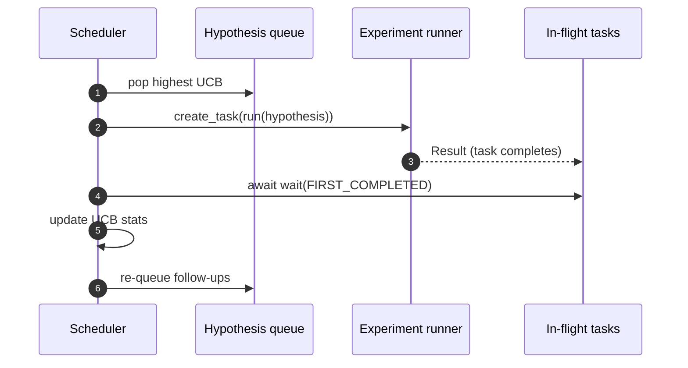

# Programación de iteraciones

> Un bucle de investigación sin cronómetro es una cola con delirios. El cronómetro es donde el bucle decide qué dejar de explorar, y esa decisión es todo el juego.

**Type:** Build
**Languages:** Python
**Prerequisites:** Phase 19 lessons 50-53
**Time:** ~90 minutes

## Objetivos de aprendizaje

- Modela un flujo de trabajo de investigación como una fila de hipótesis alimentando espacios paralelas de experimentación cuyos resultados vuelven a ventilar.
- Realice múltiples experimentos simultáneamente con asyncio para que el programador pueda mantener ocupadas todas las ranuras.
- Ponga un puntaje en cada rama de la hipótesis con UCB para que el programador pueda podar ramas de bajo rendimiento sin abandonar la exploración.
- Difundir los resultados terminados a una etapa de escritura en papel y una etapa de re-cuota para que una rama de alto rendimiento genera hipótesis de seguimiento.
- Superficie un rastro de per-iteration con puntajes de ramas, ocupación de ranuras y decisiones de poda.

```figure
ch-ucb-scheduler
```

## ¿Por qué un cronógrafo, no una lista de trabajo?

Una lista de trabajo plana ejecuta trabajos en orden de presentación. Eso está bien cuando cada trabajo es independiente. La investigación no es independiente: un hallazgo del experimento tres cambia la prioridad de los experimentos cuatro y cinco. Un programador que lee el resultado de la ventaja y reordena la cola obtiene un trabajo más útil realizado por unidad de cálculo.

La opción de diseño interesante es la regla de puntuación. Un puntero codicioso siempre elige al líder actual y nunca explora. Un puntero uniforme nunca explora. UCB (limite de confianza superior) es el camino medio: explotar al líder reservando capacidad para ramas que han sido probadas menos.

## La forma del sistema



La cola contiene hipótesis. El programador elige la hipótesis UCB más alta cuando una ranura se libera. Cada ranura ejecuta un experimento sincrónicamente. Los experimentos terminados fan su resultado en el autobús. El autobús actualiza las estadísticas UCB sobre la rama originaria y los fans a la etapa de escritura en papel cuando el rendimiento de una rama cruza un umbral.

## La forma de la hipótesis



`branch`La hipótesis de la UCB es la clave para las estadísticas de la UCB.`runs`es el recuento de experimentos completados para esa rama,`reward_sum`La UCB lee ambas cosas.

## Punto de puntuación de la UCB

La fórmula UCB utilizada en esta lección es la clásica UCB1.

```text
ucb(branch) = mean_reward(branch) + c * sqrt( ln(total_runs) / runs(branch) )
```

`total_runs`es el recuento de todos los experimentos realizados en todas las ramas. `c`es el peso de exploración; la lección se descompone a `sqrt(2)`Una rama con cero carreras obtiene`+inf`Una rama con una recompensa media alta mantiene una puntuación alta hasta que otras ramas se pongan al día; una rama que se ejecuta muchas veces sin mucha recompensa es eclipsada por alternativas menos ejecutadas.

La puerta de poda está separada del seleccionador. La poda elimina una rama de la programación futura cuando su recompensa media cae por debajo de un piso absoluto (por defecto `0.2`) después de al menos `prune_after_runs`ensayos (por defecto `3`Esto mantiene la cola limitada.

## Las ranuras paralelas con asíncio

El programador realiza experimentos con `asyncio.create_task`Cada tarea se ejecuta por el ejecutor del experimento (un`async def`(callable) que devuelve un `Result`. El bucle principal espera en el conjunto de tareas en vuelo con `asyncio.wait(..., return_when=asyncio.FIRST_COMPLETED)`y dispara la actualización de puntuación en cada finalización.



El programador continúa iniciando nuevas tareas tan pronto como una ranura se libera, hasta que la fila está vacía y no hay tareas en vuelo.

## Despliegue: desencadenantes de papel

Cuando la recompensa media de una rama cruza`paper_threshold`(por defecto `0.7`) y esa rama aún no ha producido un documento, el programador apoya una `paper.trigger`En la lección 54 el escritor del papel recogería esto. en esta lección el gatillo se captura como una lista para que las pruebas puedan afirmarlo.

## Extensidad: hipótesis de seguimiento

Cuando un resultado de alto rendimiento aterriza, el programador puede llamar al usuario `expander`El expander es una función pura de la función de la función de la función de la función de la función de la función de la función de la función de la función de la función de la función de la función de la función de la función de la función de la función de la función de la función de la función de la función de la función de la función de la función de la función de la función de la función de la función de la función de la función de la función de la función de la función de la función de la función de la función de la función de la función de la función de la función de la función de la función de la función de la función de la función de la función de la función de la función de la función de la función de la función de la función de la función de la función de la función de la función de la función de la función de la función de la función de la función de la función de la función de la función de la función de la función de la función de la función de la función de la función de la función de la función de la función de la función de la función de la función de la función de la función de la función de la cuadro.`Result`¿ Qué ?`list[Hypothesis]`La lección envía un ampliador determinista que produce dos seguimientos para cualquier resultado cuya recompensa exceda el umbral de papel.

## Presupuestos

Dos presupuestos protegen al programador de los bucles fugitivos.

```text
max_experiments    : total count of experiments run across all branches
max_seconds        : wall-clock cap (asyncio time)
```

Cuando uno de los disparos, el programador deja de programar nuevas tareas, espera las en vuelo y devuelve el rastro final.`stop_reason`¿ Qué ?

## El informe de seguimiento y final

Cada decisión de programación (pick, dispatch, result, prune, fan-out) emite un evento. El informe final resume las estadísticas por rama, las carreras totales, el reloj de pared total y los desencadenantes del papel disparados.

## Cómo leer el código

`code/main.py`define `Hypothesis`¿ Qué ?`Result`¿ Qué ?`BranchStats`¿ Qué ?`IterationScheduler`, y un `make_deterministic_runner`La fábrica que devuelve un corredor de experimento sin sincronizado con recompensas predecibles.`delay_ms`(por defecto `5ms`) de modo que la concurrencia es observable.

`code/tests/test_scheduler.py`cubertas: UCB selecciona primero ramas no probadas, ocupación de ranuras paralelas, desencadenan en papel cuando se cruza el umbral, poda de ramas después de ensayos de bajo rendimiento, hipótesis de seguimiento de ventilación y salida presupuestaria (tanto el recuento de experimentación como el reloj de pared).

## Ir más allá

Tres extensiones serán necesarias para una implementación real. Primero, estadísticas persistentes de UCB a través de las sesiones: las estadísticas actuales viven en la memoria; un cronista real las pondría en control para que un reinicio preserve el presupuesto de exploración ya gastado. En segundo lugar, la puntuación multi-objetivo: en lugar de una recompensa escalar, cada resultado emite un vector y UCB se convierte en un seleccionador de estilo Pareto. Tercero, bandidos contextuales: las condiciones de selección de las características de la hipótesis (largura, complejidad) por lo que hipótesis similares comparten la exploración.

El programador es el lugar donde la investigación se convierte en algo más que una lista de trabajo.
