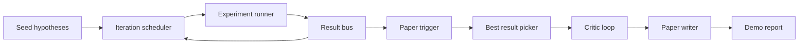
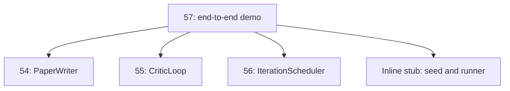
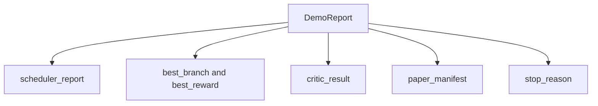

# Demo de investigación de extremo a extremo

> Una demostración es el lugar donde cada contrato que escribiste antes tiene que componerse. Si uno de ellos se filtra, la demostración es la lección que lo capta.

**Type:** Build
**Languages:** Python
**Prerequisites:** Phase 19 lessons 50-53
**Time:** ~90 minutes

## Objetivos de aprendizaje

- Envía el ciclo de investigación automática de extremo a extremo: semilla de hipótesis, ejecutor de experimentos, programador, ciclo crítico, escritor de papel.
- Compone las primitivas de las cuatro lecciones anteriores de Track D a través de importaciones simples de Python, no de un marco.
- Ejecutar el bucle a un final auto-terminante y emitir un informe de demostración que enumera la salida de cada etapa.
- Mantenga la demostración determinista para que la suite de prueba pueda afirmar la forma final.
- Superficie un modo de falla claro cuando el contrato de cualquier etapa se rompe, por lo que la siguiente etapa no se ejecuta con una entrada rota.

```figure
ch-research-pipeline
```

## ¿Qué compone aquí



La semilla es una lista de tres hipótesis. El programador realiza seis experimentos en tres espacios paralelos. El bus informa de uno o más desencadenantes de papel. El seleccionador selecciona el mejor resultado. El bucle crítico itera en un borrador construido a partir de ese resultado. El escritor de papel emite el final LaTeX, BibTeX y manifiesto.

## ¿Por qué importar y no copiar?

Cada lección anterior lleva a un `main.py`La demostración de los datos de las clases y funciones públicas.`sys.path`El programa de ensayos de las clases de enseñanza de la escuela de enseñanza de la escuela de enseñanza de la escuela de enseñanza de la escuela de enseñanza de la escuela de enseñanza de la escuela de enseñanza de la escuela de enseñanza de la escuela de enseñanza de la escuela de enseñanza de la escuela de enseñanza de la escuela de enseñanza de la escuela de enseñanza de la escuela de enseñanza de la escuela de enseñanza de la escuela de enseñanza de la escuela de enseñanza de la escuela de la escuela de enseñanza de la escuela de la escuela de enseñanza de la escuela de la escuela de enseñanza de la escuela de la escuela de enseñanza de la escuela de la escuela de enseñanza de la escuela de la escuela de enseñanza de la escuela de la escuela de enseñanza de la escuela de la escuela de enseñanza de la escuela de la escuela de enseñanza de la escuela de la escuela de enseñanza de la escuela de la escuela de enseñanza de la escuela de la escuela de enseñanza de la escuela de la escuela de enseñanza de la escuela de la escuela de la escuela de enseñanza de la escuela de la escuela de la escuela de enseñanza de la escuela de la escuela de enseñanza de la escuela de la escuela de la escuela de la escuela de enseñanza de la escuela de la escuela de la escuela de la escuela de la escuela de la escuela de enseñanza de la escuela de la escuela de la escuela de la escuela de la escuela de la escuela de la escuela de la escuela de la escuela de la escuela de la escuela de la escuela de la escuela de la escuela de la escuela de la escuela de la escuela de la escuela de la escuela de la escuela de la escuela de la escuela de la escuela de la escuela de la escuela de la escuela de la escuela de la escuela de la escuela de la escuela de la escuela de la escuela de la escuela de la escuela de la escuela de la escuela de la escuela de la escuela de la escuela de la escuela de la escuela de la escuela de la escuela de la escuela de la escuela de la escuela de la escuela de la escuela de la escuela de la escuela de la escuela de la escuela de la escuela de la escuela de la escuela de la escuela de la escuela de la escuela de la escuela de la escuela de la escuela de la escuela de la escuela de la escuela de la escuela de la escuela de la escuela de la escuela de la escuela de la escuela de la escuela de la escuela de



El estúbo en línea representa las lecciones de cincuenta a cincuenta y tres: un pequeño generador de hipótesis de semillas y una función de recompensa sincrónica. El usuario puede intercambiar el estúbo en línea por las primitivas reales de esas lecciones ajustando dos importaciones.

## Garantias de determinismo

La demostración es determinista por construcción. El ejecutor del experimento es semillado numpy. El revisor del bucle crítico camina dimensiones fijas en orden fijo. El generador de prosa del escritor de papel es el burlado de la lección cincuenta y cuatro.

Dado la misma semilla, la demostración emite el mismo informe. La prueba afirma esta propiedad ejecutando la demostración dos veces y comparando el manifiesto.

## Forma del informe de demostración



Cada campo viene literalmente de la etapa de aguas arriba. La demostración no transforma ninguna salida; las compone. Esa es la prueba de la demostración.

## Manejo en modo de falla

Cada etapa o tiene éxito o produce un error de tipografía.

```text
Scheduler ........ returns SchedulerReport with stop_reason
                   in {queue_empty, max_experiments, deadline}
Best-result pick . raises NoTriggerError if no paper trigger fired
Critic loop ...... returns LoopResult with status converged or stopped
Paper writer ..... raises PaperValidationError on contract break
```

Un fallo en cualquier etapa corta el circuito de demostración con una excepción tipada.`test_no_triggers_raises_typed_error`y `test_best_picker_raises_when_no_triggers`Afirmar que el seleccionador aumenta `NoTriggerError`- ¿ Qué ?`BestResultError`Cuando ninguna rama disparó un gatillo, y el escritor nunca se invoca.

## El mejor seleccionador de resultados

El programador emite desencadenantes de papel por rama. El seleccionador selecciona la rama con la recompensa media más alta en todos los desencadenantes. Los lazos se rompen alfabéticamente por id de rama por lo que la demostración es determinista. El seleccionador es una pequeña función pura; los pines de prueba en un informe de programador fijo.

## Cablación del bucle crítico

El ciclo crítico en la lección 55 opera en un`MiniPaper`La demostración construye un`MiniPaper`de la rama seleccionada llenando el resumen con el id de la rama, sembrando dos secciones (Introducción y Resultados), y estableciendo `originality_tag`de la recompensa media de la rama (alta si `>= 0.8`, medio si `>= 0.6`, bajo de lo contrario).

El revisor luego repite el borrador a convergencia.

## El cableado del redactor de periódico

El escritor de periódico en la lección 54 opera en el pleno`Paper`La demostración actualiza el convergente `MiniPaper`por medio de`mini_to_full_paper`, que adjunta una figura para la rama seleccionada y una pequeña bibliografía sintética construida a partir de la unión de las claves de cita que el crítico sugirió.

## Cómo leer el código

`code/main.py`define `BestResultError`¿ Qué ?`NoTriggerError`¿ Qué ?`DemoReport`¿ Qué ?`pick_best_branch`¿ Qué ?`build_mini_paper`¿ Qué ?`mini_to_full_paper`, y `run_demo`. Las importaciones en el nivel superior se ajustan `sys.path`Una vez y tira .`PaperWriter`¿ Qué ?`CriticLoop`, y `IterationScheduler`de sus lecciones.

`code/tests/test_e2e.py`cubre: las pruebas se ejecutan de extremo a extremo y emiten un informe con los cinco campos llenos, determinismo en dos ejecuciones, NoTriggerError cuando ninguna rama cruza el umbral, PaperValidationError cuando rompe el contrato del escritor, el manifiesto de papel contiene la figura de la rama elegida y la razón de parada del cronista es uno de los valores esperados.

## Ir más allá

Tres extensiones que vale la pena cablear una vez que la demostración sea verde. Primero, estado persistente: el resultado de cada etapa se escribe a un pequeño almacén JSON para que una reiniciación pueda reanudarse sin volver a ejecutar las etapas baratas. En segundo lugar, un panel: los eventos de rastreo de la programación y el ciclo crítico se hacen como una sola línea de tiempo. Tercero, llamadas de modelo reales: intercambiar el generador de prosa burlado y el crítico determinista por los impulsados por modelos; el cableado no cambia.

El trabajo de la demostración es demostrar que la composición es la arquitectura cinco lecciones, cuatro importaciones, un informe la próxima vez que añades una etapa, el cableado crece exactamente por una línea.
