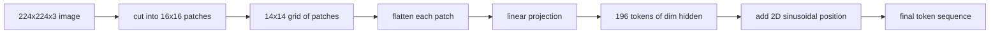

# Parches de codificación de visión

> Un modelo de visión que lee píxeles necesita un tokenizer para píxeles. El embebedimiento de parche es ese tokenizer. Cortar la imagen en una cuadrícula de cuadrados, aplanar cada cuadrado, proyectarla a través de una capa lineal, luego agregar una señal de posición 2D para que el transformador sepa dónde se sentó cada cuadrado en la imagen original.

**Type:** Build
**Languages:** Python
**Prerequisites:** Phase 19 lessons 30-37 (Track B foundations)
**Time:** ~90 minutes

## Objetivos de aprendizaje

- Tokenizar una imagen en una secuencia de longitud fija de embebedidos de parches.
- Implementar una `Conv2d`-Proyección de parches basada en la matemática de desplegarse-entonces-lineal.
- Construir una posición sinusoidal 2D determinista que incurra así que el orden simbólico codifica la posición espacial.
- Verifique el número de parches, la forma de inserción y `Conv2d`/despliegue la equivalencia en un dispositivo sintético.

## El problema

Un transformador se come una secuencia de vectores. Una imagen es una red de tres canales. Leer cada píxel como un token explota la longitud de la secuencia: una imagen RGB de 224x224 es de 150.528 tokens, que un transformador de 12 capas no puede permitirse en la atención. Leer la imagen como un vector plano gigante arroja fuera la localidad, de la que la capa de atención no puede recuperarse. El trabajo del encoder frontal es comprimir la cuadrícula de píxeles en unos cientos de tokens que resumen cada una una de las regiones cuadradas.

La inserción de parches resuelve esto con una proyección lineal. Una imagen de 224x224 cortada en parches de 16x16 produce una cuadrícula de 14x14 de 196 parches.`(3, 16, 16) = 768`Los valores de píxeles en un vector, luego una capa lineal lo mapea a la dimensión oculta del modelo.`hidden`(comúnmente 768) más un token CLS. Esa es una secuencia que el resto de la red puede masticar.

## El concepto



### ¿Por qué parches, no píxeles?

La atención es cuadrática en longitud de secuencia.`196 * 196 = 38,416`puntuaciones de atención por cabeza por capa; un 150.528 de los costos de la secuencia de tokens `150,528 * 150,528 = 22.6 billion`Los parches compran una reducción de 590.000 veces en la computación de la atención, y una sola región 16x16 lleva suficiente señal para tareas de visión de alto nivel. El costo es una pérdida de detalle espacial de granos finos dentro de un parche, por lo que las pilas multimodal aguas abajo a menudo ejecutan una segunda rama de alta resolución cuando la localización fina es importante.

### Por qué una proyección lineal es suficiente

Cada parche se trata como un vector independiente. La proyección aprende una base: detectores de bordes, filtros de color, texturas simples.`768 * 768 = 589,824`Los sistemas de codificación de peso abierto modernos tienen esta forma exacta.

### El `Conv2d`Trío

¿ Qué es esto ?`Conv2d(in_channels=3, out_channels=hidden, kernel_size=patch_size, stride=patch_size)`Sin relleno da el mismo resultado numérico que unfold-then-linear, porque cada posición de salida produce los píxeles de parche contra un filtro. La convolución es la proyección de parche, y la mayoría de las bases de código de producción lo envían de esa manera porque es más rápido en la GPU y utiliza una remodelación menos.

### Embedings de posición

Los tokens no tienen orden en la proyección. La incorporación sinusoidal 2D da a cada token una señal fija que codifica su`(row, col)`La mitad de la dimensión de incorporación codifica la posición de la fila con sin/cos en múltiples frecuencias; la otra mitad codifica la posición de la columna. La codificación es determinista para que pueda intercambiar resoluciones sin reentrenamiento, e interpola limpiamente a las redes que el modelo nunca vio en el momento de entrenamiento.

| Component | Shape | Parameters |
|-----------|-------|------------|
| Patch projection (`Conv2d`) | `(hidden, 3, patch, patch)` | `3 * P * P * hidden + hidden` |
| Position embedding (fixed) | `(num_patches, hidden)` | 0 (computed, not learned) |
| CLS token (learned) | `(1, hidden)` | `hidden` |

Para ViT-Base/16 a 224 resoluciones: 590.592 parámetros en la proyección, 768 en el token CLS, y cero para la posición sinusoidal.

### La equivalencia como control de salud mental

El paso de parche tiene dos ortografías: a `Conv2d`Si no lo hacen, la matemática de despliegue es incorrecta, y el resto del codificador está construido en arena.

```figure
ch-patch-tokenizer
```

## Construye el mismo

`code/main.py`los instrumentos:

- `PatchEmbed`, un `nn.Module`envueltas `Conv2d`para proyección de parches.
- `sinusoidal_2d(grid_h, grid_w, dim)`, una función sin estado que construye la tabla de posición 2D.
- `VisionFrontEnd`, que compone el embebimiento de parches, el prependio CLS y la adición de posición en un pase hacia adelante.
- ¿ Qué es esto ?`synthesize_image(seed)`ayudante que construye una fijación determinista de 224x224x3 de `numpy.random`¿ Qué ?
- Una demostración que ejecuta una imagen fija a través del extremo frontal e imprime la forma de salida, la norma de token CLS y una fila de la inserción de posición.

- ¿Qué quieres decir ?

```bash
python3 code/main.py
```

Resultado: el dispositivo 224x224 se tokeniza a una secuencia de forma `(1, 197, 768)`. La primera ficha es la CLS; las siguientes 196 son fichas de parche.

## Usalo

El mismo parche de frente aparece en todos los modelos modernos de lenguaje de visión: CLIP ViT-L/14, SigLIP, DINOv2, la familia Qwen-VL y la pila InternVL todos comienzan a partir de un`Conv2d`Las diferencias entre las familias viven en el río abajo (CLS vs no-CLS pooling, tokens de registro, diferentes tamaños de parches 14 vs 16, resolución dinámica a través de posiciones interpoladas).

## Pruebas

`code/test_main.py`las cubiertas:

- Parches de parches`(image_size / patch_size) ** 2`
- las formas de salida coinciden `(batch, num_patches + 1, hidden)`
- el `Conv2d`proyección es igual a manual desplegarse-también-linear en una pequeña fijación
- la tabla de posición sinusoidal es determinista en todas las llamadas
- Las emisiones de tokens CLS a través de lotes se oscurecen sin filtraciones

- ¿Qué quieres decir ?

```bash
python3 -m unittest code/test_main.py
```

## Los ejercicios

1. Reemplazar la posición sinusoidal con una aprendida `nn.Parameter`Las posiciones aprendidas ganan con resolución fija; las sinusoides ganan cuando cambias la resolución después del entrenamiento.

2. Cambiar el `Conv2d`para una explícita`nn.Unfold`Además`nn.Linear`y afirmar que las salidas coinciden con dentro de la tolerancia de flotación.

3. Añadir soporte para tamaños de parches no cuadrados (por ejemplo, 32x16 para entradas de aspecto amplio) y verificar que la tabla de posición maneja redes no cuadradas.

4. Profilar el paso del parche en los tamaños de lote 1, 8, 64. La proyección del parche rara vez es el cuello de botella; las capas de atención aguas abajo dominan.

5. Entrenar el extremo delantero como un extractor de características congeladas en un conjunto de datos de forma sintética de 4 clases (círculos, cuadrados, triángulos, estrellas).

## Términos clave

| Term | What it means |
|------|---------------|
| Patch | A square sub-region of the image, typically 14x14 or 16x16 |
| Patch embedding | Linear projection of one flattened patch to the hidden dim |
| Sequence length | Number of tokens after patch tokenization, usually plus CLS |
| Sinusoidal position | Fixed sin/cos signal that encodes 2D grid coordinates |
| CLS token | Learned vector prepended to the sequence as the pooling head |

## Leer más

- Una imagen vale 16x16 palabras (ViT, 2021) para el marco original de inserción de parches.
- Atención es todo lo que necesitas (2017) para la fórmula de posición sinusoidal adaptada aquí a 2D.
- Papel DINOv2 para tokens de registro, una extensión que puede añadir como ejercicio 6.
