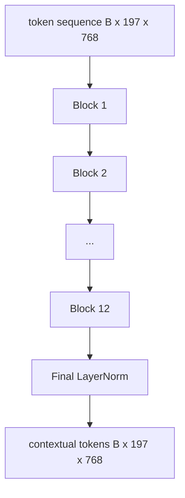
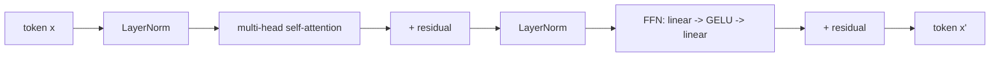

# Encodrador de transformador de visión

> Los parches por sí solos no ven. Un transformador pre-LN de 12 capas con 12 cabezas de atención convierte la secuencia de tokens de parches en una secuencia de tokens contextuales, con el token CLS unificando las características de la imagen entera en su estado oculto final.

**Type:** Build
**Languages:** Python
**Prerequisites:** Phase 19 lessons 30-37 (Track B foundations)
**Time:** ~90 minutes

## Objetivos de aprendizaje

- Implementar un bloque de transformador pre-LN con autoatención de múltiples cabezas y una subcapa de transmisión.
- Coloque 12 bloques con 12 cabezas para formar un codificador de base ViT.
- Enlaza el lado delantero del parche de la lección 58 en el codificador y ejecuta un pase hacia adelante.
- Verifique si el token CLS agrega información de cada parche.

## El problema

La incorporación del parche produce una secuencia de 197 tokens, cada uno un vector sin conocimiento de ningún otro parche. Una foto de un gato necesita cada parche para saber qué parches contienen bigotes, qué contienen fondo y cuáles contienen el ojo. El transformador es el mecanismo que construye esa conciencia, una capa de atención a la vez. Sin él, el parche frontal es un tokenizador inteligente sin comprensión.

La receta estándar es de doce bloques de profundidad, doce cabezas de ancho, con colocación pre-LayerNorm, activación GELU, y una expansión de 4x de alimentación. Esa receta es la columna vertebral de CLIP ViT-L, SigLIP, DINOv2, la familia Qwen-VL, InternVL, y todos los demás codificadores de visión de peso abierto de 2025-2026. La receta es lo suficientemente estable como para que puedas leer cualquiera de esos papeles y asumir esta forma de bloque a menos que digan explícitamente lo contrario.

## El concepto





### Pre-LN vs. después de LN

El Transformer original colocó LayerNorm después del residual. Pre-LN (LayerNorm antes de cada sub-layer) es la versión que todos los modelos modernos de lenguaje de visión usan, porque se entrena de forma estable sin trucos de calentamiento de la tasa de aprendizaje. La diferencia es una línea en el pase hacia adelante, y el flujo de gradiente a la profundidad 12+ es día y noche.

### Autoatención de varias cabezas

Cada cabeza proyecta el vector simbólico a su propio `(query, key, value)`triple con dimensión `head_dim = hidden / num_heads`- Con`hidden = 768`y `heads = 12`, cada cabeza tiene`dim = 64`. Las 12 cabezas asisten en paralelo, luego sus salidas se vuelven a la dimensión 768 y pasan a través de una proyección de salida.

### ¿Por qué la expansión 4x de la alimentación hacia adelante

La FFN se va`hidden -> 4 * hidden -> hidden`El factor 4 es empírico y se ha mantenido en los transformadores de lenguaje y visión desde 2017. Los menores (2x) se encuentran en la baja posición; los mayores (8x) se superan en el presupuesto de datos fijos.

| Component | Parameters at ViT-Base scale |
|-----------|------------------------------|
| qkv projection per block | `3 * 768 * 768 = 1.77M` |
| output projection per block | `768 * 768 = 590K` |
| FFN per block (4x expansion) | `2 * 768 * 4 * 768 = 4.72M` |
| LayerNorm per block | `4 * 768 = 3K` |
| Total per block | about 7.1M |
| 12 blocks | about 85M |
| Plus front end | about 86M total |

ViT-Base es un codificador de 86M. Es pequeño para los estándares 2026 (SigLIP-So400M es 400M, el Qwen-VL ViT es 675M), pero la arquitectura es idéntica hasta el ancho y la profundidad.

### ¿La máscara causal o no?

Los transformadores de visión son sólo codificadores y bidireccionales: token `i`puede asistir a la muestra .`j`La atención cruzada en el lado del decodificador en la lección 61 usará una máscara causal, pero dentro del codificador de visión, la atención está completamente conectada.

### Lo que aprende el token CLS

El token CLS comienza como un parámetro aprendido, no tiene contenido de parche propio, y acumula información a través de la atención en cada bloque.

```figure
ch-cls-funnel
```

## Construye el mismo

`code/main.py`los instrumentos:

- `MultiHeadSelfAttention`, con `qkv`y las proyecciones de salida, la matemática de la atención de los productos en escala de puntos y las afirmaciones de forma.
- `FeedForward`, el 4x expansión GELU MLP.
- `Block`, un bloque pre-LN que compone las subcapas de atención y de transmisión con residuos.
- `ViT`, una pila de 12 cuadras con una LayerNorm final.
- `VisionEncoder`, que los cables `VisionFrontEnd`de la lección 58 a la `ViT`se apila y expone un `forward()`Retorno de la secuencia contextual y el vector CLS combinado.
- Una demostración que ejecuta una imagen de fijación 224x224 sintetizada a través del codificador completo e imprime la forma de entrada, la forma de salida, el conteo de parámetros y la norma CLS en cada otra capa.

- ¿Qué quieres decir ?

```bash
python3 code/main.py
```

Fuente: el dispositivo está codificado en un `(1, 197, 768)`La norma CLS se desplaza hacia arriba a medida que se componen las capas, luego se estabiliza en la norma final de la capa.

## Usalo

El codificador definido aquí es, hasta el ancho y la profundidad, la misma pila de bloques que se envía dentro de cada VLM de peso abierto en 2025-2026.

- **Width and depth.**ViT-Large es`hidden=1024, depth=24, heads=16`; SigLIP So400M es `hidden=1152, depth=27, heads=16`- En el mismo bloque.
- **Pooling head.**El conjunto de CLS (esta lección) vs. el conjunto promedio (SigLIP) vs. el conjunto de atención (más tarde VLM).
- **Position handling.**El cálculo de los bloques es inalterado.
- **Register tokens.**DINOv2 prepende 4 tokens extra aprendidos.

Esta pila de bloques es el sustrato. Las siguientes lecciones (60-63) se encuentran encima de ella.

## Pruebas

`code/test_main.py`las cubiertas:

- un solo bloque conserva su forma y es invariante en relación con el tamaño del lote de entrada
- Punto de atención de la suma de uno a lo largo del eje clave (softmax sanity)
- las vías residuales están cableadas (la entrada cero todavía produce una salida no cero a través del token CLS)
- un pase de 4 capas apilado hacia adelante produce la forma correcta
- flujo de gradientes hacia la proyección del parche desde la salida del CLS

- ¿Qué quieres decir ?

```bash
python3 -m unittest code/test_main.py
```

## Los ejercicios

1. Añadir fichas de registro (4 vectores aprendidos prependidos después de CLS) y volver a ejecutar. Comparar la suavidad del mapa de atención a través de la entropía de la distribución de softmax en la última capa.

2. Cambiar el pre-LN por el post-LN y tren durante una época en un clasificador de forma sintética. Observe cuál de ellos se pone en marcha de forma estable sin LR calentamiento.

3. Implementar el enmascaramiento causal como un `attn_mask`El bloque de decodificación es el bloque de decodificación.`(seq, seq)`, triangular inferior.

4. Profilar un pase hacia adelante en los tamaños de lote 1, 8, 64 con `torch.profiler`La capa de MLP domina el tiempo de la pared, no la atención.

5. Reemplaza las proyecciones de una cabeza de atención con un adaptador LoRA de bajo rango, congela el resto y verifica que el gradiente fluye solo donde esperas.

## Términos clave

| Term | What it means |
|------|---------------|
| Pre-LN | LayerNorm applied before each sub-layer instead of after |
| Self-attention | Each token attends to every other token in the same sequence |
| Multi-head | The hidden dim is split across `H` independent attention heads |
| FFN expansion | The feed-forward layer widens to `4 * hidden` before contracting |
| CLS pooling | Use the first token's final hidden state as the image summary |

## Leer más

- Una imagen vale 16x16 palabras (ViT, 2021) para la receta del codificador.
- DINOv2 (2023) para tokens de registro y el objetivo de pre-entrenamiento auto-supervisado.
- SigLIP (2023) para la variante de pooling promedio y la pérdida contrastada sigmoide utilizada en la lección 62.
