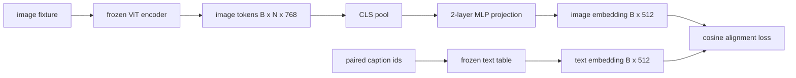

# Capa de proyección para la alineación de modalidad

> Un codificador de visión produce tokens de imagen. Un decodificador de texto consume tokens de texto. Los dos viven en espacios vectoriales diferentes. Una pequeña MLP de dos capas proyecta tokens de imagen en el espacio de incorporación de texto, y una pérdida de alineación cosina contra una leyenda emparejada atrae a los dos espacios a un acuerdo. Esa proyección es la pieza más pequeña de un modelo de lenguaje de visión y la que más importa para la transferencia.

**Type:** Build
**Languages:** Python
**Prerequisites:** Phase 19 lessons 30-37 (Track B foundations)
**Time:** ~90 minutes

## Objetivos de aprendizaje

- Construir una proyección de MLP de dos capas que mapee las características de la imagen en el espacio de incorporación de texto.
- Construir una tabla de texto simulado (sin tokenizer pre-entrenado, sin corpus real).
- Calcule una pérdida de alineación cosina entre los tokens de imagen proyectados y una incorporación de captura emparejada.
- Entrenar la proyección sola con un codificador de visión congelado y una tabla de texto congelada.

## El problema

Tienes un codificador de visión (lecciones 58-59) que produce tokens de dimensión .`vision_hidden = 768`Tienes un decodificador de texto que quieres conectar con la dimensión de incorporación`text_hidden = 512`Los tokens de imagen no tienen forma de texto: viven en una base que el codificador aprendió durante el entrenamiento previo solo en visión, sin relación con los vectores de palabras del decodificador.

La proyección de dos capas de MLP (lineal, GELU, lineal) cubre la brecha.`768 * 1024 + 1024 * 512 = 1.3M`El programa de programación de la pantalla de la pantalla de la pantalla de la pantalla de la pantalla de la pantalla de la pantalla de la pantalla de la pantalla de la pantalla de la pantalla de la pantalla de la pantalla de la pantalla de la pantalla de la pantalla de la pantalla de la pantalla de la pantalla de la pantalla de la pantalla de la pantalla de la pantalla de la pantalla de la pantalla de la pantalla de la pantalla de la pantalla de la pantalla de la pantalla de la pantalla de la pantalla de la pantalla de la pantalla de la pantalla de la pantalla de la pantalla de la pantalla de la pantalla de la pantalla de la pantalla de la pantalla de la pantalla de la pantalla de la pantalla de la pantalla de la pantalla de la pantalla de la pantalla de la pantalla de la pantalla de la pantalla de la pantalla de la pantalla de la pantalla de la pantalla de la pantalla de la pantalla de la pantalla de la pantalla de la pantalla de la pantalla de la pantalla de la pantalla de la pantalla de la pantalla de la pantalla de la pantalla de la pantalla de la pantalla de la pantalla de la pantalla de la pantalla de la pantalla de la pantalla de la pantalla de la pantalla de la pantalla de la pantalla de la pantalla de la pantalla de la pantalla de la pantalla de la pantalla de la pantalla de la pantalla de la pantalla de la pantalla de la pantalla de la pantalla de la pantalla de la pantalla de la pantalla de la pantalla de la pantalla de la pantalla de la pantalla de la pantalla de la pantalla de la pantalla de la pantalla de la pantalla de la pantalla de la pantalla de la pantalla de la pantalla de la pantalla de la pantalla de la pantalla de la pantalla de la pantalla de la pantalla de la pantalla de la pantalla de la pantalla de la pantalla de la pantalla de la pantalla de la pantalla de la pantalla de la pantalla de la pantalla de la pantalla de la pantalla de la pantalla de la pantalla de la pantalla de la pantalla de la pantalla de la pantalla de la pantalla de la pantalla de la pantalla de la pantalla de la pantalla de la pantalla de la pantalla de la pantalla de la pantalla de la pantalla de la pantalla de la pantalla de la pantalla de la pantalla de la pantalla de la pantalla de la pantalla de la pantalla de la pantalla de la pantalla de la pantalla de la pantalla de la pantalla de la pantalla de la pantalla de la pantalla de la pantalla de la pantalla de la pantalla de la pantalla de la pantalla de la pantalla de la pantalla de la pantalla de la pantalla de la pantalla de la pantalla de la pantalla de

## El concepto



### Reunificación antes de la proyección

El codificador de visión emite 197 tokens. El lado de texto tiene una sola incorporación de nivel de título. Para alinearlos se necesita un vector de nivel de imagen por muestra. La combinación CLS es la más simple: toma el primer token del codificador y proyecta. La combinación media de todos los 197 tokens es otra opción y es lo que SigLIP utiliza.

### ¿Por qué dos capas y no una?

Una sola proyección lineal puede girar y reescalar, pero no puede fijar la base si los dos espacios tienen desajustes de curvatura. GELU entre dos capas lineales da a la proyección una curva no lineal, lo que es empíricamente suficiente para alinear características de estilo CLIP con los embeddings del modelo de lenguaje. Las proyecciones más profundas (LLaVA-NeXT usó GLU; Qwen-VL usó una pila de capas de atención) son extensiones; MLP de dos capas es la línea de base canónica y es lo que las naves principales de proyección Q-Former de BLIP-2 tienen debajo del capó.

| Layer | Shape | Parameters |
|-------|-------|------------|
| fc1 | `(vision_hidden, projection_hidden)` | `768 * 1024 + 1024` |
| activation | GELU | 0 |
| fc2 | `(projection_hidden, text_hidden)` | `1024 * 512 + 512` |

Aproximadamente 1,3 M de parámetros para un `768 -> 1024 -> 512`- ¿Qué?

### Perdida de alineación de cosinos

Alinear no significa`image_emb == text_emb`Alinear significa`image_emb`puntos en la misma dirección que `text_emb`La pérdida cosínica es`1 - cos_sim(image, text)`La lección 62 generaliza a un lote de contraste (InfoNCE) donde cada imagen debe estar más cerca de su propia leyenda que de cualquier otra leyenda en el lote; esta lección utiliza la versión por par para que la dinámica sea visible.

### El codificador congelado es el truco

El codificador de visión tiene parámetros de 86M. La tabla de texto tiene otros pocos millones. Entrenarlos a todos desde un cuerpo falso es un no-iniciador. El congelamiento de ambos significa que los parámetros de 1.3M de la proyección son lo único que cambia, y unos pocos cientos de pasos en pares sintéticos son suficientes para reducir la pérdida. Esta es exactamente la forma operativa de cada VLM basado en un adaptador: las piezas pesadas se quedan congeladas, los trenes de puente ligero.

```figure
ch-projection-bridge
```

## Construye el mismo

`code/main.py`los instrumentos:

- `MLPProjector(in_dim, hidden_dim, out_dim)`, MLP lineal de dos capas con activación GELU.
- `MockTextEmbedding(vocab_size, dim)`, una tabla de incrustación congelada con un inicio determinístico de una semilla.
- `make_pair(seed, vocab_size)`, que sintetizan una muestra emparejada (imagen, leyenda) Capciones son secuencias de identificación cortas; la incorporación de leyenda se agrupa en media sobre las incorporaciones de tokens.
- `cosine_alignment_loss(image_emb, text_emb)`, el por par`1 - cos_sim`Objetivo.
- Un bucle de entrenamiento que ejecuta la proyección durante 200 pasos sobre 32 pares sintéticos (ciclados), con el codificador de visión y la tabla de texto congelados, e imprime la pérdida cada 25 pasos.

- ¿Qué quieres decir ?

```bash
python3 code/main.py
```

Resultado: los informes de entrenamiento caen de la pérdida inicial alrededor de 1.07 a alrededor de 0.80 dentro de 200 pasos, demostrando que la proyección sola puede tirar de las fichas de imagen hacia el espacio de texto.

## Usalo

El mismo patrón aparece en cada VLM de peso abierto:

- **LLaVA 1.5.**Proyección de MLP GELU de dos capas desde CLIP-ViT-L oculta a LLaMA incorporando oscurecimiento.
- **BLIP-2.**Q-Former toma 32 tokens de consulta aprendidos a través de la atención cruzada contra los tokens de imagen, luego proyecta a la LLM embebido dim.
- **MiniGPT-4.**Proyección lineal única desde la salida BLIP-2 Q-Former hasta la inclusión de Vicuna.
- **Qwen-VL.**Adaptador de atención cruzada con varias capas, pero la pieza final es otra vez una proyección a la embedaje de LM de la sombra.

La forma varía pero el papel es idéntico: fichas de imagen de grupo, proyección a texto incorporado, apagado, tren solo.

## Pruebas

`code/test_main.py`las cubiertas:

- la forma de salida del proyector coincide con la configurada `out_dim`
- la tabla de incorporación de texto congelado tiene cero `requires_grad`Parámetros
- La pérdida cosina es cero en vectores idénticos y es 2 en vectores antiparallelos
- flujos de gradiente del proyector después de un paso hacia atrás
- El ciclo de entrenamiento reduce las pérdidas entre el paso 0 y el paso 200

- ¿Qué quieres decir ?

```bash
python3 -m unittest code/test_main.py
```

## Los ejercicios

1. Reemplazar el pooling CLS con el pooling medio en los 196 tokens de parches y comparar la pérdida final después de 200 pasos.

2. Añadir una temperatura escalar aprendida a la pérdida de cosino (`cos / tau`) y observar lo que sucede cuando `tau`es demasiado pequeño (ruido gradiente) o demasiado grande (alto nivel de pérdida).

3. Cambiar la MLP de dos capas por una sola capa lineal y cuantificar la brecha de pérdida. La no linealidad importa más en las características de la imagen natural y menos en las sintéticas.

4. Añadir una pequeña penalidad L2 en los pesos del proyector y observar cómo interactúa con la alineación cosina (cosina es invariable en escala, por lo que la penalidad en su mayoría reduce las direcciones no utilizadas).

5. Persiste en pesas del proyector, luego recarga y ejecuta inferencias sin que el codificador de visión pase hacia atrás para verificar que solo se necesita el proyector en el momento de desplegamiento.

## Términos clave

| Term | What it means |
|------|---------------|
| Modality alignment | The act of making image and text embeddings comparable in one shared space |
| Projection head | The small module that maps one space to another, usually a 2-layer MLP |
| Cosine similarity | Dot product divided by the product of L2 norms |
| Frozen encoder | The vision (or text) model has all parameters with `requires_grad=False` |
| Mock corpus | Synthetic pairs used so training has no dataset download dependency |

## Leer más

- papel LLaVA para el tren de dos etapas (proyecto, luego deshielo LM).
- Papel BLIP-2 para Q-Former como alternativa de proyección que se pueda aprender.
- Informe técnico Qwen-VL para adaptadores de atención cruzada como cabezas de proyección más profundas.
