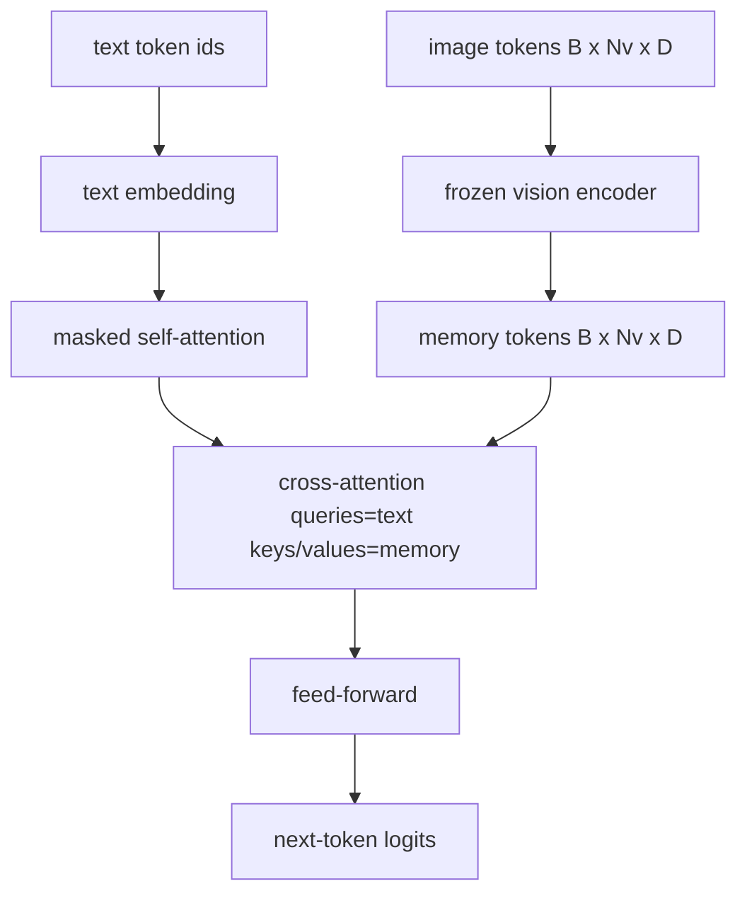
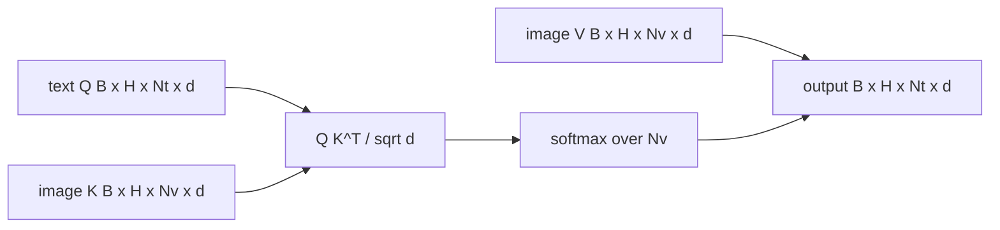

# Fusión de atención cruzada

> La capa de proyección alinea un vector de imagen con un vector de subtítulo. Un verdadero decodificador de lenguaje visual necesita cada token de texto para atender a cada token de parche, para que el modelo pueda marcar cada palabra en una región. La atención cruzada es cómo se produce la tierra. Las preguntas del texto; las claves de visión y los valores responden. Esta lección construye el bloque de atención cruzada, la autoatención del texto causal, y las formas de la máscara que mantienen ambos legales.

**Type:** Build
**Languages:** Python
**Prerequisites:** Phase 19 lessons 30-37 (Track B foundations)
**Time:** ~90 minutes

## Objetivos de aprendizaje

- Implementar la atención cruzada de múltiples cabezas donde el flujo de consulta es texto y el flujo de clave/valor es visión.
- Compone un bloque de decodificación: autoatención causal + atención cruzada + transmisión.
- Haga que la máscara tenga las formas correctas: máscara causal para la autoatención, sin máscara para la atención cruzada.
- Ejecutar un pase hacia adelante con tokens de texto en lotes y un conjunto fijo de tokens de imagen.

## El problema

Concatenando tokens de imagen y tokens de texto en una secuencia es una opción de fusión (fusión temprana, el camino que Chameleon y Emu3 toman). La atención cruzada es la otra (fusión tardía, el camino que Flamingo introdujo y que cada decodificador en forma de Flamingo ha copiado desde entonces).

La fusión tardía tiene dos ventajas. Primero, el flujo de texto se mantiene limpio y el modelo conserva las capacidades de texto solo. Segundo, el flujo de imagen se calcula una vez por imagen y se reutiliza para cada paso de decodificación, por lo que la generación es barata incluso para títulos largos. El costo es una sub capa de atención extra por bloque.

## El concepto





### Las formas de la máscara

Las dos atenciones dentro de un bloque de decodificación necesitan máscaras diferentes:

| Attention | Query length | Key length | Mask | Why |
|-----------|--------------|------------|------|-----|
| Self-attention | `Nt` (text) | `Nt` (text) | Causal: lower-triangular `(Nt, Nt)` | Text tokens may not look ahead during autoregression |
| Cross-attention | `Nt` (text) | `Nv` (vision) | No mask | The whole image is visible to every text position |

La lección incluye una función de validación de forma para que el error de mezclarlas aparezca como una`ValueError`en lugar de una curva de pérdidas silenciosamente rota.

### ¿Por qué no hay máscara en la atención cruzada?

La imagen se observa completamente antes de que se genere cualquier texto.`t`Algunas variantes de Flamingo añaden un patrón de enmascaramiento por muestra al entrelazar múltiples imágenes y segmentos de texto, pero para una sola imagen más una leyenda, la atención cruzada ve todo.

### Caching de clave/valor

Las claves y valores de la imagen se calculan una vez al comienzo del decodificación y se mantienen en una caché. Cada nuevo token de texto utiliza la caché sin recomputar. Esto es lo que hace que la subtítulo se haga rápido en la inferencia: el ViT pesado se ejecuta una vez; la atención cruzada reutiliza sus claves y valores para cada paso. La lección expone la caché y prueba el camino de caché.

### Compuesto de bloques

Un bloque de decodificación ejecuta: pre-LN -> autoatención -> residual -> pre-LN -> atención cruzada -> residual -> pre-LN -> feed-forward -> residual. Tres subcapas, cada una con su propia LayerNorm. El documento de Flamingo añadió una puerta de acceso aprendida sobre la atención cruzada para que el modelo pudiera optar por salir de la ruta de la imagen al costo de la estabilidad en el tiempo de entrenamiento; la línea de base canónica (utilizada aquí) no tiene puerta.

```python
class DecoderBlock:
  def forward(self, text_tokens, image_tokens, text_mask, cross_mask):
      text_tokens = text_tokens + self.self_attn(self.ln1(text_tokens),
                                                 mask=text_mask)
      text_tokens = text_tokens + self.cross_attn(self.ln2(text_tokens),
                                                  image_tokens,
                                                  mask=cross_mask)
      text_tokens = text_tokens + self.ffn(self.ln3(text_tokens))
      return text_tokens
```

```figure
ch-crossattn-fan
```

## Construye el mismo

`code/main.py`los instrumentos:

- `CrossAttention(hidden, heads)`, multi-cabeza de atención cruzada con separado `q`y `kv`Las proyecciones.
- `CausalSelfAttention(hidden, heads)`, la autoatención enmascarada de un decodificador estándar.
- `DecoderBlock`, que compone las tres subcapas con residuos pre-LN.
- `VisionLanguageDecoder`, un decodificador de cuatro capas alimentado por una salida de codificador de visión simulada y una pequeña tabla de incorporación de texto.
- `causal_mask(length)`retorno de un `(length, length)`tensor booleano triangular inferior.
- Una demostración que alimenta un lote de dos secuencias de texto de longitud 10 con memoria de imagen de longitud 197 y imprime la forma de salida, la forma de la máscara de autoatención y la norma de salida de atención cruzada por posición.

- ¿Qué quieres decir ?

```bash
python3 code/main.py
```

Fuente: el decodificador produce una `(2, 10, text_vocab)`La forma de la máscara es `(10, 10)`La verificación de reutilización de KV-cache confirma logits idénticos entre los caminos cachés y no cachés.

## Usalo

La atención cruzada aparece en dos familias de producción:

- **Flamingo and IDEFICS.**Insertar una sub capa de atención cruzada en cada bloque del modelo de lenguaje K, con un LM congelado. El adaptador de lenguaje de visión es el bloque de atención cruzada más su puerta.
- **BLIP-2.**El Q-Former utiliza la atención cruzada de un conjunto fijo de 32 fichas de consulta en las características de la imagen, luego proyecta las consultas en el espacio de incorporación LM.

La forma del bloque en esta lección se refleja directamente en ambos. La disciplina de la máscara (causal en sí mismo, ninguna en cruz) es la misma.

## Pruebas

`code/test_main.py`las cubiertas:

- la máscara causal es triangular inferior y coincide con la forma booleana esperada
- La forma de salida de la atención cruzada es `(B, Nt, hidden)`sin importar la longitud de la llave
- La ruta de caché KV coincide con la ruta no caché con la tolerancia a la flotabilidad
- La falta de coincidencia de forma entre los flujos de texto e imágenes genera una clara `ValueError`
- un decodificador completo para adelante produce la forma correcta de lote y secuencia

- ¿Qué quieres decir ?

```bash
python3 -m unittest code/test_main.py
```

## Los ejercicios

1. Añadir una puerta tanh aprendida al residual de atención cruzada (el truco de Flamingo) y verificar convergencias de entrenamiento desde una puerta inicial cercana a cero. La puerta comienza en 0; el modelo recupera el comportamiento de solo texto antes de mezclar el flujo de imagen.

2. Implemente la atención interconectada cuando el mismo decodificador consuma múltiples imágenes más múltiples segmentos de texto. Construye la máscara de atención cruzada por muestra que impide que el segmento de texto 2 se presente a la imagen 1.

3. Profilar la capa de atención cruzada vs auto-atención en `Nt=64, Nv=576`El coste de la atención cruzada es `Nt * Nv`y domina a alta resolución de imagen.

4. Agregue un abandono en el lado de la consulta en el mapa de atención cruzada y mide la diversidad de las subtítulos en la demostración (la varianza de la muestra de subtítulos aumenta con el abandono en el mapa cruzado).

5. Cambiar la capa de atención cruzada por un bloque de atención al estilo Q-Former donde un conjunto de consultas fijo de 32 tokens atiende a las características de la imagen una vez por capa.

## Términos clave

| Term | What it means |
|------|---------------|
| Late fusion | Text and vision stay in separate streams; cross-attention bridges them at every block |
| Cross-attention | Q comes from one stream, K and V from another |
| Causal mask | Lower-triangular boolean mask that prevents looking ahead during autoregression |
| KV cache | Image keys and values stored once and reused for every decode step |
| Memory tokens | The frozen image tokens that the decoder reaches into |

## Leer más

- Flamingo (2022) para el diseño canónico de fusión tardía con atención cruzada cerrada.
- BLIP-2 (2023) para el Q-Former, que es un bloque de atención cruzada vestido como un grupo de consultas aprendidas.
- IDEFICS (2023) para una reproducción en peso abierto de la receta del flamingo.
