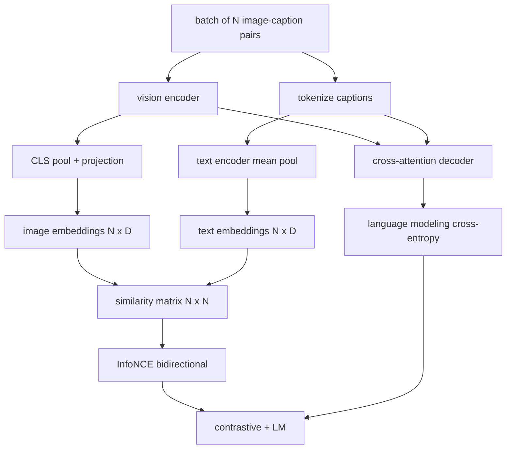

# Preparación para el lenguaje de visión

> El codificador, la proyección y el decodificador están conectados. Ahora entrenen juntos. Dos objetivos impulsan el aprendizaje: una pérdida de texto-imagen contrastada (InfoNCE) que reúne pares de coincidencias en el espacio de embebimiento conjunto, y una pérdida de modelado de lenguaje que pide al decodificador que subtítula cada imagen. Combinados, enseñan a la red tanto a encontrar la imagen correcta para una leyenda como a escribir una leyenda para la imagen.

**Type:** Build
**Languages:** Python
**Prerequisites:** Phase 19 lessons 30-37 (Track B foundations)
**Time:** ~90 minutes

## Objetivos de aprendizaje

- Implementar la pérdida de contraste de InfoNCE en un lote de pares de captura de imagen.
- Compone la pérdida de contraste con la pérdida de modelado autoregresista del lenguaje.
- Sintetiza un corpus de 200 pares de imágenes simuladas sin descarga de conjunto de datos real.
- Ejecutar un ciclo de entrenamiento demo de 50 pasos y observar las pérdidas disminuyen.

## El problema

Un modelo de lenguaje de visión necesita dos habilidades. Debe clasificar: dado un título, encontrar la imagen correcta entre muchas. Debe generar: dado una imagen, escribir un título. Pretrainar el modelo en una habilidad solo le da medio sistema. CLIP clasificación clavada pero no puede subtítulos. GPT-4V puede subtítulos pero utiliza una cabeza de recuperación separada para el ranking.

InfoNCE maneja la mitad de clasificación.Para un lote de pares N, el modelo trata a los pares N correspondientes como positivos y los `N^2 - N`los pares no emparejados como negativos, luego corre una pérdida de entropía cruzada en el resultado `(N, N)`La pérdida de LM maneja la mitad de generación: predicción estándar de next-token condicionada a la imagen. Ambas pérdidas son diferenciables y pueden compartir el peso del codificador, proyector y decodificador.

## El concepto



### InfoNCE en un párrafo

Coloque las imágenes N en filas y las imágenes N en filas. L2-normalizar ambas.`N x N`matriz `S = I T^T / tau`donde`tau`Las entradas diagonales son los pares correspondientes; las entradas fuera de la diagonal son negativas. Aplique entropía cruzada con el objetivo `argmax`corriendo por la diagonal: fila `i`debe tener su entrada más alta en la columna `i`Si el número de columnas es igual a la media de las dos, esto es la pérdida de CLIP en ocho líneas.

### La temperatura es importante

La temperatura .`tau`control de la máxima de la suavidad.`tau = 0.01`El nivel de la velocidad de los movimientos de los movimientos de velocidad de los movimientos de velocidad de los movimientos de velocidad de los movimientos de velocidad de los movimientos de velocidad de los movimientos de velocidad de los movimientos de velocidad de los movimientos de velocidad de los movimientos de velocidad de los movimientos de velocidad de los movimientos de velocidad de los movimientos de velocidad de los movimientos de velocidad de los movimientos de velocidad de los movimientos de velocidad de los movimientos de velocidad de los movimientos de velocidad de los movimientos de velocidad de los movimientos de velocidad de los movimientos de velocidad de velocidad de los movimientos de velocidad de los movimientos de velocidad de velocidad de los movimientos de velocidad de velocidad de los movimientos de velocidad de velocidad de los movimientos de velocidad de velocidad de los movimientos de velocidad de velocidad de velocidad de velocidad de los movimientos de velocidad de velocidad de velocidad de velocidad de velocidad de velocidad de velocidad de velocidad de velocidad de velocidad de velocidad de velocidad de velocidad de velocidad de velocidad de velocidad de velocidad de velocidad de velocidad de velocidad de velocidad de velocidad de velocidad de velocidad de velocidad de velocidad de velocidad de velocidad de velocidad de velocidad de velocidad de velocidad de velocidad de velocidad de velocidad de velocidad de velocidad de velocidad de velocidad de velocidad de velocidad de velocidad de velocidad de velocidad de velocidad de velocidad de velocidad de velocidad de velocidad de velocidad de velocidad de velocidad de velocidad de velocidad de velocidad de velocidad de velocidad de velocidad de velocidad de velocidad de velocidad de velocidad de velocidad de velocidad de velocidad de velocidad de velocidad de velocidad de velocidad de velocidad de velocidad de velocidad de velocidad de velocidad de velocidad de velocidad de velocidad de velocidad de velocidad de velocidad de velocidad de velocidad de velocidad de velocidad de velocidad de velocidad de velocidad de velocidad de velocidad de velocidad de velocidad de velocidad de velocidad de velocidad de velocidad de velocidad de veloc`tau`como un parámetro; la demostración aquí hace lo mismo.

### Perdida de modelado de lenguaje

El decodificador consume tokens de memoria de imagen a través de la atención cruzada y predice el siguiente token de texto en cada posición. La pérdida es la entropía cruzada estándar con el objetivo de la siguiente posición.

### Combinación de las pérdidas

`total = contrastive + lm_weight * lm`donde`lm_weight`Es un escalar (a menudo 1.0). Las dos pérdidas comparten gradientes en el codificador y la proyección; sólo el decodificador recibe el gradiente de pérdida LM. Esta es la receta multi-tareas que usan los modelos de estilo CoCa, BLIP y SigLIP, con diferentes ponderaciones.

| Component | Loss surface | Affects |
|-----------|--------------|---------|
| InfoNCE | Pair ranking in the joint space | Encoder + projection + text head |
| LM | Token prediction conditioned on image | Encoder + projection + decoder |
| Combined | Multi-task | Whole stack |

### ¿Por qué 50 pasos son suficientes para una demostración?

El cuerpo simulado es un conjunto de 200 pares sintéticos con imágenes aleatorias e identidades de título aleatorias. Después de 50 pasos SGD con tamaño de lote 16, ambas pérdidas caen visiblemente incluso si los valores absolutos permanecen por encima de lo que un modelo de datos reales lograría. El punto de la demostración es confirmar que los trabajos de plomería de gradiente terminan y que agregar la pérdida de LM no desestabiliza el objetivo contrastivo.

```figure
ch-infonce-diagonal
```

## Construye el mismo

`code/main.py`los instrumentos:

- `MultimodalModel`, combinando un pequeño codificador ViT, el proyector MLP, un pequeño codificador de lado de texto (pól medio sobre IDs incrustados), y el decodificador de atención cruzada de la lección 61.
- `info_nce_loss(image_emb, text_emb, temperature)`, la pérdida de contraste bidireccional de estilo CLIP.
- `lm_loss(logits, target_ids, padding_id)`, enmascarada de la siguiente entropias cruzados.
- `make_mock_corpus(seed, n_pairs)`, devolviendo 200 pares deterministas (imagen, capt_ids).
- Un bucle de entrenamiento que corre 50 pasos con tamaño de lote 16, optimista de Adam y un parámetro de temperatura de registro aprendido. Ambas pérdidas se imprimen cada 5 pasos.

- ¿Qué quieres decir ?

```bash
python3 code/main.py
```

Producción: pérdida contrasta baja de aproximadamente `ln(16) = 2.77`En el caso de las pérdidas de LM, el nivel de pérdida de LM se reduce en un nivel de referencia uniforme aleatorio de `ln(512) ≈ 6.24`Los modelos reales se entrenan por millones de pasos; la dinámica es la misma.

## Usalo

Esta es la misma receta de pérdida enviada:

- **CLIP (2021).**Sólo contraste de imagen-texto, con una sonda de captura congelada separada.
- **CoCa (2022).**El patrón exacto que esta lección construye.
- **BLIP (2022) and BLIP-2.**Contraste más LM más cabeza de correspondencia de imagen y texto.
- **SigLIP (2023).**Cambiar InfoNCE para una pérdida de par sigmoide; mismo papel contrastivo, forma funcional diferente.
- **LLaVA family.**El entrenamiento de dos etapas donde la primera etapa es la alineación (cosina en un LM congelado) y la segunda etapa añade pérdida de LM con un LM no congelado.

## Pruebas

`code/test_main.py`las cubiertas:

- La pérdida de InfoNCE es simétrica en las filas de imagen/texto
- La pérdida de InfoNCE devuelve 0 cuando la matriz de similitud es una diagonal perfecta de grandes números positivos
- La pérdida de LM enmascara correctamente las posiciones de relleno
- el modelo de pase a futuro produce ambas pérdidas sin errores
- El ciclo de entrenamiento de 5 pasos reduce la pérdida combinada

- ¿Qué quieres decir ?

```bash
python3 -m unittest code/test_main.py
```

## Los ejercicios

1. Sustituye InfoNCE por pérdida de pares sigmoides de estilo SigLIP y compare la convergencia en el cuerpo simulado.

2. Añadir un paso de minería duro-negativo: cada otro lote, seleccionar el par fuera de diagonal más duro del lote anterior y agregarlo. Entrenar e inspeccionar si la pérdida de contraste cae más rápido.

3. Añadir una cabeza binaria de texto-imagen coincidiendo en la parte superior de la incorporación conjunta (verdadero/falso: ¿están coincidiendo?) para una tercera pérdida, replicando la configuración de tres cabezas de BLIP.

4. Replace el cuerpo falso con secuencias de identificación de título extraídas de una cadena de Markov cuya matriz de transición está condicionada al hash de imagen.

5. Entrenar el mismo modelo con `lm_weight = 0`y otra vez con `lm_weight = 1`. Comparar pérdidas contrastantes; la pérdida de LM no debe regredir al objetivo de clasificación.

## Términos clave

| Term | What it means |
|------|---------------|
| InfoNCE | Noise contrastive estimation: cross-entropy on a similarity matrix |
| Temperature | Scalar that controls how peaked the contrastive softmax is |
| Hard negative | An off-diagonal pair the model finds confusing, useful for sampling |
| LM loss | Standard next-token cross-entropy on the captioning side |
| Joint embedding space | The shared space where image and text vectors live after projection |

## Leer más

- Papel de CLIP para la receta original de contraste.
- Papel de CoCa para contraste más subtítulos en un modelo.
- Papel SigLIP para la variante de pérdida de pares sigmoides y por qué se escala mejor.
