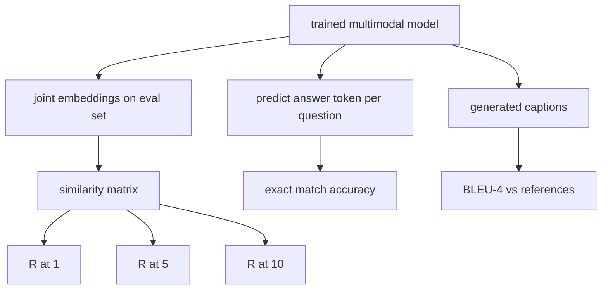

# Evaluación multimodal

> La formación es la mitad del bucle. La otra mitad es la medición. Esta lección construye tres superficies de evaluación a partir de primitivas: recuperación de título de imagen reportada como R@1, R@5, R@10; respuesta de preguntas visuales reportada como exactitud de coincidencia exacta; y subtítulo de imagen reportado como BLEU-4. Cada métrica es una función sobre las salidas del modelo y un conjunto de evaluaciones sintéticas que se ejecuta en segundos.

**Type:** Build
**Languages:** Python
**Prerequisites:** Phase 19 lessons 58-62 (Track E foundations: encoder, transformer, projection, cross-attention fusion, pretraining)
**Time:** ~90 minutes

## Objetivos de aprendizaje

- Computa Recall@K a partir de una matriz de similitud entre las incorporaciones de imagen y captura.
- Computa la precisión exacta de la VQA de un modelo que mapea pares (imagen, pregunta) a un vocabulario de respuestas fijo.
- Computa BLEU-4 a partir de secuencias de tokens generadas y de referencia sin ninguna biblioteca externa.
- Ejecutar las tres evaluaciones contra una suite sintética construida sobre el modelo entrenado de la lección 62.

## El problema

La tentación es declarar que un modelo multimodal terminó cuando las pérdidas de entrenamiento se elevan. Las medidas de pérdida de entrenamiento se ajustan a la distribución de entrenamiento; no mide si el modelo puede clasificar pares en un lote prolongado, responder a una pregunta o escribir una leyenda que un humano aceptaría.

- **Retrieval (R@1, R@5, R@10).**Construir la incorporación conjunta para una leyenda de consulta; clasificar cada imagen en el conjunto de eval por cosino; informar si la imagen coincidente se ubica en la parte superior 1, la parte superior 5, la parte superior 10.
- **Visual question answering (exact match).**Dado (imagen, pregunta), el modelo emite un token de respuesta. La coincidencia exacta es de un bit por muestra: ¿la respuesta prevista es igual a la respuesta de referencia?
- **Captioning (BLEU-4).**Generar una leyenda. Compute la media geométrica de 1 gramo a 4 gramos de precisión contra los títulos de referencia, con una penalidad de brevedad.

Cada métrica es una función delgada. La lección las construye todas en código para que las matemáticas sean concretas y la superficie permanezca bajo su control.

## El concepto



### Recall@K de una matriz de similitud

Construye el `(N, N)`Matriz de similitud cosina entre las imágenes y las inscripciones de las capciones. Para cada fila, clasifique las columnas por similitud descendente. Recall@K es la fracción de filas donde el índice de columnas diagonales se encuentra dentro de las posiciones de K superiores. Recall@K simétrico (capción a imagen) se calcula en la matriz transpuesta. Ambos números son reportados. Para una evaluación N=100, R@1 = 0.6 significa que 60 de las 100 leyendas recuperaron su imagen correcta como la coincidencia superior.

### VQA coincide exactamente

Para cada una (imagen, pregunta, respuesta), codifica la imagen, incrusta la pregunta, fusiona a través del decodificador y lea el siguiente token. El token id previsto se compara con el id de referencia; correcto si es igual. Promedio sobre el conjunto de evaluaciones. Los conjuntos de datos de VQA reales envían múltiples respuestas anotadas por humanos por pregunta y usan una fórmula de precisión suave (1.0 si al menos 3 de los 10 anotadores están de acuerdo, escalados a continuación); la lección utiliza una respuesta única para la claridad.

### BLEEU-4

```text
BLEU-4 = BP * exp(mean(log p1, log p2, log p3, log p4))
```

¿ Dónde ?`p_n`es la precisión modificada de n-gram (conto reducido de n-gramos generados que aparecen en cualquier referencia, dividido por n-gramos generados totales), y `BP`es la pena de brevedad:

```text
BP = 1                if generated length > reference length
   = exp(1 - r/g)     otherwise, where r is reference length and g is generated
```

Se requiere suavizamiento para muestras pequeñas donde algunas `p_n`La implementación utiliza el "método 1" de Chen y Cherry (agrega 1 al numerador y denominador para cualquier conteo cero), que es el estándar más seguro para regímenes de bajo conteo.

### Suites de evaluación sintéticas

Una suite de eval 50 muestras se construye en la memoria a partir del mismo modelo de cuerpo simulado utilizado en la lección 62, con una semilla retenida.

- `pairs`: 50 (imagen, capt_ids) pares para su recuperación.
- `vqa`: 50 (imagen, preguntas, respuestas) triples.
- `caps`: 50 (imagen, [reference_caption_ids, ...]) entradas con hasta 3 referencias por imagen.

La suite es determinista desde la semilla y se mantiene fuera del corpus de entrenamiento, por lo que las métricas se calculan sobre datos que el modelo nunca vio.

| Metric | Range | Random baseline (N=50) |
|--------|-------|------------------------|
| R@1 | 0 to 1 | 0.02 (1 / N) |
| R@5 | 0 to 1 | 0.10 |
| R@10 | 0 to 1 | 0.20 |
| VQA EM | 0 to 1 | 1 / vocab |
| BLEU-4 | 0 to 1 | small but nonzero |

Para una carrera de formación de 50 pasos basada en datos sintéticos, no se espera que las métricas sean altas; se espera que estén por encima de la línea de base aleatoria, que es lo que verifica la demostración.

```figure
ch-recall-window
```

## Construye el mismo

`code/main.py`los instrumentos:

- `recall_at_k(sim_matrix, k)`, devolviendo un flotador en `[0, 1]`en ambas direcciones.
- `vqa_exact_match(predictions, references)`, devolviendo la media sobre `int`la igualdad.
- `bleu4(generated, references, smoothing=True)`, con apoyo de múltiples referencias.
- `build_eval_suite(seed, n_samples, vocab_size, max_len)`, devolviendo tres listas de evaluación determinista.
- `evaluate(model, suite)`, que ejecuta las tres métricas y devuelve un `dict`de números.
- Una demostración que carga un modelo multimodal recién iniciado de la lección 62, lo evalúa, luego lo entrena durante 50 pasos y lo evalúa de nuevo, imprimiendo las métricas antes / después.

- ¿Qué quieres decir ?

```bash
python3 code/main.py
```

Resultado: la tabla métrica antes/después muestra la recuperación mejorando desde casi aleatoria hacia la señal aprendida del modelo, la VQA mejorando sobre aleatoria y la BLEU-4 mejorando (la estructura sintética es suficiente para un ascensor de precisión de 4 gramos).

## Usalo

Cada métrica se asigna directamente a un índice de referencia de producción:

- **Retrieval.**MS-COCO 5K val, Flickr30K, ImageNet zero-shot son todos problemas R@K en la misma matriz de similitud.
- **VQA.**VQA v2, GQA, OK-VQA utilizan la misma forma de coincidencia exacta (con acta suave en lugar de EM de respuesta única para VQA v2).
- **BLEU-4.**Los subtítulos MS-COCO, NoCaps, Flickr30K y todos ellos usan BLEU-4 más CIDER y METEOR.

Para valores de referencia reales, intercambiar `build_eval_suite`La matemática es analítica-agnóstica.

## Pruebas

`code/test_main.py`las cubiertas:

- recall@k devuelve 1.0 en una matriz de identidad perfecta y 0.0 en una invertida para k < N
- recall@k respeta `k <= N`límite superior
- bleu4 devuelve 1.0 cuando se genera igual a una de las referencias exactamente
- bleu4 devuelve 0.0 en el vocabulario desarticulado
- vqa coincide exactamente con la fracción de pares iguales
- build_eval_suite devuelve el número esperado de pares, elementos vqa y entradas de subtítulos

- ¿Qué quieres decir ?

```bash
python3 -m unittest code/test_main.py
```

## Los ejercicios

1. Añadir CIDEr a las métricas de subtítulos. CIDEr utiliza la ponderación TF-IDF en n-gramos, que recompensa tokens informativos.

2. Implementar VQA de precisión suave: múltiples respuestas humanas por pregunta, la precisión es `min(human_count / 3, 1)`Si alguna coincide, replica VQA v2.

3. Añadir una variante segura de NaN de `bleu4`que maneja secuencias generadas vacías sin estrellarse.

4. Computa la media de rango recíproco (MRR) junto a R@K. MRR es sensible a dónde el elemento correcto cae más allá de la parte superior K; R@K es sensible a si cae en la parte superior K.

5. Realice la evaluación del modelo en cinco puntos de control durante el entrenamiento (pasos 0, 10, 20, 30, 40, 50) y trace la curva de aprendizaje.

## Términos clave

| Term | What it means |
|------|---------------|
| R@K | Fraction of queries where the correct match lands in the top K results |
| Exact match | The simplest VQA scoring: predicted answer equals reference |
| BLEU-4 | Geometric mean of 1- to 4-gram precisions, with brevity penalty |
| Multi-reference | A captioning metric accepts several reference captions per image |
| Held-out | The eval set is sampled from a seed disjoint from the training corpus |

## Leer más

- Papel VQA v2 para la fórmula de precisión suave y las estadísticas de conjuntos de datos.
- Papel CIDER para subtítulos de n gramos ponderados por TF-IDF.
- BLEU original (Papineni et al., 2002) para las variantes de suavización.
- Los guiones de evaluación de subtítulos de MS-COCO para la implementación de referencia canónica.
