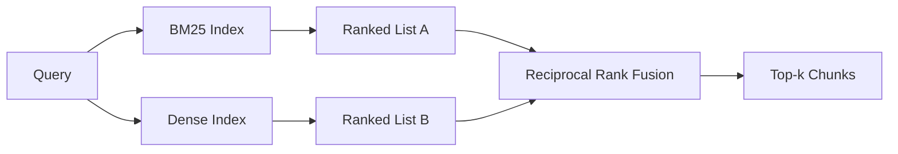

# Recuperación híbrida con BM25 y Embeddings densos

> La recuperación léxica y semántica fallan en las distribuciones de consultas opuestas. La recuperación híbrida con fusión de rango recíproca no interpola, sino que vota y el voto gana en cada clase de consultas.

**Type:** Build
**Languages:** Python
**Prerequisites:** Phase 11 lessons 04 (embeddings), 06 (RAG); Phase 19 Track B foundations (lessons 20-29); Phase 19 lesson 64 (chunking strategies)
**Time:** ~90 minutes

## Objetivos de aprendizaje
- Implemente BM25 desde cero desde la formulación de Robertson y Sparck Jones, con ponderación de campo, normalización de la longitud del documento y ajusteable k1 y b.
- Construye un recuperador denso encima de una simulación determinista de incrustación para que el bucle se ejecute fuera de línea.
- Implemente la fusión de rango recíproco exactamente como Cormack, Clarke y Buettcher lo publicaron en 2009, y explique por qué domina la interpolación ponderada por puntajes.
- Tone la constante RRF k y los pesos por modalidad y lea los compromisos en un pequeño corpus de fijación.

## El problema

La búsqueda léxica gana cuando la consulta lleva un identificador literal el corpus contiene un texto literal.`AbortMultipartOnFail`La misma consulta, incrustada, se encuentra en el límite de tres grupos de similitud y un buscador denso clasifica el archivo equivocado primero.

La búsqueda densa gana cuando la consulta se parafrasa lejos de los tokens literales del corpus. Un usuario que pregunta "cómo manejamos las subidas canceladas" nunca escribe la palabra abort o multipart. BM25 devuelve la pieza de documentación en "subir archivos grandes" porque esa página contiene la palabra subidas.

La elección entre los dos no es estática. La distribución de la consulta es la variable. Un sistema RAG de producción maneja ambas clases desde el mismo punto final, por lo que la recuperación tiene que manejar ambas a la vez. Eso es la recuperación híbrida.

## El concepto



### BM25 en un párrafo

BM25 califica un par de consulta-documento sumando, sobre los términos de consulta, un factor de frecuencia inverso del documento multiplicado por un factor de frecuencia de término saturante que incluye una corrección de normalización de longitud.`k1`control de saturación de la frecuencia térmica; la recomendación de referencia 1.5 es la publicada y no debe moverla sin un índice de referencia. `b`controlan cuánto importe la longitud del documento; el valor predeterminado de 0,75 dice que los documentos más largos son penalizados, pero no linealmente.

La fórmula de las FDI utiliza la definición suavizada de Robertson y Sparck Jones, que es `log((N - df + 0.5) / (df + 0.5) + 1)`El plus uno dentro del registro mantiene al IDF positivo cuando un término aparece en más de la mitad del corpus.

La ponderación de campo le permite decirle a BM25 que una coincidencia en el nombre del símbolo cuenta más que una coincidencia en el cuerpo. La implementación es un multiplicador de la cantidad de términos durante la indexación, no en el momento de marcar. Eso mantiene la matemática idéntica y evita una puntuación separada por campo.

### Recuperación densa en un párrafo

Embed cada pieza en un vector de dimensión fija con un modelo de embedding. En el momento de la consulta, embebebe la consulta, clasifique cada pieza por similitud y devuelva la parte superior k. El modelo es la variable que decide la calidad. El algoritmo de recuperación en sí mismo es de dos líneas: producto de puntos y orden.

Esta lección utiliza una incorporación determinista basada en hash para que pueda leer la matemática de fusión sin una llamada de red. El hash suma los offsets con llave de token en un vector de 96 dimensiones y normaliza. Las filas cosinas son deterministas a través de las carreras, lo que es lo que requiere la suite de pruebas.

### Fusión de rango recíproco, la fórmula publicada

Dos listas clasificadas. Para cada candidato que aparece en cualquiera de las listas, suma sus contribuciones recíprocas de rango.`1 / (k + rank)`y k igual a 60 como el predeterminado. clasificar por puntaje total. Ese es todo el algoritmo.

La constante publicada k = 60 no es arbitraria. con k = 60 la contribución de rango 1 es 1 / 61 y la contribución de rango 10 es 1 / 70. La contribución se descompone lentamente por lo que los candidatos más profundos aún votan.

Dos botones sintonizables en nuestra implementación.`k`Un par de pesas por modalidad para que puedas aumentar el BM25 o denso cuando tengas pruebas previas uno es mejor en tu corpus Multiplicar la contribución de rango por el peso es la implementación de principios más simple; conserva la forma de decadencia de rango y se mantiene libre de escala.

### ¿Por qué la fusión supera la interpolación ponderada por puntajes?

Las puntuaciones BM25 son ilimitadas y dependientes del corpus.`alpha * bm25 + (1 - alpha) * cosine`La combinación basada en la clasificación no lo hace. Dos filas son comparables en todas las modalidades. La línea de base RRF publicada supera la interpolación de puntajes en cada pista pública de TREC desde 2010.

Este es el mismo argumento que se escucha sobre RankFusion vs RRF en la documentación de Vespa y Weaviate.

```figure
rrf-fusion
```

## Construye el mismo

`code/main.py`los instrumentos:

- `tokenize(text)`- un rápido tokenizer de regex.
- `BM25Index`- ponderado en el campo, con `add`y `search`y ajustable k1, b.
- `mock_embed`¿ Qué ?`DenseIndex`- la misma incorporación determinista que la lección 64 para que las piezas sean comparables.
- `rrf(rankings, k, weights)`- la fusión publicada con pesos de múltiples modalidades.
- `HybridRetriever`- combina BM25 y denso.
- Una demostración .`main()`que carga un pequeño corpus de fijación, ejecuta tres consultas que se dirigen a las fortalezas y debilidades de cada retriever, e imprime las clasificaciones de cada modalidad producida más la lista fusionada.

- ¿Qué quieres decir ?

```bash
python3 code/main.py
```

La consulta para identificador literal llega a BM25 rango 1, rango denso 4, rango RRF 1. La consulta parafraseada llega a BM25 rango 6, rango denso 1, rango RRF 1. La consulta ambigua llega a BM25 rango 3, rango denso 3, rango RRF 1. La fusión no es un empate; es el sistema que gana en cada clase de consulta.

## Arreglar los botones

| Knob | Default | Move it up when | Move it down when |
|------|---------|----------------|------------------|
| BM25 k1 | 1.5 | Terms repeat in documents and you want frequency to matter more | Documents are short and term repetition is noise |
| BM25 b | 0.75 | Long documents really do say less per word | Document length is uncorrelated with topic |
| RRF k | 60 | Deep candidates should keep voting | The top-1 should dominate |
| BM25 weight | 1.0 | Your corpus contains literal identifiers and queries match them | Your queries are user-paraphrased |
| Dense weight | 1.0 | Queries are paraphrased | Queries are literal |

Agusta re ejecutando el arnés de evaluación de la lección 68 en tu conjunto de consultas, no por intuición.

## Los modos de falla de la demostración se ocultará

**Out-of-vocabulary tokens.**La IDF de BM25 se calcula desde el corpus, por lo que solo los términos de la consulta contribuyen a cero. Las incorporaciones densas alucinan un vector para el mismo término. En los identificadores fuera del corpus, la modalidad densa devuelve vecinos que parecen plausibles pero equivocados. La fusión absorbe esto porque BM25 no devuelve nada y la contribución de rango cae, pero solo si se desduplica por documento, no por pedazo.

**Stop-token domination.**BM25 contra la palabra "el" produce un ranking uniforme sobre el corpus. Filtra los tokens de parada en el índice o acepta que los términos de alto IDF dominan naturalmente.

**Identical content across modalities.**Si su cuerpo es lo suficientemente pequeño como para que el top-1 de BM25 sea también el top-1 de denso, RRF le da el mismo top-1 con los mismos vecinos. Ese es un comportamiento correcto, no un fracaso, pero hace que la fusión parezca invisible. Agregue un par de consultas adversarias en su eval para verificar que la fusión está realmente funcionando.

## Usalo

Modelos de producción:

- Indice BM25 en proceso; el cuello de botella es el diccionario de frecuencia térmica, no los vectores.
- Indice vectores densos en una tienda separada (en esta lección usamos una lista plana; en producción usaría HNSW).
- Ejecutar ambas consultas en paralelo; la fusión es una fusión constante en el tiempo sobre la unión.
- Persiste la modalidad de cada golpe recuperado para que un re-ranqueador en el río abajo pueda ver qué modalidad votó por él.

## Envío

La lección 66 toma el top-k fusionado de esta lección y se reorganiza con un codificador cruzado. La lección 68 evalúa toda la tubería con precisión, recuerdo, MRR y nDCG. El retriever híbrido en esta lección es la primera etapa del sistema de extremo a extremo en la lección 69.

## Los ejercicios

1. Reemplazar`mock_embed`Re-ejecuta la demostración y informe cómo el ranking de densidad sólo cambia en la consulta parafraseada.
2. Añadir una tercera modalidad: los resúmenes de piezas indexados por separado y fusionados como una tercera lista clasificada.
3. Busque la curva de recall@k de la lección 68. Reporte el valor de k donde la curva alcanza el punto máximo en su corpus.
4. Implemente BM25F correctamente (normalización de longitud por campo en lugar del truco del multiplicador) y compare en un corpus donde los símbolos coinciden son más importantes.

## Términos clave

| Term | What people say | What it actually means |
|------|-----------------|------------------------|
| BM25 | "Lexical search" | Probabilistic ranking with idf x saturating tf x length normalization |
| RRF | "Rank fusion" | Sum of 1 / (k + rank) across ranked lists; k = 60 default |
| k1 | "TF saturation" | Controls how fast a repeated term stops adding more score |
| b | "Length penalty" | 0 means ignore document length, 1 means full normalization |
| Field weighting | "Symbol boost" | Repeat tokens during indexing to boost matches in that field |
| Rank-based vs score-based fusion | "Why RRF beats linear" | Ranks are comparable across modalities; scores are not |

## Leer más

- Cormack, Clarke, Buettcher, "Fusión de rango recíproco supera a Condorcet y a los métodos de aprendizaje de rango individual", SIGIR 2009
- Robertson, Walker, Beaulieu, Gatford, Payne, "Okapi en TREC-3" (el papel original de BM25)
- [Vespa: Hybrid Retrieval with BM25 and Embeddings](https://docs.vespa.ai/en/tutorials/hybrid-search.html)
- [Weaviate: Hybrid Search](https://weaviate.io/developers/weaviate/search/hybrid)
- Fase 11 Lección 06 - Fundamentos del RAG
- Fase 19 lección 64 - chunkers cuya producción se indexa aquí
- Fase 19 lección 66 - reencoder cross-encoder que consume la top-k fusionado
