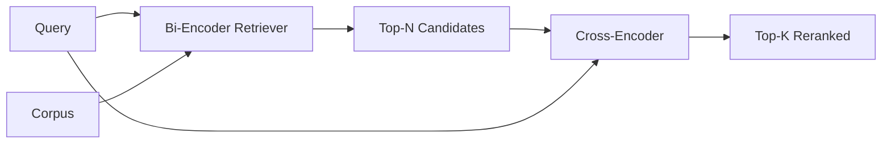

# Rencoder de codificación cruzada

> Un bi-encoder incorpora la consulta y el documento de forma independiente. Un cross-encoder los concatenan y leen ambos a la vez. El cross-encoder es el lector más inteligente y el más lento. Se utiliza como segunda etapa en la parte superior del bi-encoder, se paga por sí mismo.

**Type:** Build
**Languages:** Python
**Prerequisites:** Phase 11 lesson 06 (RAG), Phase 11 lesson 07 (advanced RAG); Phase 19 Track B foundations (lessons 20-29); Phase 19 lesson 65 (hybrid retrieval feeding this stage)
**Time:** ~90 minutes

## Objetivos de aprendizaje
- Distinguir un retriever de bi-encoder de un reencoder de cross-encoder por su forma de entrada, el número de parámetros y el costo por consulta.
- Implementar un pequeño codificador cruzado desde cero como un bloque transformador que consume una secuencia de paquetes (cuestión, documento) y emite un único escalar de relevancia.
- Envía un tubo de dos etapas de recuperación y luego de re-ranqueo: recuperar N superior con un retriever barato, volver a clasificar N a K superior con el codificador cruzado, devolver K.
- Medir la compensación entre latencia y calidad en un corpus de fijación pequeño y elegir el N correcto para un presupuesto de latencia determinado.

## El problema

Un bi-encoder mapea la consulta y el documento en el mismo espacio vectorial y se clasifica por cosino. Los dos codificadores nunca se ven entre sí. El modelo tiene que comprimir todo lo útil sobre un documento en un solo vector, ciego a la consulta. Esto es rápido - una incorporación por documento en el tiempo de índice y una por consulta en el tiempo de consulta - y es la única manera de clasificar a escala corpus.

El costo es la precisión. Dos documentos que tienen el mismo tema general pueden tener incrustaciones casi idénticas incluso cuando uno de ellos responde a la consulta y el otro no. El bi-encoder no puede distinguirlos.

Un codificador cruzado resuelve esto leyendo la consulta y el documento juntos.`[query] [SEP] [document]`El modelo de la consulta puede ser un símbolo de la consulta, y el modelo puede ser un símbolo de la consulta, y puede ser un símbolo de la consulta.

El costo es el rendimiento. Cuando el bi-encoder se incrusta una vez y hace consultas para siempre, el cross-encoder se ejecuta una vez por par (cuestión, documento). Para un corpus de 10 millones de documentos que es 10 millones de pases avanzados por consulta.

La solución es la puesta en escena. Utilice el bi-encodor para recuperar el N superior. Utilice el cross-encoder para volver a clasificar el N a un top-K. N es pequeño (50 a 200) y el aumento de calidad del cross-encoder se concentra donde importa. La latencia total permanece en el presupuesto de la solicitud. La calidad total es la calidad del cross-encoder, limitada por el recall del bi-encoder en N.

## El concepto



### La forma de entrada del codificador cruzado

El embalaje estándar es `[CLS] query_tokens [SEP] document_tokens [SEP]`. La salida de posición CLS se alimenta en una sola cabeza lineal que saca el escalar de relevancia. Algunas implementaciones utilizan el pooling medio en lugar de CLS; la diferencia es pequeña.

Un codificador cruzado de 22M (el`ms-marco-MiniLM-L-6-v2`Los modelos más pequeños pierden calidad más rápido que ahorran latencia.`bge-reranker-v2-m3`en 568M) se reservan para el reordenamiento fuera de línea o para el reordenamiento en primera página cuando K es pequeño.

### Por qué esta lección entrena a uno pequeño

Un verdadero codificador cruzado es un transformador de codificador afinado. En la producción se carga un punto de control y ejecuta. En esta lección el objetivo es mostrarle la forma del modelo y la forma de la curva de calidad de latencia, no para entrenar un clasificador de última generación. Así que construimos un pequeño`nn.Module`con un bloque de transformador, atención multi-cabeza (4 cabezas por defecto) y una cabeza de regresión. Se inicializa deterministicamente a partir de una semilla para que la demostración sea reproducible sin pesos en disco.

El modelo de juguete aprende la forma correcta del corpus de fijación: los pares de documentos de consulta relevantes tienen puntajes predichos más altos que los pares irrelevantes.

### La latencia vs calidad

El oleoducto de dos etapas tiene una tunable: N. Arrojar N de 5 a 100 en un conjunto de consultas prolongadas y usted obtiene la curva.

| N | Recall@1 of stage 2 | Cross-encoder forward passes per query | Latency |
|---|--------------------|---------------------------------------|---------|
| 5 | 0.62 | 5 | low |
| 20 | 0.81 | 20 | medium |
| 50 | 0.86 | 50 | high |
| 100 | 0.86 | 100 | very high |

Los números anteriores ilustran la forma, no las medidas de este accesorio. La forma es real. Siempre hay una rodilla alrededor de 20 a 50 candidatos donde el levantamiento de rango se satura.

El cross-encoder no puede elevar el recuerdo por encima del recalque del bi-encoder en N, por lo que un N bajo limita la calidad, no sólo la latencia.

```figure
rerank-funnel
```

## Construye el mismo

`code/main.py`los instrumentos:

- `CrossEncoder`- un pequeño .`torch.nn.Module`: embedding token, un bloque transformador con atención multi-head y cabeza de entrada, media-pooling producido una escala.
- `tokenize_pair(query, document)`- empaque las dos cadenas en una sola secuencia de identificación con identificaciones de tipo que marcan el límite, determinístico y stdlib.
- `train_tiny(pairs)`- un paso de formación supervisada en una triple lista etiquetada a mano (cuestión, documento, relevancia), de modo que el modelo produce puntuaciones sensatas en el dispositivo.
- `rerank(query, candidates, top_k)`- la interfaz de producción.
- `pipeline(query, retriever, top_n, top_k)`- el flujo de dos etapas.
- Una demostración .`main()`que carga el corpus del patrón de la lección 65, recupera la parte superior N, se reubica en la parte superior K, imprime ambas listas lado a lado, y informa la latencia de cada etapa.

- ¿Qué quieres decir ?

```bash
python3 code/main.py
```

La salida muestra la parte superior N del bi-encodor, la parte superior K del cross-encoder y un resumen de tiempo. El cross-encoder tarda más tiempo por llamada pero no se ejecuta en el corpus completo. El total de dos etapas se mantiene dentro del presupuesto de la solicitud mientras se escoge la respuesta que el bi-encoder ocupa el segundo o tercer lugar.

## Los modos de falla de la demostración se ocultará

**Cross-encoder is not symmetric.** `rerank(q, d)`y `rerank(d, q)`siempre entre la consulta primero. si cambias accidentalmente, el recuerdo se derrumba.

**N is too low to expose the bug.**Si se establece N = K, el codificador cruzado no puede reordenar; sólo puede volver a pesar. El ascensor parece cero.

**Training data leaks into the eval.**Si los pares de entrenamiento etiquetados a mano incluyen las consultas de evaluación, el rango de reubicación se ve mágico.

**Production weights are dense.**Un codificador cruzado de parámetro 22M es de 88 MB en float32. Planifique la memoria del servidor modelo antes de prometer sub-100ms p95.

**Batching matters.**Un verdadero codificador cruzado ejecuta los candidatos N en un lote.`_batch_encode`, que construye los tensores de identificación de lote y de tipo con `torch.tensor(...)`y ejecuta un pase hacia adelante. Salta el batch y la latencia se multiplica por N.

## Usalo

Modelos de producción:

- Enfilar el bi-encodor, el cross-encoder y N juntos. Cambiar cualquiera de ellos invalida la evaluación.
- Cache la salida del reranker mediante hash (query, document_id). La misma consulta contra un corpus estable se clasifica en el mismo orden; los hits de caché le compran un corte de latencia gratuito.
- Registra la puntuación de codificación cruzada de rango 1. Una consulta cuya puntuación superior a 1 está por debajo de un umbral específico del corpus es un golpe fuera del dominio; presentala al LLM como "No estoy seguro".

## Envío

La lección 68 evalúa esta línea de tubería de dos etapas de extremo a extremo. La lección 69 conecta este relanzador detrás del retriever híbrido de la lección 65 y delante del generador de respuestas.

## Los ejercicios

1. Busque N de 5 a 50 y trace recall@1 de la salida re-ranqueada.
2. Entrenar el codificador cruzado durante diez épocas en lugar de una.
3. Replace el compartimento medio con una cabeza con símbolo CLS. Compara la convergencia en este dispositivo.
4. Añadir una segunda cabeza de codificación cruzada que predica una etiqueta binaria "es esta la respuesta en el documento".
5. Reemplaza el bi-encoder determinista simulado por el de la lección 65 y enlace las dos etapas. Mide el cambio en el top-K frente al bi-encoder solo.

## Términos clave

| Term | What people say | What it actually means |
|------|-----------------|------------------------|
| Bi-encoder | "Vector retriever" | Encodes query and doc independently; cosine ranks them |
| Cross-encoder | "Reranker" | Encodes (query, doc) jointly; outputs one relevance scalar |
| Two-stage pipeline | "Retrieve and rerank" | Cheap retriever returns N, expensive reranker keeps K |
| N (candidate budget) | "Rerank pool" | The number of candidates the cross-encoder scores per query |
| Mean-pooling head | "Mean of last hidden" | Average the encoder's last-layer outputs into one vector |

## Leer más

- Nogueira, Cho, "Re-ranking del paso con BERT", 2019 - el papel canónico de clasificación de codificación cruzada
- Reimers, Gurevych, "Sentence-BERT: Embedings of sentences using Siamese BERT-Networks", 2019 - sobre bi-encoders vs cross-encoders
- [SentenceTransformers Cross-Encoders documentation](https://www.sbert.net/examples/applications/cross-encoder/README.html)
- [BGE Reranker v2 model card](https://huggingface.co/BAAI/bge-reranker-v2-m3)
- Fase 19 lección 65 - el retriever híbrido alimentando esta etapa de rango
- Fase 19 lección 68 - la evaluación que mide el aumento que este rango ofrece
