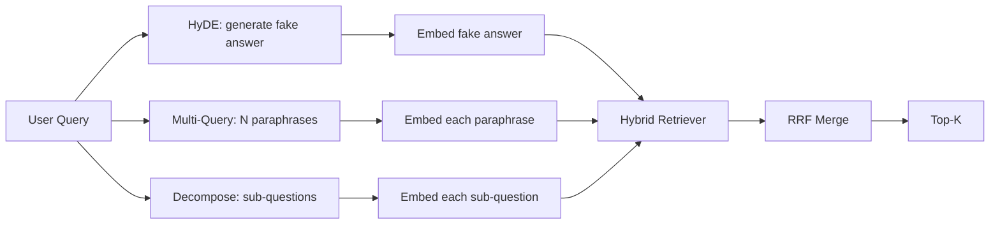

# Reescritura de consultas: HyDE, Multi-Query y Descomposición

> La consulta que el usuario escribe no es la consulta que desea el retriever. La reescritura reduce la brecha antes de la recuperación, por lo que el índice ve algo más cerca de lo que parece la respuesta.

**Type:** Build
**Languages:** Python
**Prerequisites:** Phase 11 lessons 04 (embeddings), 06 (RAG); Phase 19 Track B foundations (lessons 20-29); Phase 19 lessons 64 and 65
**Time:** ~90 minutes

## Objetivos de aprendizaje
- Implementar Hipótese de Documentos Embeddings (HyDE): generar una respuesta falsa, incrustar, recuperar contra ese vector en lugar de la consulta vector.
- Implemente la expansión de múltiples consultas: reescriba una consulta en N parafrases, recupera con cada una, fusiona la unión por fusión de rango recíproca.
- Implementar la descomposición de la consulta: dividir una pregunta compleja en subcuestiones, recuperar por subcuestión, fusionar.
- Comparar los tres reescritales de cabeza a cabeza en un fijo y explicar cuándo cada estrategia gana.
- Envía un LLM falso que produce deterministas, en fijación de salida para que el bucle de reescritor se ejecuta fuera de línea.

## El problema

Un usuario escribe "¿qué hace nuestro equipo cuando las subidas fallan y el presupuesto se ha ido?". El corpus contiene un documento que dice "AbortMultipartOnFail aborta una carga multipart S3 en vuelo y disminuye el presupuesto de retoma por balde cuando la carga falla". La consulta y el documento no comparten una frase de nombre. BM25 se pierde. El bi-encodor clasifica el documento en tercer o cuarto puesto porque el vector de consulta aterriza en una región del espacio de embebimiento que prefiere el documento sobre trabajos cancelados, no el documento sobre cargas abortadas. El rango de dos etapas de la lección 66 puede salvar la respuesta si se encuentra en la parte superior N, pero si ni siquiera llega a la parte superior N, el rango nunca lo ve.

La solución es reescribir la consulta antes de que toque el retriever. El artículo de 2023 "Precise Zero-Shot Dense Retrieval without Relevance Labels" (Gao et al.) introdujo HyDE: pida a un LLM que escriba el documento que respondería a la consulta, incrusta ese documento hipotético y use su incrustación como vector de recuperación. El documento hipotético se encuentra en la región derecha del espacio de inserción porque está escrito en la voz del corpus. El vector de consulta no lo hizo.

Dos técnicas de primos se emparejan con HyDE. La expansión de múltiples consultas (el término utilizado por Microsoft GraphRAG) genera N parafrazas de la consulta y se recupera con cada una, luego se fusiona. La descompresión (popularizada como "comunión de subcuestiones" en el trabajo de 2024 de Stanford DSPy) divide "qué hace nuestro equipo cuando las subidas fallan y el presupuesto se ha ido" en dos preguntas: "qué sucede cuando una subida falla" y "qué sucede cuando el presupuesto de retoma se ha ido". Dos respuestas, un resultado combinado, ambas partes de la respuesta alcanzables.

Esta lección aplica las tres y las dirige contra el mismo corpus fijo.

## El concepto



### HyDE en detalle

HyDE reemplaza el vector de consulta del usuario con un vector de documento hipotético escrito en LLM. El prompt es corto:

```
You are a domain expert. Write a one-paragraph passage that answers the question
below. Use the same vocabulary and phrasing the documentation in this domain would
use. Do not refuse. Do not say you do not know.

Question: {user_query}

Passage:
```

La respuesta del LLM es errónea como respuesta factual porque el LLM no conoce su corpus. Eso está bien. El retriever no se preocupa por la exactitud de los hechos, sólo por la distribución simbólica. El pasaje hipotético contiene las palabras "aborto", "multipartida", "cubo", "presupuesto", porque eso es lo que diría un pasaje de documentación sobre este tema. Incorporar ese pasaje. El vector aterriza cerca del pasaje real.

En la producción se limita el documento hipotético a dos o tres frases. los hipotéticos más largos recogen más ruido. los más cortos pierden la señal léxica que HyDE necesita.

### Expansión de múltiples consultas en detalle

Generar N parafrases de la consulta del usuario.

```
Rewrite the following question in {N} different ways. Each rewrite must preserve
the original intent. Number them 1 to {N}. Do not add explanations.
```

Recuperar el top-k para cada paráfrase. Combinar las listas clasificadas N con RRF (el mismo algoritmo de la lección 65). Barata, paralela, determinista.

Multi-query gana cuando la frase del usuario es una de muchas formas igualmente válidas de hacer la pregunta, y cualquiera de las reescrituras lo habría hecho mejor. pierde cuando todas las reescrituras son igualmente malas porque el original era malo de la misma manera.

### Descomposición en detalle

Una única recuperación no puede satisfacer una pregunta multifacética. La descomposición pide al LLM que divida la pregunta en subcuestiones y el sistema recupera por subcuestión.

```
The following question may require information from multiple distinct topics.
Decompose it into a list of sub-questions. Each sub-question must be answerable
independently. If the question is already atomic, return it unchanged.

Question: {user_query}
```

Recuperar por subcuestión. Fusión. La descomposición es la herramienta adecuada para preguntas que contienen conjunciones, comparaciones de múltiples cláusulas o dos temas no relacionados. Herramienta equivocada para preguntas atómicas; el trabajo del descompositor es devolver la pregunta única y no inventar subcuestiones falsas.

### ¿Por qué existen los tres?

Las tres son complementarias. HyDE cubre la brecha de token de la consulta-corpus. Multi-query cubre la variación de paráfrases. Decompresión cubre consultas de múltiples temas. Un sistema de producción ejecuta las tres y elige la estrategia por consulta (el sistema de extremo a extremo de la lección 69 muestra el selector).

## El Máster de Derecho de Fama

La lección se ejecuta sin conexión. La simulación LLM es una pequeña tabla de búsqueda teclada en la consulta del usuario, más un fallback para consultas que no ha visto.

- Para cada consulta de fijación: un pasaje hipotético escrito, tres paráfrases y una descomposición.
- Para una consulta desconocida: una transformación determinista: toma las palabras de contenido de la consulta, expandirlas a través de un mapa de sinónimos y devuelve el resultado.

La forma de la simulación es lo que importa, no los datos. En la producción se intercambia la simulación por una llamada de modelo real.

```figure
cd-hyde-vector
```

## Construye el mismo

`code/main.py`los instrumentos:

- `MockLLM`- el reemplazo determinista descrito anteriormente.
- `HyDERewriter`- pide al LLM que escriba el documento hipotético, devuelve la salida del reescrito como `RewriteResult`con el texto hipotético y la consulta que el retriever debe usar.
- `MultiQueryRewriter`- llama al LLM para parafrasear N, devuelve una lista de consultas.
- `DecomposeRewriter`- pide que el LLM se descomponga, devuelve las subcuestiones.
- `retrieve_with_rewriter`- toma un reescrito y un retriever, ejecuta las reescritaciones, fusiona los resultados.
- Una demostración que ejecuta los tres reescriptores en un dispositivo e imprime cuál estrategia devolvió el documento de respuesta de oro primero.

La forma del retriever se reutiliza a partir de la lección 65 (hybrido BM25 + denso). La fusión es la misma RRF. La única forma nueva es la interfaz del reescrita, que es pequeña.

- ¿Qué quieres decir ?

```bash
python3 code/main.py
```

La salida es una clasificación por estrategia y un resumen final. HyDE gana en la consulta de frazasas desajustadas. Multi-query gana en la consulta de variación de paráfrases. Decomposition gana en la consulta de múltiples temas. La caída (sin reescribir) pierde en al menos una de las tres.

## Los modos de falla de la demostración se ocultará

**HyDE hallucinates corpus-specific identifiers wrong.**El modelo inventa un nombre de función. La puntuación BM25 del hipotético en el documento derecho se derrumba porque el nombre inventado es ahora un token de alto peso que no aparece en el índice.

**Multi-query rewrites all converge.**Un modelo débil produce tres paráfrases casi idénticas. Las extracciones N devuelven la misma top-k. La fusión RRF no es mejor que una única extracción. Agregue una instrucción explícita de diversidad al prompt de reescrito y detecte duplicados por Jaccard.

**Decomposition over-splits.**El descomposición transforma una pregunta atómica en una lista. Todas las extracciones devuelven el mismo documento pero con un rango reducido. La fusión es peor que la original. Detecta esto con un "son estas subcuestiones lo suficientemente distintas" pase antes de ventilar.

**Latency multiplies.**HyDE cuesta una llamada de LLM. La consulta múltiple cuesta una llamada de LLM para generar N reescritos, luego N recuperaciones. La descomposición cuesta una llamada de LLM para descomponer, luego M recuperaciones. Las recuperaciones se ejecutan en paralelo; la llamada de LLM es el piso.

## Usalo

Modelos de producción:

- Selección de estrategia por consulta por longitud de la consulta: las consultas cortas atómicas obtienen multitemplazas, las consultas complejas con multitemplazas se descomponen, las consultas pesadas en jerga obtienen HyDE.
- Cache la salida de reescrita por hash de consulta. Muchas consultas se repiten.
- La gestión de los tres resultados se realiza en paralelo y se fusionan en uno con RRF. El coste es tres llamadas de LLM y una fusión; la calidad es la unión de la cobertura de las tres estrategias.

## Envío

La lección 69 fija esta etapa de reescritura antes que el retriever de la lección 65 y el re-ranqueador de la lección 66. La lección 68 evalúa el aumento que el reescritor añade a la recuperación de recuerdos.

## Los ejercicios

1. Implemente RAG-Fusion (una variante 2024 de la consulta múltiple) donde las paráfrases del reescrito son intencionalmente diversas, luego el paso de rango (lección 66) elige la lista final.
2. Añadir una cuarta estrategia: el paso atrás de la solicitud (pregunte al LLM para la pregunta más general, retomar en ese, luego estrecho).
3. Entrenar al descomponedor a reconocer las consultas atómicas añadiendo una cabeza de "es la cuestión atómica".
4. Replace el falso LLM con una llamada de modelo real.
5. Añadir un puntaje de confianza por reescritura. Bajar las reescrituras por debajo del umbral. Medir el impacto en el retiro.

## Términos clave

| Term | What people say | What it actually means |
|------|-----------------|------------------------|
| HyDE | "Fake-document retrieval" | LLM writes the answer; embed and retrieve on that instead of the query |
| Multi-query | "Paraphrase expansion" | N rewrites of the query; retrieve N times, merge by RRF |
| Decomposition | "Subquery split" | Multi-topic queries split into sub-questions, retrieved separately |
| Atomic query | "Single-topic" | Cannot be decomposed without inventing fake sub-questions |
| Step-back | "Abstract the query" | Ask the more general question, retrieve, then narrow |

## Leer más

- Gao, Ma, Lin, Callan, "Recuperar con precisión la densidad de la toma cero sin etiquetas de relevancia" (HyDE), 2023
- Microsoft Research, "Expansión de múltiples preguntas para la recuperación"
- Stanford DSPy, "Descomposición de subcuestiones para la QA multi-Hop"
- [LlamaIndex query transformations documentation](https://docs.llamaindex.ai/en/stable/optimizing/advanced_retrieval/query_transformations/)
- Fase 11 lección 07 - patrones avanzados de RAG
- Fase 19 lección 65 - el retriever que este reescriba alimenta
- Fase 19 lección 68 - la evaluación que mide el levantamiento del reescrito
